# What is BLEU

[BLEU (BiLingual Evaluation Understudy)](https://en.wikipedia.org/wiki/BLEU) is a metric for automatically evaluating machine-translated text. The BLEU score is a number between zero and one that measures the similarity of the machine-translated text to a set of high quality reference translations. A value of 0 means that the machine-translated output has no overlap with the reference translation (low quality) while a value of 1 means there is perfect overlap with the reference translations (high quality).

It has been shown that BLEU scores correlate well with human judgment of translation quality. Note that even human translators do not achieve a perfect score of 1.0.

BLEU scores are expressed as a percentage rather than a decimal between 0 and 1.
Trying to compare BLEU scores across different corpora and languages is strongly discouraged. Even comparing BLEU scores for the same corpus but with different numbers of reference translations can be highly misleading.

However, as a rough guideline, the following interpretation of BLEU scores (expressed as percentages rather than decimals) might be helpful.

BLEU Score |	Interpretation
--- | ---
< 10 |	Almost useless
10 - 19 |	Hard to get the gist
20 - 29 |	The gist is clear, but has significant grammatical errors
30 - 40 |	Understandable to good translations
40 - 50 |	High quality translations
50 - 60 |	Very high quality, adequate, and fluent translations
\> 60 |	Quality often better than human

[More mathematical details](https://cloud.google.com/translate/automl/docs/evaluate#the_mathematical_details)

Source: https://cloud.google.com/translate/automl/docs/evaluate#bleu

BLEU is the most popular becnhmark in academia, so using BLEU allows us also to compare with reserach papers results and competitions (see [Conference on Machine Translation Conference (WMT)](http://statmt.org/wmt21/)).

Read [this article](https://www.rws.com/blog/understanding-mt-quality-bleu-scores/) to better understand what BLEU is and why it is not perfect.

# What are these benchmarks

## Translators

1. **bergamot** - uses compiled  [bergamot-translator](https://github.com/mozilla/bergamot-translator)  (wrapper for marian that is used by Firefox Translations web extension)
2. **google** - uses Google Translation [API](https://cloud.google.com/translate)
3. **microsoft** - uses Azure Cognitive Services Translator [API](https://azure.microsoft.com/en-us/services/cognitive-services/translator/)
4. **argos** - uses [Argos Translate](https://github.com/argosopentech/argos-translate)
5. **nllb** - uses [No Language Left Behind (NLLB)](https://github.com/facebookresearch/fairseq/tree/nllb)
6. **opus-mt** - uses [Opus-MT models](https://github.com/Helsinki-NLP/Opus-MT)

Translation quality of Marian and Bergamot is supposed to be very similar.

## Method

We use official WMT ([Conference on Machine Translation](http://statmt.org/wmt21/)) parallel datasets. Available datasets are discovered automatically based on a language pair.

We perform translation from source to target language using one of three translation systems and then compare the result with the dataset reference and calculate BLEU score.

Evaluation is done using [SacreBLEU](https://github.com/mjpost/sacrebleu) tool which is reliable and widely used in academic world.

Both absolute and relative differences in BLEU scores between Bergamot and other systems are reported.

# Evaluation results

`avg` = average on all datasets

## avg

| Translator/Dataset | en-af | cs-en | tr-en | ar-en | sk-en | en-cy | en-et | en-fi | en-it | en-bn | en-gl | en-hy | en-hr | fr-en | en-pt | ro-en | hu-en | th-en | en-zh | vi-en | en-ja | ru-en | mt-en | en-sr | en-nb | en-hu | en-el | el-en | fi-en | en-da | en-nl | en-mt | en-sv | en-am | lv-en | en-ar | en-th | en-ru | en-fa | cy-en | bs-en | et-en | nb-en | en-ca | bn-en | nl-en | en-lt | en-tr | bg-en | ko-en | uk-en | hy-en | en-es | fa-en | ca-en | en-uk | en-vi | is-en | en-bg | en-lv | gl-en | zh-en | en-hi | en-ig | en-bs | en-cs | hr-en | en-ro | sr-en | sv-en | en-my | en-ko | hi-en | af-en | en-is | id-en | de-en | da-en | it-en | pl-en | am-en | sl-en | en-fr | en-pl | en-id | my-en | pt-en | en-sk | ig-en | es-en | en-sl | ja-en | lt-en | en-de |
| --- | --- | --- | --- | --- | --- | --- | --- | --- | --- | --- | --- | --- | --- | --- | --- | --- | --- | --- | --- | --- | --- | --- | --- | --- | --- | --- | --- | --- | --- | --- | --- | --- | --- | --- | --- | --- | --- | --- | --- | --- | --- | --- | --- | --- | --- | --- | --- | --- | --- | --- | --- | --- | --- | --- | --- | --- | --- | --- | --- | --- | --- | --- | --- | --- | --- | --- | --- | --- | --- | --- | --- | --- | --- | --- | --- | --- | --- | --- | --- | --- | --- | --- | --- | --- | --- | --- | --- | --- | --- | --- | --- | --- | --- | --- |
| bergamot | N/A | 31.56 | 30.08 | N/A | 34.50 | N/A | 25.50 | 24.01 | 29.77 | N/A | N/A | N/A | 28.80 | 35.43 | 49.85 | 40.03 | 26.53 | N/A | 28.00 | 33.00 | 19.15 | 32.92 | 42.70 | N/A | N/A | 21.57 | 26.90 | 32.47 | 29.44 | 45.55 | 27.30 | N/A | 45.45 | N/A | 29.10 | N/A | N/A | 30.96 | 17.30 | N/A | 31.40 | 32.37 | 37.60 | 42.20 | N/A | 29.65 | 22.83 | 25.42 | 38.50 | 25.67 | 37.33 | N/A | 33.16 | 28.70 | 38.00 | 16.34 | N/A | 23.40 | 42.10 | 27.07 | N/A | 28.84 | N/A | N/A | N/A | 26.38 | 34.10 | 37.97 | 37.25 | 46.40 | N/A | 25.67 | N/A | N/A | N/A | 39.05 | 33.51 | 45.80 | 32.60 | 27.87 | N/A | 30.65 | 36.01 | 22.27 | 46.65 | N/A | 44.87 | 32.25 | N/A | 32.38 | 29.15 | 21.47 | 30.87 | 32.17 |
| google | 38.95 | 33.36 (+1.79, +5.68%) | 39.58 (+9.50, +31.58%) | 43.03 | 43.05 (+8.55, +24.78%) | 43.20 | 28.60 (+3.10, +12.16%) | 27.43 (+3.41, +14.22%) | 28.97 (-0.80, -2.69%) | 20.80 | 37.60 | 25.50 | 33.90 (+5.10, +17.71%) | 37.81 (+2.38, +6.70%) | 53.75 (+3.90, +7.82%) | 44.53 (+4.50, +11.24%) | 31.30 (+4.77, +18.00%) | 30.95 | 46.35 (+18.35, +65.52%) | 40.55 (+7.55, +22.88%) | 31.95 (+12.80, +66.84%) | 37.96 (+5.04, +15.30%) | 59.15 (+16.45, +38.52%) | 40.00 | 35.05 | 24.80 (+3.23, +14.95%) | 29.55 (+2.65, +9.85%) | 37.13 (+4.67, +14.37%) | 33.20 (+3.76, +12.76%) | 49.70 (+4.15, +9.11%) | 29.30 (+2.00, +7.33%) | 40.60 | 48.15 (+2.70, +5.94%) | 15.05 | 36.80 (+7.70, +26.46%) | 28.70 | 15.60 | 33.85 (+2.89, +9.32%) | 27.80 (+10.50, +60.69%) | 62.55 | 45.65 (+14.25, +45.38%) | 35.80 (+3.43, +10.61%) | 42.05 (+4.45, +11.84%) | 35.70 (-6.50, -15.40%) | 39.45 | 33.05 (+3.40, +11.47%) | 28.57 (+5.73, +25.11%) | 25.52 (+0.10, +0.39%) | 41.30 (+2.80, +7.27%) | 29.47 (+3.80, +14.81%) | 42.52 (+5.20, +13.93%) | 43.50 | 36.11 (+2.96, +8.91%) | 40.85 (+12.15, +42.33%) | 48.95 (+10.95, +28.82%) | 34.16 (+17.82, +109.06%) | 45.55 | 38.90 (+15.50, +66.24%) | 44.60 (+2.50, +5.94%) | 33.77 (+6.70, +24.75%) | 43.50 | 31.75 (+2.91, +10.09%) | 31.92 | 15.30 | 36.45 | 29.08 (+2.69, +10.21%) | 40.60 (+6.50, +19.06%) | 40.60 (+2.63, +6.94%) | 47.55 (+10.30, +27.65%) | 50.50 (+4.10, +8.84%) | 3.75 | 29.20 (+3.53, +13.77%) | 42.13 | 58.85 | 28.43 | 47.75 (+8.70, +22.28%) | 36.24 (+2.73, +8.14%) | 50.40 (+4.60, +10.04%) | 34.50 (+1.90, +5.83%) | 31.23 (+3.37, +12.08%) | 40.50 | 38.75 (+8.10, +26.43%) | 29.47 (-6.54, -18.15%) | 25.50 (+3.23, +14.52%) | 49.25 (+2.60, +5.57%) | 31.05 | 46.60 (+1.73, +3.86%) | 40.10 (+7.85, +24.34%) | 31.25 | 33.64 (+1.27, +3.91%) | 35.40 (+6.25, +21.44%) | 27.56 (+6.09, +28.34%) | 36.87 (+6.00, +19.44%) | 33.84 (+1.66, +5.18%) |
| microsoft | 40.70 | 34.67 (+3.11, +9.86%) | 39.16 (+9.08, +30.19%) | 42.07 | 41.95 (+7.45, +21.59%) | 54.90 | 28.47 (+2.97, +11.63%) | 29.27 (+5.26, +21.89%) | 32.30 (+2.53, +8.51%) | 20.65 | 35.10 | 18.85 | 32.43 (+3.63, +12.62%) | 39.13 (+3.70, +10.44%) | 50.15 (+0.30, +0.60%) | 45.53 (+5.50, +13.74%) | 31.03 (+4.50, +16.97%) | 31.25 | 44.89 (+16.89, +60.32%) | 39.30 (+6.30, +19.09%) | 29.27 (+10.12, +52.87%) | 38.09 (+5.17, +15.71%) | 56.75 (+14.05, +32.90%) | 1.00 | 34.95 | 26.05 (+4.48, +20.74%) | 29.95 (+3.05, +11.34%) | 37.33 (+4.87, +14.99%) | 35.09 (+5.64, +19.17%) | 49.65 (+4.10, +9.00%) | 28.80 (+1.50, +5.49%) | 44.20 | 50.00 (+4.55, +10.01%) | 9.05 | 32.67 (+3.57, +12.26%) | 26.83 | 15.05 | 32.95 (+1.99, +6.41%) | 20.50 (+3.20, +18.50%) | 61.65 | 42.65 (+11.25, +35.83%) | 36.17 (+3.80, +11.74%) | 42.90 (+5.30, +14.10%) | 45.25 (+3.05, +7.23%) | 37.95 | 32.60 (+2.95, +9.95%) | 26.10 (+3.27, +14.31%) | 32.18 (+6.76, +26.59%) | 41.20 (+2.70, +7.01%) | 29.50 (+3.83, +14.94%) | 43.67 (+6.35, +17.01%) | 32.30 | 35.21 (+2.06, +6.20%) | 36.15 (+7.45, +25.96%) | 46.50 (+8.50, +22.37%) | 31.98 (+15.64, +95.72%) | 44.95 | 38.17 (+14.77, +63.11%) | 38.55 (-3.55, -8.43%) | 33.20 (+6.13, +22.66%) | 40.20 | 31.73 (+2.89, +10.02%) | 31.48 | 17.65 | 32.65 | 29.33 (+2.94, +11.15%) | 38.50 (+4.40, +12.90%) | 42.07 (+4.10, +10.80%) | 1.60 (-35.65, -95.70%) | 51.90 (+5.50, +11.85%) | 1.55 | 29.87 (+4.20, +16.36%) | 40.57 | 57.95 | 28.75 | 47.00 (+7.95, +20.36%) | 38.29 (+4.78, +14.26%) | 51.05 (+5.25, +11.46%) | 34.55 (+1.95, +5.98%) | 31.83 (+3.97, +14.23%) | 38.00 | 37.95 (+7.30, +23.82%) | 36.48 (+0.47, +1.31%) | 24.83 (+2.57, +11.53%) | 50.15 (+3.50, +7.50%) | 24.40 | 46.47 (+1.60, +3.57%) | 39.20 (+6.95, +21.55%) | 24.80 | 32.93 (+0.56, +1.72%) | 33.60 (+4.45, +15.27%) | 26.03 (+4.56, +21.22%) | 32.50 (+1.63, +5.29%) | 33.97 (+1.80, +5.58%) |
| argos | N/A | 20.55 (-11.01, -34.89%) | 20.42 (-9.66, -32.11%) | 30.37 | 24.80 (-9.70, -28.12%) | N/A | 23.17 (-2.33, -9.15%) | 19.33 (-4.69, -19.51%) | 27.17 (-2.60, -8.73%) | N/A | N/A | N/A | N/A | 34.04 (-1.39, -3.93%) | 43.80 (-6.05, -12.14%) | N/A | 12.97 (-13.55, -51.08%) | N/A | 23.73 (-4.27, -15.26%) | N/A | 11.78 (-7.37, -38.51%) | 23.92 (-9.00, -27.34%) | N/A | N/A | N/A | 17.40 (-4.18, -19.35%) | 26.25 (-0.65, -2.42%) | 31.83 (-0.63, -1.95%) | 22.14 (-7.30, -24.79%) | 36.80 (-8.75, -19.21%) | 24.90 (-2.40, -8.79%) | N/A | 42.05 (-3.40, -7.48%) | N/A | N/A | 15.07 | N/A | 23.91 (-7.06, -22.79%) | 21.30 (+4.00, +23.12%) | N/A | N/A | 31.33 (-1.03, -3.19%) | 38.85 (+1.25, +3.32%) | 30.40 (-11.80, -27.96%) | N/A | 29.90 (+0.25, +0.84%) | N/A | 16.18 (-9.24, -36.35%) | 36.10 (-2.40, -6.23%) | 12.93 (-12.73, -49.61%) | 19.70 (-17.63, -47.22%) | N/A | 26.60 (-6.56, -19.77%) | 27.90 (-0.80, -2.79%) | 42.30 (+4.30, +11.32%) | 9.44 (-6.90, -42.23%) | N/A | N/A | 39.45 (-2.65, -6.29%) | N/A | N/A | 18.37 (-10.47, -36.30%) | 19.10 | N/A | N/A | 14.00 (-12.38, -46.94%) | N/A | N/A | N/A | 44.35 (-2.05, -4.42%) | N/A | 14.10 (-11.57, -45.06%) | 25.70 | N/A | N/A | 29.00 (-10.05, -25.74%) | 29.34 (-4.17, -12.44%) | 38.20 (-7.60, -16.59%) | 31.07 (-1.53, -4.68%) | 27.67 (-0.20, -0.72%) | N/A | N/A | 33.44 (-2.57, -7.14%) | 19.67 (-2.60, -11.68%) | 34.45 (-12.20, -26.15%) | N/A | 42.77 (-2.10, -4.68%) | 20.35 (-11.90, -36.90%) | N/A | 30.70 (-1.68, -5.18%) | N/A | 10.66 (-10.81, -50.37%) | N/A | 23.90 (-8.27, -25.71%) |
| nllb | 34.80 | 22.66 (-8.90, -28.20%) | 22.90 (-7.18, -23.87%) | 36.23 | 26.95 (-7.55, -21.88%) | 30.90 | 17.57 (-7.93, -31.11%) | 17.41 (-6.60, -27.48%) | 28.30 (-1.47, -4.93%) | 14.45 | 31.40 | 16.10 | 22.53 (-6.27, -21.76%) | 34.95 (-0.48, -1.36%) | 45.65 (-4.20, -8.43%) | 31.57 (-8.47, -21.15%) | 15.85 (-10.68, -40.25%) | 25.45 | 22.13 (-5.87, -20.97%) | 31.70 (-1.30, -3.94%) | 11.69 (-7.46, -38.97%) | 31.03 (-1.89, -5.75%) | 26.95 (-15.75, -36.89%) | 25.60 | 28.95 | 16.60 (-4.97, -23.06%) | 23.30 (-3.60, -13.38%) | 32.80 (+0.33, +1.03%) | 13.96 (-15.49, -52.60%) | 40.30 (-5.25, -11.53%) | 24.35 (-2.95, -10.81%) | 28.60 | 38.20 (-7.25, -15.95%) | 10.35 | 15.40 (-13.70, -47.08%) | 19.10 | 7.45 | 23.54 (-7.42, -23.97%) | 18.80 (+1.50, +8.67%) | 17.20 | 26.30 (-5.10, -16.24%) | 11.40 (-20.97, -64.78%) | 27.60 (-10.00, -26.60%) | 35.45 (-6.75, -16.00%) | 32.65 | 25.55 (-4.10, -13.83%) | 16.30 (-6.53, -28.61%) | 19.00 (-6.42, -25.26%) | 36.40 (-2.10, -5.45%) | 22.90 (-2.77, -10.78%) | 24.75 (-12.58, -33.69%) | 33.25 | 28.48 (-4.68, -14.11%) | 29.75 (+1.05, +3.66%) | 37.40 (-0.60, -1.58%) | 13.18 (-3.16, -19.34%) | 37.15 | 17.63 (-5.77, -24.64%) | 34.05 (-8.05, -19.12%) | 14.30 (-12.77, -47.17%) | 35.00 | 19.08 (-9.76, -33.84%) | 20.27 | 15.10 | 24.50 | 19.06 (-7.33, -27.77%) | 23.75 (-10.35, -30.35%) | 32.23 (-5.73, -15.10%) | 33.60 (-3.65, -9.80%) | 31.45 (-14.95, -32.22%) | 2.35 | 22.37 (-3.30, -12.86%) | 35.43 | 39.35 | 13.62 | 38.95 (-0.10, -0.26%) | 24.05 (-9.46, -28.22%) | 32.20 (-13.60, -29.69%) | 30.15 (-2.45, -7.52%) | 22.83 (-5.03, -18.06%) | 30.50 | 17.40 (-13.25, -43.23%) | 35.81 (-0.20, -0.56%) | 18.33 (-3.93, -17.66%) | 41.50 (-5.15, -11.04%) | 25.60 | 40.00 (-4.87, -10.85%) | 26.00 (-6.25, -19.38%) | 21.80 | 31.91 (-0.47, -1.44%) | 23.25 (-5.90, -20.24%) | 14.40 (-7.07, -32.93%) | 16.97 (-13.90, -45.03%) | 25.29 (-6.89, -21.40%) |
| opusmt | 32.70 | 29.60 (-1.96, -6.22%) | 28.18 (-1.90, -6.32%) | 34.37 | 33.90 (-0.60, -1.74%) | 11.10 | 23.53 (-1.97, -7.71%) | 26.70 (+2.69, +11.18%) | 28.50 (-1.27, -4.26%) | N/A | 19.35 | 8.10 | N/A | 35.90 (+0.47, +1.32%) | N/A | N/A | 26.15 (-0.38, -1.41%) | 20.65 | 22.45 (-5.55, -19.81%) | 25.75 (-7.25, -21.97%) | N/A | 27.54 (-5.39, -16.36%) | N/A | N/A | N/A | 20.57 (-1.00, -4.63%) | 24.70 (-2.20, -8.18%) | N/A | 28.30 (-1.14, -3.88%) | 43.00 (-2.55, -5.60%) | 25.30 (-2.00, -7.33%) | N/A | 43.75 (-1.70, -3.74%) | N/A | 28.00 (-1.10, -3.78%) | 20.10 | N/A | 22.14 (-8.83, -28.51%) | N/A | 12.60 | N/A | 31.50 (-0.87, -2.68%) | N/A | 29.70 (-12.50, -29.62%) | 18.75 | 29.65 (0.00, 0.00%) | N/A | N/A | 36.30 (-2.20, -5.71%) | 20.13 (-5.53, -21.56%) | 20.83 (-16.50, -44.21%) | 12.75 | 29.09 (-4.07, -12.27%) | N/A | 29.75 (-8.25, -21.71%) | 11.28 (-5.06, -30.97%) | 26.35 | 25.37 (+1.97, +8.40%) | 32.50 (-9.60, -22.80%) | N/A | 21.40 | 18.76 (-10.08, -34.95%) | 9.32 | 6.65 | N/A | 21.46 (-4.92, -18.65%) | N/A | 31.37 (-6.60, -17.38%) | N/A | 46.10 (-0.30, -0.65%) | N/A | N/A | 17.40 | 43.75 | 13.00 | 34.25 (-4.80, -12.29%) | 32.29 (-1.22, -3.63%) | 45.10 (-0.70, -1.53%) | 32.25 (-0.35, -1.07%) | 26.80 (-1.07, -3.83%) | N/A | N/A | 36.31 (+0.30, +0.83%) | N/A | 37.85 (-8.80, -18.86%) | N/A | N/A | 30.35 (-1.90, -5.89%) | 8.50 | 32.58 (+0.20, +0.62%) | N/A | 11.09 (-10.39, -48.37%) | N/A | 26.92 (-5.25, -16.32%) |

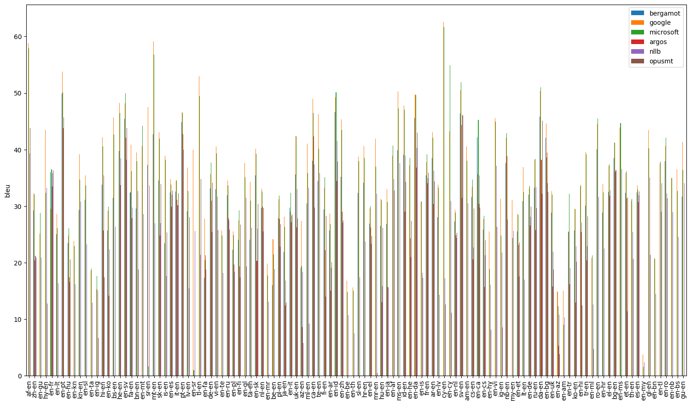
---

## en-af

| Translator/Dataset | flores-dev | flores-test |
| --- | --- | --- |
| bergamot | N/A | N/A |
| google | 38.80 | 39.10 |
| microsoft | 40.40 | 41.00 |
| argos | N/A | N/A |
| nllb | 34.90 | 34.70 |
| opusmt | 32.30 | 33.10 |

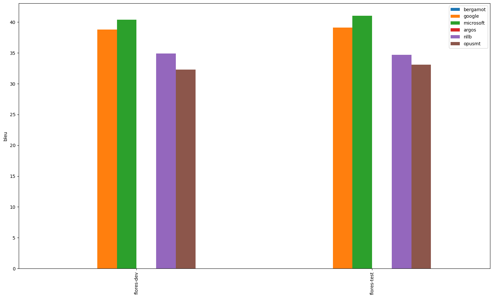
---

## cs-en

| Translator/Dataset | wmt20 | wmt08 | wmt10 | flores-dev | wmt12 | wmt17 | wmt14 | wmt11 | wmt15 | wmt18 | wmt21 | wmt09 | wmt22 | flores-test | wmt16 | wmt13 |
| --- | --- | --- | --- | --- | --- | --- | --- | --- | --- | --- | --- | --- | --- | --- | --- | --- |
| bergamot | 26.90 | 25.10 | 28.70 | 34.70 | 27.30 | 30.60 | 36.20 | 28.80 | 32.00 | 31.30 | 29.60 | 28.20 | 45.10 | 35.90 | 34.00 | 30.60 |
| google | 28.40 (+1.50, +5.58%) | 26.30 (+1.20, +4.78%) | 30.50 (+1.80, +6.27%) | 38.60 (+3.90, +11.24%) | 28.60 (+1.30, +4.76%) | 31.20 (+0.60, +1.96%) | 38.00 (+1.80, +4.97%) | 30.20 (+1.40, +4.86%) | 33.60 (+1.60, +5.00%) | 32.10 (+0.80, +2.56%) | 30.70 (+1.10, +3.72%) | 29.90 (+1.70, +6.03%) | 49.40 (+4.30, +9.53%) | 39.00 (+3.10, +8.64%) | 34.80 (+0.80, +2.35%) | 32.40 (+1.80, +5.88%) |
| microsoft | 27.60 (+0.70, +2.60%) | 26.40 (+1.30, +5.18%) | 30.70 (+2.00, +6.97%) | 40.00 (+5.30, +15.27%) | 29.70 (+2.40, +8.79%) | 33.60 (+3.00, +9.80%) | 39.90 (+3.70, +10.22%) | 30.90 (+2.10, +7.29%) | 34.70 (+2.70, +8.44%) | 34.30 (+3.00, +9.58%) | 30.50 (+0.90, +3.04%) | 29.60 (+1.40, +4.96%) | 54.90 (+9.80, +21.73%) | 40.30 (+4.40, +12.26%) | 38.30 (+4.30, +12.65%) | 33.40 (+2.80, +9.15%) |
| argos | 16.90 (-10.00, -37.17%) | 16.80 (-8.30, -33.07%) | 19.00 (-9.70, -33.80%) | 25.20 (-9.50, -27.38%) | 19.10 (-8.20, -30.04%) | 19.10 (-11.50, -37.58%) | 22.30 (-13.90, -38.40%) | 20.70 (-8.10, -28.13%) | 19.20 (-12.80, -40.00%) | 19.10 (-12.20, -38.98%) | 20.00 (-9.60, -32.43%) | 19.00 (-9.20, -32.62%) | 23.20 (-21.90, -48.56%) | 25.50 (-10.40, -28.97%) | 22.30 (-11.70, -34.41%) | 21.40 (-9.20, -30.07%) |
| nllb | 15.10 (-11.80, -43.87%) | 18.50 (-6.60, -26.29%) | 22.10 (-6.60, -23.00%) | 28.20 (-6.50, -18.73%) | 21.00 (-6.30, -23.08%) | 22.00 (-8.60, -28.10%) | 25.10 (-11.10, -30.66%) | 21.30 (-7.50, -26.04%) | 22.20 (-9.80, -30.63%) | 22.60 (-8.70, -27.80%) | 18.90 (-10.70, -36.15%) | 20.90 (-7.30, -25.89%) | 27.70 (-17.40, -38.58%) | 28.10 (-7.80, -21.73%) | 25.00 (-9.00, -26.47%) | 23.90 (-6.70, -21.90%) |
| opusmt | 23.00 (-3.90, -14.50%) | 23.30 (-1.80, -7.17%) | 26.50 (-2.20, -7.67%) | 34.30 (-0.40, -1.15%) | 27.10 (-0.20, -0.73%) | 28.00 (-2.60, -8.50%) | 33.10 (-3.10, -8.56%) | 27.70 (-1.10, -3.82%) | 29.20 (-2.80, -8.75%) | 29.20 (-2.10, -6.71%) | 27.90 (-1.70, -5.74%) | 26.50 (-1.70, -6.03%) | 41.10 (-4.00, -8.87%) | 34.90 (-1.00, -2.79%) | 31.50 (-2.50, -7.35%) | 30.30 (-0.30, -0.98%) |

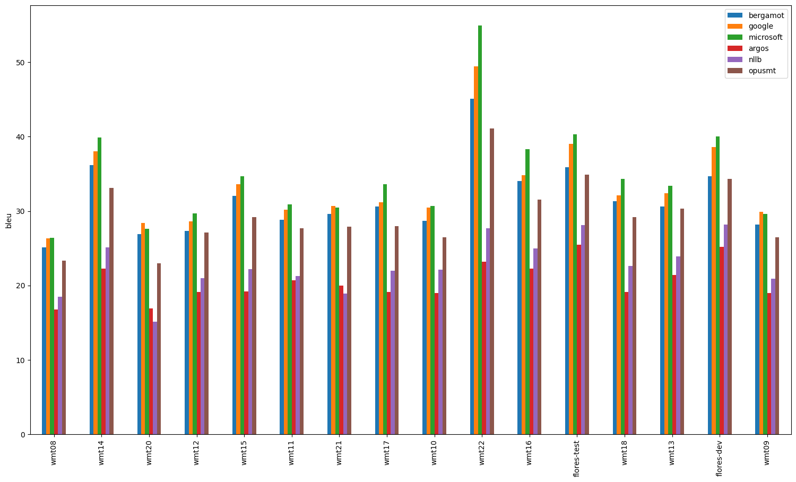
---

## tr-en

| Translator/Dataset | flores-dev | wmt17 | wmt18 | flores-test | wmt16 |
| --- | --- | --- | --- | --- | --- |
| bergamot | 33.90 | 28.50 | 27.70 | 33.20 | 27.10 |
| google | 44.10 (+10.20, +30.09%) | 38.10 (+9.60, +33.68%) | 36.10 (+8.40, +30.32%) | 42.60 (+9.40, +28.31%) | 37.00 (+9.90, +36.53%) |
| microsoft | 43.80 (+9.90, +29.20%) | 37.30 (+8.80, +30.88%) | 36.00 (+8.30, +29.96%) | 42.80 (+9.60, +28.92%) | 35.90 (+8.80, +32.47%) |
| argos | 24.60 (-9.30, -27.43%) | 18.30 (-10.20, -35.79%) | 17.40 (-10.30, -37.18%) | 23.90 (-9.30, -28.01%) | 17.90 (-9.20, -33.95%) |
| nllb | 27.30 (-6.60, -19.47%) | 19.90 (-8.60, -30.18%) | 21.00 (-6.70, -24.19%) | 25.90 (-7.30, -21.99%) | 20.40 (-6.70, -24.72%) |
| opusmt | 33.00 (-0.90, -2.65%) | 24.70 (-3.80, -13.33%) | 26.60 (-1.10, -3.97%) | 31.60 (-1.60, -4.82%) | 25.00 (-2.10, -7.75%) |

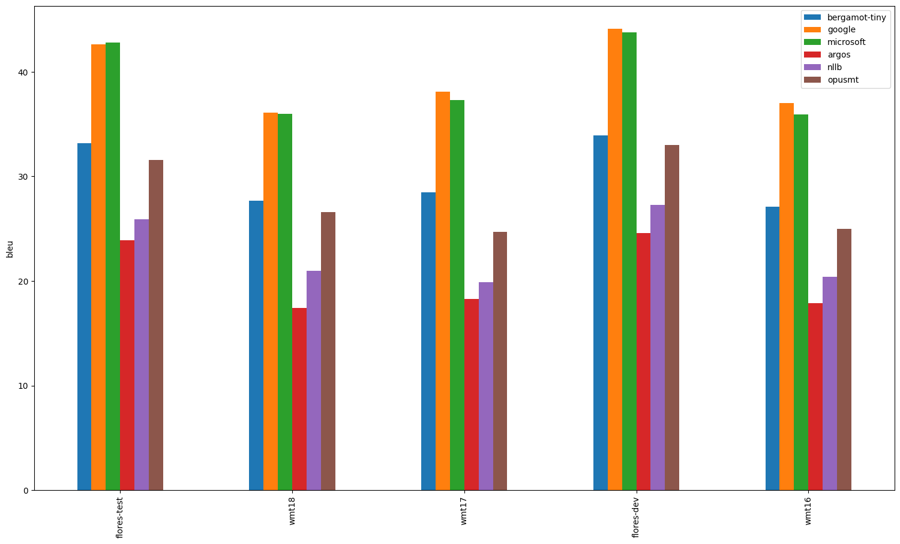
---

## ar-en

| Translator/Dataset | flores-dev | iwslt17 | flores-test |
| --- | --- | --- | --- |
| bergamot | N/A | N/A | N/A |
| google | 46.00 | 38.00 | 45.10 |
| microsoft | 44.00 | 38.50 | 43.70 |
| argos | 30.00 | 31.60 | 29.50 |
| nllb | 37.50 | 34.70 | 36.50 |
| opusmt | 33.90 | 35.30 | 33.90 |

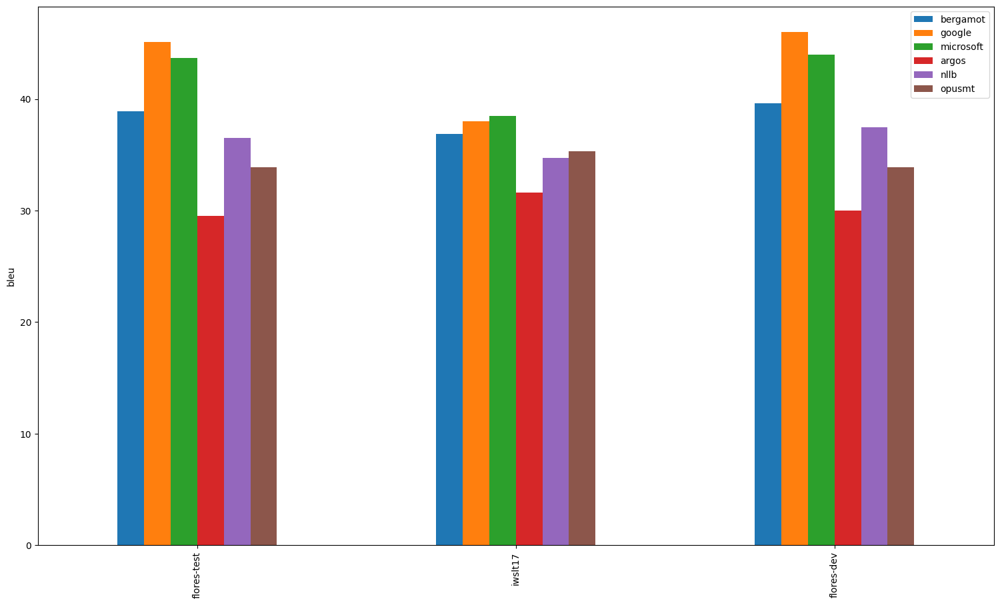
---

## sk-en

| Translator/Dataset | flores-dev | flores-test |
| --- | --- | --- |
| bergamot | 34.70 | 34.30 |
| google | 43.00 (+8.30, +23.92%) | 43.10 (+8.80, +25.66%) |
| microsoft | 42.10 (+7.40, +21.33%) | 41.80 (+7.50, +21.87%) |
| argos | 24.50 (-10.20, -29.39%) | 25.10 (-9.20, -26.82%) |
| nllb | 27.70 (-7.00, -20.17%) | 26.20 (-8.10, -23.62%) |
| opusmt | 34.00 (-0.70, -2.02%) | 33.80 (-0.50, -1.46%) |

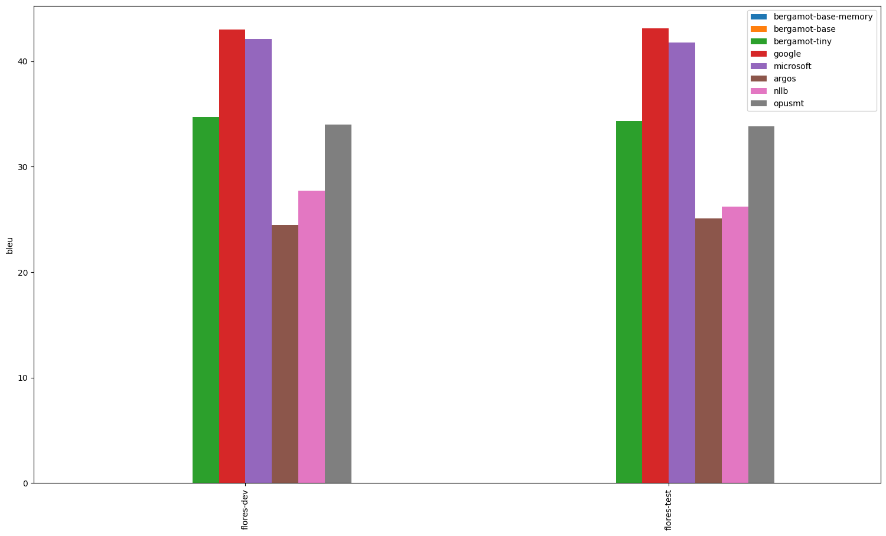
---

## en-cy

| Translator/Dataset | flores-test | flores-dev |
| --- | --- | --- |
| bergamot | N/A | N/A |
| google | 43.00 | 43.40 |
| microsoft | 54.40 | 55.40 |
| argos | N/A | N/A |
| nllb | 30.20 | 31.60 |
| opusmt | 10.70 | 11.50 |

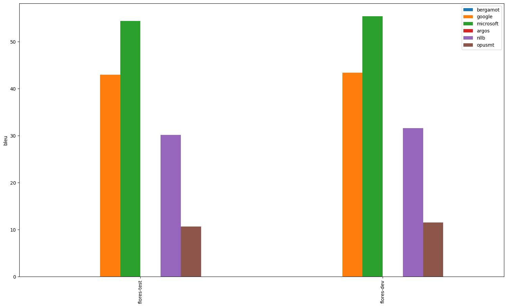
---

## en-et

| Translator/Dataset | flores-dev | flores-test | wmt18 |
| --- | --- | --- | --- |
| bergamot | 25.60 | 25.70 | 25.20 |
| google | 30.20 (+4.60, +17.97%) | 29.00 (+3.30, +12.84%) | 26.60 (+1.40, +5.56%) |
| microsoft | 28.60 (+3.00, +11.72%) | 29.20 (+3.50, +13.62%) | 27.60 (+2.40, +9.52%) |
| argos | 23.30 (-2.30, -8.98%) | 24.20 (-1.50, -5.84%) | 22.00 (-3.20, -12.70%) |
| nllb | 17.60 (-8.00, -31.25%) | 17.70 (-8.00, -31.13%) | 17.40 (-7.80, -30.95%) |
| opusmt | 23.40 (-2.20, -8.59%) | 24.80 (-0.90, -3.50%) | 22.40 (-2.80, -11.11%) |

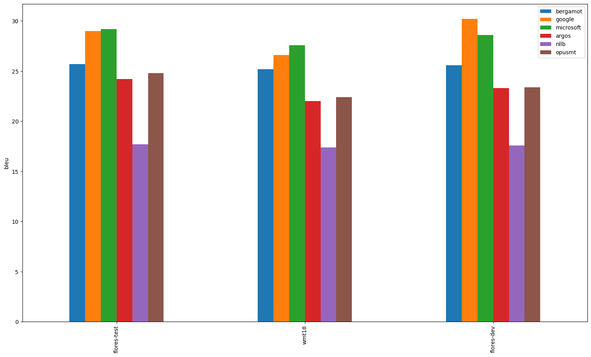
---

## en-fi

| Translator/Dataset | wmt16 | wmt15 | wmt17 | flores-dev | flores-test | wmt19 | wmt18 |
| --- | --- | --- | --- | --- | --- | --- | --- |
| bergamot | 25.70 | 23.30 | 27.80 | 24.60 | 23.40 | 25.50 | 17.80 |
| google | 28.80 (+3.10, +12.06%) | 27.10 (+3.80, +16.31%) | 31.60 (+3.80, +13.67%) | 27.90 (+3.30, +13.41%) | 28.60 (+5.20, +22.22%) | 27.70 (+2.20, +8.63%) | 20.30 (+2.50, +14.04%) |
| microsoft | 31.10 (+5.40, +21.01%) | 28.90 (+5.60, +24.03%) | 34.20 (+6.40, +23.02%) | 30.00 (+5.40, +21.95%) | 29.70 (+6.30, +26.92%) | 29.60 (+4.10, +16.08%) | 21.40 (+3.60, +20.22%) |
| argos | 20.00 (-5.70, -22.18%) | 19.50 (-3.80, -16.31%) | 22.10 (-5.70, -20.50%) | 19.50 (-5.10, -20.73%) | 19.30 (-4.10, -17.52%) | 19.00 (-6.50, -25.49%) | 15.90 (-1.90, -10.67%) |
| nllb | 18.70 (-7.00, -27.24%) | 16.20 (-7.10, -30.47%) | 19.70 (-8.10, -29.14%) | 17.00 (-7.60, -30.89%) | 16.90 (-6.50, -27.78%) | 20.10 (-5.40, -21.18%) | 13.30 (-4.50, -25.28%) |
| opusmt | 29.70 (+4.00, +15.56%) | 27.60 (+4.30, +18.45%) | 32.30 (+4.50, +16.19%) | 25.40 (+0.80, +3.25%) | 25.40 (+2.00, +8.55%) | 25.50 (0.00, 0.00%) | 21.00 (+3.20, +17.98%) |

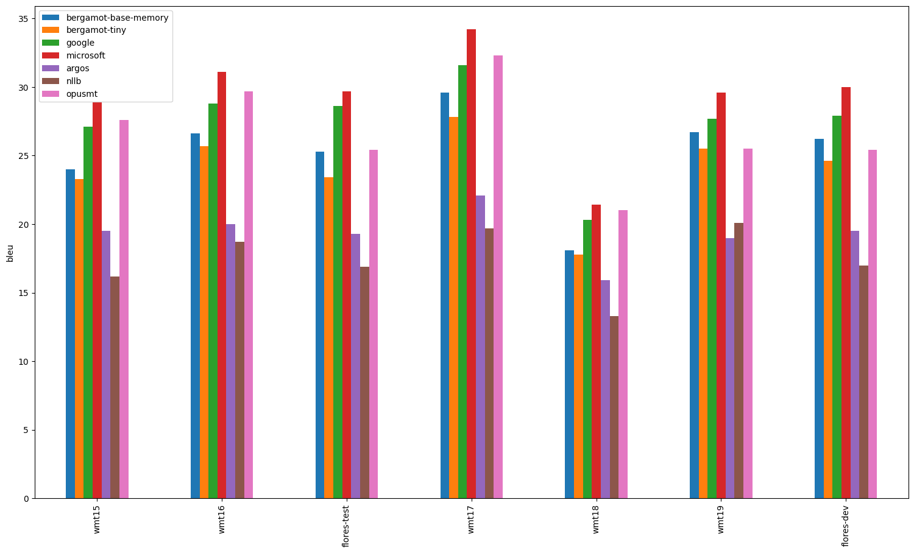
---

## en-it

| Translator/Dataset | flores-test | flores-dev | wmt09 |
| --- | --- | --- | --- |
| bergamot | 29.30 | 29.20 | 30.80 |
| google | 29.60 (+0.30, +1.02%) | 28.50 (-0.70, -2.40%) | 28.80 (-2.00, -6.49%) |
| microsoft | 32.10 (+2.80, +9.56%) | 31.10 (+1.90, +6.51%) | 33.70 (+2.90, +9.42%) |
| argos | 26.00 (-3.30, -11.26%) | 25.50 (-3.70, -12.67%) | 30.00 (-0.80, -2.60%) |
| nllb | 27.50 (-1.80, -6.14%) | 27.30 (-1.90, -6.51%) | 30.10 (-0.70, -2.27%) |
| opusmt | 27.50 (-1.80, -6.14%) | 26.80 (-2.40, -8.22%) | 31.20 (+0.40, +1.30%) |

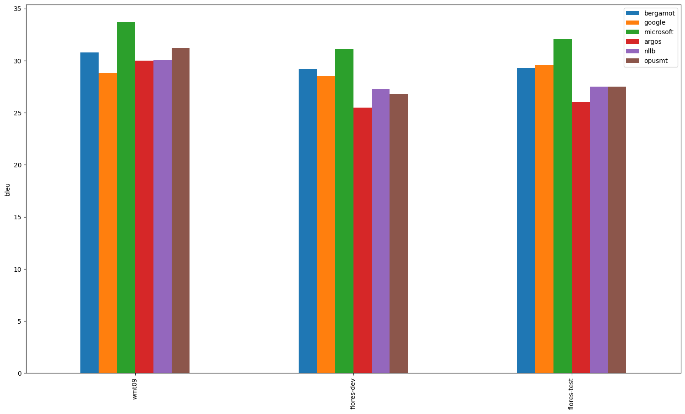
---

## en-bn

| Translator/Dataset | flores-test | flores-dev |
| --- | --- | --- |
| bergamot | N/A | N/A |
| google | 21.20 | 20.40 |
| microsoft | 20.70 | 20.60 |
| argos | N/A | N/A |
| nllb | 14.40 | 14.50 |
| opusmt | N/A | N/A |

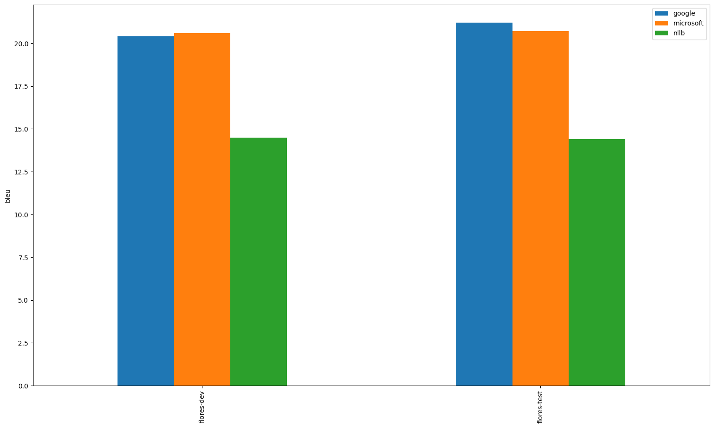
---

## en-gl

| Translator/Dataset | flores-test | flores-dev |
| --- | --- | --- |
| bergamot | N/A | N/A |
| google | 37.70 | 37.50 |
| microsoft | 34.80 | 35.40 |
| argos | N/A | N/A |
| nllb | 31.30 | 31.50 |
| opusmt | 18.90 | 19.80 |

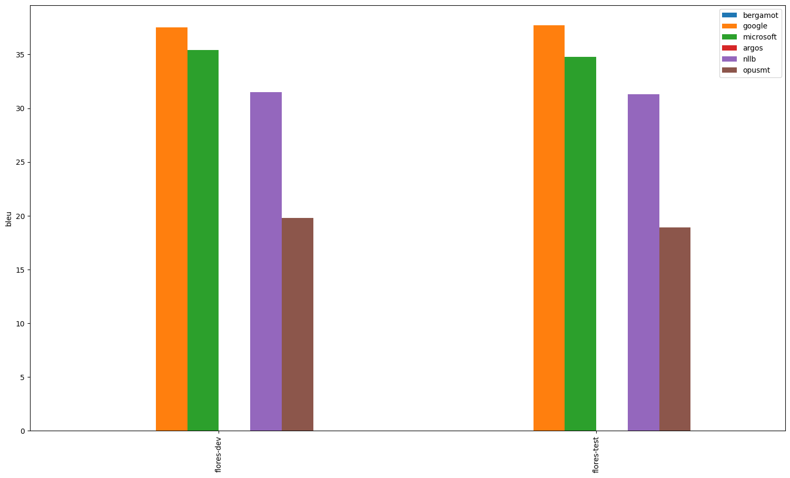
---

## en-hy

| Translator/Dataset | flores-test | flores-dev |
| --- | --- | --- |
| bergamot | N/A | N/A |
| google | 24.90 | 26.10 |
| microsoft | 18.60 | 19.10 |
| argos | N/A | N/A |
| nllb | 15.90 | 16.30 |
| opusmt | 7.80 | 8.40 |

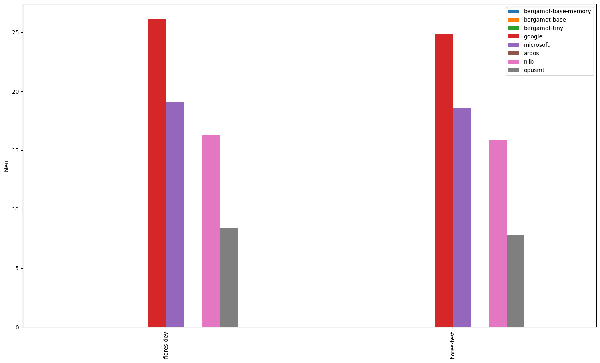
---

## en-hr

| Translator/Dataset | flores-test | flores-dev | wmt22 |
| --- | --- | --- | --- |
| bergamot | 29.70 | 30.30 | 26.40 |
| google | 35.30 (+5.60, +18.86%) | 35.00 (+4.70, +15.51%) | 31.40 (+5.00, +18.94%) |
| microsoft | 33.70 (+4.00, +13.47%) | 33.90 (+3.60, +11.88%) | 29.70 (+3.30, +12.50%) |
| argos | N/A | N/A | N/A |
| nllb | 23.20 (-6.50, -21.89%) | 22.90 (-7.40, -24.42%) | 21.50 (-4.90, -18.56%) |
| opusmt | N/A | N/A | N/A |

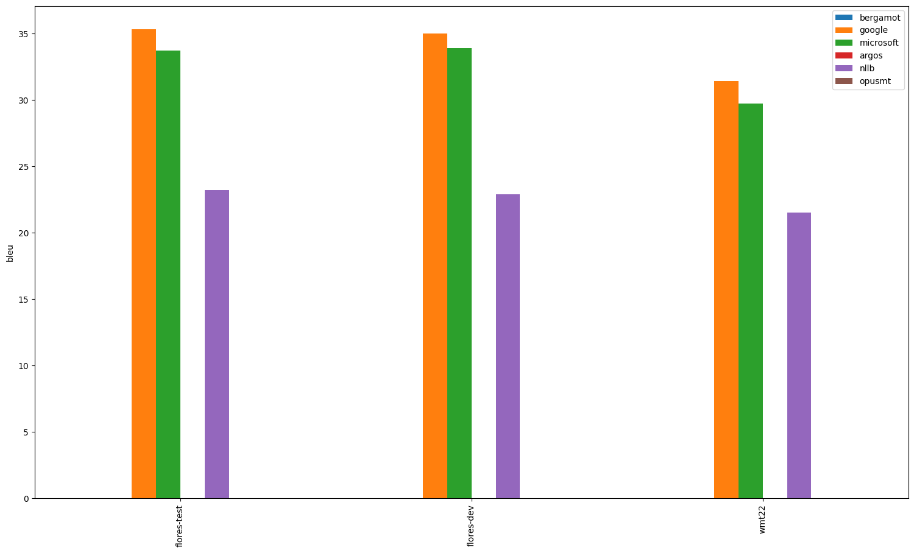
---

## fr-en

| Translator/Dataset | wmt08 | mtedx_test | wmt10 | flores-dev | wmt12 | wmt14 | wmt11 | wmt15 | iwslt17 | wmt09 | flores-test | wmt13 |
| --- | --- | --- | --- | --- | --- | --- | --- | --- | --- | --- | --- | --- |
| bergamot | 24.50 | 42.80 | 31.40 | 43.80 | 31.90 | 37.30 | 32.00 | 37.20 | 39.80 | 29.10 | 42.10 | 33.30 |
| google | 26.60 (+2.10, +8.57%) | 42.70 (-0.10, -0.23%) | 34.10 (+2.70, +8.60%) | 48.70 (+4.90, +11.19%) | 33.80 (+1.90, +5.96%) | 40.60 (+3.30, +8.85%) | 34.30 (+2.30, +7.19%) | 39.90 (+2.70, +7.26%) | 40.60 (+0.80, +2.01%) | 31.20 (+2.10, +7.22%) | 46.70 (+4.60, +10.93%) | 34.50 (+1.20, +3.60%) |
| microsoft | 27.40 (+2.90, +11.84%) | 46.40 (+3.60, +8.41%) | 35.00 (+3.60, +11.46%) | 48.90 (+5.10, +11.64%) | 34.60 (+2.70, +8.46%) | 42.30 (+5.00, +13.40%) | 35.20 (+3.20, +10.00%) | 42.70 (+5.50, +14.78%) | 41.80 (+2.00, +5.03%) | 32.20 (+3.10, +10.65%) | 47.00 (+4.90, +11.64%) | 36.10 (+2.80, +8.41%) |
| argos | 24.90 (+0.40, +1.63%) | 41.30 (-1.50, -3.50%) | 30.50 (-0.90, -2.87%) | 40.80 (-3.00, -6.85%) | 31.40 (-0.50, -1.57%) | 35.30 (-2.00, -5.36%) | 31.80 (-0.20, -0.62%) | 36.00 (-1.20, -3.23%) | 35.80 (-4.00, -10.05%) | 29.10 (0.00, 0.00%) | 39.50 (-2.60, -6.18%) | 32.10 (-1.20, -3.60%) |
| nllb | 25.50 (+1.00, +4.08%) | 39.10 (-3.70, -8.64%) | 32.00 (+0.60, +1.91%) | 43.20 (-0.60, -1.37%) | 32.20 (+0.30, +0.94%) | 37.50 (+0.20, +0.54%) | 31.60 (-0.40, -1.25%) | 35.80 (-1.40, -3.76%) | 37.90 (-1.90, -4.77%) | 29.50 (+0.40, +1.37%) | 41.90 (-0.20, -0.48%) | 33.20 (-0.10, -0.30%) |
| opusmt | 25.50 (+1.00, +4.08%) | 43.80 (+1.00, +2.34%) | 32.10 (+0.70, +2.23%) | 43.00 (-0.80, -1.83%) | 32.70 (+0.80, +2.51%) | 38.00 (+0.70, +1.88%) | 32.90 (+0.90, +2.81%) | 38.40 (+1.20, +3.23%) | 38.90 (-0.90, -2.26%) | 30.20 (+1.10, +3.78%) | 41.70 (-0.40, -0.95%) | 33.60 (+0.30, +0.90%) |

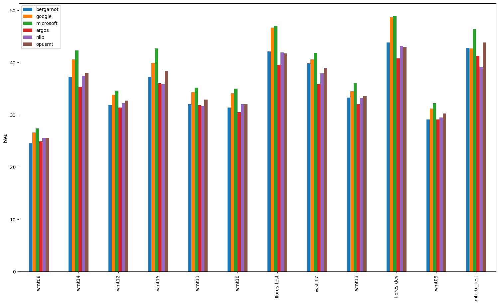
---

## en-pt

| Translator/Dataset | flores-test | flores-dev |
| --- | --- | --- |
| bergamot | 50.30 | 49.40 |
| google | 53.90 (+3.60, +7.16%) | 53.60 (+4.20, +8.50%) |
| microsoft | 50.70 (+0.40, +0.80%) | 49.60 (+0.20, +0.40%) |
| argos | 43.70 (-6.60, -13.12%) | 43.90 (-5.50, -11.13%) |
| nllb | 46.20 (-4.10, -8.15%) | 45.10 (-4.30, -8.70%) |
| opusmt | N/A | N/A |

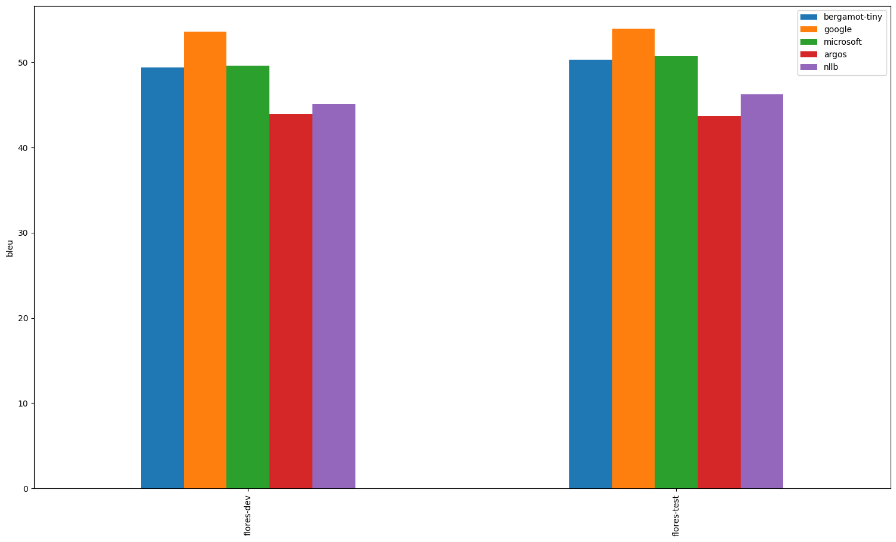
---

## ro-en

| Translator/Dataset | flores-dev | flores-test | wmt16 |
| --- | --- | --- | --- |
| bergamot | 39.90 | 39.40 | 40.80 |
| google | 45.50 (+5.60, +14.04%) | 45.20 (+5.80, +14.72%) | 42.90 (+2.10, +5.15%) |
| microsoft | 45.80 (+5.90, +14.79%) | 46.10 (+6.70, +17.01%) | 44.70 (+3.90, +9.56%) |
| argos | N/A | N/A | N/A |
| nllb | 33.00 (-6.90, -17.29%) | 32.10 (-7.30, -18.53%) | 29.60 (-11.20, -27.45%) |
| opusmt | N/A | N/A | N/A |

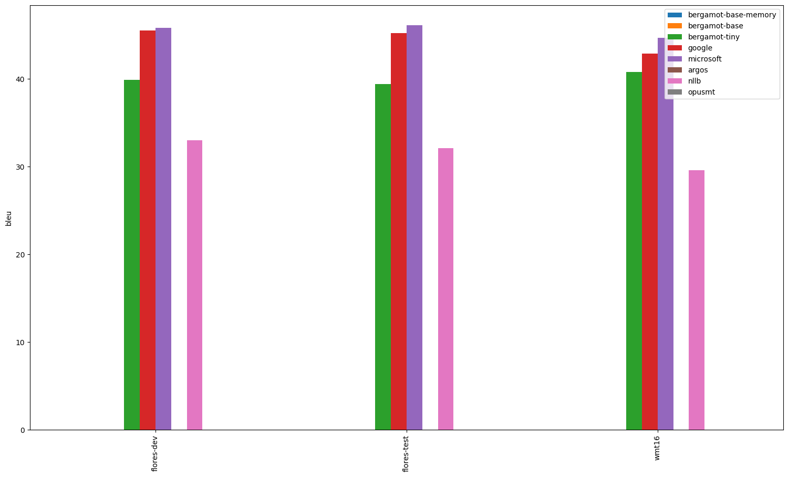
---

## hu-en

| Translator/Dataset | wmt08 | flores-dev | wmt09 | flores-test |
| --- | --- | --- | --- | --- |
| bergamot | 20.00 | 32.20 | 22.30 | 31.60 |
| google | 22.40 (+2.40, +12.00%) | 39.40 (+7.20, +22.36%) | 25.40 (+3.10, +13.90%) | 38.00 (+6.40, +20.25%) |
| microsoft | 22.60 (+2.60, +13.00%) | 38.50 (+6.30, +19.57%) | 24.80 (+2.50, +11.21%) | 38.20 (+6.60, +20.89%) |
| argos | 9.70 (-10.30, -51.50%) | 15.90 (-16.30, -50.62%) | 10.90 (-11.40, -51.12%) | 15.40 (-16.20, -51.27%) |
| nllb | 12.20 (-7.80, -39.00%) | 19.30 (-12.90, -40.06%) | 13.90 (-8.40, -37.67%) | 18.00 (-13.60, -43.04%) |
| opusmt | 19.50 (-0.50, -2.50%) | 31.90 (-0.30, -0.93%) | 22.30 (0.00, 0.00%) | 30.90 (-0.70, -2.22%) |

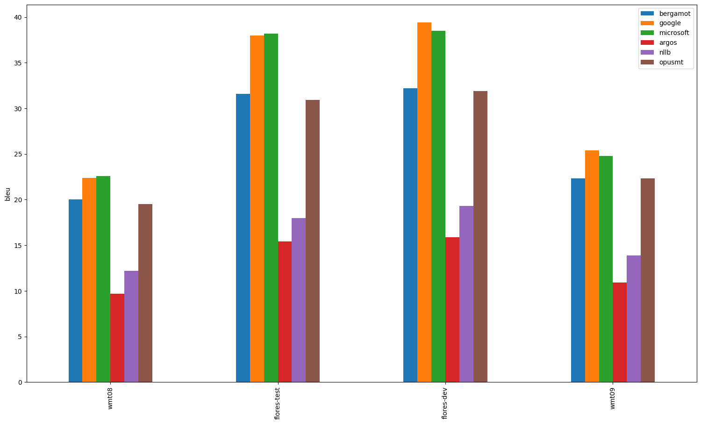
---

## th-en

| Translator/Dataset | flores-dev | flores-test |
| --- | --- | --- |
| bergamot | N/A | N/A |
| google | 31.40 | 30.50 |
| microsoft | 32.00 | 30.50 |
| argos | N/A | N/A |
| nllb | 26.50 | 24.40 |
| opusmt | 21.40 | 19.90 |

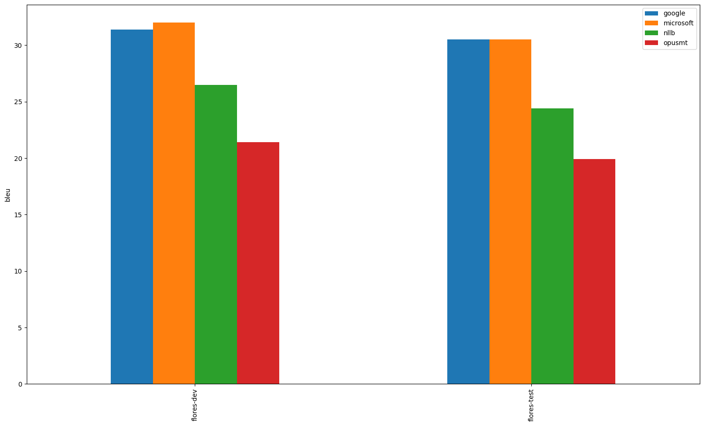
---

## en-zh

| Translator/Dataset | wmt19 | iwslt17 | flores-dev | wmt21 | wmt23 | wmt22 | flores-test | wmt18 | wmt24 | wmt20 | wmt17 |
| --- | --- | --- | --- | --- | --- | --- | --- | --- | --- | --- | --- |
| bergamot | 32.20 | 25.50 | 37.40 | 28.80 | N/A | 38.60 | 38.10 | 36.40 | N/A | 37.80 | 33.20 |
| google | 43.40 (+11.20, +34.78%) | 31.70 (+6.20, +24.31%) | 48.80 (+11.40, +30.48%) | 37.20 (+8.40, +29.17%) | 53.80 | 50.50 (+11.90, +30.83%) | 50.70 (+12.60, +33.07%) | 49.60 (+13.20, +36.26%) | 48.20 | 50.10 (+12.30, +32.54%) | 45.80 (+12.60, +37.95%) |
| microsoft | 41.00 (+8.80, +27.33%) | 31.90 (+6.40, +25.10%) | 47.80 (+10.40, +27.81%) | 35.50 (+6.70, +23.26%) | 58.30 | 49.10 (+10.50, +27.20%) | 49.00 (+10.90, +28.61%) | 45.80 (+9.40, +25.82%) | 44.70 | 48.30 (+10.50, +27.78%) | 42.40 (+9.20, +27.71%) |
| argos | 26.60 (-5.60, -17.39%) | 23.60 (-1.90, -7.45%) | 32.00 (-5.40, -14.44%) | 23.60 (-5.20, -18.06%) | N/A | 30.20 (-8.40, -21.76%) | 33.10 (-5.00, -13.12%) | 31.50 (-4.90, -13.46%) | N/A | 31.40 (-6.40, -16.93%) | 29.00 (-4.20, -12.65%) |
| nllb | 26.00 (-6.20, -19.25%) | 22.30 (-3.20, -12.55%) | 29.60 (-7.80, -20.86%) | 22.80 (-6.00, -20.83%) | N/A | 30.40 (-8.20, -21.24%) | 30.20 (-7.90, -20.73%) | 26.60 (-9.80, -26.92%) | N/A | 30.10 (-7.70, -20.37%) | 25.40 (-7.80, -23.49%) |
| opusmt | 23.90 (-8.30, -25.78%) | 23.70 (-1.80, -7.06%) | 31.00 (-6.40, -17.11%) | 22.90 (-5.90, -20.49%) | N/A | 29.70 (-8.90, -23.06%) | 32.20 (-5.90, -15.49%) | 28.00 (-8.40, -23.08%) | N/A | 29.40 (-8.40, -22.22%) | 26.20 (-7.00, -21.08%) |

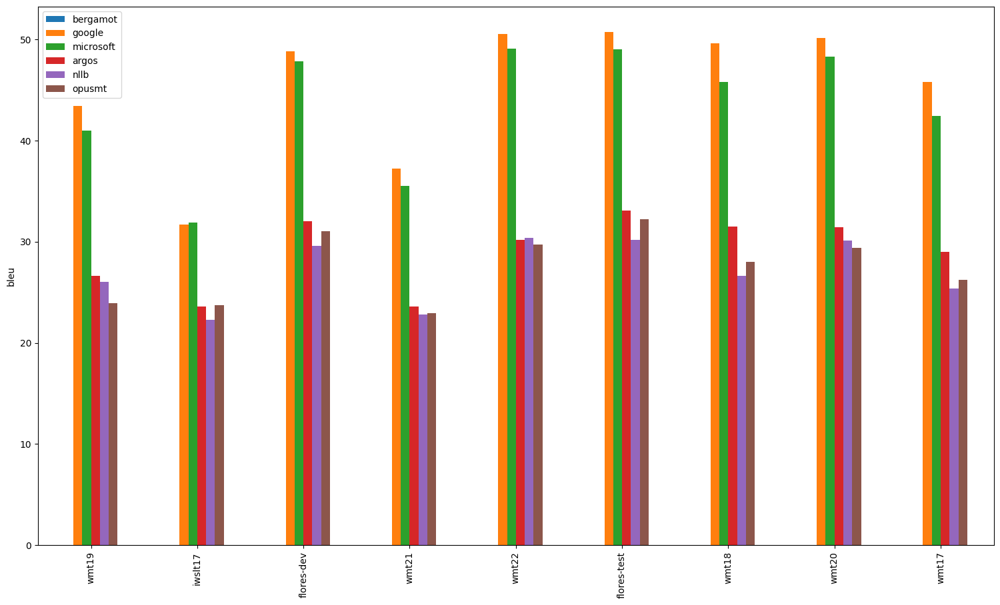
---

## vi-en

| Translator/Dataset | flores-dev | flores-test |
| --- | --- | --- |
| bergamot | 33.60 | 32.40 |
| google | 41.10 (+7.50, +22.32%) | 40.00 (+7.60, +23.46%) |
| microsoft | 39.90 (+6.30, +18.75%) | 38.70 (+6.30, +19.44%) |
| argos | N/A | N/A |
| nllb | 32.50 (-1.10, -3.27%) | 30.90 (-1.50, -4.63%) |
| opusmt | 26.20 (-7.40, -22.02%) | 25.30 (-7.10, -21.91%) |

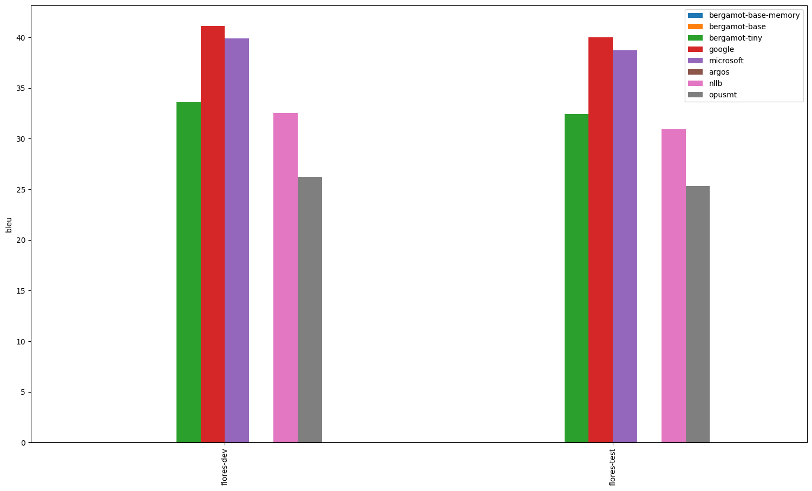
---

## en-ja

| Translator/Dataset | wmt20 | iwslt17 | wmt21 | flores-dev | wmt22 | wmt23 | wmt24 | flores-test |
| --- | --- | --- | --- | --- | --- | --- | --- | --- |
| bergamot | 23.90 | 13.00 | 25.60 | 34.20 | 22.20 | N/A | N/A | 34.30 |
| google | 35.30 (+11.40, +47.70%) | 14.70 (+1.70, +13.08%) | 37.20 (+11.60, +45.31%) | 41.40 (+7.20, +21.05%) | 28.20 (+6.00, +27.03%) | 26.70 | 30.90 | 41.20 (+6.90, +20.12%) |
| microsoft | 28.70 (+4.80, +20.08%) | 15.20 (+2.20, +16.92%) | 30.50 (+4.90, +19.14%) | 41.30 (+7.10, +20.76%) | 27.40 (+5.20, +23.42%) | 23.70 | 26.20 | 41.20 (+6.90, +20.12%) |
| argos | 12.90 (-11.00, -46.03%) | 8.00 (-5.00, -38.46%) | 13.60 (-12.00, -46.88%) | 22.30 (-11.90, -34.80%) | 15.20 (-7.00, -31.53%) | N/A | N/A | 22.20 (-12.10, -35.28%) |
| nllb | 14.50 (-9.40, -39.33%) | 10.90 (-2.10, -16.15%) | 16.00 (-9.60, -37.50%) | 19.20 (-15.00, -43.86%) | 13.90 (-8.30, -37.39%) | N/A | N/A | 19.00 (-15.30, -44.61%) |
| opusmt | N/A | N/A | N/A | N/A | N/A | N/A | N/A | N/A |

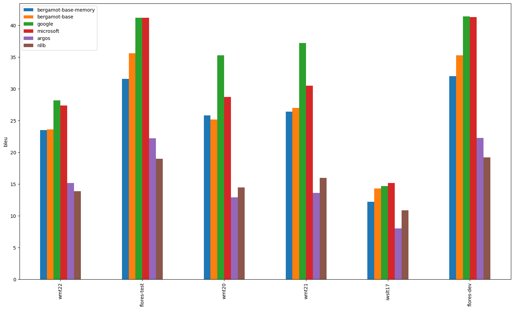
---

## ru-en

| Translator/Dataset | wmt20 | mtedx_test | flores-dev | wmt17 | wmt14 | wmt19 | wmt15 | wmt18 | wmt21 | wmt22 | flores-test | wmt23 | wmt16 | wmt13 |
| --- | --- | --- | --- | --- | --- | --- | --- | --- | --- | --- | --- | --- | --- | --- |
| bergamot | 35.00 | 23.90 | 30.40 | 37.00 | 36.90 | 39.50 | 33.00 | 31.70 | 35.50 | 38.50 | 30.30 | 29.20 | 31.90 | 28.10 |
| google | 38.40 (+3.40, +9.71%) | 25.10 (+1.20, +5.02%) | 38.40 (+8.00, +26.32%) | 42.70 (+5.70, +15.41%) | 42.70 (+5.80, +15.72%) | 42.80 (+3.30, +8.35%) | 38.60 (+5.60, +16.97%) | 37.30 (+5.60, +17.67%) | 39.80 (+4.30, +12.11%) | 43.70 (+5.20, +13.51%) | 37.30 (+7.00, +23.10%) | 34.80 (+5.60, +19.18%) | 37.60 (+5.70, +17.87%) | 32.20 (+4.10, +14.59%) |
| microsoft | 38.80 (+3.80, +10.86%) | 26.20 (+2.30, +9.62%) | 36.50 (+6.10, +20.07%) | 43.70 (+6.70, +18.11%) | 44.10 (+7.20, +19.51%) | 43.80 (+4.30, +10.89%) | 38.50 (+5.50, +16.67%) | 37.40 (+5.70, +17.98%) | 39.00 (+3.50, +9.86%) | 43.90 (+5.40, +14.03%) | 36.10 (+5.80, +19.14%) | 34.40 (+5.20, +17.81%) | 38.40 (+6.50, +20.38%) | 32.50 (+4.40, +15.66%) |
| argos | 25.50 (-9.50, -27.14%) | 21.40 (-2.50, -10.46%) | 25.70 (-4.70, -15.46%) | 28.90 (-8.10, -21.89%) | 28.20 (-8.70, -23.58%) | 26.70 (-12.80, -32.41%) | 25.50 (-7.50, -22.73%) | 24.70 (-7.00, -22.08%) | 24.90 (-10.60, -29.86%) | 27.10 (-11.40, -29.61%) | 26.40 (-3.90, -12.87%) | N/A | 25.40 (-6.50, -20.38%) | 24.50 (-3.60, -12.81%) |
| nllb | 33.90 (-1.10, -3.14%) | 24.50 (+0.60, +2.51%) | 33.80 (+3.40, +11.18%) | 37.10 (+0.10, +0.27%) | 36.10 (-0.80, -2.17%) | 36.40 (-3.10, -7.85%) | 33.50 (+0.50, +1.52%) | 32.50 (+0.80, +2.52%) | 34.40 (-1.10, -3.10%) | 36.10 (-2.40, -6.23%) | 32.80 (+2.50, +8.25%) | N/A | 33.70 (+1.80, +5.64%) | 29.60 (+1.50, +5.34%) |
| opusmt | 29.10 (-5.90, -16.86%) | 23.50 (-0.40, -1.67%) | 29.60 (-0.80, -2.63%) | 33.30 (-3.70, -10.00%) | 31.90 (-5.00, -13.55%) | 31.10 (-8.40, -21.27%) | 29.90 (-3.10, -9.39%) | 29.00 (-2.70, -8.52%) | 29.20 (-6.30, -17.75%) | 31.70 (-6.80, -17.66%) | 29.40 (-0.90, -2.97%) | N/A | 30.00 (-1.90, -5.96%) | 27.80 (-0.30, -1.07%) |

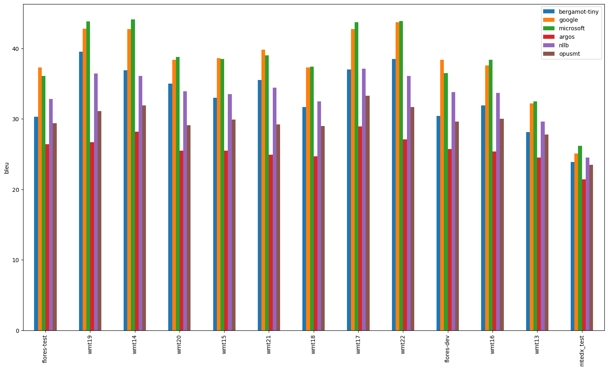
---

## mt-en

| Translator/Dataset | flores-dev | flores-test |
| --- | --- | --- |
| bergamot | 42.70 | 42.70 |
| google | 59.70 (+17.00, +39.81%) | 58.60 (+15.90, +37.24%) |
| microsoft | 57.20 (+14.50, +33.96%) | 56.30 (+13.60, +31.85%) |
| argos | N/A | N/A |
| nllb | 28.40 (-14.30, -33.49%) | 25.50 (-17.20, -40.28%) |
| opusmt | N/A | N/A |

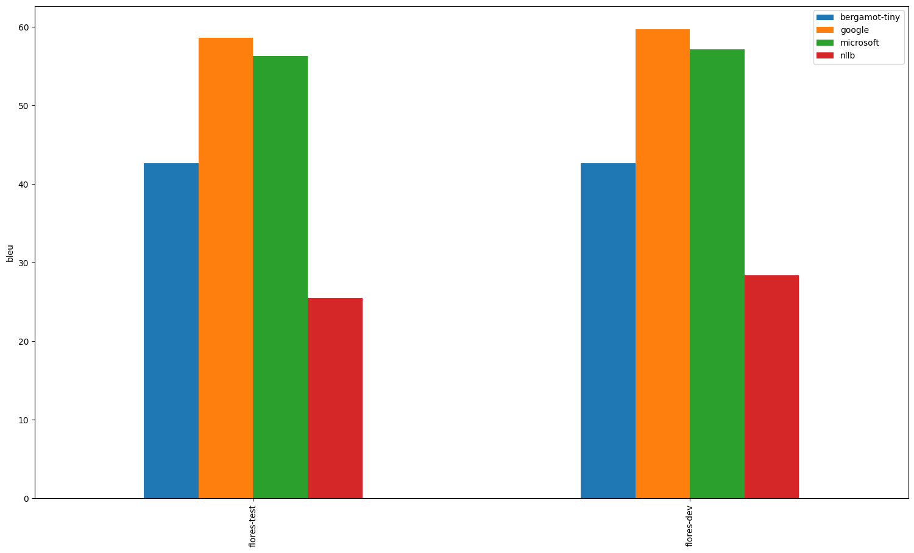
---

## en-sr

| Translator/Dataset | flores-dev | flores-test |
| --- | --- | --- |
| bergamot | N/A | N/A |
| google | 40.10 | 39.90 |
| microsoft | 1.10 | 0.90 |
| argos | N/A | N/A |
| nllb | 25.60 | 25.60 |
| opusmt | N/A | N/A |

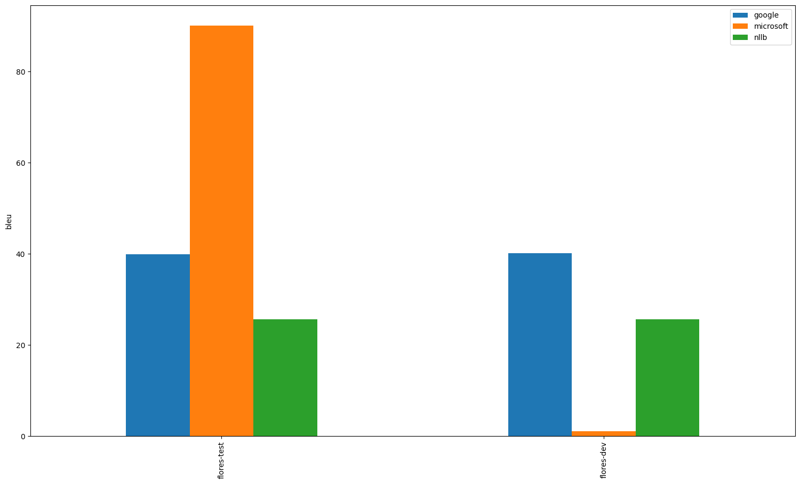
---

## en-nb

| Translator/Dataset | flores-test | flores-dev |
| --- | --- | --- |
| bergamot | N/A | N/A |
| google | 35.10 | 35.00 |
| microsoft | 35.20 | 34.70 |
| argos | N/A | N/A |
| nllb | 29.10 | 28.80 |
| opusmt | N/A | N/A |

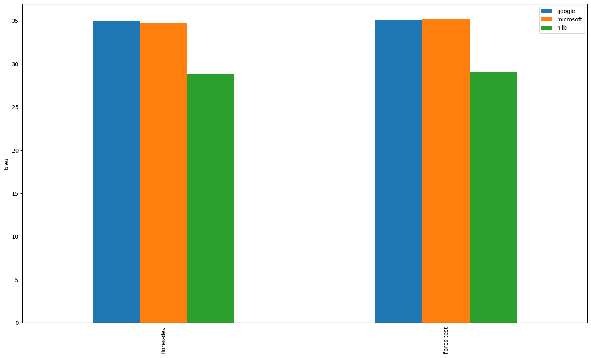
---

## en-hu

| Translator/Dataset | flores-test | flores-dev | wmt09 | wmt08 |
| --- | --- | --- | --- | --- |
| bergamot | 26.40 | 26.80 | 17.70 | 15.40 |
| google | 30.10 (+3.70, +14.02%) | 30.20 (+3.40, +12.69%) | 21.00 (+3.30, +18.64%) | 17.90 (+2.50, +16.23%) |
| microsoft | 31.50 (+5.10, +19.32%) | 31.80 (+5.00, +18.66%) | 22.20 (+4.50, +25.42%) | 18.70 (+3.30, +21.43%) |
| argos | 20.80 (-5.60, -21.21%) | 21.40 (-5.40, -20.15%) | 14.80 (-2.90, -16.38%) | 12.60 (-2.80, -18.18%) |
| nllb | 19.20 (-7.20, -27.27%) | 19.00 (-7.80, -29.10%) | 14.90 (-2.80, -15.82%) | 13.30 (-2.10, -13.64%) |
| opusmt | 24.50 (-1.90, -7.20%) | 24.80 (-2.00, -7.46%) | 18.10 (+0.40, +2.26%) | 14.90 (-0.50, -3.25%) |

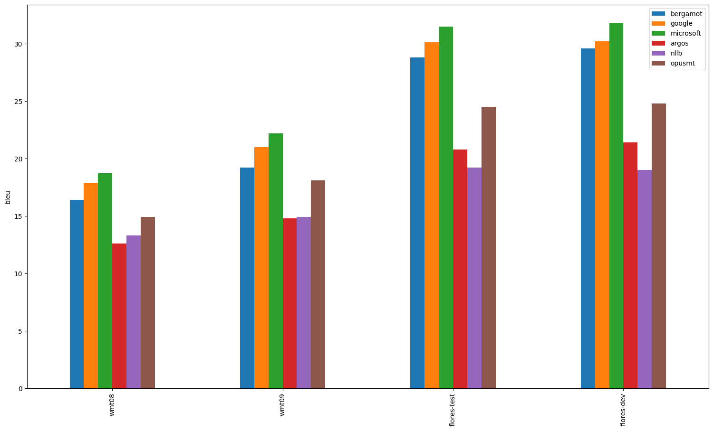
---

## en-el

| Translator/Dataset | flores-dev | flores-test |
| --- | --- | --- |
| bergamot | 26.90 | 26.90 |
| google | 29.50 (+2.60, +9.67%) | 29.60 (+2.70, +10.04%) |
| microsoft | 29.90 (+3.00, +11.15%) | 30.00 (+3.10, +11.52%) |
| argos | 26.10 (-0.80, -2.97%) | 26.40 (-0.50, -1.86%) |
| nllb | 23.40 (-3.50, -13.01%) | 23.20 (-3.70, -13.75%) |
| opusmt | 24.90 (-2.00, -7.43%) | 24.50 (-2.40, -8.92%) |

---

## el-en

| Translator/Dataset | mtedx_test | flores-dev | flores-test |
| --- | --- | --- | --- |
| bergamot | 32.50 | 33.20 | 31.70 |
| google | 32.20 (-0.30, -0.92%) | 40.20 (+7.00, +21.08%) | 39.00 (+7.30, +23.03%) |
| microsoft | 34.70 (+2.20, +6.77%) | 39.20 (+6.00, +18.07%) | 38.10 (+6.40, +20.19%) |
| argos | 31.20 (-1.30, -4.00%) | 32.90 (-0.30, -0.90%) | 31.40 (-0.30, -0.95%) |
| nllb | 29.80 (-2.70, -8.31%) | 35.10 (+1.90, +5.72%) | 33.50 (+1.80, +5.68%) |
| opusmt | N/A | N/A | N/A |

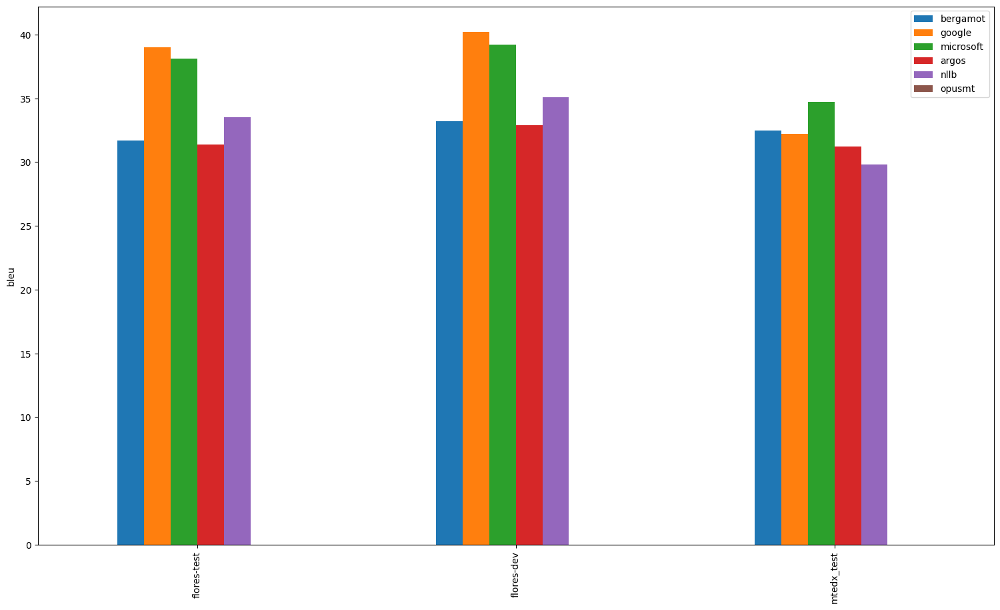
---

## fi-en

| Translator/Dataset | flores-dev | wmt17 | wmt19 | wmt15 | wmt18 | flores-test | wmt16 |
| --- | --- | --- | --- | --- | --- | --- | --- |
| bergamot | 31.70 | 33.10 | 29.50 | 26.50 | 24.10 | 30.60 | 30.60 |
| google | 37.00 (+5.30, +16.72%) | 37.70 (+4.60, +13.90%) | 32.50 (+3.00, +10.17%) | 29.90 (+3.40, +12.83%) | 25.40 (+1.30, +5.39%) | 35.60 (+5.00, +16.34%) | 34.30 (+3.70, +12.09%) |
| microsoft | 38.00 (+6.30, +19.87%) | 39.40 (+6.30, +19.03%) | 34.20 (+4.70, +15.93%) | 31.70 (+5.20, +19.62%) | 28.60 (+4.50, +18.67%) | 37.20 (+6.60, +21.57%) | 36.50 (+5.90, +19.28%) |
| argos | 25.30 (-6.40, -20.19%) | 23.90 (-9.20, -27.79%) | 21.10 (-8.40, -28.47%) | 20.10 (-6.40, -24.15%) | 18.00 (-6.10, -25.31%) | 24.60 (-6.00, -19.61%) | 22.00 (-8.60, -28.10%) |
| nllb | 15.90 (-15.80, -49.84%) | 15.50 (-17.60, -53.17%) | 12.10 (-17.40, -58.98%) | 13.00 (-13.50, -50.94%) | 11.60 (-12.50, -51.87%) | 14.60 (-16.00, -52.29%) | 15.00 (-15.60, -50.98%) |
| opusmt | 31.10 (-0.60, -1.89%) | 31.10 (-2.00, -6.04%) | 28.50 (-1.00, -3.39%) | 25.80 (-0.70, -2.64%) | 22.90 (-1.20, -4.98%) | 30.40 (-0.20, -0.65%) | 28.30 (-2.30, -7.52%) |

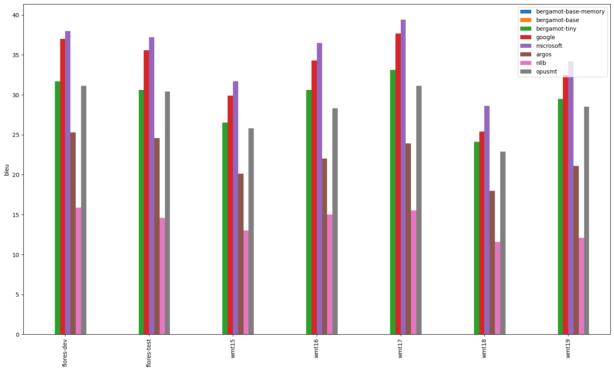
---

## en-da

| Translator/Dataset | flores-dev | flores-test |
| --- | --- | --- |
| bergamot | 45.10 | 46.00 |
| google | 49.30 (+4.20, +9.31%) | 50.10 (+4.10, +8.91%) |
| microsoft | 49.50 (+4.40, +9.76%) | 49.80 (+3.80, +8.26%) |
| argos | 37.20 (-7.90, -17.52%) | 36.40 (-9.60, -20.87%) |
| nllb | 40.50 (-4.60, -10.20%) | 40.10 (-5.90, -12.83%) |
| opusmt | 42.60 (-2.50, -5.54%) | 43.40 (-2.60, -5.65%) |

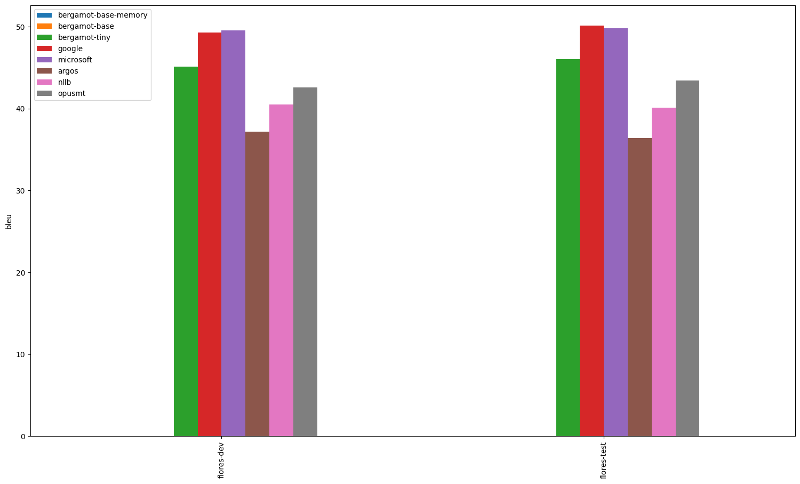
---

## en-nl

| Translator/Dataset | flores-dev | flores-test |
| --- | --- | --- |
| bergamot | 27.60 | 27.00 |
| google | 29.40 (+1.80, +6.52%) | 29.20 (+2.20, +8.15%) |
| microsoft | 29.00 (+1.40, +5.07%) | 28.60 (+1.60, +5.93%) |
| argos | 25.10 (-2.50, -9.06%) | 24.70 (-2.30, -8.52%) |
| nllb | 24.50 (-3.10, -11.23%) | 24.20 (-2.80, -10.37%) |
| opusmt | 25.60 (-2.00, -7.25%) | 25.00 (-2.00, -7.41%) |

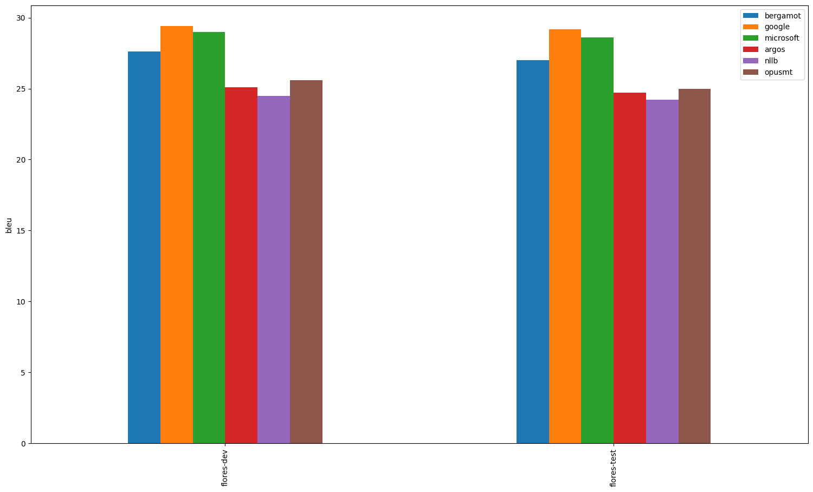
---

## en-mt

| Translator/Dataset | flores-test | flores-dev |
| --- | --- | --- |
| bergamot | N/A | N/A |
| google | 40.90 | 40.30 |
| microsoft | 44.00 | 44.40 |
| argos | N/A | N/A |
| nllb | 28.50 | 28.70 |
| opusmt | N/A | N/A |

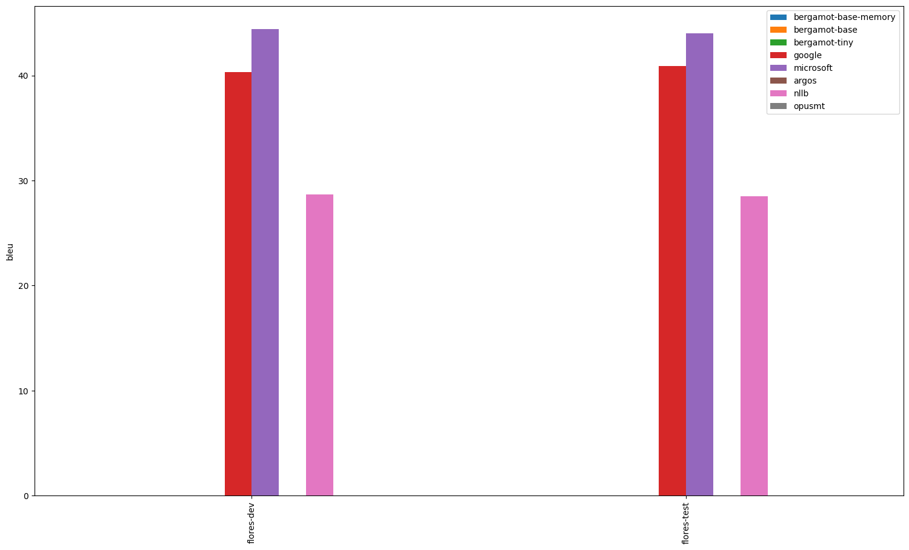
---

## en-sv

| Translator/Dataset | flores-test | flores-dev |
| --- | --- | --- |
| bergamot | 45.60 | 45.30 |
| google | 48.40 (+2.80, +6.14%) | 47.90 (+2.60, +5.74%) |
| microsoft | 50.10 (+4.50, +9.87%) | 49.90 (+4.60, +10.15%) |
| argos | 41.70 (-3.90, -8.55%) | 42.40 (-2.90, -6.40%) |
| nllb | 37.60 (-8.00, -17.54%) | 38.80 (-6.50, -14.35%) |
| opusmt | 43.70 (-1.90, -4.17%) | 43.80 (-1.50, -3.31%) |

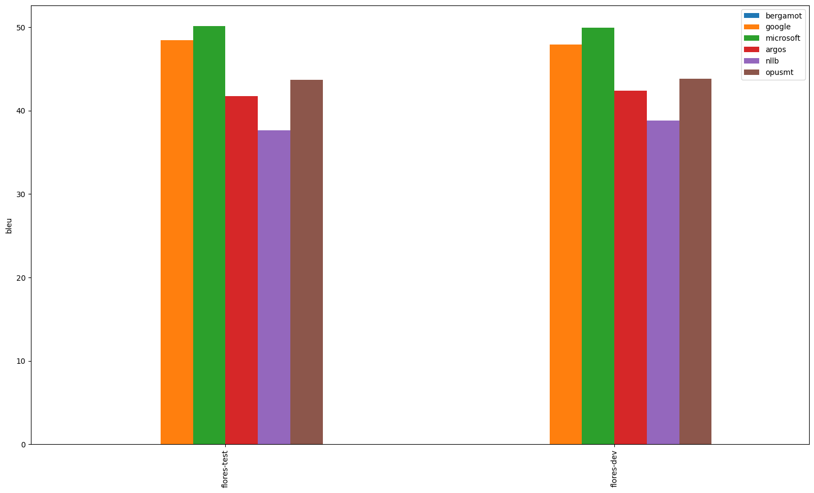
---

## en-am

| Translator/Dataset | flores-dev | flores-test |
| --- | --- | --- |
| bergamot | N/A | N/A |
| google | 13.90 | 16.20 |
| microsoft | 9.10 | 9.00 |
| argos | N/A | N/A |
| nllb | 9.60 | 11.10 |
| opusmt | N/A | N/A |

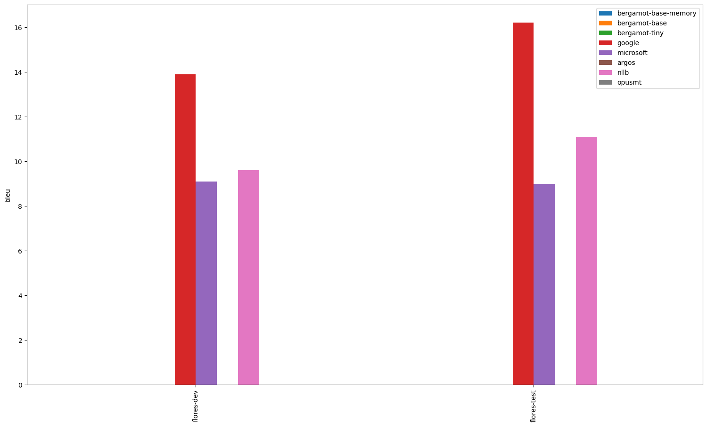
---

## lv-en

| Translator/Dataset | wmt17 | flores-dev | flores-test |
| --- | --- | --- | --- |
| bergamot | 24.40 | 31.90 | 31.00 |
| google | 27.20 (+2.80, +11.48%) | 42.10 (+10.20, +31.97%) | 41.10 (+10.10, +32.58%) |
| microsoft | 25.80 (+1.40, +5.74%) | 36.30 (+4.40, +13.79%) | 35.90 (+4.90, +15.81%) |
| argos | N/A | N/A | N/A |
| nllb | 12.60 (-11.80, -48.36%) | 17.50 (-14.40, -45.14%) | 16.10 (-14.90, -48.06%) |
| opusmt | 22.00 (-2.40, -9.84%) | 31.20 (-0.70, -2.19%) | 30.80 (-0.20, -0.65%) |

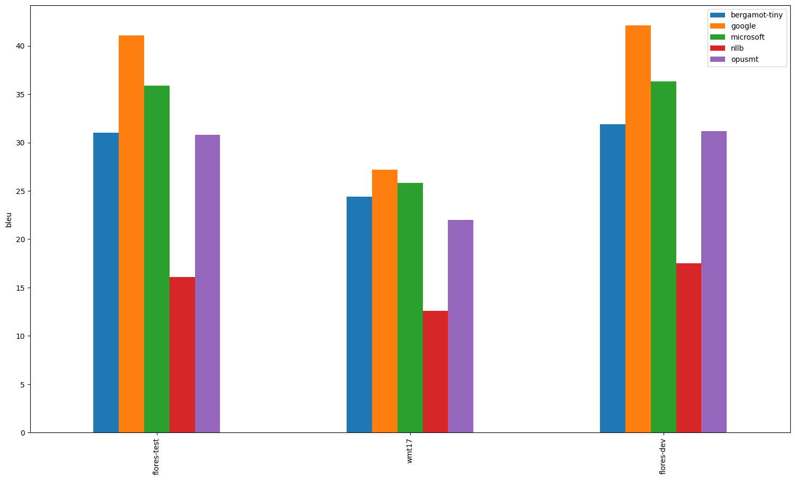
---

## en-ar

| Translator/Dataset | flores-dev | iwslt17 | flores-test |
| --- | --- | --- | --- |
| bergamot | N/A | N/A | N/A |
| google | 33.60 | 18.80 | 33.70 |
| microsoft | 31.60 | 17.90 | 31.00 |
| argos | 15.70 | 13.00 | 16.50 |
| nllb | 21.30 | 14.50 | 21.50 |
| opusmt | 21.60 | 15.90 | 22.80 |

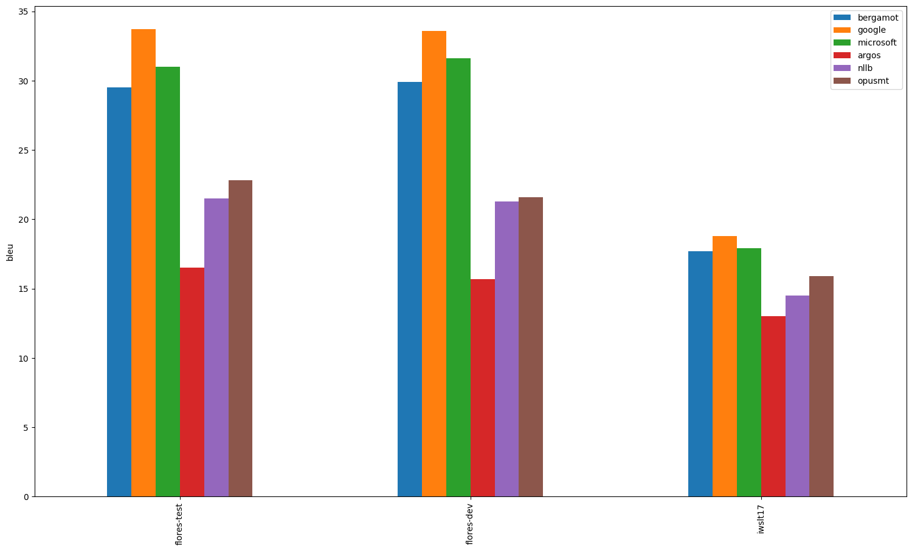
---

## en-th

| Translator/Dataset | flores-test | flores-dev |
| --- | --- | --- |
| bergamot | N/A | N/A |
| google | 14.90 | 16.30 |
| microsoft | 14.60 | 15.50 |
| argos | N/A | N/A |
| nllb | 7.10 | 7.80 |
| opusmt | N/A | N/A |

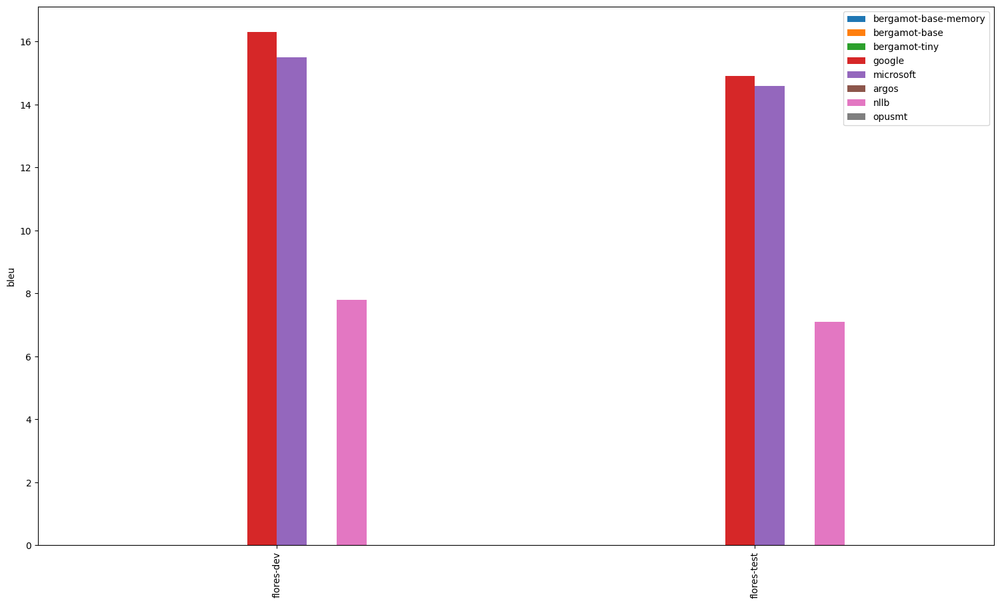
---

## en-ru

| Translator/Dataset | wmt16 | wmt15 | wmt21 | flores-dev | wmt22 | wmt24 | wmt18 | wmt14 | wmt23 | wmt17 | wmt20 | wmt19 | wmt13 | flores-test |
| --- | --- | --- | --- | --- | --- | --- | --- | --- | --- | --- | --- | --- | --- | --- |
| bergamot | 32.70 | 34.20 | 27.90 | 31.50 | 30.10 | 21.60 | 31.80 | 43.20 | 28.80 | 36.10 | 24.80 | 32.80 | 26.80 | 31.20 |
| google | 35.00 (+2.30, +7.03%) | 36.90 (+2.70, +7.89%) | 30.00 (+2.10, +7.53%) | 34.90 (+3.40, +10.79%) | 35.00 (+4.90, +16.28%) | 25.40 (+3.80, +17.59%) | 35.00 (+3.20, +10.06%) | 45.70 (+2.50, +5.79%) | 34.60 (+5.80, +20.14%) | 38.90 (+2.80, +7.76%) | 27.20 (+2.40, +9.68%) | 32.90 (+0.10, +0.30%) | 28.00 (+1.20, +4.48%) | 34.40 (+3.20, +10.26%) |
| microsoft | 34.20 (+1.50, +4.59%) | 36.10 (+1.90, +5.56%) | 29.20 (+1.30, +4.66%) | 33.50 (+2.00, +6.35%) | 33.10 (+3.00, +9.97%) | 24.00 (+2.40, +11.11%) | 33.70 (+1.90, +5.97%) | 44.70 (+1.50, +3.47%) | 33.80 (+5.00, +17.36%) | 38.60 (+2.50, +6.93%) | 26.30 (+1.50, +6.05%) | 33.20 (+0.40, +1.22%) | 27.30 (+0.50, +1.87%) | 33.60 (+2.40, +7.69%) |
| argos | 28.50 (-4.20, -12.84%) | 30.40 (-3.80, -11.11%) | 23.20 (-4.70, -16.85%) | 27.90 (-3.60, -11.43%) | 27.20 (-2.90, -9.63%) | N/A | 27.00 (-4.80, -15.09%) | 36.80 (-6.40, -14.81%) | N/A | 31.90 (-4.20, -11.63%) | 22.00 (-2.80, -11.29%) | 28.10 (-4.70, -14.33%) | 24.10 (-2.70, -10.07%) | 27.60 (-3.60, -11.54%) |
| nllb | 29.00 (-3.70, -11.31%) | 29.50 (-4.70, -13.74%) | 22.70 (-5.20, -18.64%) | 27.30 (-4.20, -13.33%) | 25.80 (-4.30, -14.29%) | N/A | 27.00 (-4.80, -15.09%) | 34.90 (-8.30, -19.21%) | N/A | 30.80 (-5.30, -14.68%) | 21.50 (-3.30, -13.31%) | 29.20 (-3.60, -10.98%) | 25.40 (-1.40, -5.22%) | 26.50 (-4.70, -15.06%) |
| opusmt | 26.20 (-6.50, -19.88%) | 27.00 (-7.20, -21.05%) | 22.90 (-5.00, -17.92%) | 26.50 (-5.00, -15.87%) | 24.60 (-5.50, -18.27%) | N/A | 24.80 (-7.00, -22.01%) | 32.60 (-10.60, -24.54%) | N/A | 29.10 (-7.00, -19.39%) | 20.10 (-4.70, -18.95%) | 27.20 (-5.60, -17.07%) | 23.40 (-3.40, -12.69%) | 25.50 (-5.70, -18.27%) |

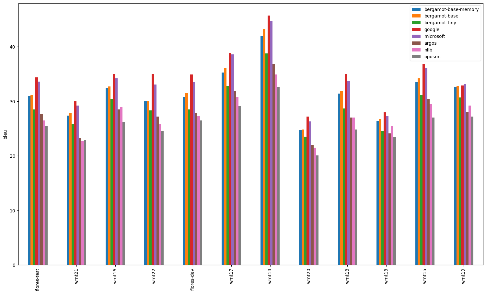
---

## en-fa

| Translator/Dataset | flores-dev | flores-test |
| --- | --- | --- |
| bergamot | 17.20 | 17.40 |
| google | 27.20 (+10.00, +58.14%) | 28.40 (+11.00, +63.22%) |
| microsoft | 19.90 (+2.70, +15.70%) | 21.10 (+3.70, +21.26%) |
| argos | 20.80 (+3.60, +20.93%) | 21.80 (+4.40, +25.29%) |
| nllb | 18.40 (+1.20, +6.98%) | 19.20 (+1.80, +10.34%) |
| opusmt | N/A | N/A |

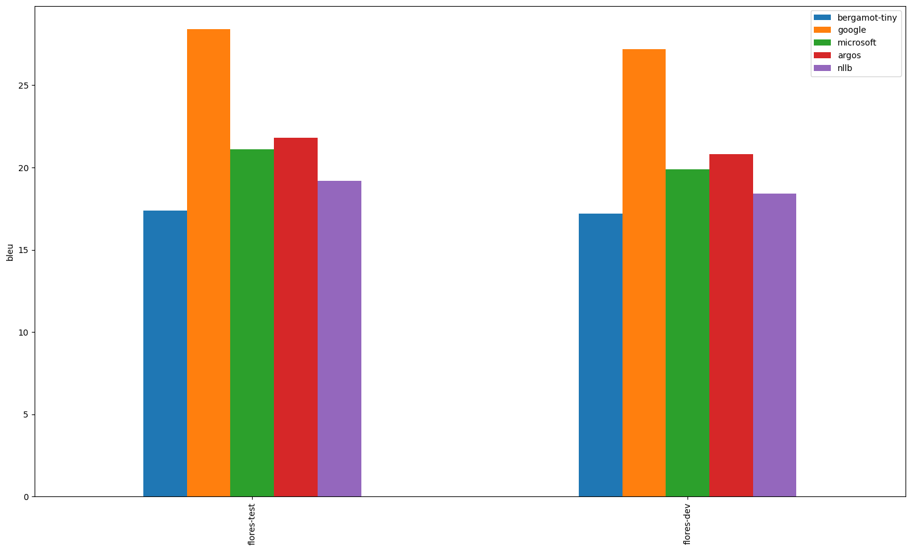
---

## cy-en

| Translator/Dataset | flores-dev | flores-test |
| --- | --- | --- |
| bergamot | N/A | N/A |
| google | 63.10 | 62.00 |
| microsoft | 62.30 | 61.00 |
| argos | N/A | N/A |
| nllb | 18.40 | 16.00 |
| opusmt | 12.90 | 12.30 |

---

## bs-en

| Translator/Dataset | flores-dev | flores-test |
| --- | --- | --- |
| bergamot | 31.00 | 31.80 |
| google | 45.50 (+14.50, +46.77%) | 45.80 (+14.00, +44.03%) |
| microsoft | 42.70 (+11.70, +37.74%) | 42.60 (+10.80, +33.96%) |
| argos | N/A | N/A |
| nllb | 26.80 (-4.20, -13.55%) | 25.80 (-6.00, -18.87%) |
| opusmt | N/A | N/A |

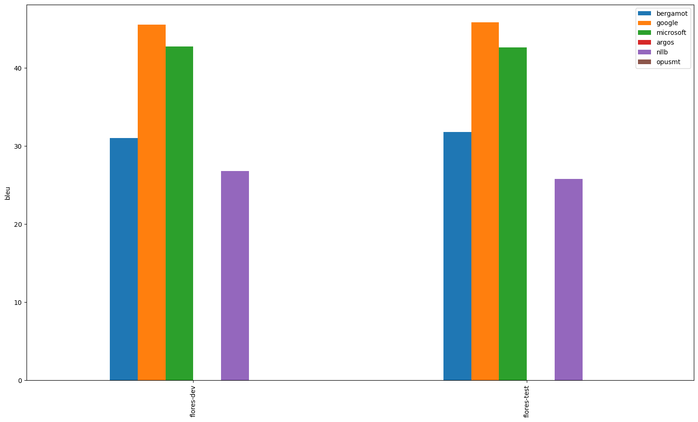
---

## et-en

| Translator/Dataset | flores-dev | wmt18 | flores-test |
| --- | --- | --- | --- |
| bergamot | 33.50 | 30.90 | 32.70 |
| google | 38.30 (+4.80, +14.33%) | 32.10 (+1.20, +3.88%) | 37.00 (+4.30, +13.15%) |
| microsoft | 37.40 (+3.90, +11.64%) | 34.10 (+3.20, +10.36%) | 37.00 (+4.30, +13.15%) |
| argos | 33.00 (-0.50, -1.49%) | 28.90 (-2.00, -6.47%) | 32.10 (-0.60, -1.83%) |
| nllb | 12.40 (-21.10, -62.99%) | 10.30 (-20.60, -66.67%) | 11.50 (-21.20, -64.83%) |
| opusmt | 33.90 (+0.40, +1.19%) | 29.10 (-1.80, -5.83%) | 31.50 (-1.20, -3.67%) |

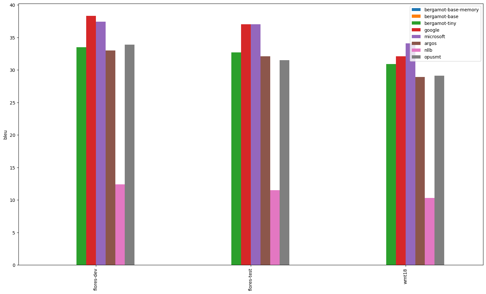
---

## nb-en

| Translator/Dataset | flores-dev | flores-test |
| --- | --- | --- |
| bergamot | 37.40 | 37.80 |
| google | 41.80 (+4.40, +11.76%) | 42.30 (+4.50, +11.90%) |
| microsoft | 42.70 (+5.30, +14.17%) | 43.10 (+5.30, +14.02%) |
| argos | 38.80 (+1.40, +3.74%) | 38.90 (+1.10, +2.91%) |
| nllb | 27.90 (-9.50, -25.40%) | 27.30 (-10.50, -27.78%) |
| opusmt | N/A | N/A |

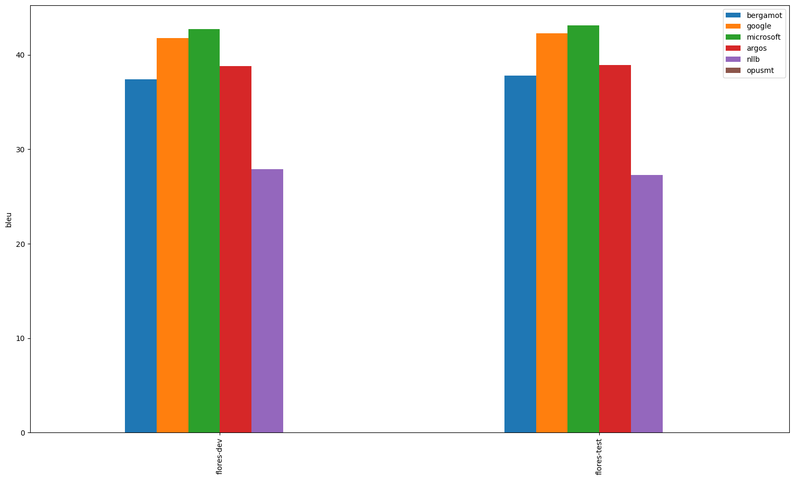
---

## en-ca

| Translator/Dataset | flores-test | flores-dev |
| --- | --- | --- |
| bergamot | 42.50 | 41.90 |
| google | 36.00 (-6.50, -15.29%) | 35.40 (-6.50, -15.51%) |
| microsoft | 45.70 (+3.20, +7.53%) | 44.80 (+2.90, +6.92%) |
| argos | 30.50 (-12.00, -28.24%) | 30.30 (-11.60, -27.68%) |
| nllb | 35.80 (-6.70, -15.76%) | 35.10 (-6.80, -16.23%) |
| opusmt | 29.80 (-12.70, -29.88%) | 29.60 (-12.30, -29.36%) |

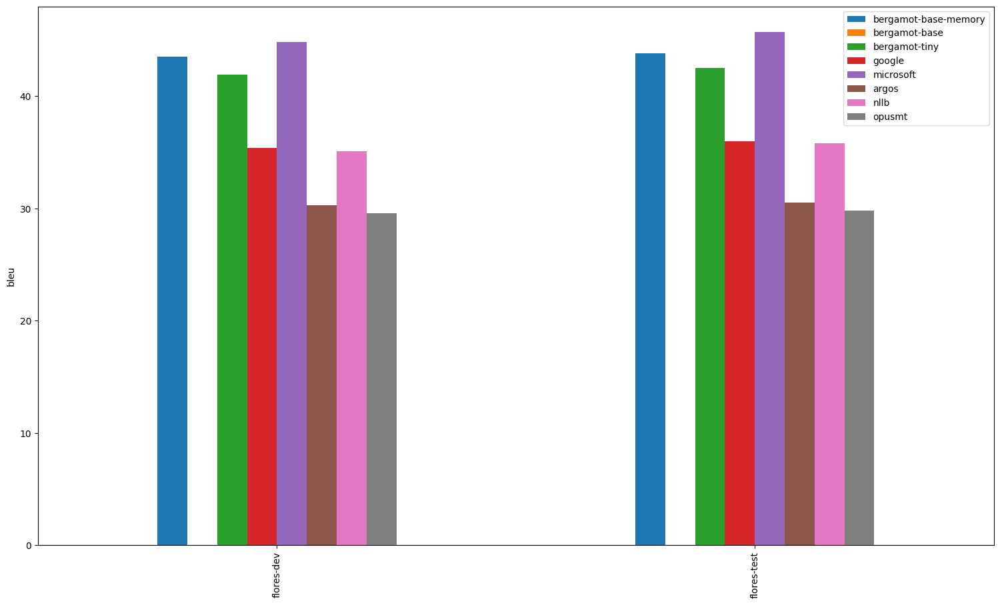
---

## bn-en

| Translator/Dataset | flores-dev | flores-test |
| --- | --- | --- |
| bergamot | N/A | N/A |
| google | 39.90 | 39.00 |
| microsoft | 38.40 | 37.50 |
| argos | N/A | N/A |
| nllb | 33.20 | 32.10 |
| opusmt | 19.50 | 18.00 |

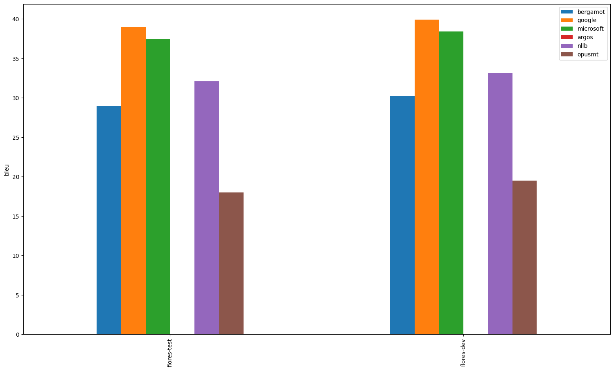
---

## nl-en

| Translator/Dataset | flores-dev | flores-test |
| --- | --- | --- |
| bergamot | 29.70 | 29.60 |
| google | 33.00 (+3.30, +11.11%) | 33.10 (+3.50, +11.82%) |
| microsoft | 32.40 (+2.70, +9.09%) | 32.80 (+3.20, +10.81%) |
| argos | 30.40 (+0.70, +2.36%) | 29.40 (-0.20, -0.68%) |
| nllb | 25.50 (-4.20, -14.14%) | 25.60 (-4.00, -13.51%) |
| opusmt | 30.10 (+0.40, +1.35%) | 29.20 (-0.40, -1.35%) |

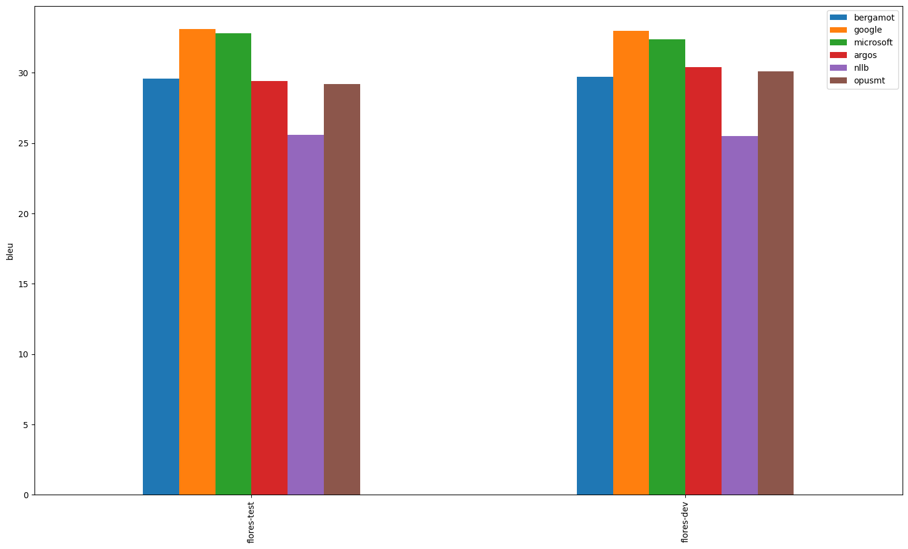
---

## en-lt

| Translator/Dataset | flores-test | wmt19 | flores-dev |
| --- | --- | --- | --- |
| bergamot | 25.70 | 18.00 | 24.80 |
| google | 32.00 (+6.30, +24.51%) | 22.70 (+4.70, +26.11%) | 31.00 (+6.20, +25.00%) |
| microsoft | 30.30 (+4.60, +17.90%) | 18.80 (+0.80, +4.44%) | 29.20 (+4.40, +17.74%) |
| argos | N/A | N/A | N/A |
| nllb | 18.40 (-7.30, -28.40%) | 12.60 (-5.40, -30.00%) | 17.90 (-6.90, -27.82%) |
| opusmt | N/A | N/A | N/A |

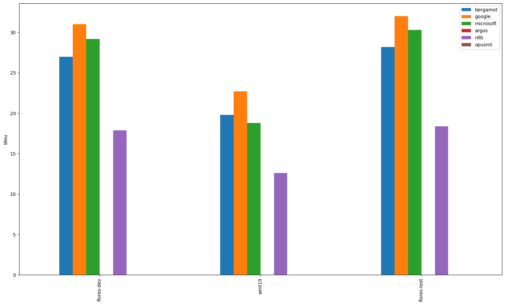
---

## en-tr

| Translator/Dataset | flores-dev | wmt16 | wmt17 | wmt18 | flores-test |
| --- | --- | --- | --- | --- | --- |
| bergamot | 30.90 | 22.20 | 23.20 | 20.60 | 30.20 |
| google | 28.10 (-2.80, -9.06%) | 22.80 (+0.60, +2.70%) | 26.40 (+3.20, +13.79%) | 22.90 (+2.30, +11.17%) | 27.40 (-2.80, -9.27%) |
| microsoft | 37.70 (+6.80, +22.01%) | 28.20 (+6.00, +27.03%) | 31.40 (+8.20, +35.34%) | 26.80 (+6.20, +30.10%) | 36.80 (+6.60, +21.85%) |
| argos | 19.10 (-11.80, -38.19%) | 14.80 (-7.40, -33.33%) | 14.80 (-8.40, -36.21%) | 13.50 (-7.10, -34.47%) | 18.70 (-11.50, -38.08%) |
| nllb | 21.90 (-9.00, -29.13%) | 17.20 (-5.00, -22.52%) | 18.30 (-4.90, -21.12%) | 16.10 (-4.50, -21.84%) | 21.50 (-8.70, -28.81%) |
| opusmt | N/A | N/A | N/A | N/A | N/A |

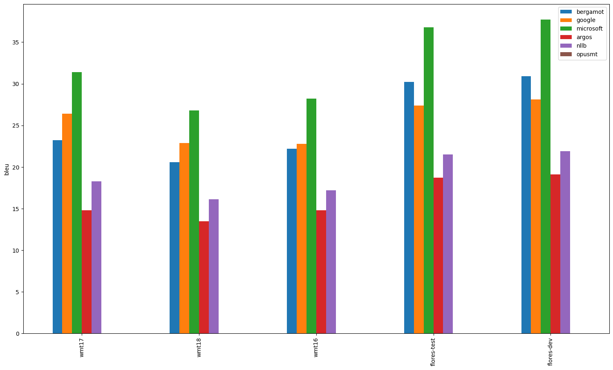
---

## bg-en

| Translator/Dataset | flores-dev | flores-test |
| --- | --- | --- |
| bergamot | 39.10 | 37.90 |
| google | 41.90 (+2.80, +7.16%) | 40.70 (+2.80, +7.39%) |
| microsoft | 42.10 (+3.00, +7.67%) | 40.30 (+2.40, +6.33%) |
| argos | 36.60 (-2.50, -6.39%) | 35.60 (-2.30, -6.07%) |
| nllb | 36.60 (-2.50, -6.39%) | 36.20 (-1.70, -4.49%) |
| opusmt | 36.40 (-2.70, -6.91%) | 36.20 (-1.70, -4.49%) |

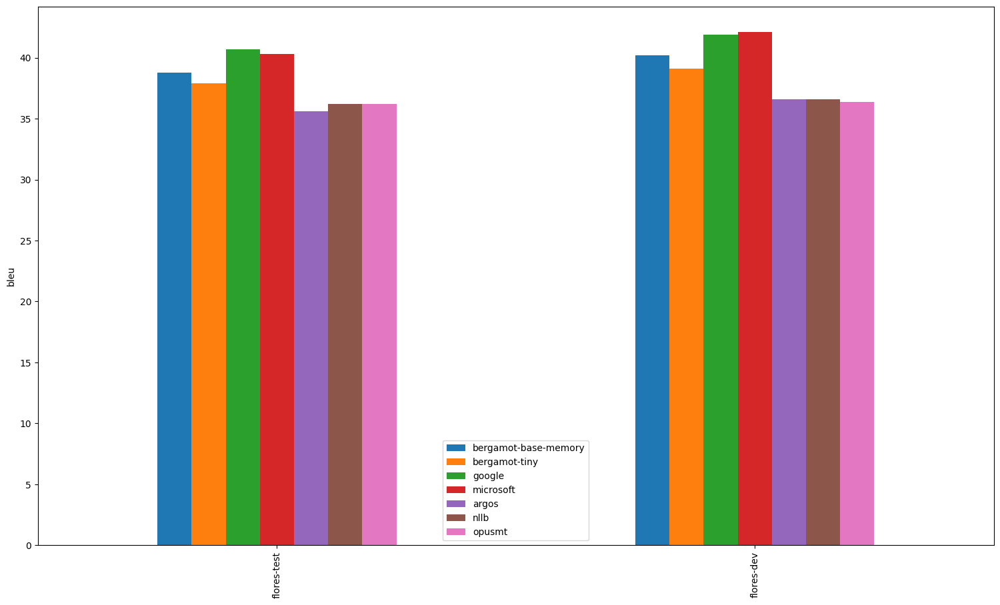
---

## ko-en

| Translator/Dataset | flores-dev | iwslt17 | flores-test |
| --- | --- | --- | --- |
| bergamot | 29.00 | 20.10 | 27.90 |
| google | 34.30 (+5.30, +18.28%) | 20.30 (+0.20, +1.00%) | 33.80 (+5.90, +21.15%) |
| microsoft | 34.30 (+5.30, +18.28%) | 20.40 (+0.30, +1.49%) | 33.80 (+5.90, +21.15%) |
| argos | 15.60 (-13.40, -46.21%) | 8.10 (-12.00, -59.70%) | 15.10 (-12.80, -45.88%) |
| nllb | 26.00 (-3.00, -10.34%) | 17.40 (-2.70, -13.43%) | 25.30 (-2.60, -9.32%) |
| opusmt | 22.10 (-6.90, -23.79%) | 17.70 (-2.40, -11.94%) | 20.60 (-7.30, -26.16%) |

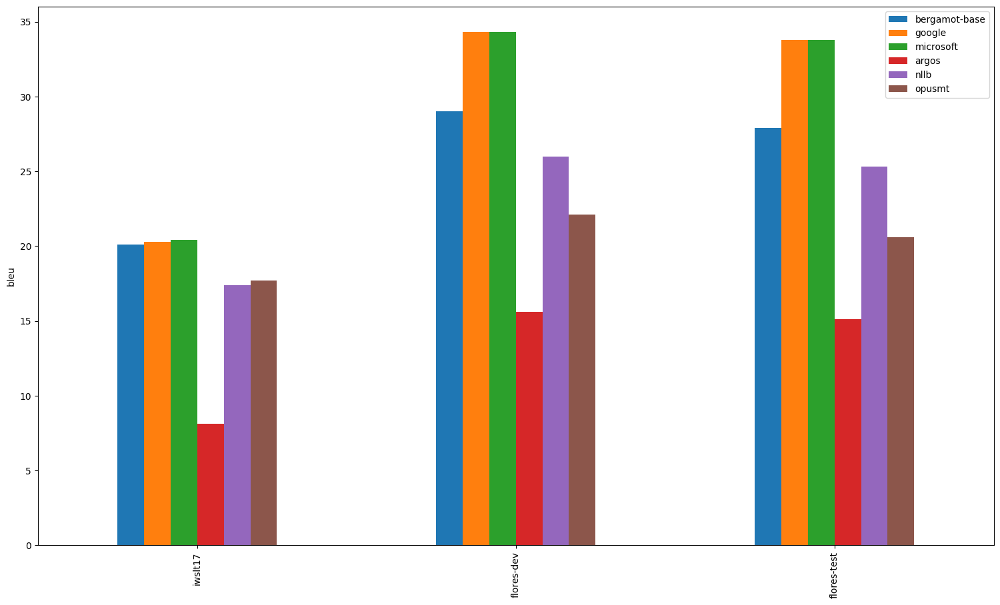
---

## uk-en

| Translator/Dataset | flores-dev | wmt22 | flores-test | wmt23 |
| --- | --- | --- | --- | --- |
| bergamot | 33.60 | 39.30 | 33.80 | 42.60 |
| google | 43.10 (+9.50, +28.27%) | 41.60 (+2.30, +5.85%) | 42.60 (+8.80, +26.04%) | 42.80 (+0.20, +0.47%) |
| microsoft | 41.80 (+8.20, +24.40%) | 44.40 (+5.10, +12.98%) | 40.70 (+6.90, +20.41%) | 47.80 (+5.20, +12.21%) |
| argos | 27.90 (-5.70, -16.96%) | 22.70 (-16.60, -42.24%) | 28.20 (-5.60, -16.57%) | N/A |
| nllb | 34.00 (+0.40, +1.19%) | 31.40 (-7.90, -20.10%) | 33.60 (-0.20, -0.59%) | N/A |
| opusmt | 28.60 (-5.00, -14.88%) | 26.10 (-13.20, -33.59%) | 28.60 (-5.20, -15.38%) | N/A |

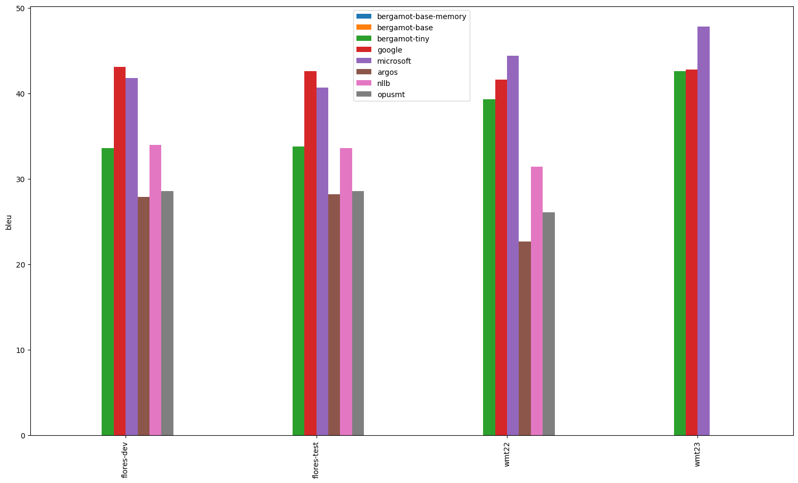
---

## hy-en

| Translator/Dataset | flores-dev | flores-test |
| --- | --- | --- |
| bergamot | N/A | N/A |
| google | 44.30 | 42.70 |
| microsoft | 32.50 | 32.10 |
| argos | N/A | N/A |
| nllb | 33.70 | 32.80 |
| opusmt | 12.70 | 12.80 |

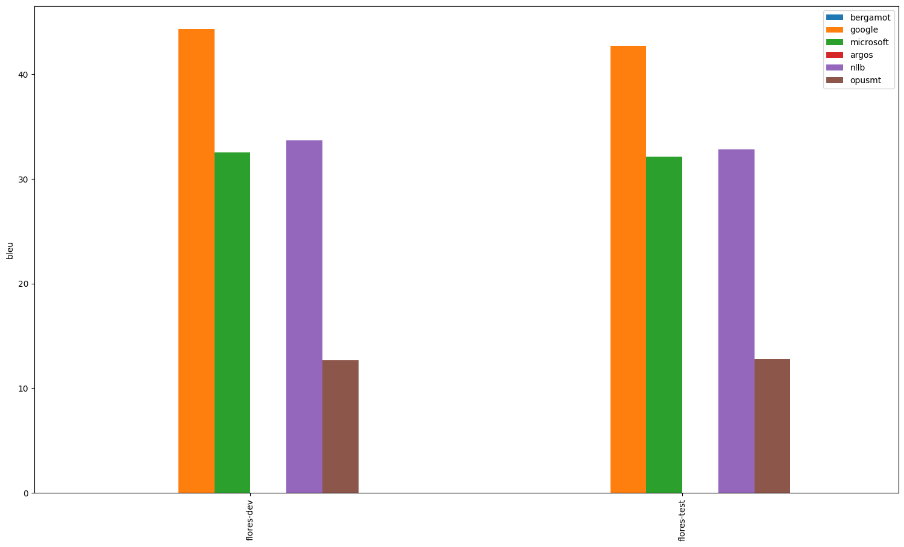
---

## en-es

| Translator/Dataset | wmt08 | wmt11 | wmt24 | flores-test | flores-dev | wmt12 | wmt10 | wmt09 | wmt13 |
| --- | --- | --- | --- | --- | --- | --- | --- | --- | --- |
| bergamot | 29.00 | 37.90 | 39.10 | 26.20 | 25.90 | 38.90 | 36.70 | 29.90 | 34.80 |
| google | 30.00 (+1.00, +3.45%) | 39.90 (+2.00, +5.28%) | 47.10 (+8.00, +20.46%) | 30.40 (+4.20, +16.03%) | 30.50 (+4.60, +17.76%) | 40.50 (+1.60, +4.11%) | 38.80 (+2.10, +5.72%) | 30.90 (+1.00, +3.34%) | 36.90 (+2.10, +6.03%) |
| microsoft | 29.90 (+0.90, +3.10%) | 39.10 (+1.20, +3.17%) | 46.80 (+7.70, +19.69%) | 28.50 (+2.30, +8.78%) | 28.40 (+2.50, +9.65%) | 40.00 (+1.10, +2.83%) | 37.80 (+1.10, +3.00%) | 30.70 (+0.80, +2.68%) | 35.70 (+0.90, +2.59%) |
| argos | 26.90 (-2.10, -7.24%) | 35.50 (-2.40, -6.33%) | N/A | 23.30 (-2.90, -11.07%) | 23.80 (-2.10, -8.11%) | 35.20 (-3.70, -9.51%) | 34.00 (-2.70, -7.36%) | 28.80 (-1.10, -3.68%) | 31.90 (-2.90, -8.33%) |
| nllb | 28.50 (-0.50, -1.72%) | 37.30 (-0.60, -1.58%) | N/A | 26.40 (+0.20, +0.76%) | 26.20 (+0.30, +1.16%) | 37.80 (-1.10, -2.83%) | 35.80 (-0.90, -2.45%) | 29.80 (-0.10, -0.33%) | 34.50 (-0.30, -0.86%) |
| opusmt | 29.20 (+0.20, +0.69%) | 38.20 (+0.30, +0.79%) | N/A | 26.70 (+0.50, +1.91%) | 26.60 (+0.70, +2.70%) | 38.90 (0.00, 0.00%) | 36.90 (+0.20, +0.54%) | 30.30 (+0.40, +1.34%) | 35.00 (+0.20, +0.57%) |

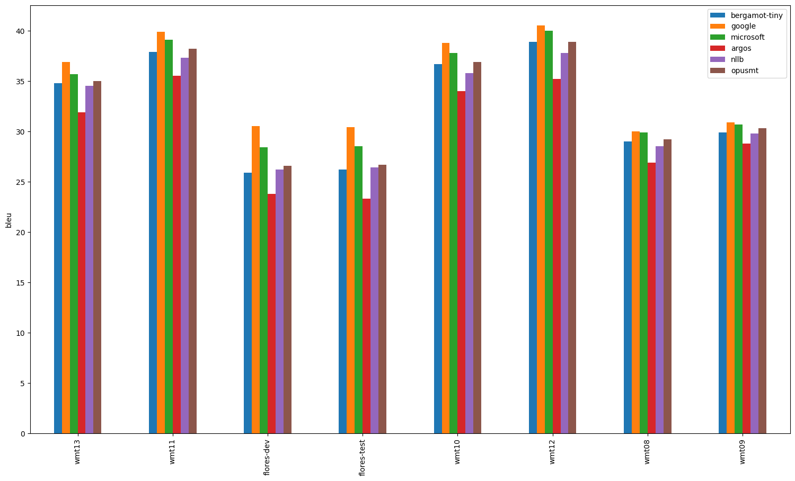
---

## fa-en

| Translator/Dataset | flores-dev | flores-test |
| --- | --- | --- |
| bergamot | 29.10 | 28.30 |
| google | 42.00 (+12.90, +44.33%) | 39.70 (+11.40, +40.28%) |
| microsoft | 36.50 (+7.40, +25.43%) | 35.80 (+7.50, +26.50%) |
| argos | 28.40 (-0.70, -2.41%) | 27.40 (-0.90, -3.18%) |
| nllb | 30.10 (+1.00, +3.44%) | 29.40 (+1.10, +3.89%) |
| opusmt | N/A | N/A |

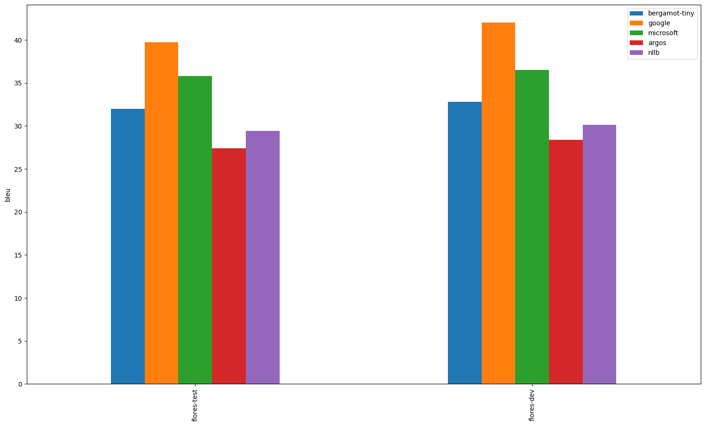
---

## ca-en

| Translator/Dataset | flores-dev | flores-test |
| --- | --- | --- |
| bergamot | 38.70 | 37.30 |
| google | 49.60 (+10.90, +28.17%) | 48.30 (+11.00, +29.49%) |
| microsoft | 46.80 (+8.10, +20.93%) | 46.20 (+8.90, +23.86%) |
| argos | 42.80 (+4.10, +10.59%) | 41.80 (+4.50, +12.06%) |
| nllb | 37.90 (-0.80, -2.07%) | 36.90 (-0.40, -1.07%) |
| opusmt | 29.90 (-8.80, -22.74%) | 29.60 (-7.70, -20.64%) |

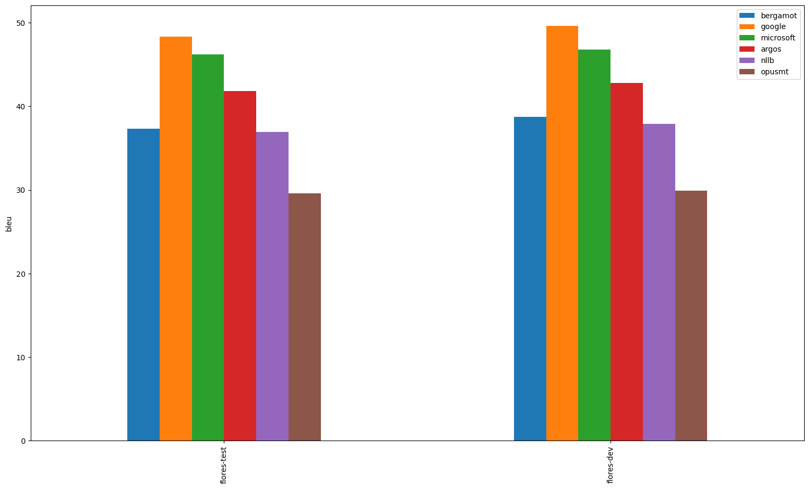
---

## en-uk

| Translator/Dataset | flores-dev | flores-test | wmt22 | wmt24 | wmt23 |
| --- | --- | --- | --- | --- | --- |
| bergamot | 28.00 | 29.00 | 24.70 | N/A | N/A |
| google | 32.80 (+4.80, +17.14%) | 33.10 (+4.10, +14.14%) | 32.00 (+7.30, +29.55%) | 33.40 | 39.50 |
| microsoft | 32.20 (+4.20, +15.00%) | 33.50 (+4.50, +15.52%) | 30.40 (+5.70, +23.08%) | 32.10 | 31.70 |
| argos | 16.40 (-11.60, -41.43%) | 15.80 (-13.20, -45.52%) | 15.00 (-9.70, -39.27%) | N/A | N/A |
| nllb | 22.90 (-5.10, -18.21%) | 22.50 (-6.50, -22.41%) | 20.50 (-4.20, -17.00%) | N/A | N/A |
| opusmt | 19.70 (-8.30, -29.64%) | 20.00 (-9.00, -31.03%) | 16.70 (-8.00, -32.39%) | N/A | N/A |

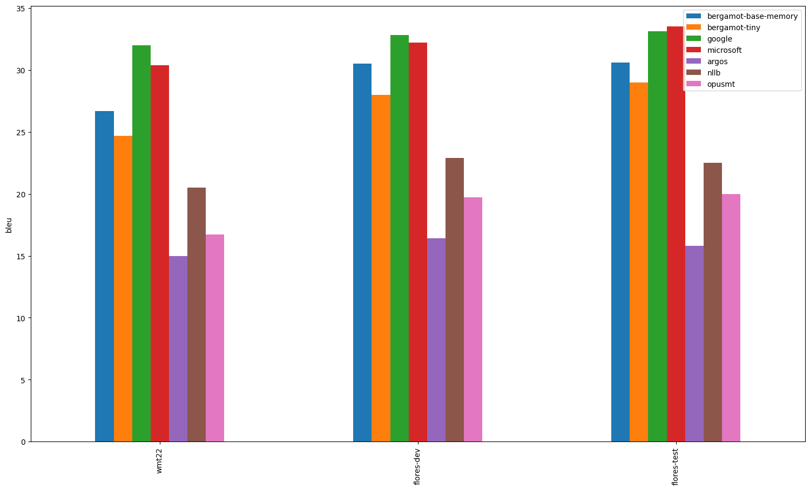
---

## en-vi

| Translator/Dataset | flores-test | flores-dev |
| --- | --- | --- |
| bergamot | N/A | N/A |
| google | 45.70 | 45.40 |
| microsoft | 45.00 | 44.90 |
| argos | N/A | N/A |
| nllb | 37.50 | 36.80 |
| opusmt | 26.70 | 26.00 |

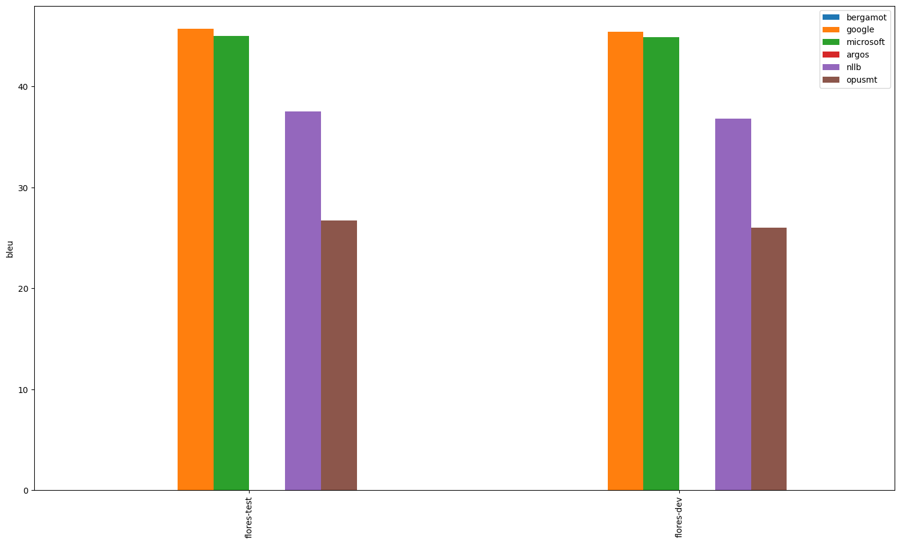
---

## is-en

| Translator/Dataset | flores-dev | flores-test | wmt21 |
| --- | --- | --- | --- |
| bergamot | 23.60 | 23.40 | 23.20 |
| google | 39.40 (+15.80, +66.95%) | 38.60 (+15.20, +64.96%) | 38.70 (+15.50, +66.81%) |
| microsoft | 37.30 (+13.70, +58.05%) | 36.70 (+13.30, +56.84%) | 40.50 (+17.30, +74.57%) |
| argos | N/A | N/A | N/A |
| nllb | 18.40 (-5.20, -22.03%) | 16.60 (-6.80, -29.06%) | 17.90 (-5.30, -22.84%) |
| opusmt | 26.40 (+2.80, +11.86%) | 25.60 (+2.20, +9.40%) | 24.10 (+0.90, +3.88%) |

---

## en-bg

| Translator/Dataset | flores-dev | flores-test |
| --- | --- | --- |
| bergamot | 42.00 | 42.20 |
| google | 44.10 (+2.10, +5.00%) | 45.10 (+2.90, +6.87%) |
| microsoft | 38.00 (-4.00, -9.52%) | 39.10 (-3.10, -7.35%) |
| argos | 39.50 (-2.50, -5.95%) | 39.40 (-2.80, -6.64%) |
| nllb | 34.20 (-7.80, -18.57%) | 33.90 (-8.30, -19.67%) |
| opusmt | 32.50 (-9.50, -22.62%) | 32.50 (-9.70, -22.99%) |

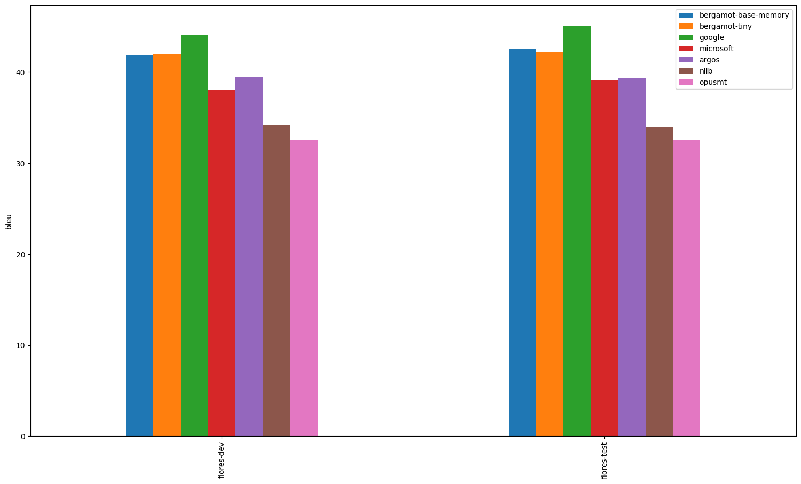
---

## en-lv

| Translator/Dataset | flores-dev | flores-test | wmt17 |
| --- | --- | --- | --- |
| bergamot | 30.60 | 30.50 | 20.10 |
| google | 37.40 (+6.80, +22.22%) | 37.50 (+7.00, +22.95%) | 26.40 (+6.30, +31.34%) |
| microsoft | 37.90 (+7.30, +23.86%) | 36.50 (+6.00, +19.67%) | 25.20 (+5.10, +25.37%) |
| argos | N/A | N/A | N/A |
| nllb | 16.10 (-14.50, -47.39%) | 15.10 (-15.40, -50.49%) | 11.70 (-8.40, -41.79%) |
| opusmt | N/A | N/A | N/A |

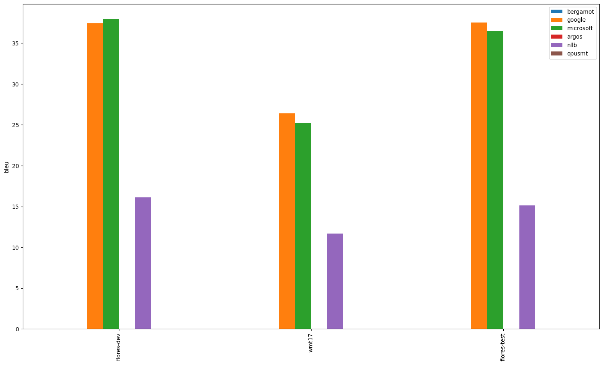
---

## gl-en

| Translator/Dataset | flores-dev | flores-test |
| --- | --- | --- |
| bergamot | N/A | N/A |
| google | 43.40 | 43.60 |
| microsoft | 40.40 | 40.00 |
| argos | N/A | N/A |
| nllb | 35.60 | 34.40 |
| opusmt | 21.90 | 20.90 |

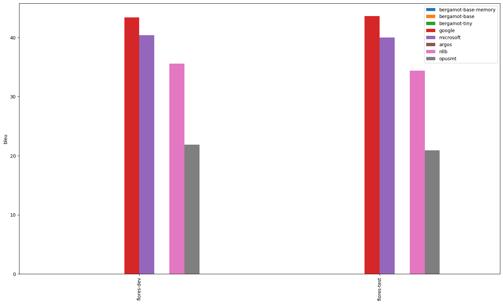
---

## zh-en

| Translator/Dataset | wmt20 | flores-dev | wmt17 | wmt19 | iwslt17 | wmt18 | wmt21 | wmt22 | flores-test | wmt23 |
| --- | --- | --- | --- | --- | --- | --- | --- | --- | --- | --- |
| bergamot | 34.30 | 28.80 | 29.40 | 34.80 | 24.10 | 29.00 | 28.70 | 25.20 | 29.00 | 25.10 |
| google | 36.80 (+2.50, +7.29%) | 33.00 (+4.20, +14.58%) | 30.60 (+1.20, +4.08%) | 39.00 (+4.20, +12.07%) | 24.80 (+0.70, +2.90%) | 33.40 (+4.40, +15.17%) | 31.80 (+3.10, +10.80%) | 28.50 (+3.30, +13.10%) | 32.70 (+3.70, +12.76%) | 26.90 (+1.80, +7.17%) |
| microsoft | 38.10 (+3.80, +11.08%) | 32.50 (+3.70, +12.85%) | 29.40 (0.00, 0.00%) | 37.00 (+2.20, +6.32%) | 26.90 (+2.80, +11.62%) | 31.50 (+2.50, +8.62%) | 32.30 (+3.60, +12.54%) | 29.00 (+3.80, +15.08%) | 32.10 (+3.10, +10.69%) | 28.50 (+3.40, +13.55%) |
| argos | 21.30 (-13.00, -37.90%) | 23.40 (-5.40, -18.75%) | 19.20 (-10.20, -34.69%) | 21.00 (-13.80, -39.66%) | 22.90 (-1.20, -4.98%) | 19.40 (-9.60, -33.10%) | 17.30 (-11.40, -39.72%) | 15.90 (-9.30, -36.90%) | 23.30 (-5.70, -19.66%) | N/A |
| nllb | 22.40 (-11.90, -34.69%) | 24.70 (-4.10, -14.24%) | 21.00 (-8.40, -28.57%) | 21.10 (-13.70, -39.37%) | 21.40 (-2.70, -11.20%) | 21.00 (-8.00, -27.59%) | 18.20 (-10.50, -36.59%) | 17.00 (-8.20, -32.54%) | 24.00 (-5.00, -17.24%) | N/A |
| opusmt | 22.20 (-12.10, -35.28%) | 23.00 (-5.80, -20.14%) | 19.20 (-10.20, -34.69%) | 21.30 (-13.50, -38.79%) | 23.10 (-1.00, -4.15%) | 20.20 (-8.80, -30.34%) | 18.30 (-10.40, -36.24%) | 16.80 (-8.40, -33.33%) | 23.50 (-5.50, -18.97%) | N/A |

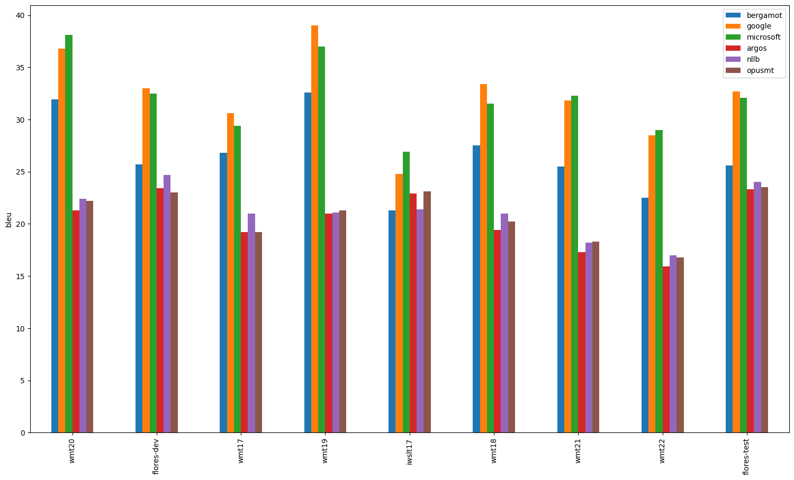
---

## en-hi

| Translator/Dataset | wmt14 | flores-dev | flores-test | wmt24 |
| --- | --- | --- | --- | --- |
| bergamot | N/A | N/A | N/A | N/A |
| google | 27.20 | 36.80 | 36.30 | 27.40 |
| microsoft | 25.90 | 38.20 | 37.10 | 24.70 |
| argos | 19.10 | 28.70 | 28.60 | N/A |
| nllb | 22.00 | 29.80 | 29.30 | N/A |
| opusmt | 9.90 | 13.90 | 13.50 | N/A |

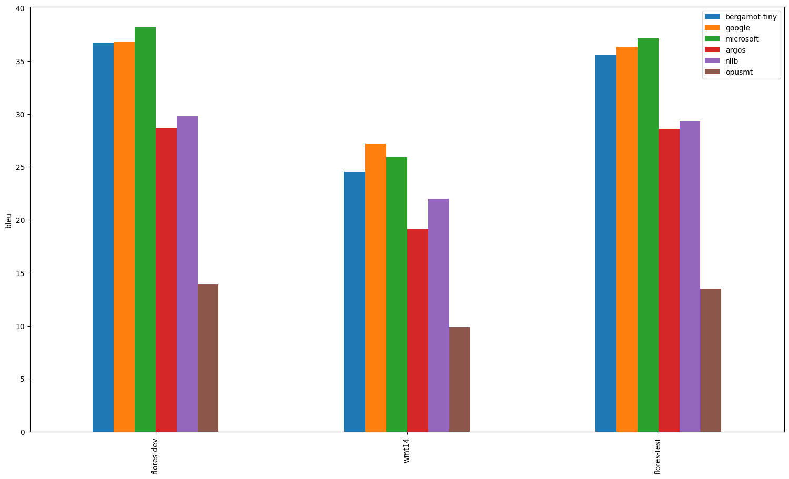
---

## en-ig

| Translator/Dataset | flores-dev | flores-test |
| --- | --- | --- |
| bergamot | N/A | N/A |
| google | 14.60 | 16.00 |
| microsoft | 16.90 | 18.40 |
| argos | N/A | N/A |
| nllb | 14.60 | 15.60 |
| opusmt | 6.10 | 7.20 |

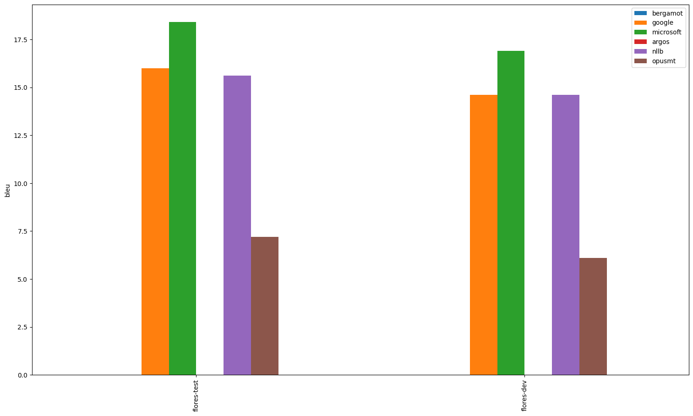
---

## en-bs

| Translator/Dataset | flores-dev | flores-test |
| --- | --- | --- |
| bergamot | N/A | N/A |
| google | 36.30 | 36.60 |
| microsoft | 32.10 | 33.20 |
| argos | N/A | N/A |
| nllb | 24.20 | 24.80 |
| opusmt | N/A | N/A |

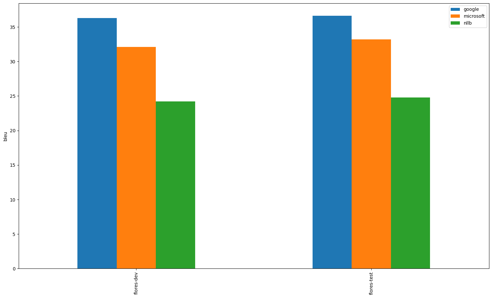
---

## en-cs

| Translator/Dataset | wmt09 | wmt12 | wmt20 | wmt19 | flores-dev | wmt21 | wmt23 | wmt08 | wmt14 | wmt17 | wmt15 | wmt22 | wmt11 | wmt13 | wmt10 | wmt18 | wmt16 | flores-test | wmt24 |
| --- | --- | --- | --- | --- | --- | --- | --- | --- | --- | --- | --- | --- | --- | --- | --- | --- | --- | --- | --- |
| bergamot | 22.70 | 21.10 | 32.30 | 25.10 | 31.30 | 18.40 | 36.20 | 20.60 | 29.50 | 23.80 | 25.10 | 34.60 | 23.60 | 25.50 | 23.30 | 23.10 | 28.30 | 31.10 | 25.70 |
| google | 22.60 (-0.10, -0.44%) | 20.70 (-0.40, -1.90%) | 35.50 (+3.20, +9.91%) | 27.20 (+2.10, +8.37%) | 34.10 (+2.80, +8.95%) | 21.80 (+3.40, +18.48%) | 50.30 (+14.10, +38.95%) | 20.50 (-0.10, -0.49%) | 31.20 (+1.70, +5.76%) | 24.70 (+0.90, +3.78%) | 26.80 (+1.70, +6.77%) | 48.40 (+13.80, +39.88%) | 23.00 (-0.60, -2.54%) | 25.20 (-0.30, -1.18%) | 22.40 (-0.90, -3.86%) | 24.40 (+1.30, +5.63%) | 28.30 (0.00, 0.00%) | 34.40 (+3.30, +10.61%) | 31.00 (+5.30, +20.62%) |
| microsoft | 25.00 (+2.30, +10.13%) | 22.90 (+1.80, +8.53%) | 34.10 (+1.80, +5.57%) | 27.20 (+2.10, +8.37%) | 33.50 (+2.20, +7.03%) | 22.00 (+3.60, +19.57%) | 46.10 (+9.90, +27.35%) | 22.60 (+2.00, +9.71%) | 31.90 (+2.40, +8.14%) | 25.60 (+1.80, +7.56%) | 27.40 (+2.30, +9.16%) | 42.10 (+7.50, +21.68%) | 25.30 (+1.70, +7.20%) | 27.70 (+2.20, +8.63%) | 24.30 (+1.00, +4.29%) | 24.90 (+1.80, +7.79%) | 29.90 (+1.60, +5.65%) | 34.00 (+2.90, +9.32%) | 30.70 (+5.00, +19.46%) |
| argos | 14.30 (-8.40, -37.00%) | 13.70 (-7.40, -35.07%) | 16.50 (-15.80, -48.92%) | 13.70 (-11.40, -45.42%) | 19.90 (-11.40, -36.42%) | 9.90 (-8.50, -46.20%) | N/A | 12.70 (-7.90, -38.35%) | 17.10 (-12.40, -42.03%) | 14.00 (-9.80, -41.18%) | 14.40 (-10.70, -42.63%) | 22.90 (-11.70, -33.82%) | 15.80 (-7.80, -33.05%) | 16.00 (-9.50, -37.25%) | 14.70 (-8.60, -36.91%) | 13.30 (-9.80, -42.42%) | 18.00 (-10.30, -36.40%) | 19.10 (-12.00, -38.59%) | N/A |
| nllb | 19.50 (-3.20, -14.10%) | 18.60 (-2.50, -11.85%) | 23.80 (-8.50, -26.32%) | 20.60 (-4.50, -17.93%) | 25.20 (-6.10, -19.49%) | 15.40 (-3.00, -16.30%) | N/A | 17.90 (-2.70, -13.11%) | 23.50 (-6.00, -20.34%) | 19.80 (-4.00, -16.81%) | 20.50 (-4.60, -18.33%) | 28.40 (-6.20, -17.92%) | 20.50 (-3.10, -13.14%) | 22.00 (-3.50, -13.73%) | 19.80 (-3.50, -15.02%) | 18.50 (-4.60, -19.91%) | 22.50 (-5.80, -20.49%) | 25.60 (-5.50, -17.68%) | N/A |
| opusmt | 21.60 (-1.10, -4.85%) | 20.40 (-0.70, -3.32%) | 27.50 (-4.80, -14.86%) | 22.60 (-2.50, -9.96%) | 28.90 (-2.40, -7.67%) | 17.00 (-1.40, -7.61%) | N/A | 19.50 (-1.10, -5.34%) | 27.30 (-2.20, -7.46%) | 21.90 (-1.90, -7.98%) | 23.70 (-1.40, -5.58%) | 30.90 (-3.70, -10.69%) | 22.70 (-0.90, -3.81%) | 24.50 (-1.00, -3.92%) | 21.80 (-1.50, -6.44%) | 21.60 (-1.50, -6.49%) | 26.50 (-1.80, -6.36%) | 29.40 (-1.70, -5.47%) | N/A |

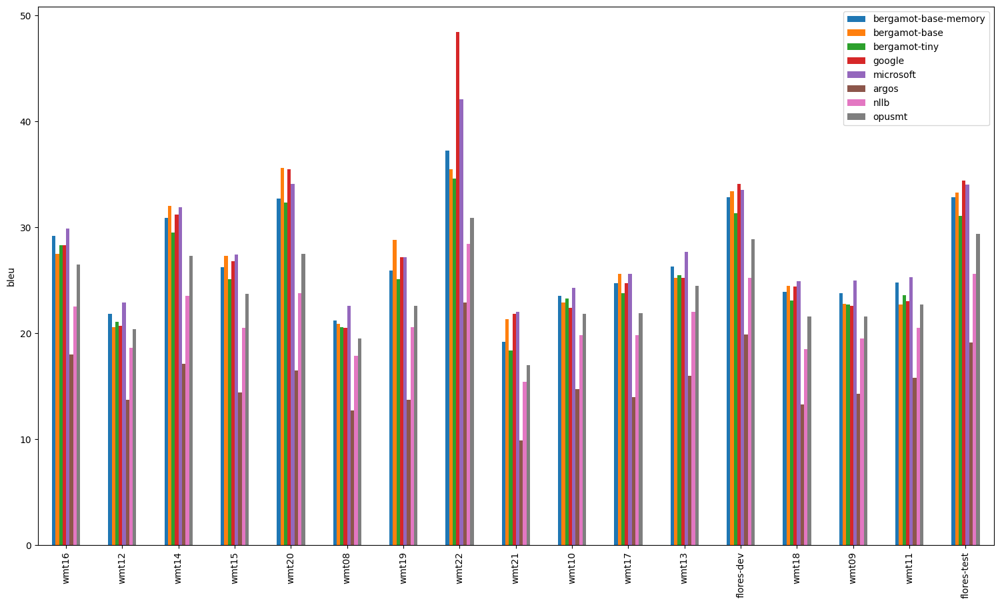
---

## hr-en

| Translator/Dataset | flores-dev | flores-test |
| --- | --- | --- |
| bergamot | 34.20 | 34.00 |
| google | 41.10 (+6.90, +20.18%) | 40.10 (+6.10, +17.94%) |
| microsoft | 39.00 (+4.80, +14.04%) | 38.00 (+4.00, +11.76%) |
| argos | N/A | N/A |
| nllb | 24.40 (-9.80, -28.65%) | 23.10 (-10.90, -32.06%) |
| opusmt | N/A | N/A |

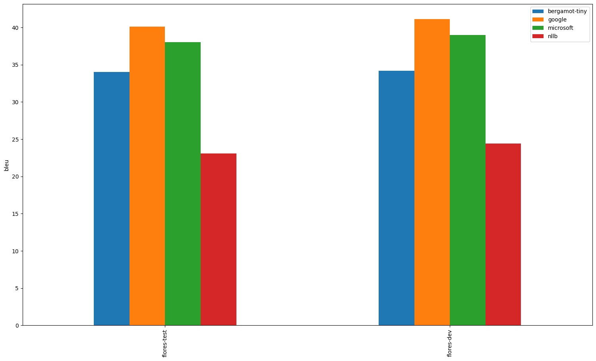
---

## en-ro

| Translator/Dataset | wmt16 | flores-test | flores-dev |
| --- | --- | --- | --- |
| bergamot | 33.00 | 40.40 | 40.50 |
| google | 35.40 (+2.40, +7.27%) | 43.30 (+2.90, +7.18%) | 43.10 (+2.60, +6.42%) |
| microsoft | 37.70 (+4.70, +14.24%) | 44.40 (+4.00, +9.90%) | 44.10 (+3.60, +8.89%) |
| argos | N/A | N/A | N/A |
| nllb | 29.10 (-3.90, -11.82%) | 33.40 (-7.00, -17.33%) | 34.20 (-6.30, -15.56%) |
| opusmt | 27.60 (-5.40, -16.36%) | 32.90 (-7.50, -18.56%) | 33.60 (-6.90, -17.04%) |

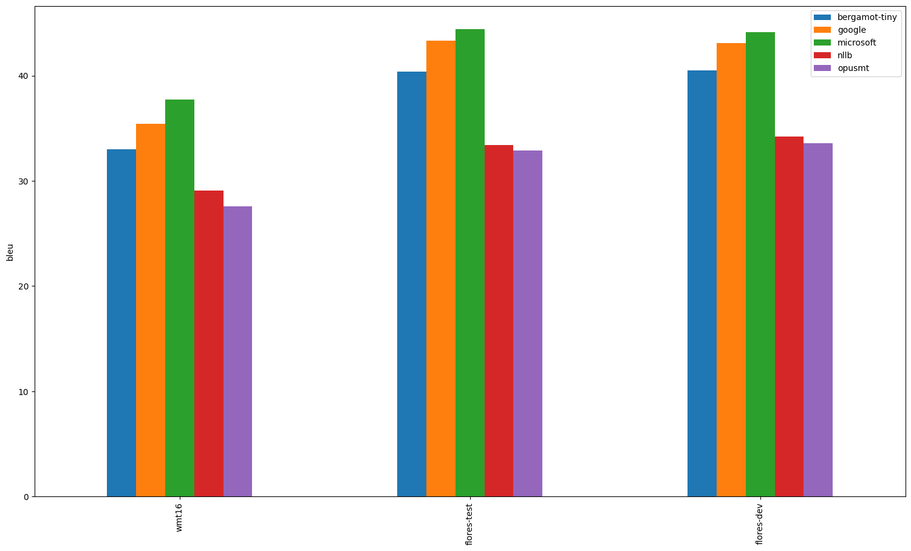
---

## sr-en

| Translator/Dataset | flores-dev | flores-test |
| --- | --- | --- |
| bergamot | 37.80 | 36.70 |
| google | 48.10 (+10.30, +27.25%) | 47.00 (+10.30, +28.07%) |
| microsoft | 1.70 (-36.10, -95.50%) | 1.50 (-35.20, -95.91%) |
| argos | N/A | N/A |
| nllb | 34.20 (-3.60, -9.52%) | 33.00 (-3.70, -10.08%) |
| opusmt | N/A | N/A |

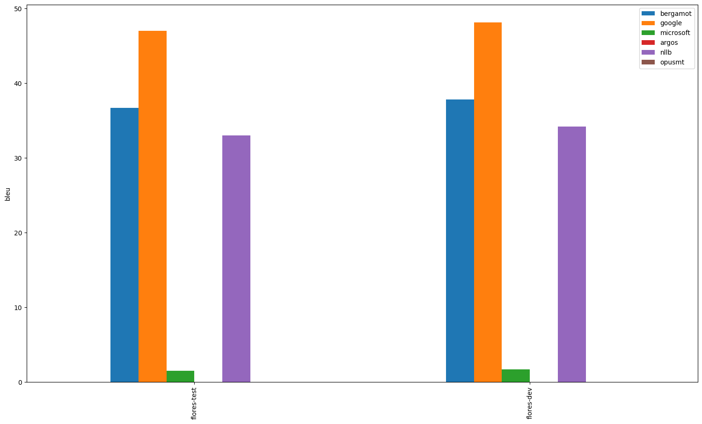
---

## sv-en

| Translator/Dataset | flores-dev | flores-test |
| --- | --- | --- |
| bergamot | 47.20 | 45.60 |
| google | 50.80 (+3.60, +7.63%) | 50.20 (+4.60, +10.09%) |
| microsoft | 52.80 (+5.60, +11.86%) | 51.00 (+5.40, +11.84%) |
| argos | 45.10 (-2.10, -4.45%) | 43.60 (-2.00, -4.39%) |
| nllb | 32.20 (-15.00, -31.78%) | 30.70 (-14.90, -32.68%) |
| opusmt | 46.80 (-0.40, -0.85%) | 45.40 (-0.20, -0.44%) |

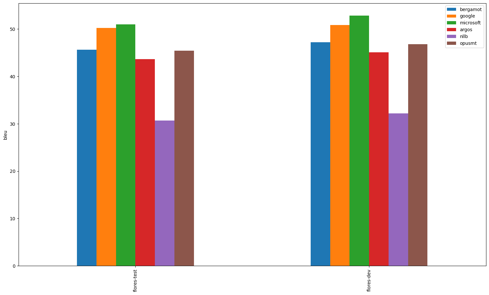
---

## en-my

| Translator/Dataset | flores-dev | flores-test |
| --- | --- | --- |
| bergamot | N/A | N/A |
| google | 3.90 | 3.60 |
| microsoft | 1.60 | 1.50 |
| argos | N/A | N/A |
| nllb | 2.40 | 2.30 |
| opusmt | N/A | N/A |

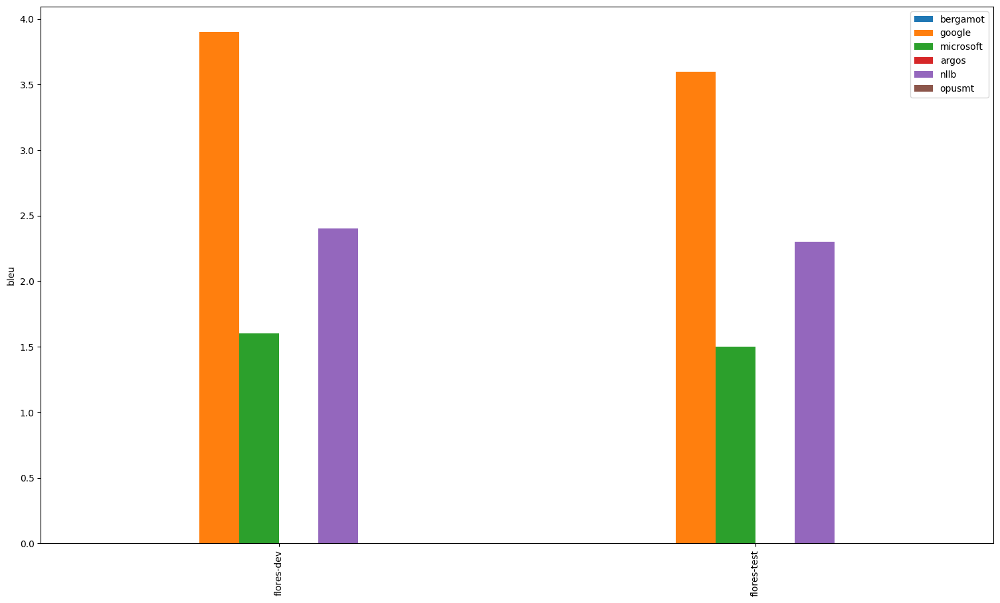
---

## en-ko

| Translator/Dataset | iwslt17 | flores-dev | flores-test |
| --- | --- | --- | --- |
| bergamot | 17.60 | 29.90 | 29.50 |
| google | 20.30 (+2.70, +15.34%) | 33.70 (+3.80, +12.71%) | 33.60 (+4.10, +13.90%) |
| microsoft | 20.40 (+2.80, +15.91%) | 34.90 (+5.00, +16.72%) | 34.30 (+4.80, +16.27%) |
| argos | 10.00 (-7.60, -43.18%) | 16.50 (-13.40, -44.82%) | 15.80 (-13.70, -46.44%) |
| nllb | 15.80 (-1.80, -10.23%) | 25.90 (-4.00, -13.38%) | 25.40 (-4.10, -13.90%) |
| opusmt | N/A | N/A | N/A |

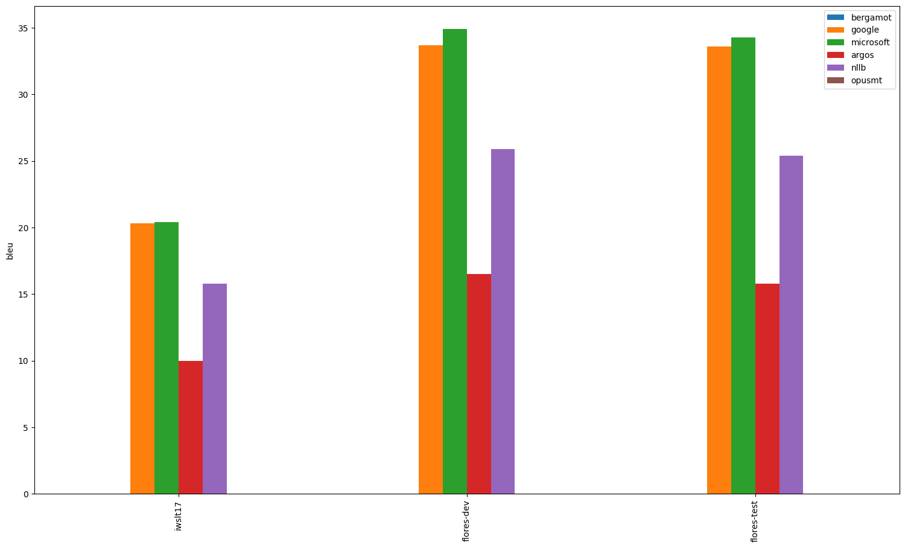
---

## hi-en

| Translator/Dataset | flores-dev | wmt14 | flores-test |
| --- | --- | --- | --- |
| bergamot | N/A | N/A | N/A |
| google | 45.80 | 35.40 | 45.20 |
| microsoft | 43.90 | 34.70 | 43.10 |
| argos | 28.70 | 20.50 | 27.90 |
| nllb | 38.50 | 30.10 | 37.70 |
| opusmt | 20.10 | 13.40 | 18.70 |

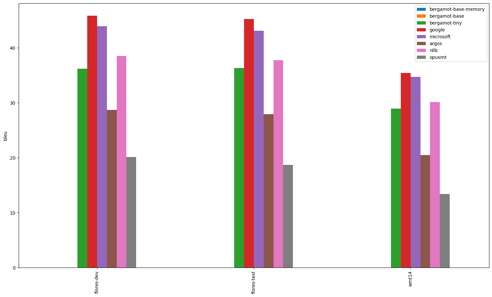
---

## af-en

| Translator/Dataset | flores-dev | flores-test |
| --- | --- | --- |
| bergamot | N/A | N/A |
| google | 59.10 | 58.60 |
| microsoft | 58.10 | 57.80 |
| argos | N/A | N/A |
| nllb | 39.30 | 39.40 |
| opusmt | 43.20 | 44.30 |

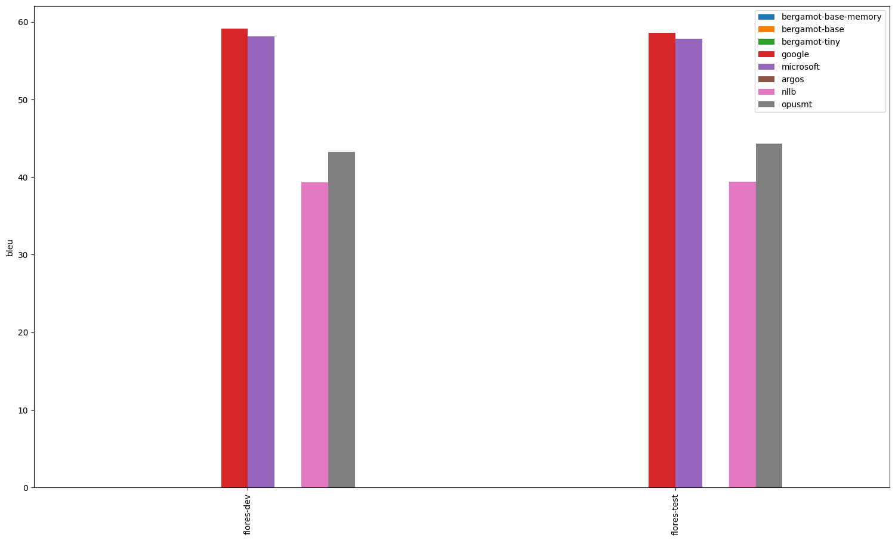
---

## en-is

| Translator/Dataset | flores-dev | flores-test | wmt24 | wmt21 |
| --- | --- | --- | --- | --- |
| bergamot | N/A | N/A | N/A | N/A |
| google | 31.90 | 31.40 | 21.60 | 28.80 |
| microsoft | 32.10 | 31.00 | 22.50 | 29.40 |
| argos | N/A | N/A | N/A | N/A |
| nllb | 19.10 | 17.50 | N/A | 17.90 |
| opusmt | 18.70 | 18.30 | N/A | 15.00 |

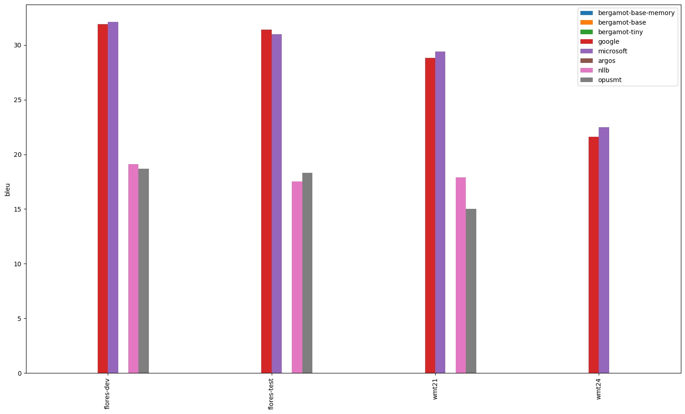
---

## id-en

| Translator/Dataset | flores-dev | flores-test |
| --- | --- | --- |
| bergamot | 39.50 | 38.60 |
| google | 47.50 (+8.00, +20.25%) | 48.00 (+9.40, +24.35%) |
| microsoft | 47.00 (+7.50, +18.99%) | 47.00 (+8.40, +21.76%) |
| argos | 29.50 (-10.00, -25.32%) | 28.50 (-10.10, -26.17%) |
| nllb | 39.20 (-0.30, -0.76%) | 38.70 (+0.10, +0.26%) |
| opusmt | 35.10 (-4.40, -11.14%) | 33.40 (-5.20, -13.47%) |

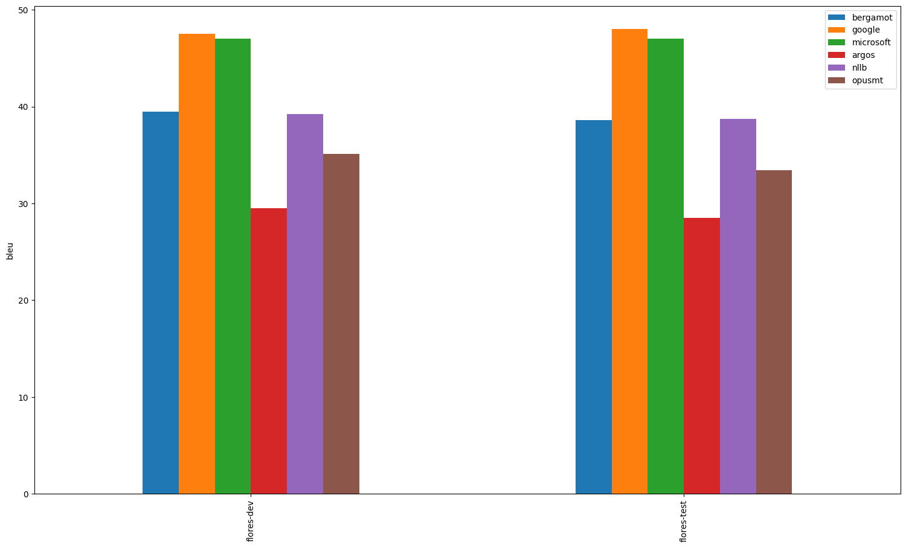
---

## de-en

| Translator/Dataset | wmt20 | wmt08 | wmt10 | flores-dev | wmt12 | wmt17 | wmt14 | wmt11 | wmt19 | wmt15 | iwslt17 | wmt18 | wmt21 | wmt09 | wmt22 | flores-test | wmt23 | wmt16 | wmt13 |
| --- | --- | --- | --- | --- | --- | --- | --- | --- | --- | --- | --- | --- | --- | --- | --- | --- | --- | --- | --- |
| bergamot | 38.80 | 26.00 | 29.00 | 39.60 | 27.60 | 35.00 | 33.50 | 26.30 | 39.00 | 33.50 | 28.60 | 43.30 | 31.50 | 26.40 | 29.20 | 39.10 | 39.90 | 39.60 | 30.80 |
| google | 41.80 (+3.00, +7.73%) | 27.60 (+1.60, +6.15%) | 32.10 (+3.10, +10.69%) | 43.10 (+3.50, +8.84%) | 29.50 (+1.90, +6.88%) | 38.70 (+3.70, +10.57%) | 37.40 (+3.90, +11.64%) | 27.30 (+1.00, +3.80%) | 41.10 (+2.10, +5.38%) | 36.10 (+2.60, +7.76%) | 30.10 (+1.50, +5.24%) | 46.20 (+2.90, +6.70%) | 32.70 (+1.20, +3.81%) | 27.20 (+0.80, +3.03%) | 33.30 (+4.10, +14.04%) | 42.80 (+3.70, +9.46%) | 46.80 (+6.90, +17.29%) | 42.30 (+2.70, +6.82%) | 32.40 (+1.60, +5.19%) |
| microsoft | 43.60 (+4.80, +12.37%) | 29.40 (+3.40, +13.08%) | 33.40 (+4.40, +15.17%) | 44.90 (+5.30, +13.38%) | 31.30 (+3.70, +13.41%) | 40.80 (+5.80, +16.57%) | 39.20 (+5.70, +17.01%) | 29.20 (+2.90, +11.03%) | 43.80 (+4.80, +12.31%) | 38.10 (+4.60, +13.73%) | 32.50 (+3.90, +13.64%) | 49.60 (+6.30, +14.55%) | 34.30 (+2.80, +8.89%) | 29.10 (+2.70, +10.23%) | 33.50 (+4.30, +14.73%) | 45.80 (+6.70, +17.14%) | 48.40 (+8.50, +21.30%) | 46.30 (+6.70, +16.92%) | 34.30 (+3.50, +11.36%) |
| argos | 35.80 (-3.00, -7.73%) | 24.80 (-1.20, -4.62%) | 27.70 (-1.30, -4.48%) | 37.00 (-2.60, -6.57%) | 26.70 (-0.90, -3.26%) | 31.90 (-3.10, -8.86%) | 30.00 (-3.50, -10.45%) | 25.50 (-0.80, -3.04%) | 35.80 (-3.20, -8.21%) | 30.80 (-2.70, -8.06%) | 27.00 (-1.60, -5.59%) | 39.30 (-4.00, -9.24%) | 29.60 (-1.90, -6.03%) | 24.80 (-1.60, -6.06%) | 28.90 (-0.30, -1.03%) | 36.20 (-2.90, -7.42%) | N/A | 36.40 (-3.20, -8.08%) | 29.30 (-1.50, -4.87%) |
| nllb | 25.20 (-13.60, -35.05%) | 21.30 (-4.70, -18.08%) | 24.00 (-5.00, -17.24%) | 32.10 (-7.50, -18.94%) | 22.30 (-5.30, -19.20%) | 26.90 (-8.10, -23.14%) | 25.30 (-8.20, -24.48%) | 20.20 (-6.10, -23.19%) | 26.30 (-12.70, -32.56%) | 27.20 (-6.30, -18.81%) | 23.00 (-5.60, -19.58%) | 32.40 (-10.90, -25.17%) | 21.50 (-10.00, -31.75%) | 21.40 (-5.00, -18.94%) | 21.40 (-7.80, -26.71%) | 31.20 (-7.90, -20.20%) | N/A | 30.50 (-9.10, -22.98%) | 24.80 (-6.00, -19.48%) |
| opusmt | 39.60 (+0.80, +2.06%) | 27.00 (+1.00, +3.85%) | 30.00 (+1.00, +3.45%) | 41.20 (+1.60, +4.04%) | 29.00 (+1.40, +5.07%) | 35.60 (+0.60, +1.71%) | 34.00 (+0.50, +1.49%) | 27.30 (+1.00, +3.80%) | 39.30 (+0.30, +0.77%) | 34.00 (+0.50, +1.49%) | 30.40 (+1.80, +6.29%) | 43.60 (+0.30, +0.69%) | 32.20 (+0.70, +2.22%) | 27.10 (+0.70, +2.65%) | 30.50 (+1.30, +4.45%) | 40.60 (+1.50, +3.84%) | N/A | 40.20 (+0.60, +1.52%) | 32.00 (+1.20, +3.90%) |

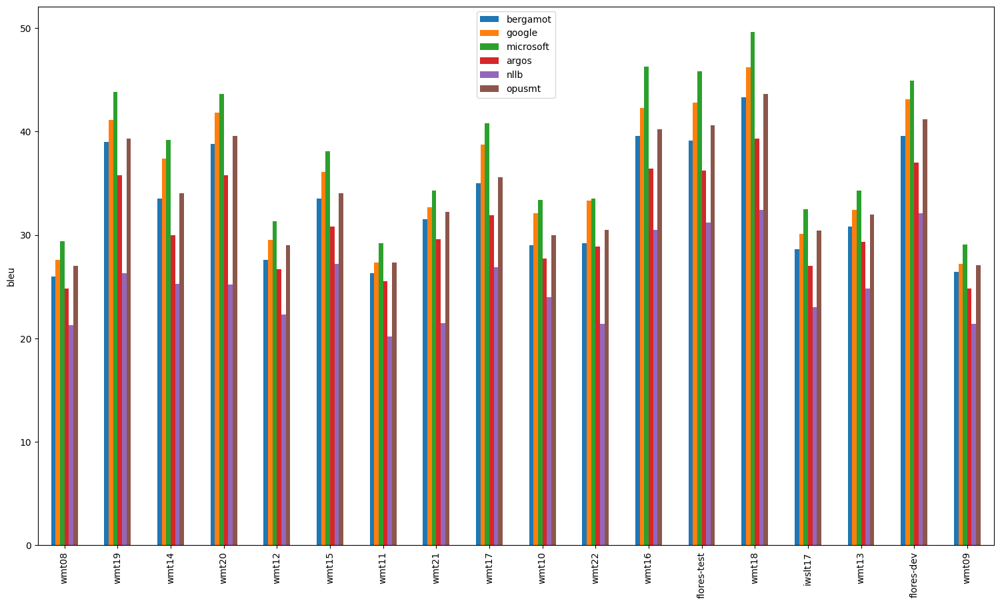
---

## da-en

| Translator/Dataset | flores-dev | flores-test |
| --- | --- | --- |
| bergamot | 46.00 | 45.60 |
| google | 50.60 (+4.60, +10.00%) | 50.20 (+4.60, +10.09%) |
| microsoft | 51.20 (+5.20, +11.30%) | 50.90 (+5.30, +11.62%) |
| argos | 38.60 (-7.40, -16.09%) | 37.80 (-7.80, -17.11%) |
| nllb | 32.50 (-13.50, -29.35%) | 31.90 (-13.70, -30.04%) |
| opusmt | 45.10 (-0.90, -1.96%) | 45.10 (-0.50, -1.10%) |

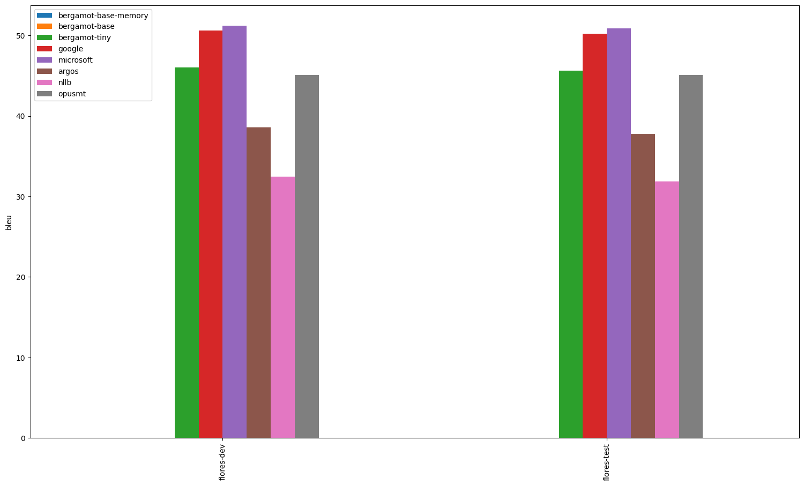
---

## it-en

| Translator/Dataset | mtedx_test | flores-dev | wmt09 | flores-test |
| --- | --- | --- | --- | --- |
| bergamot | 35.70 | 30.90 | 33.40 | 30.40 |
| google | 35.90 (+0.20, +0.56%) | 33.40 (+2.50, +8.09%) | 35.40 (+2.00, +5.99%) | 33.30 (+2.90, +9.54%) |
| microsoft | 36.40 (+0.70, +1.96%) | 33.30 (+2.40, +7.77%) | 35.80 (+2.40, +7.19%) | 32.70 (+2.30, +7.57%) |
| argos | 34.90 (-0.80, -2.24%) | 28.80 (-2.10, -6.80%) | 32.00 (-1.40, -4.19%) | 28.60 (-1.80, -5.92%) |
| nllb | 31.40 (-4.30, -12.04%) | 29.20 (-1.70, -5.50%) | 31.20 (-2.20, -6.59%) | 28.80 (-1.60, -5.26%) |
| opusmt | 35.70 (0.00, 0.00%) | 30.20 (-0.70, -2.27%) | 33.70 (+0.30, +0.90%) | 29.40 (-1.00, -3.29%) |

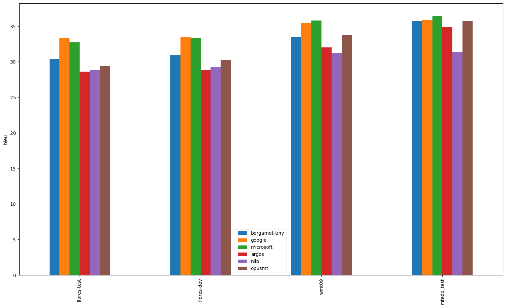
---

## pl-en

| Translator/Dataset | wmt20 | flores-dev | flores-test |
| --- | --- | --- | --- |
| bergamot | 31.00 | 26.80 | 25.80 |
| google | 34.10 (+3.10, +10.00%) | 30.00 (+3.20, +11.94%) | 29.60 (+3.80, +14.73%) |
| microsoft | 35.50 (+4.50, +14.52%) | 30.10 (+3.30, +12.31%) | 29.90 (+4.10, +15.89%) |
| argos | 30.10 (-0.90, -2.90%) | 26.80 (0.00, 0.00%) | 26.10 (+0.30, +1.16%) |
| nllb | 23.30 (-7.70, -24.84%) | 22.80 (-4.00, -14.93%) | 22.40 (-3.40, -13.18%) |
| opusmt | 29.20 (-1.80, -5.81%) | 25.90 (-0.90, -3.36%) | 25.30 (-0.50, -1.94%) |

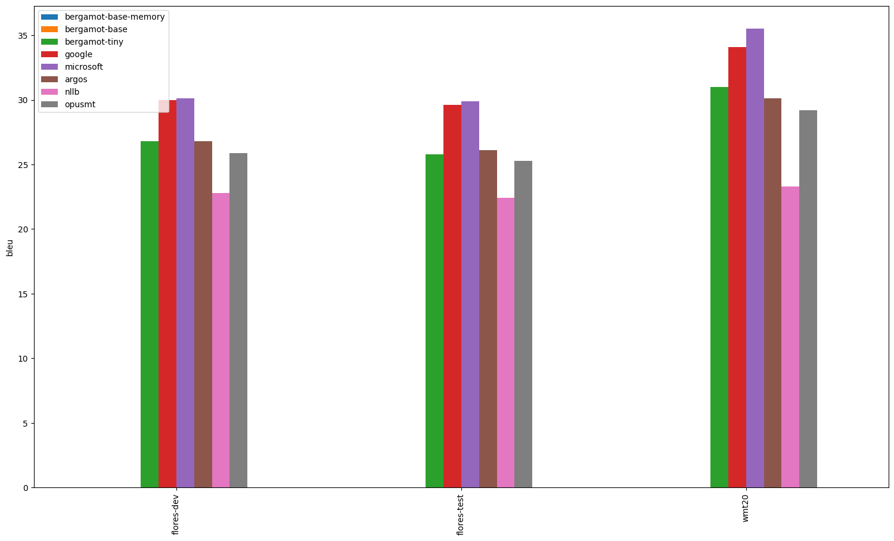
---

## am-en

| Translator/Dataset | flores-dev | flores-test |
| --- | --- | --- |
| bergamot | N/A | N/A |
| google | 39.70 | 41.30 |
| microsoft | 36.80 | 39.20 |
| argos | N/A | N/A |
| nllb | 30.10 | 30.90 |
| opusmt | N/A | N/A |

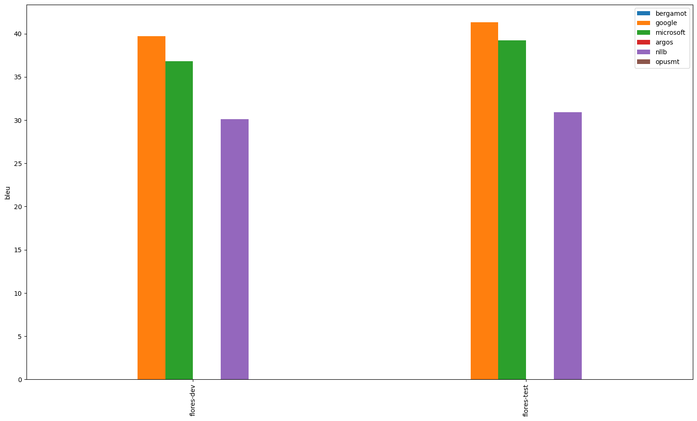
---

## sl-en

| Translator/Dataset | flores-dev | flores-test |
| --- | --- | --- |
| bergamot | 31.00 | 30.30 |
| google | 39.50 (+8.50, +27.42%) | 38.00 (+7.70, +25.41%) |
| microsoft | 38.70 (+7.70, +24.84%) | 37.20 (+6.90, +22.77%) |
| argos | N/A | N/A |
| nllb | 17.90 (-13.10, -42.26%) | 16.90 (-13.40, -44.22%) |
| opusmt | N/A | N/A |

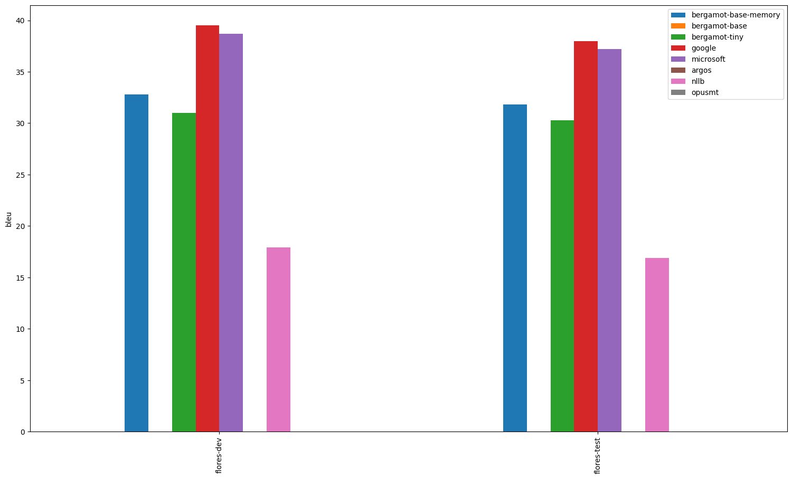
---

## en-fr

| Translator/Dataset | wmt10 | iwslt17 | flores-dev | wmt13 | wmt09 | wmt11 | flores-test | wmt08 | wmt12 | wmt14 | wmt15 |
| --- | --- | --- | --- | --- | --- | --- | --- | --- | --- | --- | --- |
| bergamot | 31.00 | 38.60 | 48.50 | 33.40 | 28.80 | 33.60 | 48.70 | 25.50 | 31.40 | 39.70 | 36.90 |
| google | 26.60 (-4.40, -14.19%) | 28.00 (-10.60, -27.46%) | 41.30 (-7.20, -14.85%) | 26.50 (-6.90, -20.66%) | 23.50 (-5.30, -18.40%) | 27.50 (-6.10, -18.15%) | 41.80 (-6.90, -14.17%) | 20.70 (-4.80, -18.82%) | 25.10 (-6.30, -20.06%) | 32.60 (-7.10, -17.88%) | 30.60 (-6.30, -17.07%) |
| microsoft | 33.00 (+2.00, +6.45%) | 36.50 (-2.10, -5.44%) | 52.50 (+4.00, +8.25%) | 31.50 (-1.90, -5.69%) | 28.20 (-0.60, -2.08%) | 32.10 (-1.50, -4.46%) | 52.70 (+4.00, +8.21%) | 25.10 (-0.40, -1.57%) | 29.60 (-1.80, -5.73%) | 40.40 (+0.70, +1.76%) | 39.70 (+2.80, +7.59%) |
| argos | 29.20 (-1.80, -5.81%) | 36.90 (-1.70, -4.40%) | 42.70 (-5.80, -11.96%) | 30.60 (-2.80, -8.38%) | 27.40 (-1.40, -4.86%) | 32.00 (-1.60, -4.76%) | 42.70 (-6.00, -12.32%) | 25.10 (-0.40, -1.57%) | 29.70 (-1.70, -5.41%) | 35.60 (-4.10, -10.33%) | 35.90 (-1.00, -2.71%) |
| nllb | 31.90 (+0.90, +2.90%) | 37.30 (-1.30, -3.37%) | 46.00 (-2.50, -5.15%) | 33.80 (+0.40, +1.20%) | 29.70 (+0.90, +3.12%) | 34.20 (+0.60, +1.79%) | 46.30 (-2.40, -4.93%) | 26.50 (+1.00, +3.92%) | 32.20 (+0.80, +2.55%) | 39.30 (-0.40, -1.01%) | 36.70 (-0.20, -0.54%) |
| opusmt | 31.70 (+0.70, +2.26%) | 38.60 (0.00, 0.00%) | 47.70 (-0.80, -1.65%) | 33.20 (-0.20, -0.60%) | 29.50 (+0.70, +2.43%) | 34.30 (+0.70, +2.08%) | 47.80 (-0.90, -1.85%) | 26.60 (+1.10, +4.31%) | 31.70 (+0.30, +0.96%) | 39.90 (+0.20, +0.50%) | 38.40 (+1.50, +4.07%) |

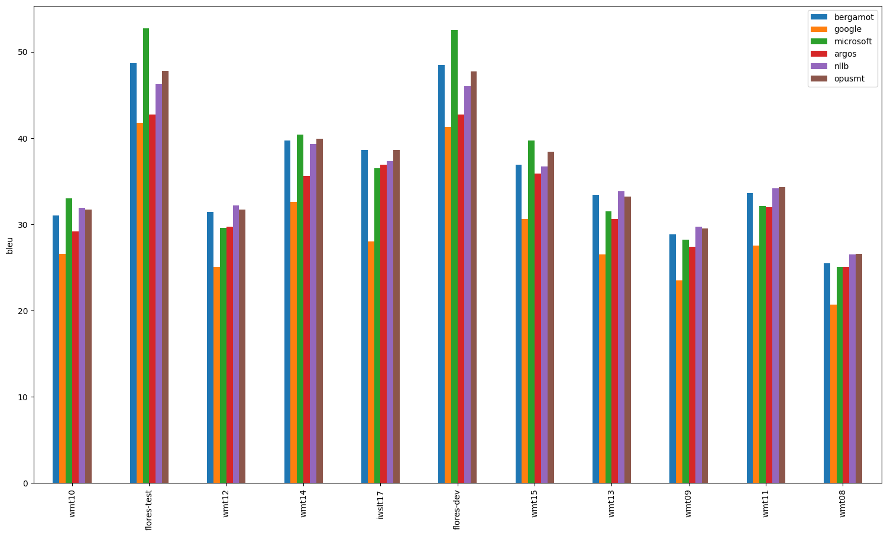
---

## en-pl

| Translator/Dataset | wmt20 | flores-dev | flores-test |
| --- | --- | --- | --- |
| bergamot | 25.10 | 20.70 | 21.00 |
| google | 27.90 (+2.80, +11.16%) | 24.20 (+3.50, +16.91%) | 24.40 (+3.40, +16.19%) |
| microsoft | 27.70 (+2.60, +10.36%) | 23.00 (+2.30, +11.11%) | 23.80 (+2.80, +13.33%) |
| argos | 21.50 (-3.60, -14.34%) | 18.60 (-2.10, -10.14%) | 18.90 (-2.10, -10.00%) |
| nllb | 20.70 (-4.40, -17.53%) | 17.00 (-3.70, -17.87%) | 17.30 (-3.70, -17.62%) |
| opusmt | N/A | N/A | N/A |

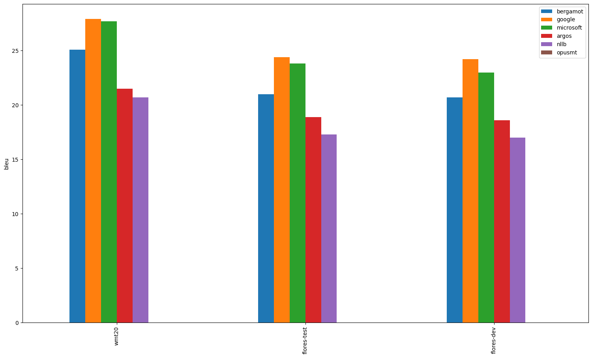
---

## en-id

| Translator/Dataset | flores-test | flores-dev |
| --- | --- | --- |
| bergamot | 47.20 | 46.10 |
| google | 49.50 (+2.30, +4.87%) | 49.00 (+2.90, +6.29%) |
| microsoft | 50.90 (+3.70, +7.84%) | 49.40 (+3.30, +7.16%) |
| argos | 34.90 (-12.30, -26.06%) | 34.00 (-12.10, -26.25%) |
| nllb | 42.10 (-5.10, -10.81%) | 40.90 (-5.20, -11.28%) |
| opusmt | 38.50 (-8.70, -18.43%) | 37.20 (-8.90, -19.31%) |

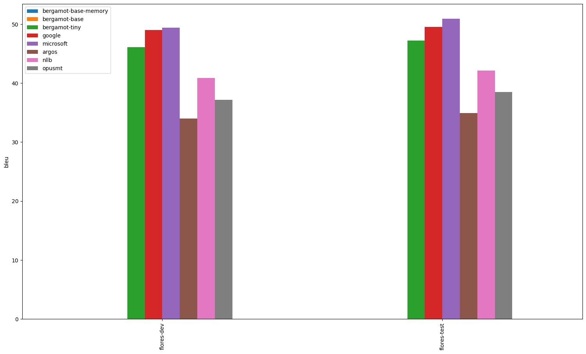
---

## my-en

| Translator/Dataset | flores-dev | flores-test |
| --- | --- | --- |
| bergamot | N/A | N/A |
| google | 31.70 | 30.40 |
| microsoft | 25.00 | 23.80 |
| argos | N/A | N/A |
| nllb | 26.10 | 25.10 |
| opusmt | N/A | N/A |

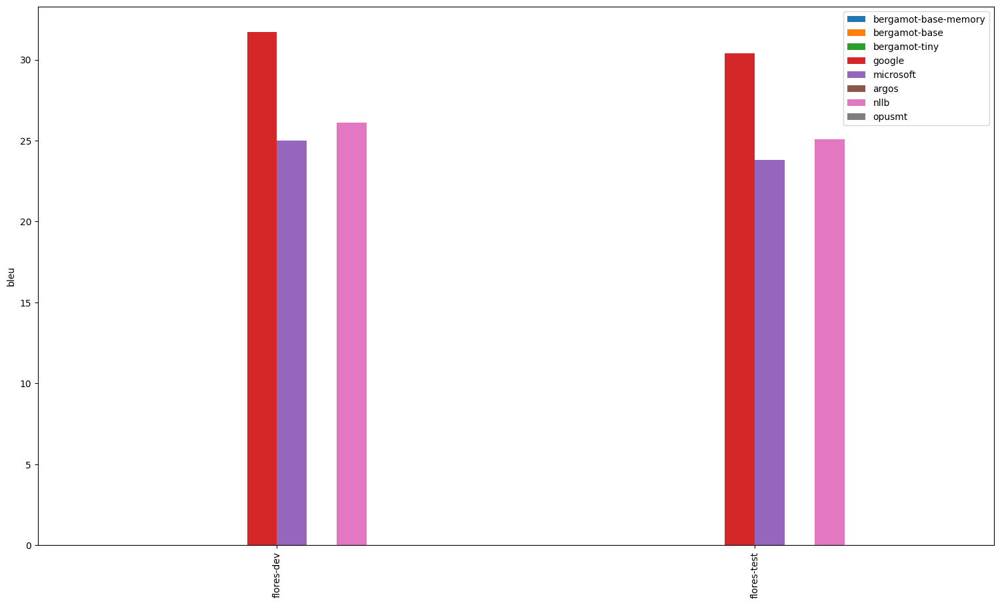
---

## pt-en

| Translator/Dataset | mtedx_test | flores-dev | flores-test |
| --- | --- | --- | --- |
| bergamot | 40.20 | 47.80 | 46.60 |
| google | 39.10 (-1.10, -2.74%) | 50.40 (+2.60, +5.44%) | 50.30 (+3.70, +7.94%) |
| microsoft | 41.00 (+0.80, +1.99%) | 49.80 (+2.00, +4.18%) | 48.60 (+2.00, +4.29%) |
| argos | 38.90 (-1.30, -3.23%) | 45.40 (-2.40, -5.02%) | 44.00 (-2.60, -5.58%) |
| nllb | 34.70 (-5.50, -13.68%) | 43.10 (-4.70, -9.83%) | 42.20 (-4.40, -9.44%) |
| opusmt | N/A | N/A | N/A |

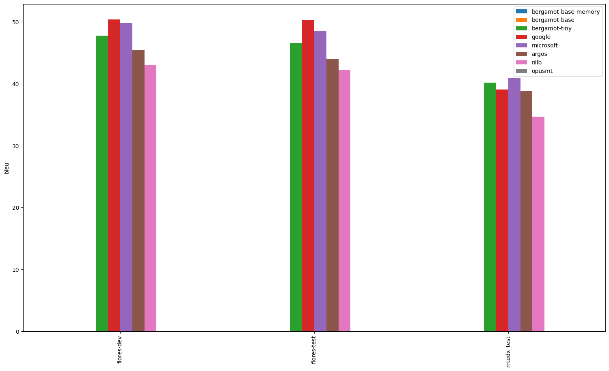
---

## en-sk

| Translator/Dataset | flores-dev | flores-test |
| --- | --- | --- |
| bergamot | 31.90 | 32.60 |
| google | 39.80 (+7.90, +24.76%) | 40.40 (+7.80, +23.93%) |
| microsoft | 38.80 (+6.90, +21.63%) | 39.60 (+7.00, +21.47%) |
| argos | 20.40 (-11.50, -36.05%) | 20.30 (-12.30, -37.73%) |
| nllb | 25.80 (-6.10, -19.12%) | 26.20 (-6.40, -19.63%) |
| opusmt | 30.30 (-1.60, -5.02%) | 30.40 (-2.20, -6.75%) |

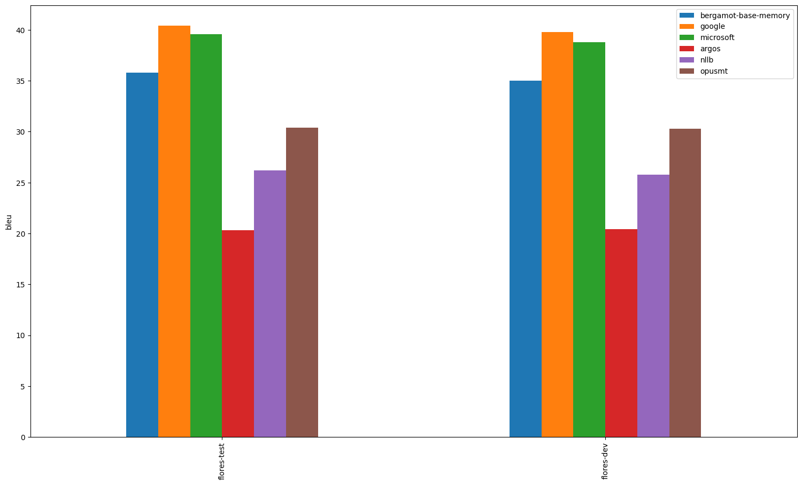
---

## ig-en

| Translator/Dataset | flores-dev | flores-test |
| --- | --- | --- |
| bergamot | N/A | N/A |
| google | 30.40 | 32.10 |
| microsoft | 24.60 | 25.00 |
| argos | N/A | N/A |
| nllb | 21.10 | 22.50 |
| opusmt | 8.30 | 8.70 |

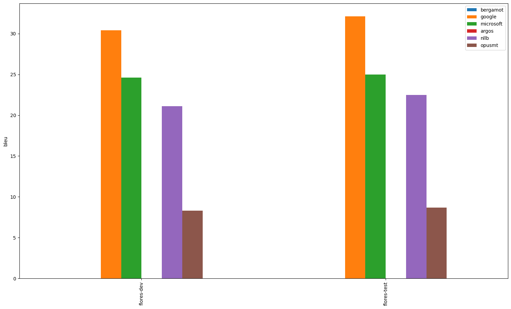
---

## es-en

| Translator/Dataset | wmt08 | mtedx_test | wmt10 | flores-dev | wmt12 | wmt11 | wmt09 | flores-test | wmt13 |
| --- | --- | --- | --- | --- | --- | --- | --- | --- | --- |
| bergamot | 27.30 | 36.80 | 35.80 | 27.50 | 38.30 | 34.30 | 29.40 | 26.80 | 35.20 |
| google | 28.30 (+1.00, +3.66%) | 35.40 (-1.40, -3.80%) | 37.00 (+1.20, +3.35%) | 30.50 (+3.00, +10.91%) | 38.80 (+0.50, +1.31%) | 35.20 (+0.90, +2.62%) | 31.60 (+2.20, +7.48%) | 30.30 (+3.50, +13.06%) | 35.70 (+0.50, +1.42%) |
| microsoft | 26.80 (-0.50, -1.83%) | 37.60 (+0.80, +2.17%) | 35.40 (-0.40, -1.12%) | 30.30 (+2.80, +10.18%) | 37.80 (-0.50, -1.31%) | 33.70 (-0.60, -1.75%) | 29.60 (+0.20, +0.68%) | 29.90 (+3.10, +11.57%) | 35.30 (+0.10, +0.28%) |
| argos | 26.10 (-1.20, -4.40%) | 35.40 (-1.40, -3.80%) | 33.50 (-2.30, -6.42%) | 25.30 (-2.20, -8.00%) | 36.10 (-2.20, -5.74%) | 33.00 (-1.30, -3.79%) | 29.00 (-0.40, -1.36%) | 25.10 (-1.70, -6.34%) | 32.80 (-2.40, -6.82%) |
| nllb | 27.40 (+0.10, +0.37%) | 34.00 (-2.80, -7.61%) | 35.50 (-0.30, -0.84%) | 29.20 (+1.70, +6.18%) | 35.70 (-2.60, -6.79%) | 32.10 (-2.20, -6.41%) | 30.00 (+0.60, +2.04%) | 28.90 (+2.10, +7.84%) | 34.40 (-0.80, -2.27%) |
| opusmt | 27.50 (+0.20, +0.73%) | 36.50 (-0.30, -0.82%) | 36.00 (+0.20, +0.56%) | 28.00 (+0.50, +1.82%) | 37.80 (-0.50, -1.31%) | 34.20 (-0.10, -0.29%) | 30.40 (+1.00, +3.40%) | 27.60 (+0.80, +2.99%) | 35.20 (0.00, 0.00%) |

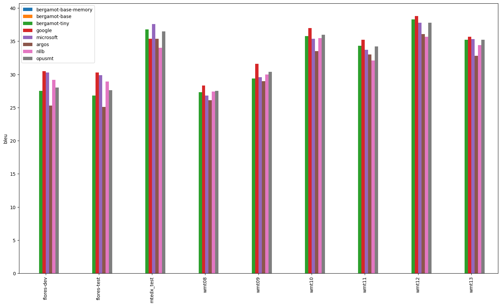
---

## en-sl

| Translator/Dataset | flores-test | flores-dev |
| --- | --- | --- |
| bergamot | 28.80 | 29.50 |
| google | 35.40 (+6.60, +22.92%) | 35.40 (+5.90, +20.00%) |
| microsoft | 33.70 (+4.90, +17.01%) | 33.50 (+4.00, +13.56%) |
| argos | N/A | N/A |
| nllb | 22.60 (-6.20, -21.53%) | 23.90 (-5.60, -18.98%) |
| opusmt | N/A | N/A |

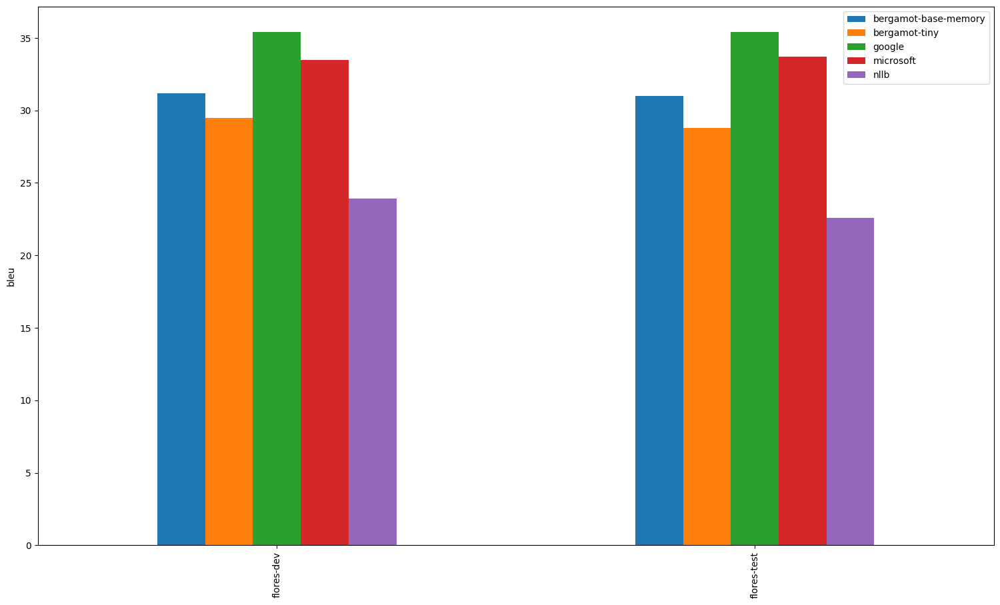
---

## ja-en

| Translator/Dataset | wmt20 | flores-dev | iwslt17 | wmt21 | wmt22 | flores-test | wmt23 |
| --- | --- | --- | --- | --- | --- | --- | --- |
| bergamot | 21.60 | 25.90 | 16.40 | 21.70 | 20.00 | 25.40 | 19.30 |
| google | 31.20 (+9.60, +44.44%) | 31.70 (+5.80, +22.39%) | 17.50 (+1.10, +6.71%) | 34.20 (+12.50, +57.60%) | 22.70 (+2.70, +13.50%) | 31.20 (+5.80, +22.83%) | 24.40 (+5.10, +26.42%) |
| microsoft | 25.60 (+4.00, +18.52%) | 31.40 (+5.50, +21.24%) | 18.80 (+2.40, +14.63%) | 26.00 (+4.30, +19.82%) | 25.40 (+5.40, +27.00%) | 30.70 (+5.30, +20.87%) | 24.30 (+5.00, +25.91%) |
| argos | 11.80 (-9.80, -45.37%) | 16.40 (-9.50, -36.68%) | 7.20 (-9.20, -56.10%) | 11.50 (-10.20, -47.00%) | 11.40 (-8.60, -43.00%) | 16.30 (-9.10, -35.83%) | N/A |
| nllb | 13.30 (-8.30, -38.43%) | 23.80 (-2.10, -8.11%) | 14.70 (-1.70, -10.37%) | 12.70 (-9.00, -41.47%) | 13.30 (-6.70, -33.50%) | 23.00 (-2.40, -9.45%) | N/A |
| opusmt | 9.30 (-12.30, -56.94%) | 19.40 (-6.50, -25.10%) | 11.20 (-5.20, -31.71%) | 9.00 (-12.70, -58.53%) | 9.50 (-10.50, -52.50%) | 19.20 (-6.20, -24.41%) | N/A |

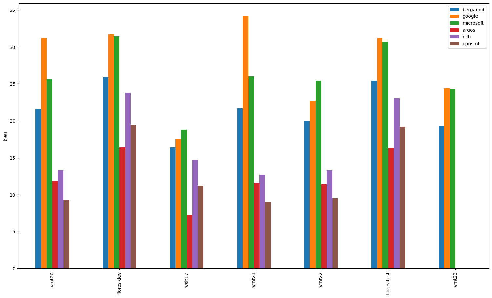
---

## lt-en

| Translator/Dataset | wmt19 | flores-dev | flores-test |
| --- | --- | --- | --- |
| bergamot | 33.20 | 29.40 | 30.00 |
| google | 35.30 (+2.10, +6.33%) | 37.90 (+8.50, +28.91%) | 37.40 (+7.40, +24.67%) |
| microsoft | 33.90 (+0.70, +2.11%) | 31.20 (+1.80, +6.12%) | 32.40 (+2.40, +8.00%) |
| argos | N/A | N/A | N/A |
| nllb | 17.60 (-15.60, -46.99%) | 16.70 (-12.70, -43.20%) | 16.60 (-13.40, -44.67%) |
| opusmt | N/A | N/A | N/A |

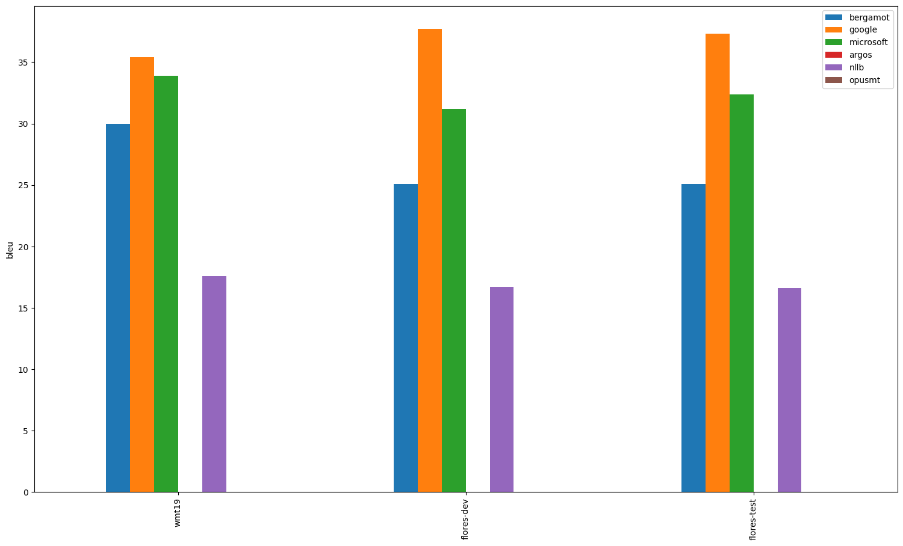
---

## en-de

| Translator/Dataset | wmt13 | wmt19 | flores-test | wmt09 | wmt18 | wmt12 | wmt11 | wmt22 | iwslt17 | wmt20 | wmt08 | wmt15 | wmt17 | wmt16 | wmt10 | wmt21 | flores-dev | wmt14 | wmt23 | wmt24 |
| --- | --- | --- | --- | --- | --- | --- | --- | --- | --- | --- | --- | --- | --- | --- | --- | --- | --- | --- | --- | --- |
| bergamot | 28.20 | 44.50 | 38.80 | 23.00 | 47.70 | 24.30 | 23.40 | 32.10 | 26.70 | 35.70 | 23.60 | 33.10 | 32.00 | 40.00 | 26.80 | 27.70 | 38.80 | 29.80 | 38.90 | 28.30 |
| google | 28.80 (+0.60, +2.13%) | 43.50 (-1.00, -2.25%) | 42.30 (+3.50, +9.02%) | 23.60 (+0.60, +2.61%) | 47.80 (+0.10, +0.21%) | 24.70 (+0.40, +1.65%) | 24.10 (+0.70, +2.99%) | 38.30 (+6.20, +19.31%) | 28.90 (+2.20, +8.24%) | 36.50 (+0.80, +2.24%) | 23.70 (+0.10, +0.42%) | 33.70 (+0.60, +1.81%) | 31.50 (-0.50, -1.56%) | 38.60 (-1.40, -3.50%) | 26.50 (-0.30, -1.12%) | 29.70 (+2.00, +7.22%) | 43.70 (+4.90, +12.63%) | 30.90 (+1.10, +3.69%) | 45.40 (+6.50, +16.71%) | 34.50 (+6.20, +21.91%) |
| microsoft | 28.80 (+0.60, +2.13%) | 43.80 (-0.70, -1.57%) | 42.90 (+4.10, +10.57%) | 23.90 (+0.90, +3.91%) | 48.70 (+1.00, +2.10%) | 25.30 (+1.00, +4.12%) | 23.70 (+0.30, +1.28%) | 37.30 (+5.20, +16.20%) | 28.20 (+1.50, +5.62%) | 36.10 (+0.40, +1.12%) | 24.00 (+0.40, +1.69%) | 34.30 (+1.20, +3.63%) | 33.10 (+1.10, +3.44%) | 40.50 (+0.50, +1.25%) | 27.20 (+0.40, +1.49%) | 29.80 (+2.10, +7.58%) | 44.00 (+5.20, +13.40%) | 32.20 (+2.40, +8.05%) | 43.20 (+4.30, +11.05%) | 32.30 (+4.00, +14.13%) |
| argos | 24.20 (-4.00, -14.18%) | 34.60 (-9.90, -22.25%) | 31.80 (-7.00, -18.04%) | 20.30 (-2.70, -11.74%) | 39.00 (-8.70, -18.24%) | 20.40 (-3.90, -16.05%) | 20.30 (-3.10, -13.25%) | 28.50 (-3.60, -11.21%) | 24.20 (-2.50, -9.36%) | 26.40 (-9.30, -26.05%) | 20.20 (-3.40, -14.41%) | 28.00 (-5.10, -15.41%) | 26.60 (-5.40, -16.87%) | 33.10 (-6.90, -17.25%) | 22.50 (-4.30, -16.04%) | 21.50 (-6.20, -22.38%) | 32.10 (-6.70, -17.27%) | 24.30 (-5.50, -18.46%) | N/A | N/A |
| nllb | 25.40 (-2.80, -9.93%) | 37.00 (-7.50, -16.85%) | 33.70 (-5.10, -13.14%) | 21.20 (-1.80, -7.83%) | 39.70 (-8.00, -16.77%) | 22.20 (-2.10, -8.64%) | 21.70 (-1.70, -7.26%) | 29.70 (-2.40, -7.48%) | 25.50 (-1.20, -4.49%) | 29.80 (-5.90, -16.53%) | 21.70 (-1.90, -8.05%) | 29.10 (-4.00, -12.08%) | 27.00 (-5.00, -15.62%) | 33.70 (-6.30, -15.75%) | 23.90 (-2.90, -10.82%) | 24.30 (-3.40, -12.27%) | 33.90 (-4.90, -12.63%) | 26.20 (-3.60, -12.08%) | N/A | N/A |
| opusmt | 26.90 (-1.30, -4.61%) | 40.40 (-4.10, -9.21%) | 36.10 (-2.70, -6.96%) | 22.50 (-0.50, -2.17%) | 45.00 (-2.70, -5.66%) | 22.90 (-1.40, -5.76%) | 22.50 (-0.90, -3.85%) | 31.30 (-0.80, -2.49%) | 25.70 (-1.00, -3.75%) | 31.20 (-4.50, -12.61%) | 22.10 (-1.50, -6.36%) | 31.10 (-2.00, -6.04%) | 29.90 (-2.10, -6.56%) | 36.80 (-3.20, -8.00%) | 24.90 (-1.90, -7.09%) | 25.20 (-2.50, -9.03%) | 36.30 (-2.50, -6.44%) | 27.60 (-2.20, -7.38%) | N/A | N/A |

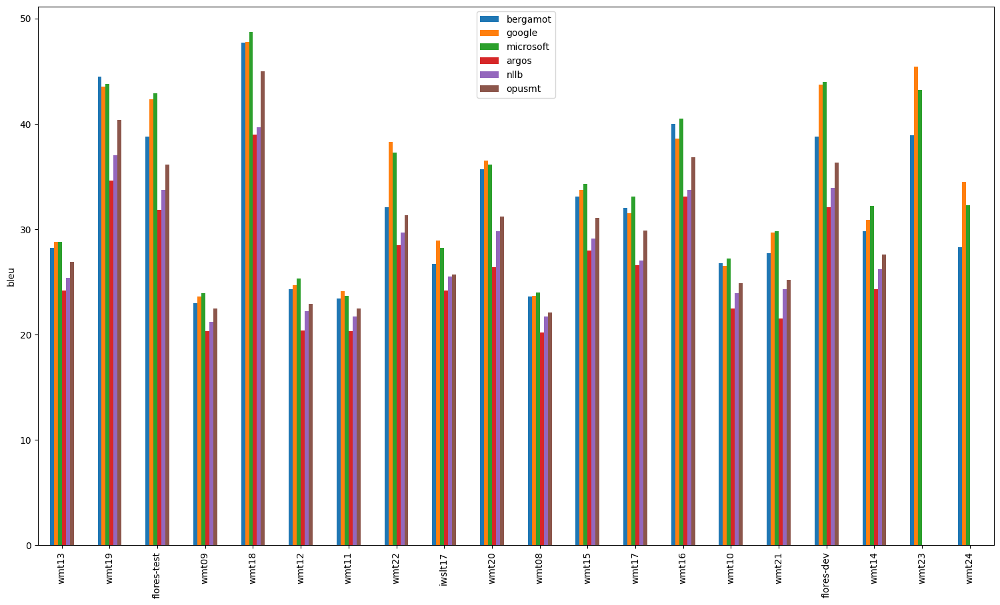
---