# What is BLEU

[BLEU (BiLingual Evaluation Understudy)](https://en.wikipedia.org/wiki/BLEU) is a metric for automatically evaluating machine-translated text. The BLEU score is a number between zero and one that measures the similarity of the machine-translated text to a set of high quality reference translations. A value of 0 means that the machine-translated output has no overlap with the reference translation (low quality) while a value of 1 means there is perfect overlap with the reference translations (high quality).

It has been shown that BLEU scores correlate well with human judgment of translation quality. Note that even human translators do not achieve a perfect score of 1.0.

BLEU scores are expressed as a percentage rather than a decimal between 0 and 1.
Trying to compare BLEU scores across different corpora and languages is strongly discouraged. Even comparing BLEU scores for the same corpus but with different numbers of reference translations can be highly misleading.

However, as a rough guideline, the following interpretation of BLEU scores (expressed as percentages rather than decimals) might be helpful.

BLEU Score |	Interpretation
--- | ---
< 10 |	Almost useless
10 - 19 |	Hard to get the gist
20 - 29 |	The gist is clear, but has significant grammatical errors
30 - 40 |	Understandable to good translations
40 - 50 |	High quality translations
50 - 60 |	Very high quality, adequate, and fluent translations
\> 60 |	Quality often better than human

[More mathematical details](https://cloud.google.com/translate/automl/docs/evaluate#the_mathematical_details)

Source: https://cloud.google.com/translate/automl/docs/evaluate#bleu

BLEU is the most popular becnhmark in academia, so using BLEU allows us also to compare with reserach papers results and competitions (see [Conference on Machine Translation Conference (WMT)](http://statmt.org/wmt21/)).

Read [this article](https://www.rws.com/blog/understanding-mt-quality-bleu-scores/) to better understand what BLEU is and why it is not perfect.

# What are these benchmarks

## Translators

1. **bergamot** - uses compiled  [bergamot-translator](https://github.com/mozilla/bergamot-translator)  (wrapper for marian that is used by Firefox Translations web extension)
2. **google** - uses Google Translation [API](https://cloud.google.com/translate)
3. **microsoft** - uses Azure Cognitive Services Translator [API](https://azure.microsoft.com/en-us/services/cognitive-services/translator/)
4. **argos** - uses [Argos Translate](https://github.com/argosopentech/argos-translate)
5. **nllb** - uses [No Language Left Behind (NLLB)](https://github.com/facebookresearch/fairseq/tree/nllb)
6. **opus-mt** - uses [Opus-MT models](https://github.com/Helsinki-NLP/Opus-MT)

Translation quality of Marian and Bergamot is supposed to be very similar.

## Method

We use official WMT ([Conference on Machine Translation](http://statmt.org/wmt21/)) parallel datasets. Available datasets are discovered automatically based on a language pair.

We perform translation from source to target language using one of three translation systems and then compare the result with the dataset reference and calculate BLEU score.

Evaluation is done using [SacreBLEU](https://github.com/mjpost/sacrebleu) tool which is reliable and widely used in academic world.

Both absolute and relative differences in BLEU scores between Bergamot and other systems are reported.

# Evaluation results

`avg` = average on all datasets

## avg

| Translator/Dataset | cs-en | tr-en | sk-en | en-et | en-fi | en-it | en-gl | en-hr | fr-en | en-pt | ro-en | hu-en | th-en | en-zh | vi-en | en-ja | ru-en | mt-en | en-sr | en-nb | en-hu | en-el | el-en | fi-en | en-da | en-nl | en-mt | en-sv | lv-en | en-th | en-ru | en-fa | bs-en | et-en | nb-en | en-ca | nl-en | en-lt | en-tr | bg-en | ko-en | uk-en | en-es | fa-en | ca-en | en-uk | en-vi | is-en | en-bg | en-lv | gl-en | zh-en | en-hi | en-bs | en-cs | hr-en | en-ro | sr-en | sv-en | en-ko | hi-en | en-is | id-en | de-en | da-en | it-en | pl-en | sl-en | en-fr | en-pl | en-id | pt-en | en-sk | es-en | en-sl | ja-en | lt-en | en-de |
| --- | --- | --- | --- | --- | --- | --- | --- | --- | --- | --- | --- | --- | --- | --- | --- | --- | --- | --- | --- | --- | --- | --- | --- | --- | --- | --- | --- | --- | --- | --- | --- | --- | --- | --- | --- | --- | --- | --- | --- | --- | --- | --- | --- | --- | --- | --- | --- | --- | --- | --- | --- | --- | --- | --- | --- | --- | --- | --- | --- | --- | --- | --- | --- | --- | --- | --- | --- | --- | --- | --- | --- | --- | --- | --- | --- | --- | --- | --- |
| bergamot | 31.07 | 30.08 | N/A | 25.50 | N/A | 29.77 | N/A | N/A | 35.43 | 49.85 | N/A | 26.53 | N/A | N/A | N/A | N/A | 33.69 | 42.70 | N/A | N/A | 20.32 | N/A | 32.53 | 29.44 | N/A | 27.30 | N/A | N/A | N/A | N/A | 29.44 | 17.30 | N/A | 32.37 | 37.60 | 42.20 | 29.65 | N/A | N/A | 38.50 | N/A | 35.93 | 32.41 | 28.70 | 38.00 | 26.30 | N/A | 23.40 | 42.10 | N/A | N/A | N/A | N/A | N/A | 25.35 | N/A | N/A | N/A | N/A | N/A | N/A | N/A | N/A | 33.16 | N/A | 32.60 | 27.87 | 29.10 | 36.01 | 22.27 | N/A | 44.87 | N/A | 32.38 | N/A | N/A | 30.53 | 32.01 |
| google | 33.36 (+2.29, +7.36%) | 39.58 (+9.50, +31.58%) | 43.05 | 28.60 (+3.10, +12.16%) | 27.43 | 28.97 (-0.80, -2.69%) | 37.60 | 33.90 | 37.81 (+2.38, +6.70%) | 53.75 (+3.90, +7.82%) | 44.53 | 31.30 (+4.77, +18.00%) | 30.95 | 45.31 | 40.55 | 33.00 | 38.20 (+4.51, +13.38%) | 59.15 (+16.45, +38.52%) | 40.00 | 35.05 | 24.80 (+4.48, +22.02%) | 29.55 | 37.13 (+4.60, +14.14%) | 33.20 (+3.76, +12.76%) | 49.70 | 29.30 (+2.00, +7.33%) | 40.60 | 48.15 | 36.80 | 15.60 | 34.49 (+5.05, +17.15%) | 27.80 (+10.50, +60.69%) | 45.65 | 35.80 (+3.43, +10.61%) | 42.05 (+4.45, +11.84%) | 35.70 (-6.50, -15.40%) | 33.05 (+3.40, +11.47%) | 28.57 | 25.52 | 41.30 (+2.80, +7.27%) | 29.47 | 42.43 (+6.50, +18.09%) | 34.74 (+2.32, +7.17%) | 40.85 (+12.15, +42.33%) | 48.95 (+10.95, +28.82%) | 32.63 (+6.33, +24.08%) | 45.55 | 38.90 (+15.50, +66.24%) | 44.60 (+2.50, +5.94%) | 33.77 | 43.50 | 32.29 | 33.43 | 36.45 | 27.72 (+2.36, +9.33%) | 40.60 | 40.60 | 47.55 | 50.50 | 29.20 | 42.13 | 30.70 | 47.75 | 35.65 (+2.49, +7.52%) | 50.40 | 34.50 (+1.90, +5.83%) | 31.23 (+3.37, +12.08%) | 38.75 (+9.65, +33.16%) | 29.47 (-6.54, -18.15%) | 25.50 (+3.23, +14.52%) | 49.25 | 46.60 (+1.73, +3.86%) | 40.10 | 33.64 (+1.27, +3.91%) | 35.40 | 28.08 | 36.80 (+6.27, +20.52%) | 33.16 (+1.14, +3.58%) |
| microsoft | 34.67 (+3.61, +11.61%) | 39.16 (+9.08, +30.19%) | 41.95 | 28.47 (+2.97, +11.63%) | 29.27 | 32.30 (+2.53, +8.51%) | 35.10 | 32.43 | 39.13 (+3.70, +10.44%) | 50.15 (+0.30, +0.60%) | 45.53 | 31.03 (+4.50, +16.97%) | 31.25 | 43.42 | 39.30 | 30.72 | 38.38 (+4.68, +13.90%) | 56.75 (+14.05, +32.90%) | 1.00 | 34.95 | 26.05 (+5.73, +28.17%) | 29.95 | 37.33 (+4.80, +14.75%) | 35.09 (+5.64, +19.17%) | 49.65 | 28.80 (+1.50, +5.49%) | 44.20 | 50.00 | 32.67 | 15.05 | 33.62 (+4.18, +14.21%) | 20.50 (+3.20, +18.50%) | 42.65 | 36.17 (+3.80, +11.74%) | 42.90 (+5.30, +14.10%) | 45.25 (+3.05, +7.23%) | 32.60 (+2.95, +9.95%) | 26.10 | 32.18 | 41.20 (+2.70, +7.01%) | 29.50 | 42.30 (+6.37, +17.72%) | 33.76 (+1.35, +4.17%) | 36.15 (+7.45, +25.96%) | 46.50 (+8.50, +22.37%) | 32.03 (+5.73, +21.80%) | 44.95 | 38.17 (+14.77, +63.11%) | 38.55 (-3.55, -8.43%) | 33.20 | 40.20 | 32.09 | 33.73 | 32.65 | 28.26 (+2.91, +11.46%) | 38.50 | 42.07 | 1.60 | 51.90 | 29.87 | 40.57 | 30.83 | 47.00 | 37.73 (+4.57, +13.79%) | 51.05 | 34.55 (+1.95, +5.98%) | 31.83 (+3.97, +14.23%) | 34.65 (+5.55, +19.07%) | 36.48 (+0.47, +1.31%) | 24.83 (+2.57, +11.53%) | 50.15 | 46.47 (+1.60, +3.57%) | 39.20 | 32.93 (+0.56, +1.72%) | 33.60 | 26.32 | 32.50 (+1.97, +6.44%) | 33.54 (+1.53, +4.79%) |
| argos | 20.55 (-10.52, -33.86%) | 20.42 (-9.66, -32.11%) | 24.80 | 23.17 (-2.33, -9.15%) | 19.33 | 27.17 (-2.60, -8.73%) | N/A | N/A | 34.04 (-1.39, -3.93%) | 43.80 (-6.05, -12.14%) | N/A | 12.97 (-13.55, -51.08%) | N/A | 29.00 | N/A | 15.70 | 25.76 (-7.93, -23.54%) | N/A | N/A | N/A | 17.40 (-2.93, -14.39%) | 26.25 | 31.83 (-0.70, -2.15%) | 22.14 (-7.30, -24.79%) | 36.80 | 24.90 (-2.40, -8.79%) | N/A | 42.05 | N/A | N/A | 27.89 (-1.55, -5.26%) | 21.30 (+4.00, +23.12%) | N/A | 31.33 (-1.03, -3.19%) | 38.85 (+1.25, +3.32%) | 30.40 (-11.80, -27.96%) | 29.90 (+0.25, +0.84%) | N/A | 16.18 | 36.10 (-2.40, -6.23%) | 12.93 | 26.27 (-9.67, -26.90%) | 29.93 (-2.49, -7.67%) | 27.90 (-0.80, -2.79%) | 42.30 (+4.30, +11.32%) | 15.73 (-10.57, -40.18%) | N/A | N/A | 39.45 (-2.65, -6.29%) | N/A | N/A | 20.41 | 25.47 | N/A | 15.65 (-9.71, -38.28%) | N/A | N/A | N/A | 44.35 | 14.10 | 25.70 | N/A | 29.00 | 30.97 (-2.18, -6.59%) | 38.20 | 31.07 (-1.53, -4.68%) | 27.67 (-0.20, -0.72%) | N/A | 33.44 (-2.57, -7.14%) | 19.67 (-2.60, -11.68%) | 34.45 | 42.77 (-2.10, -4.68%) | 20.35 | 30.70 (-1.68, -5.18%) | N/A | 12.43 | N/A | 26.56 (-5.46, -17.04%) |
| nllb | 22.66 (-8.41, -27.06%) | 22.90 (-7.18, -23.87%) | 26.95 | 17.57 (-7.93, -31.11%) | 17.41 | 28.30 (-1.47, -4.93%) | 31.40 | 22.53 | 34.95 (-0.48, -1.36%) | 45.65 (-4.20, -8.43%) | 31.57 | 15.85 (-10.68, -40.25%) | 25.45 | 27.04 | 31.70 | 15.58 | 33.42 (-0.28, -0.82%) | 26.95 (-15.75, -36.89%) | 25.60 | 28.95 | 16.60 (-3.72, -18.33%) | 23.30 | 32.80 (+0.27, +0.82%) | 13.96 (-15.49, -52.60%) | 40.30 | 24.35 (-2.95, -10.81%) | 28.60 | 38.20 | 15.40 | 7.45 | 27.47 (-1.98, -6.71%) | 18.80 (+1.50, +8.67%) | 26.30 | 11.40 (-20.97, -64.78%) | 27.60 (-10.00, -26.60%) | 35.45 (-6.75, -16.00%) | 25.55 (-4.10, -13.83%) | 16.30 | 19.00 | 36.40 (-2.10, -5.45%) | 22.90 | 33.00 (-2.93, -8.16%) | 32.04 (-0.38, -1.16%) | 29.75 (+1.05, +3.66%) | 37.40 (-0.60, -1.58%) | 21.97 (-4.33, -16.48%) | 37.15 | 17.63 (-5.77, -24.64%) | 34.05 (-8.05, -19.12%) | 14.30 | 35.00 | 21.20 | 27.03 | 24.50 | 21.30 (-4.05, -15.99%) | 23.75 | 32.23 | 33.60 | 31.45 | 22.37 | 35.43 | 18.17 | 38.95 | 25.39 (-7.77, -23.42%) | 32.20 | 30.15 (-2.45, -7.52%) | 22.83 (-5.03, -18.06%) | 17.40 (-11.70, -40.21%) | 35.81 (-0.20, -0.56%) | 18.33 (-3.93, -17.66%) | 41.50 | 40.00 (-4.87, -10.85%) | 26.00 | 31.91 (-0.47, -1.44%) | 23.25 | 16.80 | 16.97 (-13.57, -44.43%) | 28.09 (-3.92, -12.24%) |
| opusmt | 29.60 (-1.47, -4.73%) | 28.18 (-1.90, -6.32%) | 33.90 | 23.53 (-1.97, -7.71%) | 26.70 | 28.50 (-1.27, -4.26%) | 19.35 | N/A | 35.90 (+0.47, +1.32%) | N/A | N/A | 26.15 (-0.38, -1.41%) | 20.65 | 27.44 | 25.75 | N/A | 29.65 (-4.04, -11.99%) | N/A | N/A | N/A | 20.57 (+0.25, +1.23%) | 24.70 | N/A | 28.30 (-1.14, -3.88%) | 43.00 | 25.30 (-2.00, -7.33%) | N/A | 43.75 | 28.00 | N/A | 25.82 (-3.62, -12.28%) | N/A | N/A | 31.50 (-0.87, -2.68%) | N/A | 29.70 (-12.50, -29.62%) | 29.65 (0.00, 0.00%) | N/A | N/A | 36.30 (-2.20, -5.71%) | 20.13 | 27.77 (-8.17, -22.73%) | 32.73 (+0.31, +0.96%) | N/A | 29.75 (-8.25, -21.71%) | 18.80 (-7.50, -28.52%) | 26.35 | 25.37 (+1.97, +8.40%) | 32.50 (-9.60, -22.80%) | N/A | 21.40 | 20.84 | 12.43 | N/A | 23.99 (-1.36, -5.38%) | N/A | 31.37 | N/A | 46.10 | N/A | 17.40 | 17.33 | 34.25 | 34.09 (+0.93, +2.82%) | 45.10 | 32.25 (-0.35, -1.07%) | 26.80 (-1.07, -3.83%) | N/A | 36.31 (+0.30, +0.83%) | N/A | 37.85 | N/A | 30.35 | 32.58 (+0.20, +0.62%) | N/A | 12.93 | N/A | 29.91 (-2.10, -6.56%) |

---

## cs-en

| Translator/Dataset | wmt20 | wmt08 | wmt10 | flores-dev | wmt12 | wmt17 | wmt14 | wmt11 | wmt15 | wmt18 | wmt21 | wmt09 | wmt22 | flores-test | wmt16 | wmt13 |
| --- | --- | --- | --- | --- | --- | --- | --- | --- | --- | --- | --- | --- | --- | --- | --- | --- |
| bergamot | 27.00 | 24.50 | 28.20 | 35.30 | 26.50 | 30.20 | 35.00 | 28.10 | 32.00 | 31.30 | 27.90 | 27.60 | 44.50 | 35.30 | 33.40 | 30.30 |
| google | 28.40 (+1.40, +5.19%) | 26.30 (+1.80, +7.35%) | 30.50 (+2.30, +8.16%) | 38.60 (+3.30, +9.35%) | 28.60 (+2.10, +7.92%) | 31.20 (+1.00, +3.31%) | 38.00 (+3.00, +8.57%) | 30.20 (+2.10, +7.47%) | 33.60 (+1.60, +5.00%) | 32.10 (+0.80, +2.56%) | 30.70 (+2.80, +10.04%) | 29.90 (+2.30, +8.33%) | 49.40 (+4.90, +11.01%) | 39.00 (+3.70, +10.48%) | 34.80 (+1.40, +4.19%) | 32.40 (+2.10, +6.93%) |
| microsoft | 27.60 (+0.60, +2.22%) | 26.40 (+1.90, +7.76%) | 30.70 (+2.50, +8.87%) | 40.00 (+4.70, +13.31%) | 29.70 (+3.20, +12.08%) | 33.60 (+3.40, +11.26%) | 39.90 (+4.90, +14.00%) | 30.90 (+2.80, +9.96%) | 34.70 (+2.70, +8.44%) | 34.30 (+3.00, +9.58%) | 30.50 (+2.60, +9.32%) | 29.60 (+2.00, +7.25%) | 54.90 (+10.40, +23.37%) | 40.30 (+5.00, +14.16%) | 38.30 (+4.90, +14.67%) | 33.40 (+3.10, +10.23%) |
| argos | 16.90 (-10.10, -37.41%) | 16.80 (-7.70, -31.43%) | 19.00 (-9.20, -32.62%) | 25.20 (-10.10, -28.61%) | 19.10 (-7.40, -27.92%) | 19.10 (-11.10, -36.75%) | 22.30 (-12.70, -36.29%) | 20.70 (-7.40, -26.33%) | 19.20 (-12.80, -40.00%) | 19.10 (-12.20, -38.98%) | 20.00 (-7.90, -28.32%) | 19.00 (-8.60, -31.16%) | 23.20 (-21.30, -47.87%) | 25.50 (-9.80, -27.76%) | 22.30 (-11.10, -33.23%) | 21.40 (-8.90, -29.37%) |
| nllb | 15.10 (-11.90, -44.07%) | 18.50 (-6.00, -24.49%) | 22.10 (-6.10, -21.63%) | 28.20 (-7.10, -20.11%) | 21.00 (-5.50, -20.75%) | 22.00 (-8.20, -27.15%) | 25.10 (-9.90, -28.29%) | 21.30 (-6.80, -24.20%) | 22.20 (-9.80, -30.63%) | 22.60 (-8.70, -27.80%) | 18.90 (-9.00, -32.26%) | 20.90 (-6.70, -24.28%) | 27.70 (-16.80, -37.75%) | 28.10 (-7.20, -20.40%) | 25.00 (-8.40, -25.15%) | 23.90 (-6.40, -21.12%) |
| opusmt | 23.00 (-4.00, -14.81%) | 23.30 (-1.20, -4.90%) | 26.50 (-1.70, -6.03%) | 34.30 (-1.00, -2.83%) | 27.10 (+0.60, +2.26%) | 28.00 (-2.20, -7.28%) | 33.10 (-1.90, -5.43%) | 27.70 (-0.40, -1.42%) | 29.20 (-2.80, -8.75%) | 29.20 (-2.10, -6.71%) | 27.90 (0.00, 0.00%) | 26.50 (-1.10, -3.99%) | 41.10 (-3.40, -7.64%) | 34.90 (-0.40, -1.13%) | 31.50 (-1.90, -5.69%) | 30.30 (0.00, 0.00%) |

---

## tr-en

| Translator/Dataset | flores-dev | wmt17 | wmt18 | flores-test | wmt16 |
| --- | --- | --- | --- | --- | --- |
| bergamot | 33.90 | 28.50 | 27.70 | 33.20 | 27.10 |
| google | 44.10 (+10.20, +30.09%) | 38.10 (+9.60, +33.68%) | 36.10 (+8.40, +30.32%) | 42.60 (+9.40, +28.31%) | 37.00 (+9.90, +36.53%) |
| microsoft | 43.80 (+9.90, +29.20%) | 37.30 (+8.80, +30.88%) | 36.00 (+8.30, +29.96%) | 42.80 (+9.60, +28.92%) | 35.90 (+8.80, +32.47%) |
| argos | 24.60 (-9.30, -27.43%) | 18.30 (-10.20, -35.79%) | 17.40 (-10.30, -37.18%) | 23.90 (-9.30, -28.01%) | 17.90 (-9.20, -33.95%) |
| nllb | 27.30 (-6.60, -19.47%) | 19.90 (-8.60, -30.18%) | 21.00 (-6.70, -24.19%) | 25.90 (-7.30, -21.99%) | 20.40 (-6.70, -24.72%) |
| opusmt | 33.00 (-0.90, -2.65%) | 24.70 (-3.80, -13.33%) | 26.60 (-1.10, -3.97%) | 31.60 (-1.60, -4.82%) | 25.00 (-2.10, -7.75%) |

---

## sk-en

| Translator/Dataset | flores-dev | flores-test |
| --- | --- | --- |
| bergamot | N/A | N/A |
| google | 43.00 | 43.10 |
| microsoft | 42.10 | 41.80 |
| argos | 24.50 | 25.10 |
| nllb | 27.70 | 26.20 |
| opusmt | 34.00 | 33.80 |

---

## en-et

| Translator/Dataset | flores-dev | flores-test | wmt18 |
| --- | --- | --- | --- |
| bergamot | 25.60 | 25.70 | 25.20 |
| google | 30.20 (+4.60, +17.97%) | 29.00 (+3.30, +12.84%) | 26.60 (+1.40, +5.56%) |
| microsoft | 28.60 (+3.00, +11.72%) | 29.20 (+3.50, +13.62%) | 27.60 (+2.40, +9.52%) |
| argos | 23.30 (-2.30, -8.98%) | 24.20 (-1.50, -5.84%) | 22.00 (-3.20, -12.70%) |
| nllb | 17.60 (-8.00, -31.25%) | 17.70 (-8.00, -31.13%) | 17.40 (-7.80, -30.95%) |
| opusmt | 23.40 (-2.20, -8.59%) | 24.80 (-0.90, -3.50%) | 22.40 (-2.80, -11.11%) |

---

## en-fi

| Translator/Dataset | wmt16 | wmt15 | wmt17 | flores-dev | flores-test | wmt19 | wmt18 |
| --- | --- | --- | --- | --- | --- | --- | --- |
| bergamot | N/A | N/A | N/A | N/A | N/A | N/A | N/A |
| google | 28.80 | 27.10 | 31.60 | 27.90 | 28.60 | 27.70 | 20.30 |
| microsoft | 31.10 | 28.90 | 34.20 | 30.00 | 29.70 | 29.60 | 21.40 |
| argos | 20.00 | 19.50 | 22.10 | 19.50 | 19.30 | 19.00 | 15.90 |
| nllb | 18.70 | 16.20 | 19.70 | 17.00 | 16.90 | 20.10 | 13.30 |
| opusmt | 29.70 | 27.60 | 32.30 | 25.40 | 25.40 | 25.50 | 21.00 |

---

## en-it

| Translator/Dataset | flores-test | flores-dev | wmt09 |
| --- | --- | --- | --- |
| bergamot | 29.30 | 29.20 | 30.80 |
| google | 29.60 (+0.30, +1.02%) | 28.50 (-0.70, -2.40%) | 28.80 (-2.00, -6.49%) |
| microsoft | 32.10 (+2.80, +9.56%) | 31.10 (+1.90, +6.51%) | 33.70 (+2.90, +9.42%) |
| argos | 26.00 (-3.30, -11.26%) | 25.50 (-3.70, -12.67%) | 30.00 (-0.80, -2.60%) |
| nllb | 27.50 (-1.80, -6.14%) | 27.30 (-1.90, -6.51%) | 30.10 (-0.70, -2.27%) |
| opusmt | 27.50 (-1.80, -6.14%) | 26.80 (-2.40, -8.22%) | 31.20 (+0.40, +1.30%) |

---

## en-gl

| Translator/Dataset | flores-test | flores-dev |
| --- | --- | --- |
| bergamot | N/A | N/A |
| google | 37.70 | 37.50 |
| microsoft | 34.80 | 35.40 |
| argos | N/A | N/A |
| nllb | 31.30 | 31.50 |
| opusmt | 18.90 | 19.80 |

---

## en-hr

| Translator/Dataset | flores-test | flores-dev | wmt22 |
| --- | --- | --- | --- |
| bergamot | N/A | N/A | N/A |
| google | 35.30 | 35.00 | 31.40 |
| microsoft | 33.70 | 33.90 | 29.70 |
| argos | N/A | N/A | N/A |
| nllb | 23.20 | 22.90 | 21.50 |
| opusmt | N/A | N/A | N/A |

---

## fr-en

| Translator/Dataset | wmt08 | mtedx_test | wmt10 | flores-dev | wmt12 | wmt14 | wmt11 | wmt15 | iwslt17 | wmt09 | flores-test | wmt13 |
| --- | --- | --- | --- | --- | --- | --- | --- | --- | --- | --- | --- | --- |
| bergamot | 24.50 | 42.80 | 31.40 | 43.80 | 31.90 | 37.30 | 32.00 | 37.20 | 39.80 | 29.10 | 42.10 | 33.30 |
| google | 26.60 (+2.10, +8.57%) | 42.70 (-0.10, -0.23%) | 34.10 (+2.70, +8.60%) | 48.70 (+4.90, +11.19%) | 33.80 (+1.90, +5.96%) | 40.60 (+3.30, +8.85%) | 34.30 (+2.30, +7.19%) | 39.90 (+2.70, +7.26%) | 40.60 (+0.80, +2.01%) | 31.20 (+2.10, +7.22%) | 46.70 (+4.60, +10.93%) | 34.50 (+1.20, +3.60%) |
| microsoft | 27.40 (+2.90, +11.84%) | 46.40 (+3.60, +8.41%) | 35.00 (+3.60, +11.46%) | 48.90 (+5.10, +11.64%) | 34.60 (+2.70, +8.46%) | 42.30 (+5.00, +13.40%) | 35.20 (+3.20, +10.00%) | 42.70 (+5.50, +14.78%) | 41.80 (+2.00, +5.03%) | 32.20 (+3.10, +10.65%) | 47.00 (+4.90, +11.64%) | 36.10 (+2.80, +8.41%) |
| argos | 24.90 (+0.40, +1.63%) | 41.30 (-1.50, -3.50%) | 30.50 (-0.90, -2.87%) | 40.80 (-3.00, -6.85%) | 31.40 (-0.50, -1.57%) | 35.30 (-2.00, -5.36%) | 31.80 (-0.20, -0.62%) | 36.00 (-1.20, -3.23%) | 35.80 (-4.00, -10.05%) | 29.10 (0.00, 0.00%) | 39.50 (-2.60, -6.18%) | 32.10 (-1.20, -3.60%) |
| nllb | 25.50 (+1.00, +4.08%) | 39.10 (-3.70, -8.64%) | 32.00 (+0.60, +1.91%) | 43.20 (-0.60, -1.37%) | 32.20 (+0.30, +0.94%) | 37.50 (+0.20, +0.54%) | 31.60 (-0.40, -1.25%) | 35.80 (-1.40, -3.76%) | 37.90 (-1.90, -4.77%) | 29.50 (+0.40, +1.37%) | 41.90 (-0.20, -0.48%) | 33.20 (-0.10, -0.30%) |
| opusmt | 25.50 (+1.00, +4.08%) | 43.80 (+1.00, +2.34%) | 32.10 (+0.70, +2.23%) | 43.00 (-0.80, -1.83%) | 32.70 (+0.80, +2.51%) | 38.00 (+0.70, +1.88%) | 32.90 (+0.90, +2.81%) | 38.40 (+1.20, +3.23%) | 38.90 (-0.90, -2.26%) | 30.20 (+1.10, +3.78%) | 41.70 (-0.40, -0.95%) | 33.60 (+0.30, +0.90%) |

---

## en-pt

| Translator/Dataset | flores-test | flores-dev |
| --- | --- | --- |
| bergamot | 50.30 | 49.40 |
| google | 53.90 (+3.60, +7.16%) | 53.60 (+4.20, +8.50%) |
| microsoft | 50.70 (+0.40, +0.80%) | 49.60 (+0.20, +0.40%) |
| argos | 43.70 (-6.60, -13.12%) | 43.90 (-5.50, -11.13%) |
| nllb | 46.20 (-4.10, -8.15%) | 45.10 (-4.30, -8.70%) |
| opusmt | N/A | N/A |

---

## ro-en

| Translator/Dataset | flores-dev | flores-test | wmt16 |
| --- | --- | --- | --- |
| bergamot | N/A | N/A | N/A |
| google | 45.50 | 45.20 | 42.90 |
| microsoft | 45.80 | 46.10 | 44.70 |
| argos | N/A | N/A | N/A |
| nllb | 33.00 | 32.10 | 29.60 |
| opusmt | N/A | N/A | N/A |

---

## hu-en

| Translator/Dataset | wmt08 | flores-dev | wmt09 | flores-test |
| --- | --- | --- | --- | --- |
| bergamot | 20.00 | 32.20 | 22.30 | 31.60 |
| google | 22.40 (+2.40, +12.00%) | 39.40 (+7.20, +22.36%) | 25.40 (+3.10, +13.90%) | 38.00 (+6.40, +20.25%) |
| microsoft | 22.60 (+2.60, +13.00%) | 38.50 (+6.30, +19.57%) | 24.80 (+2.50, +11.21%) | 38.20 (+6.60, +20.89%) |
| argos | 9.70 (-10.30, -51.50%) | 15.90 (-16.30, -50.62%) | 10.90 (-11.40, -51.12%) | 15.40 (-16.20, -51.27%) |
| nllb | 12.20 (-7.80, -39.00%) | 19.30 (-12.90, -40.06%) | 13.90 (-8.40, -37.67%) | 18.00 (-13.60, -43.04%) |
| opusmt | 19.50 (-0.50, -2.50%) | 31.90 (-0.30, -0.93%) | 22.30 (0.00, 0.00%) | 30.90 (-0.70, -2.22%) |

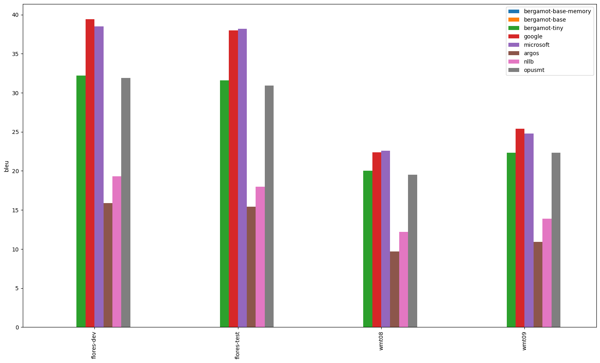
---

## th-en

| Translator/Dataset | flores-dev | flores-test |
| --- | --- | --- |
| bergamot | N/A | N/A |
| google | 31.40 | 30.50 |
| microsoft | 32.00 | 30.50 |
| argos | N/A | N/A |
| nllb | 26.50 | 24.40 |
| opusmt | 21.40 | 19.90 |

---

## en-zh

| Translator/Dataset | wmt19 | iwslt17 | flores-dev | wmt21 | wmt22 | flores-test | wmt18 | wmt20 | wmt17 |
| --- | --- | --- | --- | --- | --- | --- | --- | --- | --- |
| bergamot | N/A | N/A | N/A | N/A | N/A | N/A | N/A | N/A | N/A |
| google | 43.40 | 31.70 | 48.80 | 37.20 | 50.50 | 50.70 | 49.60 | 50.10 | 45.80 |
| microsoft | 41.00 | 31.90 | 47.80 | 35.50 | 49.10 | 49.00 | 45.80 | 48.30 | 42.40 |
| argos | 26.60 | 23.60 | 32.00 | 23.60 | 30.20 | 33.10 | 31.50 | 31.40 | 29.00 |
| nllb | 26.00 | 22.30 | 29.60 | 22.80 | 30.40 | 30.20 | 26.60 | 30.10 | 25.40 |
| opusmt | 23.90 | 23.70 | 31.00 | 22.90 | 29.70 | 32.20 | 28.00 | 29.40 | 26.20 |

---

## vi-en

| Translator/Dataset | flores-dev | flores-test |
| --- | --- | --- |
| bergamot | N/A | N/A |
| google | 41.10 | 40.00 |
| microsoft | 39.90 | 38.70 |
| argos | N/A | N/A |
| nllb | 32.50 | 30.90 |
| opusmt | 26.20 | 25.30 |

---

## en-ja

| Translator/Dataset | wmt20 | iwslt17 | wmt21 | flores-dev | wmt22 | flores-test |
| --- | --- | --- | --- | --- | --- | --- |
| bergamot | N/A | N/A | N/A | N/A | N/A | N/A |
| google | 35.30 | 14.70 | 37.20 | 41.40 | 28.20 | 41.20 |
| microsoft | 28.70 | 15.20 | 30.50 | 41.30 | 27.40 | 41.20 |
| argos | 12.90 | 8.00 | 13.60 | 22.30 | 15.20 | 22.20 |
| nllb | 14.50 | 10.90 | 16.00 | 19.20 | 13.90 | 19.00 |
| opusmt | N/A | N/A | N/A | N/A | N/A | N/A |

---

## ru-en

| Translator/Dataset | wmt20 | mtedx_test | flores-dev | wmt17 | wmt14 | wmt19 | wmt15 | wmt18 | wmt21 | wmt22 | flores-test | wmt16 | wmt13 |
| --- | --- | --- | --- | --- | --- | --- | --- | --- | --- | --- | --- | --- | --- |
| bergamot | 35.00 | 24.00 | 31.90 | 37.60 | 37.80 | 39.10 | 33.50 | 31.90 | 35.40 | 38.50 | 31.00 | 33.00 | 29.30 |
| google | 38.40 (+3.40, +9.71%) | 25.10 (+1.10, +4.58%) | 38.40 (+6.50, +20.38%) | 42.70 (+5.10, +13.56%) | 42.70 (+4.90, +12.96%) | 42.80 (+3.70, +9.46%) | 38.60 (+5.10, +15.22%) | 37.30 (+5.40, +16.93%) | 39.80 (+4.40, +12.43%) | 43.70 (+5.20, +13.51%) | 37.30 (+6.30, +20.32%) | 37.60 (+4.60, +13.94%) | 32.20 (+2.90, +9.90%) |
| microsoft | 38.80 (+3.80, +10.86%) | 26.20 (+2.20, +9.17%) | 36.50 (+4.60, +14.42%) | 43.70 (+6.10, +16.22%) | 44.10 (+6.30, +16.67%) | 43.80 (+4.70, +12.02%) | 38.50 (+5.00, +14.93%) | 37.40 (+5.50, +17.24%) | 39.00 (+3.60, +10.17%) | 43.90 (+5.40, +14.03%) | 36.10 (+5.10, +16.45%) | 38.40 (+5.40, +16.36%) | 32.50 (+3.20, +10.92%) |
| argos | 25.50 (-9.50, -27.14%) | 21.40 (-2.60, -10.83%) | 25.70 (-6.20, -19.44%) | 28.90 (-8.70, -23.14%) | 28.20 (-9.60, -25.40%) | 26.70 (-12.40, -31.71%) | 25.50 (-8.00, -23.88%) | 24.70 (-7.20, -22.57%) | 24.90 (-10.50, -29.66%) | 27.10 (-11.40, -29.61%) | 26.40 (-4.60, -14.84%) | 25.40 (-7.60, -23.03%) | 24.50 (-4.80, -16.38%) |
| nllb | 33.90 (-1.10, -3.14%) | 24.50 (+0.50, +2.08%) | 33.80 (+1.90, +5.96%) | 37.10 (-0.50, -1.33%) | 36.10 (-1.70, -4.50%) | 36.40 (-2.70, -6.91%) | 33.50 (0.00, 0.00%) | 32.50 (+0.60, +1.88%) | 34.40 (-1.00, -2.82%) | 36.10 (-2.40, -6.23%) | 32.80 (+1.80, +5.81%) | 33.70 (+0.70, +2.12%) | 29.60 (+0.30, +1.02%) |
| opusmt | 29.10 (-5.90, -16.86%) | 23.50 (-0.50, -2.08%) | 29.60 (-2.30, -7.21%) | 33.30 (-4.30, -11.44%) | 31.90 (-5.90, -15.61%) | 31.10 (-8.00, -20.46%) | 29.90 (-3.60, -10.75%) | 29.00 (-2.90, -9.09%) | 29.20 (-6.20, -17.51%) | 31.70 (-6.80, -17.66%) | 29.40 (-1.60, -5.16%) | 30.00 (-3.00, -9.09%) | 27.80 (-1.50, -5.12%) |

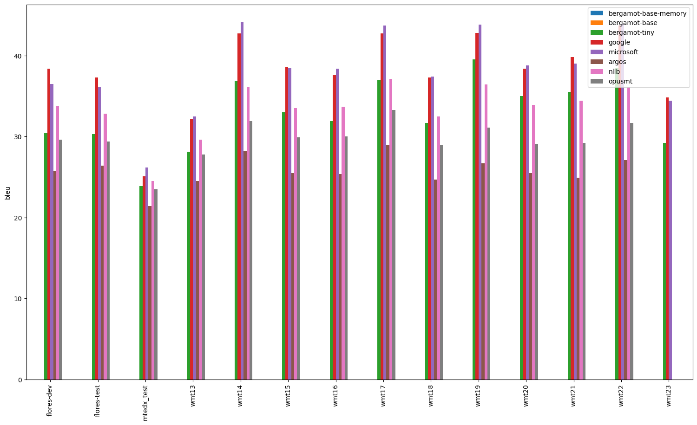
---

## mt-en

| Translator/Dataset | flores-dev | flores-test |
| --- | --- | --- |
| bergamot | 42.70 | 42.70 |
| google | 59.70 (+17.00, +39.81%) | 58.60 (+15.90, +37.24%) |
| microsoft | 57.20 (+14.50, +33.96%) | 56.30 (+13.60, +31.85%) |
| argos | N/A | N/A |
| nllb | 28.40 (-14.30, -33.49%) | 25.50 (-17.20, -40.28%) |
| opusmt | N/A | N/A |

---

## en-sr

| Translator/Dataset | flores-dev | flores-test |
| --- | --- | --- |
| bergamot | N/A | N/A |
| google | 40.10 | 39.90 |
| microsoft | 1.10 | 0.90 |
| argos | N/A | N/A |
| nllb | 25.60 | 25.60 |
| opusmt | N/A | N/A |

---

## en-nb

| Translator/Dataset | flores-test | flores-dev |
| --- | --- | --- |
| bergamot | N/A | N/A |
| google | 35.10 | 35.00 |
| microsoft | 35.20 | 34.70 |
| argos | N/A | N/A |
| nllb | 29.10 | 28.80 |
| opusmt | N/A | N/A |

---

## en-hu

| Translator/Dataset | flores-test | flores-dev | wmt09 | wmt08 |
| --- | --- | --- | --- | --- |
| bergamot | 25.10 | 25.40 | 16.40 | 14.40 |
| google | 30.10 (+5.00, +19.92%) | 30.20 (+4.80, +18.90%) | 21.00 (+4.60, +28.05%) | 17.90 (+3.50, +24.31%) |
| microsoft | 31.50 (+6.40, +25.50%) | 31.80 (+6.40, +25.20%) | 22.20 (+5.80, +35.37%) | 18.70 (+4.30, +29.86%) |
| argos | 20.80 (-4.30, -17.13%) | 21.40 (-4.00, -15.75%) | 14.80 (-1.60, -9.76%) | 12.60 (-1.80, -12.50%) |
| nllb | 19.20 (-5.90, -23.51%) | 19.00 (-6.40, -25.20%) | 14.90 (-1.50, -9.15%) | 13.30 (-1.10, -7.64%) |
| opusmt | 24.50 (-0.60, -2.39%) | 24.80 (-0.60, -2.36%) | 18.10 (+1.70, +10.37%) | 14.90 (+0.50, +3.47%) |

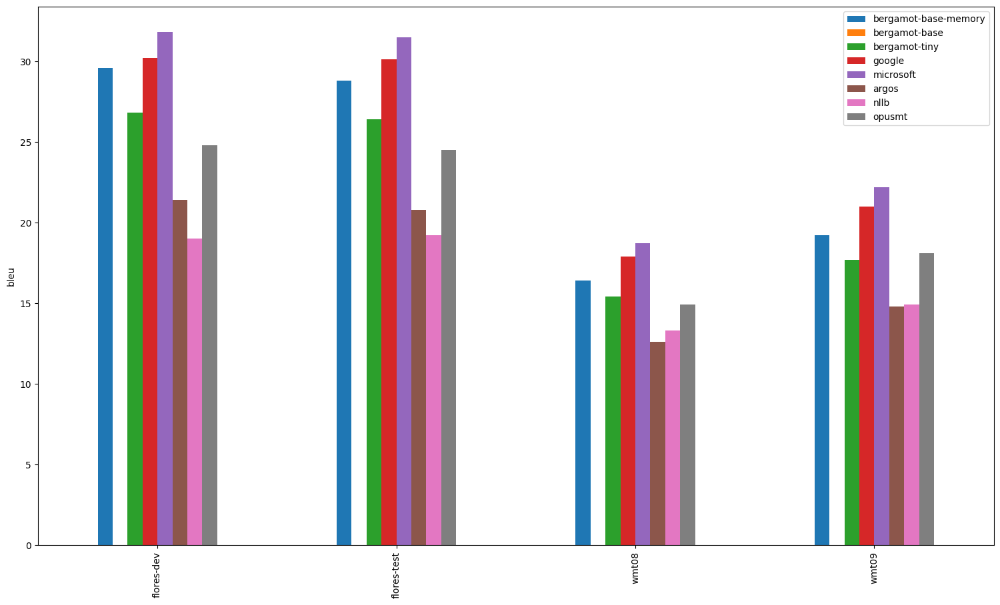
---

## en-el

| Translator/Dataset | flores-dev | flores-test |
| --- | --- | --- |
| bergamot | N/A | N/A |
| google | 29.50 | 29.60 |
| microsoft | 29.90 | 30.00 |
| argos | 26.10 | 26.40 |
| nllb | 23.40 | 23.20 |
| opusmt | 24.90 | 24.50 |

---

## el-en

| Translator/Dataset | mtedx_test | flores-dev | flores-test |
| --- | --- | --- | --- |
| bergamot | 31.50 | 34.00 | 32.10 |
| google | 32.20 (+0.70, +2.22%) | 40.20 (+6.20, +18.24%) | 39.00 (+6.90, +21.50%) |
| microsoft | 34.70 (+3.20, +10.16%) | 39.20 (+5.20, +15.29%) | 38.10 (+6.00, +18.69%) |
| argos | 31.20 (-0.30, -0.95%) | 32.90 (-1.10, -3.24%) | 31.40 (-0.70, -2.18%) |
| nllb | 29.80 (-1.70, -5.40%) | 35.10 (+1.10, +3.24%) | 33.50 (+1.40, +4.36%) |
| opusmt | N/A | N/A | N/A |

---

## fi-en

| Translator/Dataset | flores-dev | wmt17 | wmt19 | wmt15 | wmt18 | flores-test | wmt16 |
| --- | --- | --- | --- | --- | --- | --- | --- |
| bergamot | 31.70 | 33.10 | 29.50 | 26.50 | 24.10 | 30.60 | 30.60 |
| google | 37.00 (+5.30, +16.72%) | 37.70 (+4.60, +13.90%) | 32.50 (+3.00, +10.17%) | 29.90 (+3.40, +12.83%) | 25.40 (+1.30, +5.39%) | 35.60 (+5.00, +16.34%) | 34.30 (+3.70, +12.09%) |
| microsoft | 38.00 (+6.30, +19.87%) | 39.40 (+6.30, +19.03%) | 34.20 (+4.70, +15.93%) | 31.70 (+5.20, +19.62%) | 28.60 (+4.50, +18.67%) | 37.20 (+6.60, +21.57%) | 36.50 (+5.90, +19.28%) |
| argos | 25.30 (-6.40, -20.19%) | 23.90 (-9.20, -27.79%) | 21.10 (-8.40, -28.47%) | 20.10 (-6.40, -24.15%) | 18.00 (-6.10, -25.31%) | 24.60 (-6.00, -19.61%) | 22.00 (-8.60, -28.10%) |
| nllb | 15.90 (-15.80, -49.84%) | 15.50 (-17.60, -53.17%) | 12.10 (-17.40, -58.98%) | 13.00 (-13.50, -50.94%) | 11.60 (-12.50, -51.87%) | 14.60 (-16.00, -52.29%) | 15.00 (-15.60, -50.98%) |
| opusmt | 31.10 (-0.60, -1.89%) | 31.10 (-2.00, -6.04%) | 28.50 (-1.00, -3.39%) | 25.80 (-0.70, -2.64%) | 22.90 (-1.20, -4.98%) | 30.40 (-0.20, -0.65%) | 28.30 (-2.30, -7.52%) |

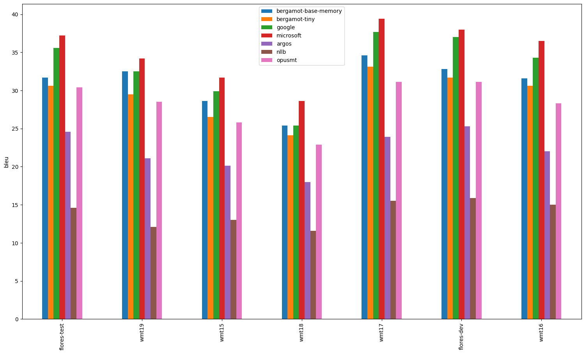
---

## en-da

| Translator/Dataset | flores-dev | flores-test |
| --- | --- | --- |
| bergamot | N/A | N/A |
| google | 49.30 | 50.10 |
| microsoft | 49.50 | 49.80 |
| argos | 37.20 | 36.40 |
| nllb | 40.50 | 40.10 |
| opusmt | 42.60 | 43.40 |

---

## en-nl

| Translator/Dataset | flores-dev | flores-test |
| --- | --- | --- |
| bergamot | 27.60 | 27.00 |
| google | 29.40 (+1.80, +6.52%) | 29.20 (+2.20, +8.15%) |
| microsoft | 29.00 (+1.40, +5.07%) | 28.60 (+1.60, +5.93%) |
| argos | 25.10 (-2.50, -9.06%) | 24.70 (-2.30, -8.52%) |
| nllb | 24.50 (-3.10, -11.23%) | 24.20 (-2.80, -10.37%) |
| opusmt | 25.60 (-2.00, -7.25%) | 25.00 (-2.00, -7.41%) |

---

## en-mt

| Translator/Dataset | flores-test | flores-dev |
| --- | --- | --- |
| bergamot | N/A | N/A |
| google | 40.90 | 40.30 |
| microsoft | 44.00 | 44.40 |
| argos | N/A | N/A |
| nllb | 28.50 | 28.70 |
| opusmt | N/A | N/A |

---

## en-sv

| Translator/Dataset | flores-test | flores-dev |
| --- | --- | --- |
| bergamot | N/A | N/A |
| google | 48.40 | 47.90 |
| microsoft | 50.10 | 49.90 |
| argos | 41.70 | 42.40 |
| nllb | 37.60 | 38.80 |
| opusmt | 43.70 | 43.80 |

---

## lv-en

| Translator/Dataset | wmt17 | flores-dev | flores-test |
| --- | --- | --- | --- |
| bergamot | N/A | N/A | N/A |
| google | 27.20 | 42.10 | 41.10 |
| microsoft | 25.80 | 36.30 | 35.90 |
| argos | N/A | N/A | N/A |
| nllb | 12.60 | 17.50 | 16.10 |
| opusmt | 22.00 | 31.20 | 30.80 |

---

## en-th

| Translator/Dataset | flores-test | flores-dev |
| --- | --- | --- |
| bergamot | N/A | N/A |
| google | 14.90 | 16.30 |
| microsoft | 14.60 | 15.50 |
| argos | N/A | N/A |
| nllb | 7.10 | 7.80 |
| opusmt | N/A | N/A |

---

## en-ru

| Translator/Dataset | wmt16 | wmt15 | wmt21 | flores-dev | wmt22 | wmt18 | wmt14 | wmt17 | wmt20 | wmt19 | wmt13 | flores-test |
| --- | --- | --- | --- | --- | --- | --- | --- | --- | --- | --- | --- | --- |
| bergamot | 30.90 | 31.40 | 25.50 | 29.90 | 26.50 | 28.50 | 38.20 | 33.60 | 22.00 | 31.40 | 26.20 | 29.20 |
| google | 35.00 (+4.10, +13.27%) | 36.90 (+5.50, +17.52%) | 30.00 (+4.50, +17.65%) | 34.90 (+5.00, +16.72%) | 35.00 (+8.50, +32.08%) | 35.00 (+6.50, +22.81%) | 45.70 (+7.50, +19.63%) | 38.90 (+5.30, +15.77%) | 27.20 (+5.20, +23.64%) | 32.90 (+1.50, +4.78%) | 28.00 (+1.80, +6.87%) | 34.40 (+5.20, +17.81%) |
| microsoft | 34.20 (+3.30, +10.68%) | 36.10 (+4.70, +14.97%) | 29.20 (+3.70, +14.51%) | 33.50 (+3.60, +12.04%) | 33.10 (+6.60, +24.91%) | 33.70 (+5.20, +18.25%) | 44.70 (+6.50, +17.02%) | 38.60 (+5.00, +14.88%) | 26.30 (+4.30, +19.55%) | 33.20 (+1.80, +5.73%) | 27.30 (+1.10, +4.20%) | 33.60 (+4.40, +15.07%) |
| argos | 28.50 (-2.40, -7.77%) | 30.40 (-1.00, -3.18%) | 23.20 (-2.30, -9.02%) | 27.90 (-2.00, -6.69%) | 27.20 (+0.70, +2.64%) | 27.00 (-1.50, -5.26%) | 36.80 (-1.40, -3.66%) | 31.90 (-1.70, -5.06%) | 22.00 (0.00, 0.00%) | 28.10 (-3.30, -10.51%) | 24.10 (-2.10, -8.02%) | 27.60 (-1.60, -5.48%) |
| nllb | 29.00 (-1.90, -6.15%) | 29.50 (-1.90, -6.05%) | 22.70 (-2.80, -10.98%) | 27.30 (-2.60, -8.70%) | 25.80 (-0.70, -2.64%) | 27.00 (-1.50, -5.26%) | 34.90 (-3.30, -8.64%) | 30.80 (-2.80, -8.33%) | 21.50 (-0.50, -2.27%) | 29.20 (-2.20, -7.01%) | 25.40 (-0.80, -3.05%) | 26.50 (-2.70, -9.25%) |
| opusmt | 26.20 (-4.70, -15.21%) | 27.00 (-4.40, -14.01%) | 22.90 (-2.60, -10.20%) | 26.50 (-3.40, -11.37%) | 24.60 (-1.90, -7.17%) | 24.80 (-3.70, -12.98%) | 32.60 (-5.60, -14.66%) | 29.10 (-4.50, -13.39%) | 20.10 (-1.90, -8.64%) | 27.20 (-4.20, -13.38%) | 23.40 (-2.80, -10.69%) | 25.50 (-3.70, -12.67%) |

---

## en-fa

| Translator/Dataset | flores-dev | flores-test |
| --- | --- | --- |
| bergamot | 17.20 | 17.40 |
| google | 27.20 (+10.00, +58.14%) | 28.40 (+11.00, +63.22%) |
| microsoft | 19.90 (+2.70, +15.70%) | 21.10 (+3.70, +21.26%) |
| argos | 20.80 (+3.60, +20.93%) | 21.80 (+4.40, +25.29%) |
| nllb | 18.40 (+1.20, +6.98%) | 19.20 (+1.80, +10.34%) |
| opusmt | N/A | N/A |

---

## bs-en

| Translator/Dataset | flores-dev | flores-test |
| --- | --- | --- |
| bergamot | N/A | N/A |
| google | 45.50 | 45.80 |
| microsoft | 42.70 | 42.60 |
| argos | N/A | N/A |
| nllb | 26.80 | 25.80 |
| opusmt | N/A | N/A |

---

## et-en

| Translator/Dataset | flores-dev | wmt18 | flores-test |
| --- | --- | --- | --- |
| bergamot | 33.50 | 30.90 | 32.70 |
| google | 38.30 (+4.80, +14.33%) | 32.10 (+1.20, +3.88%) | 37.00 (+4.30, +13.15%) |
| microsoft | 37.40 (+3.90, +11.64%) | 34.10 (+3.20, +10.36%) | 37.00 (+4.30, +13.15%) |
| argos | 33.00 (-0.50, -1.49%) | 28.90 (-2.00, -6.47%) | 32.10 (-0.60, -1.83%) |
| nllb | 12.40 (-21.10, -62.99%) | 10.30 (-20.60, -66.67%) | 11.50 (-21.20, -64.83%) |
| opusmt | 33.90 (+0.40, +1.19%) | 29.10 (-1.80, -5.83%) | 31.50 (-1.20, -3.67%) |

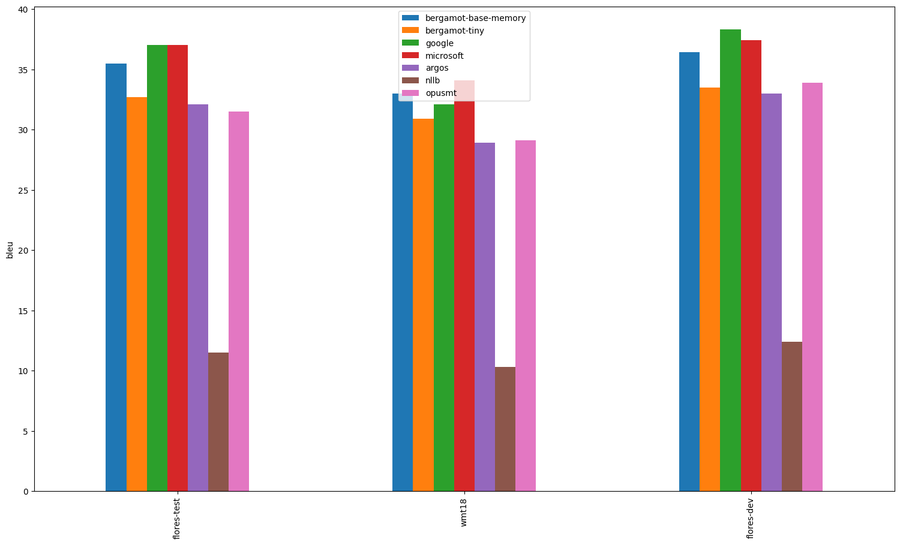
---

## nb-en

| Translator/Dataset | flores-dev | flores-test |
| --- | --- | --- |
| bergamot | 37.40 | 37.80 |
| google | 41.80 (+4.40, +11.76%) | 42.30 (+4.50, +11.90%) |
| microsoft | 42.70 (+5.30, +14.17%) | 43.10 (+5.30, +14.02%) |
| argos | 38.80 (+1.40, +3.74%) | 38.90 (+1.10, +2.91%) |
| nllb | 27.90 (-9.50, -25.40%) | 27.30 (-10.50, -27.78%) |
| opusmt | N/A | N/A |

---

## en-ca

| Translator/Dataset | flores-test | flores-dev |
| --- | --- | --- |
| bergamot | 42.50 | 41.90 |
| google | 36.00 (-6.50, -15.29%) | 35.40 (-6.50, -15.51%) |
| microsoft | 45.70 (+3.20, +7.53%) | 44.80 (+2.90, +6.92%) |
| argos | 30.50 (-12.00, -28.24%) | 30.30 (-11.60, -27.68%) |
| nllb | 35.80 (-6.70, -15.76%) | 35.10 (-6.80, -16.23%) |
| opusmt | 29.80 (-12.70, -29.88%) | 29.60 (-12.30, -29.36%) |

---

## nl-en

| Translator/Dataset | flores-dev | flores-test |
| --- | --- | --- |
| bergamot | 29.70 | 29.60 |
| google | 33.00 (+3.30, +11.11%) | 33.10 (+3.50, +11.82%) |
| microsoft | 32.40 (+2.70, +9.09%) | 32.80 (+3.20, +10.81%) |
| argos | 30.40 (+0.70, +2.36%) | 29.40 (-0.20, -0.68%) |
| nllb | 25.50 (-4.20, -14.14%) | 25.60 (-4.00, -13.51%) |
| opusmt | 30.10 (+0.40, +1.35%) | 29.20 (-0.40, -1.35%) |

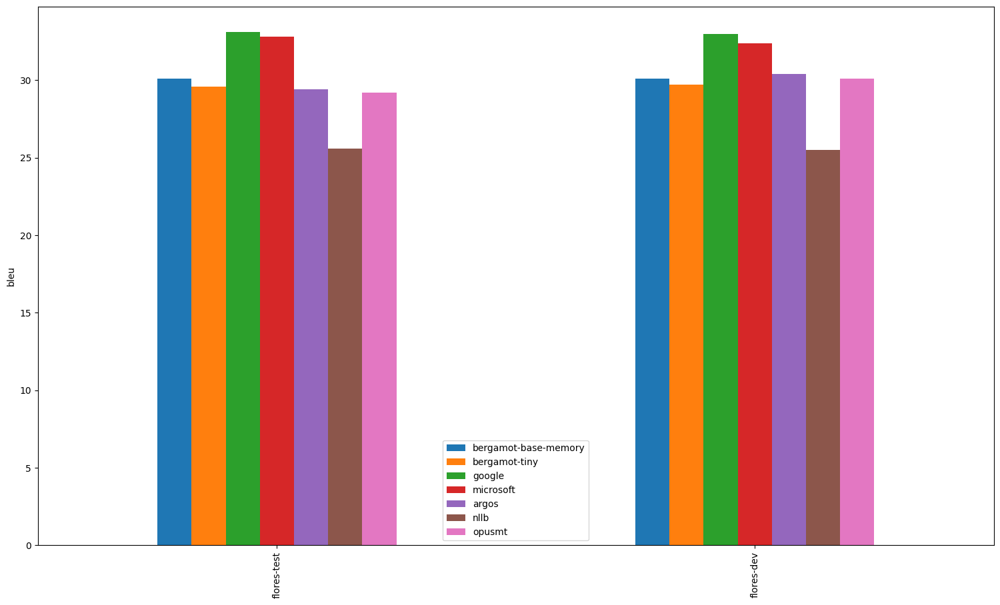
---

## en-lt

| Translator/Dataset | flores-test | wmt19 | flores-dev |
| --- | --- | --- | --- |
| bergamot | N/A | N/A | N/A |
| google | 32.00 | 22.70 | 31.00 |
| microsoft | 30.30 | 18.80 | 29.20 |
| argos | N/A | N/A | N/A |
| nllb | 18.40 | 12.60 | 17.90 |
| opusmt | N/A | N/A | N/A |

---

## en-tr

| Translator/Dataset | flores-dev | wmt16 | wmt17 | wmt18 | flores-test |
| --- | --- | --- | --- | --- | --- |
| bergamot | N/A | N/A | N/A | N/A | N/A |
| google | 28.10 | 22.80 | 26.40 | 22.90 | 27.40 |
| microsoft | 37.70 | 28.20 | 31.40 | 26.80 | 36.80 |
| argos | 19.10 | 14.80 | 14.80 | 13.50 | 18.70 |
| nllb | 21.90 | 17.20 | 18.30 | 16.10 | 21.50 |
| opusmt | N/A | N/A | N/A | N/A | N/A |

---

## bg-en

| Translator/Dataset | flores-dev | flores-test |
| --- | --- | --- |
| bergamot | 39.10 | 37.90 |
| google | 41.90 (+2.80, +7.16%) | 40.70 (+2.80, +7.39%) |
| microsoft | 42.10 (+3.00, +7.67%) | 40.30 (+2.40, +6.33%) |
| argos | 36.60 (-2.50, -6.39%) | 35.60 (-2.30, -6.07%) |
| nllb | 36.60 (-2.50, -6.39%) | 36.20 (-1.70, -4.49%) |
| opusmt | 36.40 (-2.70, -6.91%) | 36.20 (-1.70, -4.49%) |

---

## ko-en

| Translator/Dataset | flores-dev | iwslt17 | flores-test |
| --- | --- | --- | --- |
| bergamot | N/A | N/A | N/A |
| google | 34.30 | 20.30 | 33.80 |
| microsoft | 34.30 | 20.40 | 33.80 |
| argos | 15.60 | 8.10 | 15.10 |
| nllb | 26.00 | 17.40 | 25.30 |
| opusmt | 22.10 | 17.70 | 20.60 |

---

## uk-en

| Translator/Dataset | flores-dev | wmt22 | flores-test |
| --- | --- | --- | --- |
| bergamot | 35.60 | 36.60 | 35.60 |
| google | 43.10 (+7.50, +21.07%) | 41.60 (+5.00, +13.66%) | 42.60 (+7.00, +19.66%) |
| microsoft | 41.80 (+6.20, +17.42%) | 44.40 (+7.80, +21.31%) | 40.70 (+5.10, +14.33%) |
| argos | 27.90 (-7.70, -21.63%) | 22.70 (-13.90, -37.98%) | 28.20 (-7.40, -20.79%) |
| nllb | 34.00 (-1.60, -4.49%) | 31.40 (-5.20, -14.21%) | 33.60 (-2.00, -5.62%) |
| opusmt | 28.60 (-7.00, -19.66%) | 26.10 (-10.50, -28.69%) | 28.60 (-7.00, -19.66%) |

---

## en-es

| Translator/Dataset | wmt08 | wmt11 | flores-test | flores-dev | wmt12 | wmt10 | wmt09 | wmt13 |
| --- | --- | --- | --- | --- | --- | --- | --- | --- |
| bergamot | 29.00 | 37.90 | 26.20 | 25.90 | 38.90 | 36.70 | 29.90 | 34.80 |
| google | 30.00 (+1.00, +3.45%) | 39.90 (+2.00, +5.28%) | 30.40 (+4.20, +16.03%) | 30.50 (+4.60, +17.76%) | 40.50 (+1.60, +4.11%) | 38.80 (+2.10, +5.72%) | 30.90 (+1.00, +3.34%) | 36.90 (+2.10, +6.03%) |
| microsoft | 29.90 (+0.90, +3.10%) | 39.10 (+1.20, +3.17%) | 28.50 (+2.30, +8.78%) | 28.40 (+2.50, +9.65%) | 40.00 (+1.10, +2.83%) | 37.80 (+1.10, +3.00%) | 30.70 (+0.80, +2.68%) | 35.70 (+0.90, +2.59%) |
| argos | 26.90 (-2.10, -7.24%) | 35.50 (-2.40, -6.33%) | 23.30 (-2.90, -11.07%) | 23.80 (-2.10, -8.11%) | 35.20 (-3.70, -9.51%) | 34.00 (-2.70, -7.36%) | 28.80 (-1.10, -3.68%) | 31.90 (-2.90, -8.33%) |
| nllb | 28.50 (-0.50, -1.72%) | 37.30 (-0.60, -1.58%) | 26.40 (+0.20, +0.76%) | 26.20 (+0.30, +1.16%) | 37.80 (-1.10, -2.83%) | 35.80 (-0.90, -2.45%) | 29.80 (-0.10, -0.33%) | 34.50 (-0.30, -0.86%) |
| opusmt | 29.20 (+0.20, +0.69%) | 38.20 (+0.30, +0.79%) | 26.70 (+0.50, +1.91%) | 26.60 (+0.70, +2.70%) | 38.90 (0.00, 0.00%) | 36.90 (+0.20, +0.54%) | 30.30 (+0.40, +1.34%) | 35.00 (+0.20, +0.57%) |

---

## fa-en

| Translator/Dataset | flores-dev | flores-test |
| --- | --- | --- |
| bergamot | 29.10 | 28.30 |
| google | 42.00 (+12.90, +44.33%) | 39.70 (+11.40, +40.28%) |
| microsoft | 36.50 (+7.40, +25.43%) | 35.80 (+7.50, +26.50%) |
| argos | 28.40 (-0.70, -2.41%) | 27.40 (-0.90, -3.18%) |
| nllb | 30.10 (+1.00, +3.44%) | 29.40 (+1.10, +3.89%) |
| opusmt | N/A | N/A |

---

## ca-en

| Translator/Dataset | flores-dev | flores-test |
| --- | --- | --- |
| bergamot | 38.70 | 37.30 |
| google | 49.60 (+10.90, +28.17%) | 48.30 (+11.00, +29.49%) |
| microsoft | 46.80 (+8.10, +20.93%) | 46.20 (+8.90, +23.86%) |
| argos | 42.80 (+4.10, +10.59%) | 41.80 (+4.50, +12.06%) |
| nllb | 37.90 (-0.80, -2.07%) | 36.90 (-0.40, -1.07%) |
| opusmt | 29.90 (-8.80, -22.74%) | 29.60 (-7.70, -20.64%) |

---

## en-uk

| Translator/Dataset | flores-dev | flores-test | wmt22 |
| --- | --- | --- | --- |
| bergamot | 27.90 | 28.20 | 22.80 |
| google | 32.80 (+4.90, +17.56%) | 33.10 (+4.90, +17.38%) | 32.00 (+9.20, +40.35%) |
| microsoft | 32.20 (+4.30, +15.41%) | 33.50 (+5.30, +18.79%) | 30.40 (+7.60, +33.33%) |
| argos | 16.40 (-11.50, -41.22%) | 15.80 (-12.40, -43.97%) | 15.00 (-7.80, -34.21%) |
| nllb | 22.90 (-5.00, -17.92%) | 22.50 (-5.70, -20.21%) | 20.50 (-2.30, -10.09%) |
| opusmt | 19.70 (-8.20, -29.39%) | 20.00 (-8.20, -29.08%) | 16.70 (-6.10, -26.75%) |

---

## en-vi

| Translator/Dataset | flores-test | flores-dev |
| --- | --- | --- |
| bergamot | N/A | N/A |
| google | 45.70 | 45.40 |
| microsoft | 45.00 | 44.90 |
| argos | N/A | N/A |
| nllb | 37.50 | 36.80 |
| opusmt | 26.70 | 26.00 |

---

## is-en

| Translator/Dataset | flores-dev | flores-test | wmt21 |
| --- | --- | --- | --- |
| bergamot | 23.60 | 23.40 | 23.20 |
| google | 39.40 (+15.80, +66.95%) | 38.60 (+15.20, +64.96%) | 38.70 (+15.50, +66.81%) |
| microsoft | 37.30 (+13.70, +58.05%) | 36.70 (+13.30, +56.84%) | 40.50 (+17.30, +74.57%) |
| argos | N/A | N/A | N/A |
| nllb | 18.40 (-5.20, -22.03%) | 16.60 (-6.80, -29.06%) | 17.90 (-5.30, -22.84%) |
| opusmt | 26.40 (+2.80, +11.86%) | 25.60 (+2.20, +9.40%) | 24.10 (+0.90, +3.88%) |

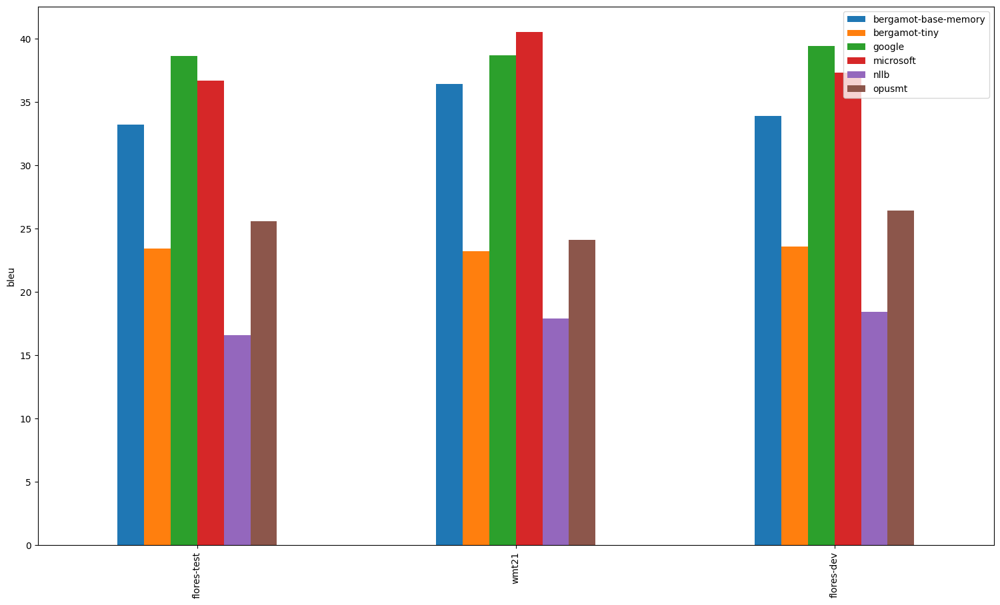
---

## en-bg

| Translator/Dataset | flores-dev | flores-test |
| --- | --- | --- |
| bergamot | 42.00 | 42.20 |
| google | 44.10 (+2.10, +5.00%) | 45.10 (+2.90, +6.87%) |
| microsoft | 38.00 (-4.00, -9.52%) | 39.10 (-3.10, -7.35%) |
| argos | 39.50 (-2.50, -5.95%) | 39.40 (-2.80, -6.64%) |
| nllb | 34.20 (-7.80, -18.57%) | 33.90 (-8.30, -19.67%) |
| opusmt | 32.50 (-9.50, -22.62%) | 32.50 (-9.70, -22.99%) |

---

## en-lv

| Translator/Dataset | flores-dev | wmt17 | flores-test |
| --- | --- | --- | --- |
| bergamot | N/A | N/A | N/A |
| google | 37.40 | 26.40 | 37.50 |
| microsoft | 37.90 | 25.20 | 36.50 |
| argos | N/A | N/A | N/A |
| nllb | 16.10 | 11.70 | 15.10 |
| opusmt | N/A | N/A | N/A |

---

## gl-en

| Translator/Dataset | flores-dev | flores-test |
| --- | --- | --- |
| bergamot | N/A | N/A |
| google | 43.40 | 43.60 |
| microsoft | 40.40 | 40.00 |
| argos | N/A | N/A |
| nllb | 35.60 | 34.40 |
| opusmt | 21.90 | 20.90 |

---

## zh-en

| Translator/Dataset | wmt20 | flores-dev | wmt17 | wmt19 | iwslt17 | wmt18 | wmt21 | wmt22 | flores-test |
| --- | --- | --- | --- | --- | --- | --- | --- | --- | --- |
| bergamot | N/A | N/A | N/A | N/A | N/A | N/A | N/A | N/A | N/A |
| google | 36.80 | 33.00 | 30.60 | 39.00 | 24.80 | 33.40 | 31.80 | 28.50 | 32.70 |
| microsoft | 38.10 | 32.50 | 29.40 | 37.00 | 26.90 | 31.50 | 32.30 | 29.00 | 32.10 |
| argos | 21.30 | 23.40 | 19.20 | 21.00 | 22.90 | 19.40 | 17.30 | 15.90 | 23.30 |
| nllb | 22.40 | 24.70 | 21.00 | 21.10 | 21.40 | 21.00 | 18.20 | 17.00 | 24.00 |
| opusmt | 22.20 | 23.00 | 19.20 | 21.30 | 23.10 | 20.20 | 18.30 | 16.80 | 23.50 |

---

## en-hi

| Translator/Dataset | wmt14 | flores-dev | flores-test |
| --- | --- | --- | --- |
| bergamot | N/A | N/A | N/A |
| google | 27.20 | 36.80 | 36.30 |
| microsoft | 25.90 | 38.20 | 37.10 |
| argos | 19.10 | 28.70 | 28.60 |
| nllb | 22.00 | 29.80 | 29.30 |
| opusmt | 9.90 | 13.90 | 13.50 |

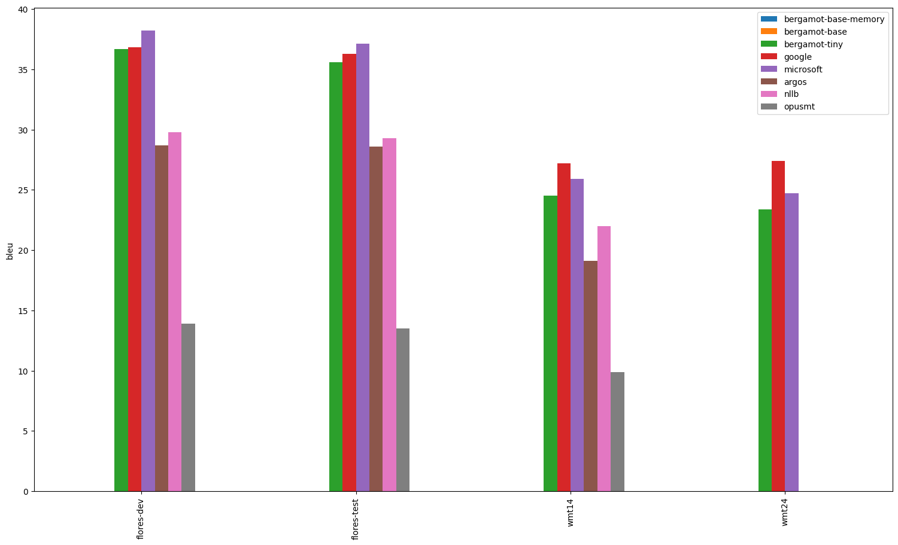
---

## en-bs

| Translator/Dataset | flores-dev | flores-test |
| --- | --- | --- |
| bergamot | N/A | N/A |
| google | 36.30 | 36.60 |
| microsoft | 32.10 | 33.20 |
| argos | N/A | N/A |
| nllb | 24.20 | 24.80 |
| opusmt | N/A | N/A |

---

## en-cs

| Translator/Dataset | wmt09 | wmt12 | wmt20 | wmt19 | flores-dev | wmt21 | wmt08 | wmt14 | wmt17 | wmt15 | wmt22 | wmt11 | wmt13 | wmt10 | wmt18 | wmt16 | flores-test |
| --- | --- | --- | --- | --- | --- | --- | --- | --- | --- | --- | --- | --- | --- | --- | --- | --- | --- |
| bergamot | 21.90 | 20.40 | 32.80 | 24.80 | 30.70 | 18.60 | 19.70 | 28.40 | 23.10 | 24.30 | 33.60 | 23.30 | 25.40 | 22.10 | 22.30 | 27.80 | 31.80 |
| google | 22.60 (+0.70, +3.20%) | 20.70 (+0.30, +1.47%) | 35.50 (+2.70, +8.23%) | 27.20 (+2.40, +9.68%) | 34.10 (+3.40, +11.07%) | 21.80 (+3.20, +17.20%) | 20.50 (+0.80, +4.06%) | 31.20 (+2.80, +9.86%) | 24.70 (+1.60, +6.93%) | 26.80 (+2.50, +10.29%) | 48.40 (+14.80, +44.05%) | 23.00 (-0.30, -1.29%) | 25.20 (-0.20, -0.79%) | 22.40 (+0.30, +1.36%) | 24.40 (+2.10, +9.42%) | 28.30 (+0.50, +1.80%) | 34.40 (+2.60, +8.18%) |
| microsoft | 25.00 (+3.10, +14.16%) | 22.90 (+2.50, +12.25%) | 34.10 (+1.30, +3.96%) | 27.20 (+2.40, +9.68%) | 33.50 (+2.80, +9.12%) | 22.00 (+3.40, +18.28%) | 22.60 (+2.90, +14.72%) | 31.90 (+3.50, +12.32%) | 25.60 (+2.50, +10.82%) | 27.40 (+3.10, +12.76%) | 42.10 (+8.50, +25.30%) | 25.30 (+2.00, +8.58%) | 27.70 (+2.30, +9.06%) | 24.30 (+2.20, +9.95%) | 24.90 (+2.60, +11.66%) | 29.90 (+2.10, +7.55%) | 34.00 (+2.20, +6.92%) |
| argos | 14.30 (-7.60, -34.70%) | 13.70 (-6.70, -32.84%) | 16.50 (-16.30, -49.70%) | 13.70 (-11.10, -44.76%) | 19.90 (-10.80, -35.18%) | 9.90 (-8.70, -46.77%) | 12.70 (-7.00, -35.53%) | 17.10 (-11.30, -39.79%) | 14.00 (-9.10, -39.39%) | 14.40 (-9.90, -40.74%) | 22.90 (-10.70, -31.85%) | 15.80 (-7.50, -32.19%) | 16.00 (-9.40, -37.01%) | 14.70 (-7.40, -33.48%) | 13.30 (-9.00, -40.36%) | 18.00 (-9.80, -35.25%) | 19.10 (-12.70, -39.94%) |
| nllb | 19.50 (-2.40, -10.96%) | 18.60 (-1.80, -8.82%) | 23.80 (-9.00, -27.44%) | 20.60 (-4.20, -16.94%) | 25.20 (-5.50, -17.92%) | 15.40 (-3.20, -17.20%) | 17.90 (-1.80, -9.14%) | 23.50 (-4.90, -17.25%) | 19.80 (-3.30, -14.29%) | 20.50 (-3.80, -15.64%) | 28.40 (-5.20, -15.48%) | 20.50 (-2.80, -12.02%) | 22.00 (-3.40, -13.39%) | 19.80 (-2.30, -10.41%) | 18.50 (-3.80, -17.04%) | 22.50 (-5.30, -19.06%) | 25.60 (-6.20, -19.50%) |
| opusmt | 21.60 (-0.30, -1.37%) | 20.40 (0.00, 0.00%) | 27.50 (-5.30, -16.16%) | 22.60 (-2.20, -8.87%) | 28.90 (-1.80, -5.86%) | 17.00 (-1.60, -8.60%) | 19.50 (-0.20, -1.02%) | 27.30 (-1.10, -3.87%) | 21.90 (-1.20, -5.19%) | 23.70 (-0.60, -2.47%) | 30.90 (-2.70, -8.04%) | 22.70 (-0.60, -2.58%) | 24.50 (-0.90, -3.54%) | 21.80 (-0.30, -1.36%) | 21.60 (-0.70, -3.14%) | 26.50 (-1.30, -4.68%) | 29.40 (-2.40, -7.55%) |

---

## hr-en

| Translator/Dataset | flores-dev | flores-test |
| --- | --- | --- |
| bergamot | N/A | N/A |
| google | 41.10 | 40.10 |
| microsoft | 39.00 | 38.00 |
| argos | N/A | N/A |
| nllb | 24.40 | 23.10 |
| opusmt | N/A | N/A |

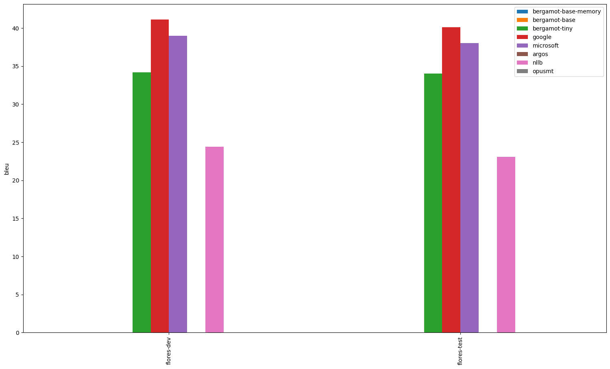
---

## en-ro

| Translator/Dataset | wmt16 | flores-test | flores-dev |
| --- | --- | --- | --- |
| bergamot | N/A | N/A | N/A |
| google | 35.40 | 43.30 | 43.10 |
| microsoft | 37.70 | 44.40 | 44.10 |
| argos | N/A | N/A | N/A |
| nllb | 29.10 | 33.40 | 34.20 |
| opusmt | 27.60 | 32.90 | 33.60 |

---

## sr-en

| Translator/Dataset | flores-dev | flores-test |
| --- | --- | --- |
| bergamot | N/A | N/A |
| google | 48.10 | 47.00 |
| microsoft | 1.70 | 1.50 |
| argos | N/A | N/A |
| nllb | 34.20 | 33.00 |
| opusmt | N/A | N/A |

---

## sv-en

| Translator/Dataset | flores-dev | flores-test |
| --- | --- | --- |
| bergamot | N/A | N/A |
| google | 50.80 | 50.20 |
| microsoft | 52.80 | 51.00 |
| argos | 45.10 | 43.60 |
| nllb | 32.20 | 30.70 |
| opusmt | 46.80 | 45.40 |

---

## en-ko

| Translator/Dataset | iwslt17 | flores-dev | flores-test |
| --- | --- | --- | --- |
| bergamot | N/A | N/A | N/A |
| google | 20.30 | 33.70 | 33.60 |
| microsoft | 20.40 | 34.90 | 34.30 |
| argos | 10.00 | 16.50 | 15.80 |
| nllb | 15.80 | 25.90 | 25.40 |
| opusmt | N/A | N/A | N/A |

---

## hi-en

| Translator/Dataset | flores-dev | wmt14 | flores-test |
| --- | --- | --- | --- |
| bergamot | N/A | N/A | N/A |
| google | 45.80 | 35.40 | 45.20 |
| microsoft | 43.90 | 34.70 | 43.10 |
| argos | 28.70 | 20.50 | 27.90 |
| nllb | 38.50 | 30.10 | 37.70 |
| opusmt | 20.10 | 13.40 | 18.70 |

---

## en-is

| Translator/Dataset | flores-dev | flores-test | wmt21 |
| --- | --- | --- | --- |
| bergamot | N/A | N/A | N/A |
| google | 31.90 | 31.40 | 28.80 |
| microsoft | 32.10 | 31.00 | 29.40 |
| argos | N/A | N/A | N/A |
| nllb | 19.10 | 17.50 | 17.90 |
| opusmt | 18.70 | 18.30 | 15.00 |

---

## id-en

| Translator/Dataset | flores-dev | flores-test |
| --- | --- | --- |
| bergamot | N/A | N/A |
| google | 47.50 | 48.00 |
| microsoft | 47.00 | 47.00 |
| argos | 29.50 | 28.50 |
| nllb | 39.20 | 38.70 |
| opusmt | 35.10 | 33.40 |

---

## de-en

| Translator/Dataset | wmt20 | wmt08 | wmt10 | flores-dev | wmt12 | wmt17 | wmt14 | wmt11 | wmt19 | wmt15 | iwslt17 | wmt18 | wmt21 | wmt09 | wmt22 | flores-test | wmt16 | wmt13 |
| --- | --- | --- | --- | --- | --- | --- | --- | --- | --- | --- | --- | --- | --- | --- | --- | --- | --- | --- |
| bergamot | 38.80 | 26.00 | 29.00 | 39.60 | 27.60 | 35.00 | 33.50 | 26.30 | 39.00 | 33.50 | 28.60 | 43.30 | 31.50 | 26.40 | 29.20 | 39.10 | 39.60 | 30.80 |
| google | 41.80 (+3.00, +7.73%) | 27.60 (+1.60, +6.15%) | 32.10 (+3.10, +10.69%) | 43.10 (+3.50, +8.84%) | 29.50 (+1.90, +6.88%) | 38.70 (+3.70, +10.57%) | 37.40 (+3.90, +11.64%) | 27.30 (+1.00, +3.80%) | 41.10 (+2.10, +5.38%) | 36.10 (+2.60, +7.76%) | 30.10 (+1.50, +5.24%) | 46.20 (+2.90, +6.70%) | 32.70 (+1.20, +3.81%) | 27.20 (+0.80, +3.03%) | 33.30 (+4.10, +14.04%) | 42.80 (+3.70, +9.46%) | 42.30 (+2.70, +6.82%) | 32.40 (+1.60, +5.19%) |
| microsoft | 43.60 (+4.80, +12.37%) | 29.40 (+3.40, +13.08%) | 33.40 (+4.40, +15.17%) | 44.90 (+5.30, +13.38%) | 31.30 (+3.70, +13.41%) | 40.80 (+5.80, +16.57%) | 39.20 (+5.70, +17.01%) | 29.20 (+2.90, +11.03%) | 43.80 (+4.80, +12.31%) | 38.10 (+4.60, +13.73%) | 32.50 (+3.90, +13.64%) | 49.60 (+6.30, +14.55%) | 34.30 (+2.80, +8.89%) | 29.10 (+2.70, +10.23%) | 33.50 (+4.30, +14.73%) | 45.80 (+6.70, +17.14%) | 46.30 (+6.70, +16.92%) | 34.30 (+3.50, +11.36%) |
| argos | 35.80 (-3.00, -7.73%) | 24.80 (-1.20, -4.62%) | 27.70 (-1.30, -4.48%) | 37.00 (-2.60, -6.57%) | 26.70 (-0.90, -3.26%) | 31.90 (-3.10, -8.86%) | 30.00 (-3.50, -10.45%) | 25.50 (-0.80, -3.04%) | 35.80 (-3.20, -8.21%) | 30.80 (-2.70, -8.06%) | 27.00 (-1.60, -5.59%) | 39.30 (-4.00, -9.24%) | 29.60 (-1.90, -6.03%) | 24.80 (-1.60, -6.06%) | 28.90 (-0.30, -1.03%) | 36.20 (-2.90, -7.42%) | 36.40 (-3.20, -8.08%) | 29.30 (-1.50, -4.87%) |
| nllb | 25.20 (-13.60, -35.05%) | 21.30 (-4.70, -18.08%) | 24.00 (-5.00, -17.24%) | 32.10 (-7.50, -18.94%) | 22.30 (-5.30, -19.20%) | 26.90 (-8.10, -23.14%) | 25.30 (-8.20, -24.48%) | 20.20 (-6.10, -23.19%) | 26.30 (-12.70, -32.56%) | 27.20 (-6.30, -18.81%) | 23.00 (-5.60, -19.58%) | 32.40 (-10.90, -25.17%) | 21.50 (-10.00, -31.75%) | 21.40 (-5.00, -18.94%) | 21.40 (-7.80, -26.71%) | 31.20 (-7.90, -20.20%) | 30.50 (-9.10, -22.98%) | 24.80 (-6.00, -19.48%) |
| opusmt | 39.60 (+0.80, +2.06%) | 27.00 (+1.00, +3.85%) | 30.00 (+1.00, +3.45%) | 41.20 (+1.60, +4.04%) | 29.00 (+1.40, +5.07%) | 35.60 (+0.60, +1.71%) | 34.00 (+0.50, +1.49%) | 27.30 (+1.00, +3.80%) | 39.30 (+0.30, +0.77%) | 34.00 (+0.50, +1.49%) | 30.40 (+1.80, +6.29%) | 43.60 (+0.30, +0.69%) | 32.20 (+0.70, +2.22%) | 27.10 (+0.70, +2.65%) | 30.50 (+1.30, +4.45%) | 40.60 (+1.50, +3.84%) | 40.20 (+0.60, +1.52%) | 32.00 (+1.20, +3.90%) |

---

## da-en

| Translator/Dataset | flores-dev | flores-test |
| --- | --- | --- |
| bergamot | N/A | N/A |
| google | 50.60 | 50.20 |
| microsoft | 51.20 | 50.90 |
| argos | 38.60 | 37.80 |
| nllb | 32.50 | 31.90 |
| opusmt | 45.10 | 45.10 |

---

## it-en

| Translator/Dataset | mtedx_test | flores-dev | wmt09 | flores-test |
| --- | --- | --- | --- | --- |
| bergamot | 35.70 | 30.90 | 33.40 | 30.40 |
| google | 35.90 (+0.20, +0.56%) | 33.40 (+2.50, +8.09%) | 35.40 (+2.00, +5.99%) | 33.30 (+2.90, +9.54%) |
| microsoft | 36.40 (+0.70, +1.96%) | 33.30 (+2.40, +7.77%) | 35.80 (+2.40, +7.19%) | 32.70 (+2.30, +7.57%) |
| argos | 34.90 (-0.80, -2.24%) | 28.80 (-2.10, -6.80%) | 32.00 (-1.40, -4.19%) | 28.60 (-1.80, -5.92%) |
| nllb | 31.40 (-4.30, -12.04%) | 29.20 (-1.70, -5.50%) | 31.20 (-2.20, -6.59%) | 28.80 (-1.60, -5.26%) |
| opusmt | 35.70 (0.00, 0.00%) | 30.20 (-0.70, -2.27%) | 33.70 (+0.30, +0.90%) | 29.40 (-1.00, -3.29%) |

---

## pl-en

| Translator/Dataset | wmt20 | flores-dev | flores-test |
| --- | --- | --- | --- |
| bergamot | 31.00 | 26.80 | 25.80 |
| google | 34.10 (+3.10, +10.00%) | 30.00 (+3.20, +11.94%) | 29.60 (+3.80, +14.73%) |
| microsoft | 35.50 (+4.50, +14.52%) | 30.10 (+3.30, +12.31%) | 29.90 (+4.10, +15.89%) |
| argos | 30.10 (-0.90, -2.90%) | 26.80 (0.00, 0.00%) | 26.10 (+0.30, +1.16%) |
| nllb | 23.30 (-7.70, -24.84%) | 22.80 (-4.00, -14.93%) | 22.40 (-3.40, -13.18%) |
| opusmt | 29.20 (-1.80, -5.81%) | 25.90 (-0.90, -3.36%) | 25.30 (-0.50, -1.94%) |

---

## sl-en

| Translator/Dataset | flores-dev | flores-test |
| --- | --- | --- |
| bergamot | 29.40 | 28.80 |
| google | 39.40 (+10.00, +34.01%) | 38.10 (+9.30, +32.29%) |
| microsoft | 35.10 (+5.70, +19.39%) | 34.20 (+5.40, +18.75%) |
| argos | N/A | N/A |
| nllb | 17.90 (-11.50, -39.12%) | 16.90 (-11.90, -41.32%) |
| opusmt | N/A | N/A |

---

## en-fr

| Translator/Dataset | wmt10 | iwslt17 | flores-dev | wmt13 | wmt09 | wmt11 | flores-test | wmt08 | wmt12 | wmt14 | wmt15 |
| --- | --- | --- | --- | --- | --- | --- | --- | --- | --- | --- | --- |
| bergamot | 31.00 | 38.60 | 48.50 | 33.40 | 28.80 | 33.60 | 48.70 | 25.50 | 31.40 | 39.70 | 36.90 |
| google | 26.60 (-4.40, -14.19%) | 28.00 (-10.60, -27.46%) | 41.30 (-7.20, -14.85%) | 26.50 (-6.90, -20.66%) | 23.50 (-5.30, -18.40%) | 27.50 (-6.10, -18.15%) | 41.80 (-6.90, -14.17%) | 20.70 (-4.80, -18.82%) | 25.10 (-6.30, -20.06%) | 32.60 (-7.10, -17.88%) | 30.60 (-6.30, -17.07%) |
| microsoft | 33.00 (+2.00, +6.45%) | 36.50 (-2.10, -5.44%) | 52.50 (+4.00, +8.25%) | 31.50 (-1.90, -5.69%) | 28.20 (-0.60, -2.08%) | 32.10 (-1.50, -4.46%) | 52.70 (+4.00, +8.21%) | 25.10 (-0.40, -1.57%) | 29.60 (-1.80, -5.73%) | 40.40 (+0.70, +1.76%) | 39.70 (+2.80, +7.59%) |
| argos | 29.20 (-1.80, -5.81%) | 36.90 (-1.70, -4.40%) | 42.70 (-5.80, -11.96%) | 30.60 (-2.80, -8.38%) | 27.40 (-1.40, -4.86%) | 32.00 (-1.60, -4.76%) | 42.70 (-6.00, -12.32%) | 25.10 (-0.40, -1.57%) | 29.70 (-1.70, -5.41%) | 35.60 (-4.10, -10.33%) | 35.90 (-1.00, -2.71%) |
| nllb | 31.90 (+0.90, +2.90%) | 37.30 (-1.30, -3.37%) | 46.00 (-2.50, -5.15%) | 33.80 (+0.40, +1.20%) | 29.70 (+0.90, +3.12%) | 34.20 (+0.60, +1.79%) | 46.30 (-2.40, -4.93%) | 26.50 (+1.00, +3.92%) | 32.20 (+0.80, +2.55%) | 39.30 (-0.40, -1.01%) | 36.70 (-0.20, -0.54%) |
| opusmt | 31.70 (+0.70, +2.26%) | 38.60 (0.00, 0.00%) | 47.70 (-0.80, -1.65%) | 33.20 (-0.20, -0.60%) | 29.50 (+0.70, +2.43%) | 34.30 (+0.70, +2.08%) | 47.80 (-0.90, -1.85%) | 26.60 (+1.10, +4.31%) | 31.70 (+0.30, +0.96%) | 39.90 (+0.20, +0.50%) | 38.40 (+1.50, +4.07%) |

---

## en-pl

| Translator/Dataset | wmt20 | flores-dev | flores-test |
| --- | --- | --- | --- |
| bergamot | 25.10 | 20.70 | 21.00 |
| google | 27.90 (+2.80, +11.16%) | 24.20 (+3.50, +16.91%) | 24.40 (+3.40, +16.19%) |
| microsoft | 27.70 (+2.60, +10.36%) | 23.00 (+2.30, +11.11%) | 23.80 (+2.80, +13.33%) |
| argos | 21.50 (-3.60, -14.34%) | 18.60 (-2.10, -10.14%) | 18.90 (-2.10, -10.00%) |
| nllb | 20.70 (-4.40, -17.53%) | 17.00 (-3.70, -17.87%) | 17.30 (-3.70, -17.62%) |
| opusmt | N/A | N/A | N/A |

---

## en-id

| Translator/Dataset | flores-dev | flores-test |
| --- | --- | --- |
| bergamot | N/A | N/A |
| google | 49.00 | 49.50 |
| microsoft | 49.40 | 50.90 |
| argos | 34.00 | 34.90 |
| nllb | 40.90 | 42.10 |
| opusmt | 37.20 | 38.50 |

---

## pt-en

| Translator/Dataset | mtedx_test | flores-dev | flores-test |
| --- | --- | --- | --- |
| bergamot | 40.20 | 47.80 | 46.60 |
| google | 39.10 (-1.10, -2.74%) | 50.40 (+2.60, +5.44%) | 50.30 (+3.70, +7.94%) |
| microsoft | 41.00 (+0.80, +1.99%) | 49.80 (+2.00, +4.18%) | 48.60 (+2.00, +4.29%) |
| argos | 38.90 (-1.30, -3.23%) | 45.40 (-2.40, -5.02%) | 44.00 (-2.60, -5.58%) |
| nllb | 34.70 (-5.50, -13.68%) | 43.10 (-4.70, -9.83%) | 42.20 (-4.40, -9.44%) |
| opusmt | N/A | N/A | N/A |

---

## en-sk

| Translator/Dataset | flores-test | flores-dev |
| --- | --- | --- |
| bergamot | N/A | N/A |
| google | 40.40 | 39.80 |
| microsoft | 39.60 | 38.80 |
| argos | 20.30 | 20.40 |
| nllb | 26.20 | 25.80 |
| opusmt | 30.40 | 30.30 |

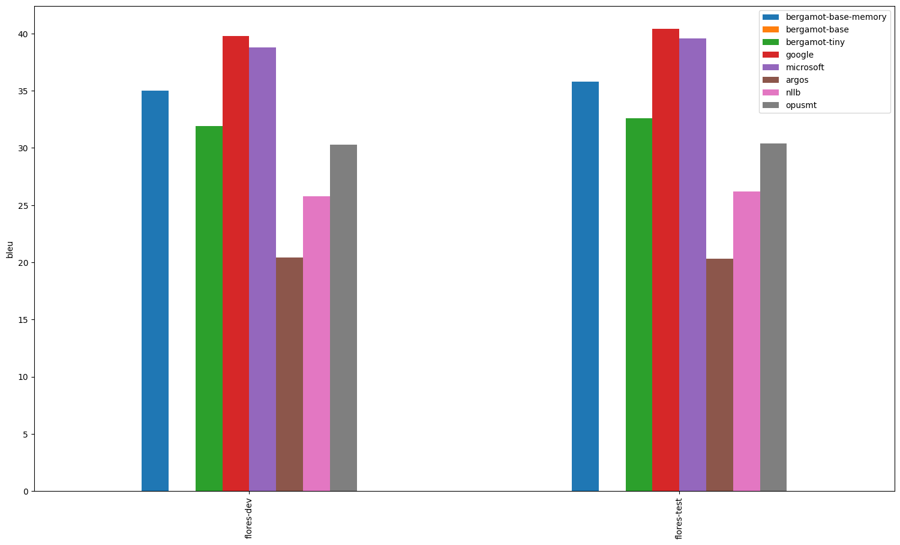
---

## es-en

| Translator/Dataset | wmt08 | mtedx_test | wmt10 | flores-dev | wmt12 | wmt11 | wmt09 | flores-test | wmt13 |
| --- | --- | --- | --- | --- | --- | --- | --- | --- | --- |
| bergamot | 27.30 | 36.80 | 35.80 | 27.50 | 38.30 | 34.30 | 29.40 | 26.80 | 35.20 |
| google | 28.30 (+1.00, +3.66%) | 35.40 (-1.40, -3.80%) | 37.00 (+1.20, +3.35%) | 30.50 (+3.00, +10.91%) | 38.80 (+0.50, +1.31%) | 35.20 (+0.90, +2.62%) | 31.60 (+2.20, +7.48%) | 30.30 (+3.50, +13.06%) | 35.70 (+0.50, +1.42%) |
| microsoft | 26.80 (-0.50, -1.83%) | 37.60 (+0.80, +2.17%) | 35.40 (-0.40, -1.12%) | 30.30 (+2.80, +10.18%) | 37.80 (-0.50, -1.31%) | 33.70 (-0.60, -1.75%) | 29.60 (+0.20, +0.68%) | 29.90 (+3.10, +11.57%) | 35.30 (+0.10, +0.28%) |
| argos | 26.10 (-1.20, -4.40%) | 35.40 (-1.40, -3.80%) | 33.50 (-2.30, -6.42%) | 25.30 (-2.20, -8.00%) | 36.10 (-2.20, -5.74%) | 33.00 (-1.30, -3.79%) | 29.00 (-0.40, -1.36%) | 25.10 (-1.70, -6.34%) | 32.80 (-2.40, -6.82%) |
| nllb | 27.40 (+0.10, +0.37%) | 34.00 (-2.80, -7.61%) | 35.50 (-0.30, -0.84%) | 29.20 (+1.70, +6.18%) | 35.70 (-2.60, -6.79%) | 32.10 (-2.20, -6.41%) | 30.00 (+0.60, +2.04%) | 28.90 (+2.10, +7.84%) | 34.40 (-0.80, -2.27%) |
| opusmt | 27.50 (+0.20, +0.73%) | 36.50 (-0.30, -0.82%) | 36.00 (+0.20, +0.56%) | 28.00 (+0.50, +1.82%) | 37.80 (-0.50, -1.31%) | 34.20 (-0.10, -0.29%) | 30.40 (+1.00, +3.40%) | 27.60 (+0.80, +2.99%) | 35.20 (0.00, 0.00%) |

---

## en-sl

| Translator/Dataset | flores-test | flores-dev |
| --- | --- | --- |
| bergamot | N/A | N/A |
| google | 35.40 | 35.40 |
| microsoft | 33.70 | 33.50 |
| argos | N/A | N/A |
| nllb | 22.60 | 23.90 |
| opusmt | N/A | N/A |

---

## ja-en

| Translator/Dataset | wmt20 | flores-dev | iwslt17 | wmt21 | wmt22 | flores-test |
| --- | --- | --- | --- | --- | --- | --- |
| bergamot | N/A | N/A | N/A | N/A | N/A | N/A |
| google | 31.20 | 31.70 | 17.50 | 34.20 | 22.70 | 31.20 |
| microsoft | 25.60 | 31.40 | 18.80 | 26.00 | 25.40 | 30.70 |
| argos | 11.80 | 16.40 | 7.20 | 11.50 | 11.40 | 16.30 |
| nllb | 13.30 | 23.80 | 14.70 | 12.70 | 13.30 | 23.00 |
| opusmt | 9.30 | 19.40 | 11.20 | 9.00 | 9.50 | 19.20 |

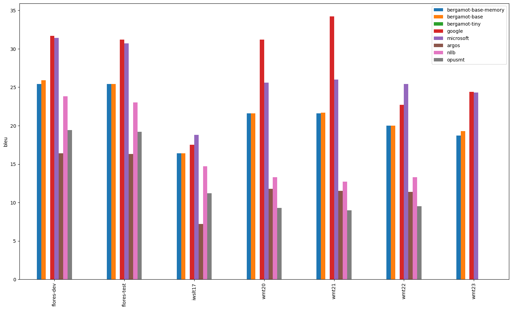
---

## lt-en

| Translator/Dataset | wmt19 | flores-dev | flores-test |
| --- | --- | --- | --- |
| bergamot | 32.70 | 29.30 | 29.60 |
| google | 35.40 (+2.70, +8.26%) | 37.70 (+8.40, +28.67%) | 37.30 (+7.70, +26.01%) |
| microsoft | 33.90 (+1.20, +3.67%) | 31.20 (+1.90, +6.48%) | 32.40 (+2.80, +9.46%) |
| argos | N/A | N/A | N/A |
| nllb | 17.60 (-15.10, -46.18%) | 16.70 (-12.60, -43.00%) | 16.60 (-13.00, -43.92%) |
| opusmt | N/A | N/A | N/A |

---

## en-de

| Translator/Dataset | wmt13 | wmt19 | flores-test | wmt09 | wmt18 | wmt12 | wmt11 | wmt22 | iwslt17 | wmt20 | wmt08 | wmt15 | wmt17 | wmt16 | wmt10 | wmt21 | flores-dev | wmt14 |
| --- | --- | --- | --- | --- | --- | --- | --- | --- | --- | --- | --- | --- | --- | --- | --- | --- | --- | --- |
| bergamot | 28.20 | 44.50 | 38.80 | 23.00 | 47.70 | 24.30 | 23.40 | 32.10 | 26.70 | 35.70 | 23.60 | 33.10 | 32.00 | 40.00 | 26.80 | 27.70 | 38.80 | 29.80 |
| google | 28.80 (+0.60, +2.13%) | 43.50 (-1.00, -2.25%) | 42.30 (+3.50, +9.02%) | 23.60 (+0.60, +2.61%) | 47.80 (+0.10, +0.21%) | 24.70 (+0.40, +1.65%) | 24.10 (+0.70, +2.99%) | 38.30 (+6.20, +19.31%) | 28.90 (+2.20, +8.24%) | 36.50 (+0.80, +2.24%) | 23.70 (+0.10, +0.42%) | 33.70 (+0.60, +1.81%) | 31.50 (-0.50, -1.56%) | 38.60 (-1.40, -3.50%) | 26.50 (-0.30, -1.12%) | 29.70 (+2.00, +7.22%) | 43.70 (+4.90, +12.63%) | 30.90 (+1.10, +3.69%) |
| microsoft | 28.80 (+0.60, +2.13%) | 43.80 (-0.70, -1.57%) | 42.90 (+4.10, +10.57%) | 23.90 (+0.90, +3.91%) | 48.70 (+1.00, +2.10%) | 25.30 (+1.00, +4.12%) | 23.70 (+0.30, +1.28%) | 37.30 (+5.20, +16.20%) | 28.20 (+1.50, +5.62%) | 36.10 (+0.40, +1.12%) | 24.00 (+0.40, +1.69%) | 34.30 (+1.20, +3.63%) | 33.10 (+1.10, +3.44%) | 40.50 (+0.50, +1.25%) | 27.20 (+0.40, +1.49%) | 29.80 (+2.10, +7.58%) | 44.00 (+5.20, +13.40%) | 32.20 (+2.40, +8.05%) |
| argos | 24.20 (-4.00, -14.18%) | 34.60 (-9.90, -22.25%) | 31.80 (-7.00, -18.04%) | 20.30 (-2.70, -11.74%) | 39.00 (-8.70, -18.24%) | 20.40 (-3.90, -16.05%) | 20.30 (-3.10, -13.25%) | 28.50 (-3.60, -11.21%) | 24.20 (-2.50, -9.36%) | 26.40 (-9.30, -26.05%) | 20.20 (-3.40, -14.41%) | 28.00 (-5.10, -15.41%) | 26.60 (-5.40, -16.87%) | 33.10 (-6.90, -17.25%) | 22.50 (-4.30, -16.04%) | 21.50 (-6.20, -22.38%) | 32.10 (-6.70, -17.27%) | 24.30 (-5.50, -18.46%) |
| nllb | 25.40 (-2.80, -9.93%) | 37.00 (-7.50, -16.85%) | 33.70 (-5.10, -13.14%) | 21.20 (-1.80, -7.83%) | 39.70 (-8.00, -16.77%) | 22.20 (-2.10, -8.64%) | 21.70 (-1.70, -7.26%) | 29.70 (-2.40, -7.48%) | 25.50 (-1.20, -4.49%) | 29.80 (-5.90, -16.53%) | 21.70 (-1.90, -8.05%) | 29.10 (-4.00, -12.08%) | 27.00 (-5.00, -15.62%) | 33.70 (-6.30, -15.75%) | 23.90 (-2.90, -10.82%) | 24.30 (-3.40, -12.27%) | 33.90 (-4.90, -12.63%) | 26.20 (-3.60, -12.08%) |
| opusmt | 26.90 (-1.30, -4.61%) | 40.40 (-4.10, -9.21%) | 36.10 (-2.70, -6.96%) | 22.50 (-0.50, -2.17%) | 45.00 (-2.70, -5.66%) | 22.90 (-1.40, -5.76%) | 22.50 (-0.90, -3.85%) | 31.30 (-0.80, -2.49%) | 25.70 (-1.00, -3.75%) | 31.20 (-4.50, -12.61%) | 22.10 (-1.50, -6.36%) | 31.10 (-2.00, -6.04%) | 29.90 (-2.10, -6.56%) | 36.80 (-3.20, -8.00%) | 24.90 (-1.90, -7.09%) | 25.20 (-2.50, -9.03%) | 36.30 (-2.50, -6.44%) | 27.60 (-2.20, -7.38%) |

---