# What is COMET

COMET is a neural framework its developers present for training multilingual machine translation evaluation models. The framework has been reported to obtain new state-of-the-art levels of correlation with human judgments. Recent breakthroughs in cross-lingual pre-trained language modeling have been leveraged by the framework resulting in highly multilingual and adaptable MT evaluation models.

Three models with different human judgments have been trained to showcase the framework. These include Direct Assessments, Human-mediated Translation Edit Rate, and Multidimensional Quality Metrics. These models are designed to exploit information from source input and a target-language reference translation to more accurately predict MT quality.

The models developed by COMET have achieved new state-of-the-art performance on the WMT 2019 Metrics shared task, demonstrating robustness to high-performing systems.

## Interpreting Scores:

When using COMET to evaluate machine translation, it's important to understand how to interpret the scores it produces.

In general, COMET models are trained to predict quality scores for translations. These scores are typically normalized using a z-score transformation to account for individual differences among annotators. While the raw score itself does not have a direct interpretation, it is useful for ranking translations and systems according to their quality.

However, for the latest COMET models like Unbabel/wmt22-comet-da, we have introduced a new training approach that scales the scores between 0 and 1. This makes it easier to interpret the scores: a score close to 1 indicates a high-quality translation, while a score close to 0 indicates a translation that is no better than random chance.

It's worth noting that when using COMET to compare the performance of two different translation systems, it's important to run the comet-compare command to obtain statistical significance measures. This command compares the output of two systems using a statistical hypothesis test, providing an estimate of the probability that the observed difference in scores between the systems is due to chance. This is an important step to ensure that any differences in scores between systems are statistically significant.

Overall, the added interpretability of scores in the latest COMET models, combined with the ability to assess statistical significance between systems using comet-compare, make COMET a valuable tool for evaluating machine translation.

Source: https://aclanthology.org/2020.emnlp-main.213.pdf

Tool: https://github.com/Unbabel/COMET

# What are these benchmarks

## Translators

1. **bergamot** - uses compiled  [bergamot-translator](https://github.com/mozilla/bergamot-translator)  (wrapper for marian that is used by Firefox Translations web extension)
2. **google** - uses Google Translation [API](https://cloud.google.com/translate)
3. **microsoft** - uses Azure Cognitive Services Translator [API](https://azure.microsoft.com/en-us/services/cognitive-services/translator/)
4. **argos** - uses [Argos Translate](https://github.com/argosopentech/argos-translate)
5. **nllb** - uses [No Language Left Behind (NLLB)](https://github.com/facebookresearch/fairseq/tree/nllb)
6. **opus-mt** - uses [Opus-MT models](https://github.com/Helsinki-NLP/Opus-MT)

## Method

We use official WMT ([Conference on Machine Translation](http://statmt.org/wmt21/)) parallel datasets. Available datasets are discovered automatically based on a language pair.

We perform the translation from source to target language using one of the three translation systems, compare the result with the dataset reference, and then calculate the [COMET](https://github.com/Unbabel/COMET) score.

Both absolute and relative differences in the scores between Bergamot and other systems are reported.

We also compare the systems using the `comet-compare` tool that calculates the statistical significance with Paired T-Test and bootstrap resampling.

# Evaluation results

`avg` = average on all datasets

## avg

| Translator/Dataset | af-en | zh-en | en-gu | hy-en | en-fr | en-lt | en-pt | en-hu | en-kn | kn-en | en-sl | en-ta | en-ig | hi-en | en-ko | bs-en | he-en | en-sv | fa-en | bn-en | en-mt | sr-en | mt-en | sk-en | is-en | en-es | it-en | pt-en | lv-en | en-sr | tl-en | en-fa | de-en | vi-en | en-te | en-ru | en-pl | en-fi | en-gl | ta-en | en-sk | nl-en | en-mr | be-en | pl-en | ja-en | en-it | uk-en | az-en | ml-en | ca-en | te-en | fi-en | en-ar | en-id | en-zh | en-be | en-th | sl-en | hr-en | en-el | mr-en | hu-en | en-ja | en-af | ms-en | id-en | en-he | en-da | en-is | fr-en | ar-en | en-lv | cy-en | en-cy | en-nl | sv-en | am-en | cs-en | en-ca | en-cs | en-hy | en-vi | ig-en | nb-en | my-en | en-et | lt-en | en-de | ru-en | da-en | en-bg | en-uk | en-az | en-am | en-tr | ko-en | en-hi | tr-en | en-ml | ro-en | en-hr | el-en | bg-en | en-ms | et-en | th-en | es-en | en-my | gl-en | en-bn | en-tl | en-ro | en-nb | en-bs | gu-en |
| --- | --- | --- | --- | --- | --- | --- | --- | --- | --- | --- | --- | --- | --- | --- | --- | --- | --- | --- | --- | --- | --- | --- | --- | --- | --- | --- | --- | --- | --- | --- | --- | --- | --- | --- | --- | --- | --- | --- | --- | --- | --- | --- | --- | --- | --- | --- | --- | --- | --- | --- | --- | --- | --- | --- | --- | --- | --- | --- | --- | --- | --- | --- | --- | --- | --- | --- | --- | --- | --- | --- | --- | --- | --- | --- | --- | --- | --- | --- | --- | --- | --- | --- | --- | --- | --- | --- | --- | --- | --- | --- | --- | --- | --- | --- | --- | --- | --- | --- | --- | --- | --- | --- | --- | --- | --- | --- | --- | --- | --- | --- | --- | --- | --- | --- | --- | --- |
| bergamot-base-memory | N/A | N/A | N/A | N/A | N/A | 0.87 | N/A | 0.86 | N/A | N/A | 0.88 | N/A | N/A | N/A | N/A | N/A | N/A | N/A | N/A | N/A | N/A | N/A | N/A | N/A | N/A | N/A | N/A | N/A | N/A | N/A | N/A | N/A | N/A | N/A | N/A | N/A | N/A | N/A | N/A | N/A | 0.89 | N/A | N/A | N/A | N/A | N/A | N/A | N/A | N/A | N/A | N/A | N/A | N/A | N/A | N/A | N/A | N/A | N/A | 0.86 | N/A | N/A | N/A | N/A | N/A | N/A | N/A | N/A | N/A | N/A | N/A | N/A | N/A | 0.86 | N/A | N/A | N/A | N/A | N/A | N/A | N/A | N/A | N/A | N/A | N/A | N/A | N/A | N/A | N/A | N/A | N/A | N/A | N/A | 0.86 | N/A | N/A | N/A | N/A | N/A | N/A | N/A | N/A | N/A | N/A | N/A | N/A | N/A | N/A | N/A | N/A | N/A | N/A | N/A | N/A | N/A | N/A | N/A |
| bergamot-base | N/A | 0.82 | N/A | N/A | N/A | N/A | N/A | N/A | N/A | N/A | N/A | N/A | N/A | N/A | 0.85 | N/A | N/A | N/A | N/A | N/A | N/A | N/A | N/A | N/A | N/A | N/A | N/A | N/A | N/A | N/A | N/A | N/A | N/A | N/A | N/A | 0.87 | N/A | N/A | N/A | N/A | N/A | N/A | N/A | N/A | N/A | 0.81 | N/A | N/A | N/A | N/A | N/A | N/A | N/A | 0.85 | N/A | 0.83 | N/A | N/A | N/A | N/A | N/A | N/A | N/A | 0.87 | N/A | N/A | N/A | N/A | N/A | N/A | N/A | 0.86 | N/A | N/A | N/A | N/A | N/A | N/A | N/A | N/A | N/A | N/A | N/A | N/A | N/A | N/A | N/A | N/A | N/A | N/A | N/A | N/A | N/A | N/A | N/A | N/A | 0.85 | N/A | N/A | N/A | N/A | N/A | N/A | N/A | N/A | N/A | N/A | N/A | N/A | N/A | N/A | N/A | N/A | N/A | N/A | N/A |
| bergamot-tiny | N/A | N/A | N/A | N/A | 0.82 | N/A | 0.89 | 0.84 (-0.03, -3.11%) | N/A | 0.84 | 0.86 (-0.02, -2.52%) | N/A | N/A | 0.87 | N/A | 0.82 | 0.86 | 0.89 | 0.86 | 0.85 | N/A | 0.85 | 0.76 | 0.86 | 0.73 | 0.83 | 0.85 | 0.87 | 0.84 | N/A | N/A | 0.79 | 0.83 | 0.85 | N/A | N/A | 0.86 | 0.88 | N/A | 0.82 | N/A | 0.86 | N/A | 0.79 | 0.83 | N/A | 0.86 | 0.83 | 0.83 | 0.85 | 0.85 | 0.85 | 0.86 | N/A | 0.90 | N/A | N/A | N/A | 0.85 (-0.01, -1.43%) | 0.86 | 0.87 | N/A | 0.84 | N/A | N/A | 0.87 | 0.87 | N/A | 0.89 | N/A | 0.84 | N/A | N/A | N/A | N/A | 0.86 | 0.89 | N/A | 0.83 | 0.86 | 0.85 | N/A | N/A | N/A | 0.85 | N/A | 0.87 | 0.84 | 0.84 | 0.83 | 0.89 | 0.89 | N/A | N/A | N/A | 0.87 | N/A | N/A | 0.85 | N/A | 0.87 | 0.86 | 0.85 | 0.87 | N/A | 0.85 | N/A | 0.83 | N/A | N/A | N/A | N/A | 0.88 | N/A | N/A | 0.87 |
| google | 0.90 | 0.84 (+0.02, +3.00%) | 0.89 | 0.89 | 0.85 (+0.03, +3.51%) | 0.89 (+0.02, +2.76%) | 0.90 (+0.02, +1.73%) | 0.88 (+0.02, +2.20%) | 0.88 | 0.89 (+0.05, +5.64%) | 0.91 (+0.03, +3.07%) | 0.90 | 0.72 | 0.90 (+0.03, +3.61%) | 0.89 (+0.04, +4.84%) | 0.89 (+0.08, +9.59%) | 0.88 (+0.02, +2.60%) | 0.91 (+0.02, +2.13%) | 0.89 (+0.03, +3.65%) | 0.89 (+0.04, +4.24%) | 0.73 | 0.88 (+0.03, +4.10%) | 0.84 (+0.08, +10.71%) | 0.89 (+0.03, +3.46%) | 0.87 (+0.14, +18.68%) | 0.85 (+0.02, +2.40%) | 0.86 (+0.02, +1.85%) | 0.89 (+0.01, +1.53%) | 0.87 (+0.03, +3.55%) | 0.90 | 0.89 | 0.88 (+0.09, +11.26%) | 0.86 (+0.03, +3.37%) | 0.88 (+0.03, +3.67%) | 0.88 | 0.90 (+0.03, +3.09%) | 0.90 (+0.04, +4.88%) | 0.91 (+0.03, +3.46%) | 0.87 | 0.88 (+0.05, +6.55%) | 0.92 (+0.03, +3.03%) | 0.88 (+0.02, +2.11%) | 0.77 | 0.84 (+0.05, +6.41%) | 0.86 (+0.02, +2.90%) | 0.85 (+0.04, +5.37%) | 0.88 (+0.02, +2.33%) | 0.87 (+0.04, +4.24%) | 0.88 (+0.04, +5.40%) | 0.89 (+0.04, +5.22%) | 0.89 (+0.05, +5.32%) | 0.89 (+0.03, +3.89%) | 0.89 (+0.03, +3.42%) | 0.88 (+0.02, +2.74%) | 0.92 (+0.02, +2.26%) | 0.88 (+0.04, +5.32%) | 0.88 | 0.89 | 0.88 (+0.02, +2.32%) | 0.88 (+0.02, +2.71%) | 0.90 (+0.02, +2.39%) | 0.89 | 0.86 (+0.03, +3.01%) | 0.91 (+0.04, +4.36%) | 0.87 | 0.90 (+0.03, +3.85%) | 0.90 (+0.02, +2.66%) | 0.90 | 0.91 (+0.02, +2.65%) | 0.86 | 0.86 (+0.02, +1.87%) | 0.88 (+0.02, +2.38%) | 0.90 (+0.04, +4.36%) | 0.90 | 0.88 | 0.88 (+0.02, +2.56%) | 0.90 (+0.01, +1.19%) | 0.88 | 0.85 (+0.02, +2.97%) | 0.88 (+0.01, +1.71%) | 0.89 (+0.04, +4.62%) | 0.90 | 0.90 | 0.74 | 0.89 (+0.04, +5.23%) | 0.87 | 0.91 (+0.04, +4.95%) | 0.87 (+0.03, +3.44%) | 0.87 (+0.03, +3.42%) | 0.85 (+0.02, +2.65%) | 0.91 (+0.01, +1.54%) | 0.92 (+0.02, +2.53%) | 0.90 (+0.04, +4.22%) | 0.87 | 0.88 | 0.90 (+0.04, +4.17%) | 0.87 (+0.02, +2.84%) | 0.83 | 0.89 (+0.04, +4.71%) | 0.90 | 0.89 (+0.02, +1.89%) | 0.90 (+0.05, +5.37%) | 0.87 (+0.02, +2.71%) | 0.89 (+0.02, +2.29%) | 0.90 | 0.89 (+0.04, +5.14%) | 0.88 | 0.84 (+0.01, +1.75%) | 0.87 | 0.89 | 0.87 | 0.85 | 0.90 (+0.02, +2.32%) | 0.90 | 0.92 | 0.90 (+0.03, +3.98%) |
| microsoft | 0.89 | 0.84 (+0.02, +2.46%) | 0.89 | 0.85 | 0.86 (+0.03, +4.15%) | 0.89 (+0.02, +2.29%) | 0.90 (+0.01, +1.28%) | 0.89 (+0.02, +2.63%) | 0.87 | 0.88 (+0.03, +3.88%) | 0.89 (+0.01, +1.36%) | 0.89 | 0.71 | 0.89 (+0.02, +2.69%) | 0.89 (+0.04, +4.60%) | 0.89 (+0.07, +8.61%) | 0.89 (+0.03, +3.37%) | 0.92 (+0.03, +3.01%) | 0.87 (+0.01, +1.45%) | 0.89 (+0.03, +3.90%) | 0.74 | 0.68 (-0.17, -19.68%) | 0.83 (+0.07, +9.25%) | 0.89 (+0.03, +3.22%) | 0.86 (+0.13, +17.94%) | 0.86 (+0.02, +2.65%) | 0.86 (+0.02, +1.97%) | 0.89 (+0.01, +1.43%) | 0.86 (+0.02, +2.64%) | 0.75 | 0.88 | 0.82 (+0.02, +3.03%) | 0.86 (+0.03, +4.16%) | 0.88 (+0.03, +3.36%) | 0.88 | 0.89 (+0.02, +2.00%) | 0.89 (+0.04, +4.14%) | 0.92 (+0.04, +4.41%) | 0.86 | 0.86 (+0.04, +5.16%) | 0.91 (+0.02, +2.54%) | 0.87 (+0.02, +1.81%) | 0.76 | 0.83 (+0.04, +4.82%) | 0.86 (+0.03, +3.13%) | 0.84 (+0.03, +3.66%) | 0.88 (+0.02, +2.42%) | 0.86 (+0.03, +3.54%) | 0.83 (-0.00, -0.15%) | 0.88 (+0.04, +4.20%) | 0.89 (+0.04, +4.92%) | 0.88 (+0.03, +3.11%) | 0.89 (+0.03, +3.83%) | 0.86 (+0.01, +1.29%) | 0.92 (+0.01, +1.47%) | 0.86 (+0.03, +3.73%) | 0.85 | 0.88 | 0.88 (+0.02, +2.23%) | 0.88 (+0.02, +2.46%) | 0.90 (+0.02, +2.52%) | 0.88 | 0.87 (+0.03, +3.29%) | 0.90 (+0.03, +3.11%) | 0.87 | 0.89 (+0.02, +2.62%) | 0.90 (+0.02, +2.63%) | 0.90 | 0.91 (+0.02, +2.54%) | 0.85 | 0.86 (+0.02, +2.43%) | 0.87 (+0.01, +1.31%) | 0.89 (+0.03, +4.02%) | 0.89 | 0.88 | 0.88 (+0.02, +2.12%) | 0.91 (+0.02, +2.06%) | 0.87 | 0.85 (+0.03, +3.35%) | 0.88 (+0.02, +2.31%) | 0.90 (+0.04, +5.07%) | 0.88 | 0.89 | 0.67 | 0.89 (+0.04, +5.13%) | 0.84 | 0.91 (+0.04, +4.67%) | 0.86 (+0.02, +2.32%) | 0.87 (+0.03, +3.72%) | 0.85 (+0.03, +3.05%) | 0.91 (+0.01, +1.62%) | 0.91 (+0.02, +1.79%) | 0.89 (+0.03, +3.15%) | 0.85 | 0.87 | 0.90 (+0.03, +3.82%) | 0.87 (+0.02, +2.37%) | 0.81 | 0.89 (+0.04, +4.50%) | 0.89 | 0.89 (+0.02, +2.12%) | 0.89 (+0.03, +3.89%) | 0.87 (+0.02, +2.61%) | 0.88 (+0.01, +1.63%) | 0.90 | 0.88 (+0.04, +4.25%) | 0.88 | 0.85 (+0.02, +2.34%) | 0.86 | 0.87 | 0.87 | 0.85 | 0.90 (+0.02, +2.76%) | 0.90 | 0.91 | 0.89 (+0.02, +2.84%) |
| argos | N/A | 0.79 (-0.03, -3.67%) | N/A | N/A | 0.81 (-0.01, -1.47%) | N/A | 0.86 (-0.02, -2.62%) | 0.78 (-0.09, -10.09%) | N/A | N/A | N/A | N/A | N/A | 0.82 (-0.05, -5.55%) | 0.71 (-0.14, -16.67%) | N/A | 0.82 (-0.04, -5.13%) | 0.87 (-0.02, -2.68%) | 0.82 (-0.03, -3.81%) | N/A | N/A | N/A | N/A | 0.78 (-0.08, -9.22%) | N/A | 0.82 (-0.01, -1.52%) | 0.83 (-0.01, -1.44%) | 0.87 (-0.01, -0.79%) | N/A | N/A | N/A | 0.80 (+0.01, +1.43%) | 0.82 (-0.01, -1.29%) | N/A | N/A | 0.84 (-0.03, -3.61%) | 0.84 (-0.02, -1.84%) | 0.85 (-0.03, -3.43%) | N/A | N/A | 0.72 (-0.17, -19.01%) | 0.86 (+0.00, +0.37%) | N/A | N/A | 0.84 (+0.00, +0.36%) | 0.72 (-0.09, -11.47%) | 0.84 (-0.02, -2.57%) | 0.76 (-0.07, -8.54%) | 0.65 (-0.18, -22.16%) | N/A | 0.87 (+0.02, +2.23%) | N/A | 0.79 (-0.07, -7.61%) | 0.78 (-0.07, -8.78%) | 0.83 (-0.07, -8.26%) | 0.80 (-0.03, -3.74%) | N/A | N/A | N/A | N/A | 0.87 (-0.00, -0.08%) | N/A | 0.66 (-0.18, -21.30%) | 0.75 (-0.11, -13.17%) | N/A | N/A | 0.81 (-0.07, -7.90%) | 0.82 | 0.83 (-0.06, -6.75%) | N/A | 0.83 (-0.01, -1.00%) | 0.81 (-0.04, -5.12%) | N/A | N/A | N/A | 0.85 (-0.01, -1.73%) | 0.88 (-0.01, -1.05%) | N/A | 0.71 (-0.12, -14.20%) | 0.77 (-0.09, -10.72%) | 0.68 (-0.18, -20.82%) | N/A | N/A | N/A | 0.87 (+0.02, +2.10%) | N/A | 0.86 (-0.02, -1.73%) | N/A | 0.79 (-0.05, -5.97%) | 0.78 (-0.05, -6.14%) | 0.84 (-0.05, -5.24%) | 0.88 (-0.01, -1.47%) | 0.70 (-0.17, -19.44%) | 0.52 | N/A | 0.78 (-0.09, -10.09%) | 0.72 (-0.13, -15.50%) | 0.73 | 0.76 (-0.09, -10.40%) | N/A | N/A | N/A | 0.85 (+0.00, +0.24%) | 0.85 (-0.01, -1.37%) | N/A | 0.86 (+0.01, +1.63%) | N/A | 0.82 (-0.01, -0.93%) | N/A | N/A | N/A | N/A | N/A | N/A | N/A | N/A |
| nllb | 0.76 | 0.79 (-0.03, -3.64%) | 0.87 | 0.85 | 0.84 (+0.01, +1.81%) | 0.81 (-0.06, -7.03%) | 0.88 (-0.01, -0.61%) | 0.83 (-0.04, -4.42%) | 0.85 | 0.86 (+0.02, +2.28%) | 0.84 (-0.04, -4.65%) | 0.87 | 0.71 | 0.88 (+0.01, +1.23%) | 0.86 (+0.01, +0.76%) | 0.75 (-0.06, -7.89%) | 0.85 (-0.01, -0.82%) | 0.88 (-0.01, -1.47%) | 0.83 (-0.03, -3.04%) | 0.87 (+0.01, +1.72%) | 0.69 | 0.81 (-0.03, -4.08%) | 0.62 (-0.14, -17.90%) | 0.76 (-0.10, -11.31%) | 0.63 (-0.10, -13.68%) | 0.84 (+0.01, +0.91%) | 0.82 (-0.03, -3.55%) | 0.84 (-0.04, -4.16%) | 0.67 (-0.17, -20.28%) | 0.83 | 0.69 | 0.84 (+0.05, +5.81%) | 0.75 (-0.08, -9.91%) | 0.84 (-0.01, -1.19%) | 0.85 | 0.86 (-0.01, -1.63%) | 0.84 (-0.01, -1.50%) | 0.85 (-0.03, -3.84%) | 0.86 | 0.84 (+0.02, +2.85%) | 0.86 (-0.03, -3.64%) | 0.81 (-0.05, -5.79%) | 0.72 | 0.81 (+0.01, +1.76%) | 0.77 (-0.06, -7.70%) | 0.77 (-0.04, -4.48%) | 0.86 (+0.00, +0.21%) | 0.82 (-0.02, -2.03%) | 0.81 (-0.02, -2.91%) | 0.87 (+0.02, +2.69%) | 0.83 (-0.02, -2.68%) | 0.87 (+0.02, +1.95%) | 0.65 (-0.20, -23.75%) | 0.83 (-0.02, -2.20%) | 0.90 (-0.01, -0.67%) | 0.80 (-0.03, -4.16%) | 0.81 | 0.80 | 0.68 (-0.18, -20.66%) | 0.73 (-0.13, -14.74%) | 0.87 (-0.01, -0.67%) | 0.86 | 0.70 (-0.14, -16.93%) | 0.85 (-0.02, -1.95%) | 0.86 | 0.84 (-0.03, -3.42%) | 0.86 (-0.01, -1.38%) | 0.81 | 0.88 (-0.01, -0.68%) | 0.79 | 0.83 (-0.01, -0.77%) | 0.85 (-0.01, -1.04%) | 0.73 (-0.13, -14.82%) | 0.57 | 0.80 | 0.85 (-0.01, -0.76%) | 0.77 (-0.11, -12.76%) | 0.85 | 0.73 (-0.10, -11.82%) | 0.85 (-0.01, -1.49%) | 0.84 (-0.01, -1.18%) | 0.87 | 0.86 | 0.66 | 0.76 (-0.09, -10.49%) | 0.84 | 0.83 (-0.04, -4.59%) | 0.67 (-0.17, -20.10%) | 0.83 (-0.01, -1.09%) | 0.83 (+0.01, +0.74%) | 0.78 (-0.11, -12.31%) | 0.88 (-0.01, -1.54%) | 0.83 (-0.04, -4.11%) | 0.84 | 0.87 | 0.86 (-0.01, -0.97%) | 0.84 (-0.01, -1.33%) | 0.79 | 0.77 (-0.08, -9.17%) | 0.86 | 0.80 (-0.07, -8.21%) | 0.84 (-0.01, -1.70%) | 0.85 (+0.00, +0.48%) | 0.86 (-0.01, -1.17%) | 0.88 | 0.59 (-0.25, -30.00%) | 0.85 | 0.83 (-0.00, -0.10%) | 0.85 | 0.83 | 0.85 | 0.81 | 0.87 (-0.01, -0.72%) | 0.87 | 0.87 | 0.88 (+0.01, +1.65%) |
| opusmt | 0.81 | 0.79 (-0.03, -3.22%) | N/A | 0.66 | 0.83 (+0.01, +1.43%) | N/A | N/A | 0.84 (-0.02, -2.61%) | N/A | N/A | N/A | N/A | 0.68 | 0.75 (-0.12, -13.99%) | N/A | N/A | N/A | 0.89 (-0.00, -0.21%) | N/A | 0.79 (-0.07, -7.85%) | N/A | N/A | N/A | 0.86 (+0.00, +0.33%) | 0.78 (+0.05, +7.09%) | 0.84 (+0.01, +1.12%) | 0.85 (+0.00, +0.27%) | N/A | 0.84 (-0.00, -0.02%) | N/A | 0.81 | N/A | 0.84 (+0.02, +1.83%) | 0.82 (-0.03, -3.83%) | N/A | 0.84 (-0.03, -3.32%) | N/A | 0.91 (+0.03, +2.96%) | 0.66 | N/A | 0.86 (-0.03, -3.74%) | 0.86 (+0.00, +0.43%) | 0.36 | N/A | 0.83 (-0.00, -0.23%) | 0.72 (-0.09, -10.66%) | 0.85 (-0.01, -0.77%) | 0.80 (-0.04, -4.21%) | 0.59 (-0.25, -29.62%) | 0.66 (-0.19, -22.41%) | 0.78 (-0.06, -7.63%) | N/A | 0.86 (+0.01, +0.63%) | 0.83 (-0.02, -2.69%) | 0.88 (-0.03, -2.95%) | 0.79 (-0.04, -4.99%) | N/A | N/A | N/A | N/A | 0.86 (-0.01, -1.17%) | 0.45 | 0.84 (+0.00, +0.58%) | N/A | 0.82 | N/A | 0.86 (-0.02, -1.73%) | 0.85 | 0.88 (-0.01, -1.02%) | 0.74 | 0.85 (+0.01, +0.72%) | 0.84 (-0.02, -1.90%) | N/A | 0.52 | 0.51 | 0.85 (-0.01, -1.22%) | 0.89 (+0.00, +0.50%) | N/A | 0.82 (-0.00, -0.55%) | 0.77 (-0.10, -11.04%) | 0.84 (-0.01, -1.23%) | 0.68 | 0.76 | 0.52 | N/A | N/A | 0.86 (-0.01, -1.30%) | N/A | 0.83 (-0.01, -1.31%) | 0.82 (-0.01, -1.36%) | 0.89 (+0.00, +0.02%) | 0.82 (-0.07, -7.86%) | 0.79 (-0.07, -7.94%) | 0.56 | N/A | N/A | 0.82 (-0.03, -3.52%) | 0.60 | 0.85 (-0.00, -0.05%) | 0.71 | N/A | N/A | N/A | 0.86 (-0.00, -0.52%) | N/A | 0.86 (+0.02, +2.05%) | 0.82 | 0.84 (+0.01, +0.97%) | N/A | 0.72 | N/A | 0.82 | 0.86 (-0.01, -1.57%) | N/A | N/A | N/A |
---

## af-en

| Translator/Dataset | flores-test | flores-dev |
| --- | --- | --- |
| google | 0.90 | 0.90 |
| microsoft | 0.89 | 0.89 |
| nllb | 0.76 | 0.76 |
| opusmt | 0.82 | 0.81 |

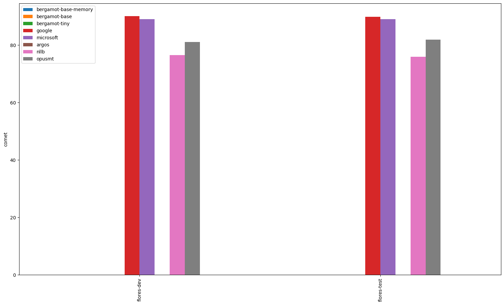
---

## zh-en

| Translator/Dataset | flores-dev | wmt19 | wmt18 | wmt17 | flores-test | wmt20 | wmt22 | wmt21 | iwslt17 |
| --- | --- | --- | --- | --- | --- | --- | --- | --- | --- |
| bergamot-base | 0.86 | 0.82 | 0.82 | 0.82 | 0.86 | 0.81 | 0.77 | 0.79 | 0.82 |
| google | 0.88 (+0.02, +1.97%) | 0.84 (+0.02, +2.72%) | 0.84 (+0.02, +2.97%) | 0.84 (+0.02, +2.41%) | 0.88 (+0.01, +1.73%) | 0.83 (+0.02, +3.02%) | 0.82 (+0.05, +6.66%) | 0.82 (+0.03, +4.16%) | 0.84 (+0.01, +1.72%) |
| microsoft | 0.87 (+0.01, +1.64%) | 0.84 (+0.02, +2.31%) | 0.84 (+0.02, +2.21%) | 0.83 (+0.01, +1.76%) | 0.88 (+0.01, +1.54%) | 0.83 (+0.02, +2.91%) | 0.81 (+0.04, +4.67%) | 0.82 (+0.03, +3.78%) | 0.84 (+0.01, +1.62%) |
| argos | 0.84 (-0.02, -2.42%) | 0.78 (-0.04, -4.93%) | 0.78 (-0.03, -4.15%) | 0.79 (-0.03, -3.42%) | 0.84 (-0.02, -2.40%) | 0.77 (-0.03, -4.18%) | 0.73 (-0.04, -5.57%) | 0.75 (-0.04, -4.86%) | 0.81 (-0.01, -1.41%) |
| nllb | 0.84 (-0.02, -2.13%) | 0.78 (-0.04, -4.98%) | 0.79 (-0.03, -3.93%) | 0.79 (-0.03, -3.57%) | 0.84 (-0.02, -2.31%) | 0.77 (-0.04, -4.44%) | 0.73 (-0.04, -4.62%) | 0.75 (-0.04, -5.29%) | 0.81 (-0.01, -1.80%) |
| opusmt | 0.84 (-0.02, -2.28%) | 0.78 (-0.04, -4.28%) | 0.79 (-0.03, -3.95%) | 0.79 (-0.03, -3.16%) | 0.84 (-0.02, -2.12%) | 0.78 (-0.03, -3.59%) | 0.74 (-0.03, -4.09%) | 0.76 (-0.04, -4.44%) | 0.81 (-0.01, -1.30%) |

---

## en-gu

| Translator/Dataset | wmt19 | flores-dev | flores-test |
| --- | --- | --- | --- |
| google | 0.87 | 0.90 | 0.89 |
| microsoft | 0.88 | 0.89 | 0.89 |
| nllb | 0.86 | 0.87 | 0.87 |

---

## hy-en

| Translator/Dataset | flores-test | flores-dev |
| --- | --- | --- |
| google | 0.89 | 0.89 |
| microsoft | 0.85 | 0.85 |
| nllb | 0.85 | 0.86 |
| opusmt | 0.67 | 0.66 |

---

## en-fr

| Translator/Dataset | wmt10 | wmt11 | wmt15 | wmt12 | wmt14 | wmt08 | flores-dev | iwslt17 | flores-test | wmt09 | wmt13 |
| --- | --- | --- | --- | --- | --- | --- | --- | --- | --- | --- | --- |
| bergamot-tiny | 0.81 | 0.81 | 0.80 | 0.81 | 0.84 | 0.79 | 0.86 | 0.83 | 0.85 | 0.81 | 0.82 |
| google | 0.85 (+0.03, +3.88%) | 0.83 (+0.02, +3.00%) | 0.84 (+0.04, +5.38%) | 0.83 (+0.02, +2.76%) | 0.87 (+0.03, +3.59%) | 0.82 (+0.03, +4.17%) | 0.88 (+0.03, +3.21%) | 0.85 (+0.02, +2.59%) | 0.88 (+0.03, +3.92%) | 0.83 (+0.03, +3.26%) | 0.85 (+0.02, +2.96%) |
| microsoft | 0.85 (+0.04, +4.48%) | 0.84 (+0.03, +3.81%) | 0.85 (+0.05, +5.76%) | 0.84 (+0.03, +3.76%) | 0.88 (+0.04, +4.58%) | 0.83 (+0.04, +4.52%) | 0.89 (+0.03, +3.66%) | 0.86 (+0.03, +3.22%) | 0.89 (+0.04, +4.23%) | 0.84 (+0.03, +4.07%) | 0.85 (+0.03, +3.66%) |
| argos | 0.80 (-0.01, -1.29%) | 0.80 (-0.01, -1.05%) | 0.79 (-0.01, -0.86%) | 0.80 (-0.01, -1.20%) | 0.82 (-0.02, -2.16%) | 0.78 (-0.01, -1.00%) | 0.84 (-0.02, -2.55%) | 0.81 (-0.02, -1.83%) | 0.84 (-0.02, -1.88%) | 0.80 (-0.01, -0.79%) | 0.81 (-0.01, -1.45%) |
| nllb | 0.83 (+0.02, +2.24%) | 0.83 (+0.02, +2.03%) | 0.82 (+0.02, +2.41%) | 0.82 (+0.01, +1.73%) | 0.85 (+0.02, +1.96%) | 0.81 (+0.02, +2.41%) | 0.87 (+0.01, +1.10%) | 0.84 (+0.01, +1.23%) | 0.87 (+0.01, +1.69%) | 0.82 (+0.01, +1.76%) | 0.83 (+0.01, +1.40%) |
| opusmt | 0.83 (+0.02, +1.90%) | 0.82 (+0.01, +1.51%) | 0.81 (+0.01, +1.86%) | 0.82 (+0.01, +1.64%) | 0.85 (+0.01, +1.41%) | 0.80 (+0.01, +1.65%) | 0.86 (+0.01, +0.73%) | 0.84 (+0.01, +0.74%) | 0.86 (+0.01, +1.21%) | 0.82 (+0.01, +1.84%) | 0.83 (+0.01, +1.34%) |

---

## en-lt

| Translator/Dataset | flores-test | wmt19 | flores-dev |
| --- | --- | --- | --- |
| bergamot-base-memory | 0.88 | 0.84 | 0.88 |
| google | 0.91 (+0.02, +2.78%) | 0.86 (+0.02, +2.40%) | 0.91 (+0.03, +3.09%) |
| microsoft | 0.90 (+0.02, +2.38%) | 0.86 (+0.02, +2.06%) | 0.90 (+0.02, +2.41%) |
| nllb | 0.83 (-0.06, -6.31%) | 0.78 (-0.06, -7.70%) | 0.82 (-0.06, -7.11%) |

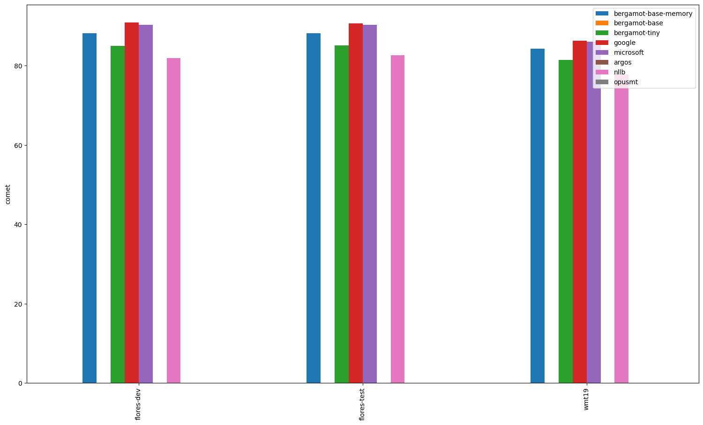
---

## en-pt

| Translator/Dataset | flores-dev | flores-test |
| --- | --- | --- |
| bergamot-tiny | 0.89 | 0.89 |
| google | 0.90 (+0.01, +1.68%) | 0.90 (+0.02, +1.78%) |
| microsoft | 0.90 (+0.01, +1.19%) | 0.90 (+0.01, +1.38%) |
| argos | 0.87 (-0.02, -2.74%) | 0.86 (-0.02, -2.50%) |
| nllb | 0.88 (-0.01, -0.61%) | 0.88 (-0.01, -0.61%) |

---

## en-hu

| Translator/Dataset | flores-dev | wmt09 | flores-test | wmt08 |
| --- | --- | --- | --- | --- |
| bergamot-base-memory | 0.88 | 0.85 | 0.88 | 0.84 |
| bergamot-tiny | 0.86 (-0.03, -3.13%) | 0.82 (-0.03, -3.22%) | 0.85 (-0.03, -3.17%) | 0.82 (-0.02, -2.91%) |
| google | 0.90 (+0.02, +1.97%) | 0.86 (+0.02, +1.91%) | 0.90 (+0.02, +2.19%) | 0.87 (+0.02, +2.75%) |
| microsoft | 0.90 (+0.02, +2.21%) | 0.87 (+0.02, +2.81%) | 0.90 (+0.02, +2.51%) | 0.87 (+0.03, +3.00%) |
| argos | 0.79 (-0.09, -10.52%) | 0.77 (-0.08, -9.52%) | 0.79 (-0.09, -10.47%) | 0.76 (-0.08, -9.79%) |
| nllb | 0.84 (-0.05, -5.35%) | 0.81 (-0.03, -4.11%) | 0.84 (-0.04, -4.60%) | 0.81 (-0.03, -3.57%) |
| opusmt | 0.85 (-0.03, -3.58%) | 0.83 (-0.01, -1.74%) | 0.85 (-0.03, -3.39%) | 0.83 (-0.01, -1.65%) |

---

## en-kn

| Translator/Dataset | flores-dev | flores-test |
| --- | --- | --- |
| google | 0.88 | 0.88 |
| microsoft | 0.87 | 0.87 |
| nllb | 0.85 | 0.85 |

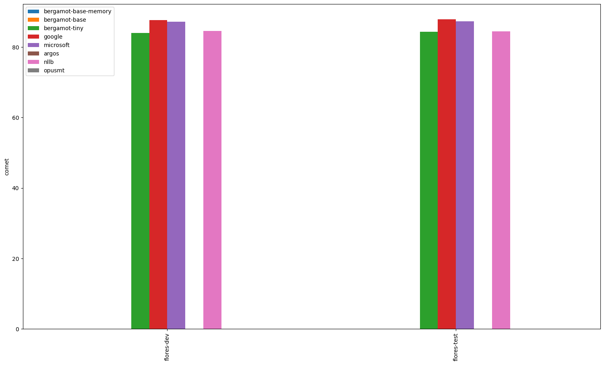
---

## kn-en

| Translator/Dataset | flores-test | flores-dev |
| --- | --- | --- |
| bergamot-tiny | 0.84 | 0.84 |
| google | 0.89 (+0.05, +5.51%) | 0.89 (+0.05, +5.76%) |
| microsoft | 0.87 (+0.03, +3.66%) | 0.88 (+0.03, +4.10%) |
| nllb | 0.86 (+0.02, +2.11%) | 0.86 (+0.02, +2.44%) |

---

## en-sl

| Translator/Dataset | flores-dev | flores-test |
| --- | --- | --- |
| bergamot-base-memory | 0.88 | 0.88 |
| bergamot-tiny | 0.86 (-0.02, -2.51%) | 0.86 (-0.02, -2.53%) |
| google | 0.91 (+0.03, +2.96%) | 0.91 (+0.03, +3.19%) |
| microsoft | 0.89 (+0.01, +1.29%) | 0.89 (+0.01, +1.43%) |
| nllb | 0.84 (-0.04, -4.52%) | 0.84 (-0.04, -4.78%) |

---

## en-ta

| Translator/Dataset | flores-dev | flores-test | wmt20 |
| --- | --- | --- | --- |
| google | 0.91 | 0.91 | 0.90 |
| microsoft | 0.90 | 0.90 | 0.89 |
| nllb | 0.87 | 0.87 | 0.86 |

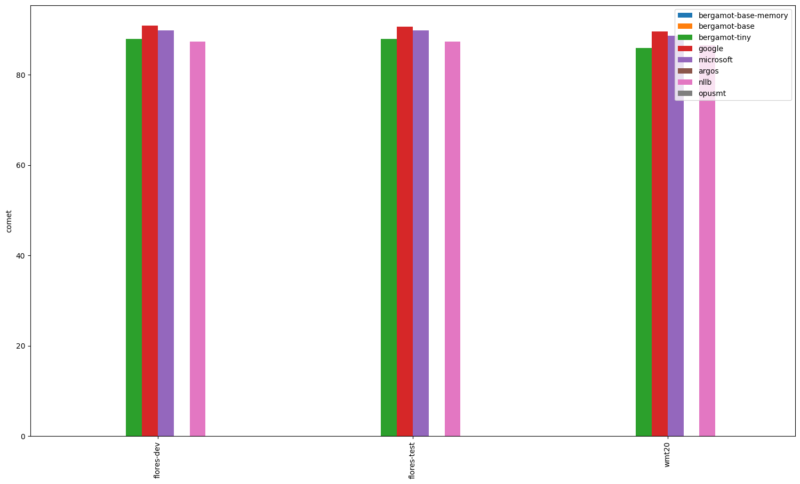
---

## en-ig

| Translator/Dataset | flores-test | flores-dev |
| --- | --- | --- |
| google | 0.72 | 0.71 |
| microsoft | 0.71 | 0.70 |
| nllb | 0.71 | 0.71 |
| opusmt | 0.69 | 0.68 |

---

## hi-en

| Translator/Dataset | flores-test | wmt14 | flores-dev |
| --- | --- | --- | --- |
| bergamot-tiny | 0.87 | 0.86 | 0.87 |
| google | 0.90 (+0.03, +3.65%) | 0.88 (+0.03, +3.28%) | 0.91 (+0.03, +3.90%) |
| microsoft | 0.90 (+0.02, +2.66%) | 0.88 (+0.02, +2.65%) | 0.90 (+0.02, +2.76%) |
| argos | 0.83 (-0.04, -5.02%) | 0.80 (-0.06, -7.08%) | 0.83 (-0.04, -4.56%) |
| nllb | 0.88 (+0.01, +1.17%) | 0.87 (+0.01, +1.23%) | 0.88 (+0.01, +1.31%) |
| opusmt | 0.76 (-0.11, -13.15%) | 0.72 (-0.14, -16.22%) | 0.76 (-0.11, -12.63%) |

---

## en-ko

| Translator/Dataset | iwslt17 | flores-test | flores-dev |
| --- | --- | --- | --- |
| bergamot-base | 0.82 | 0.87 | 0.86 |
| google | 0.86 (+0.05, +5.58%) | 0.90 (+0.04, +4.28%) | 0.91 (+0.04, +4.72%) |
| microsoft | 0.86 (+0.04, +5.05%) | 0.90 (+0.04, +4.20%) | 0.90 (+0.04, +4.58%) |
| argos | 0.68 (-0.14, -16.64%) | 0.72 (-0.15, -17.21%) | 0.73 (-0.14, -16.17%) |
| nllb | 0.83 (+0.02, +1.90%) | 0.87 (+0.00, +0.09%) | 0.87 (+0.00, +0.35%) |

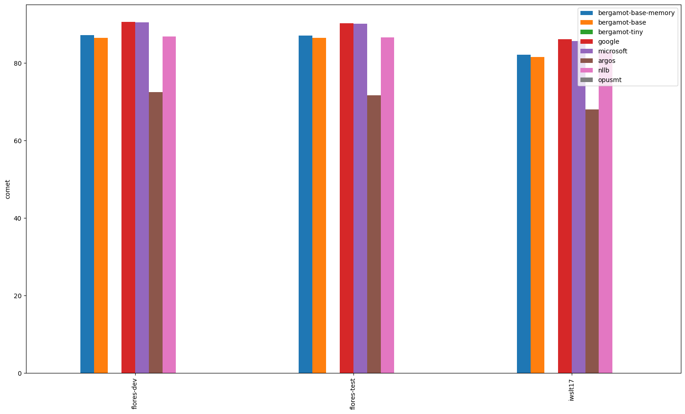
---

## bs-en

| Translator/Dataset | flores-test | flores-dev |
| --- | --- | --- |
| bergamot-tiny | 0.82 | 0.82 |
| google | 0.89 (+0.08, +9.61%) | 0.89 (+0.08, +9.56%) |
| microsoft | 0.89 (+0.07, +8.53%) | 0.89 (+0.07, +8.69%) |
| nllb | 0.75 (-0.07, -8.50%) | 0.76 (-0.06, -7.29%) |

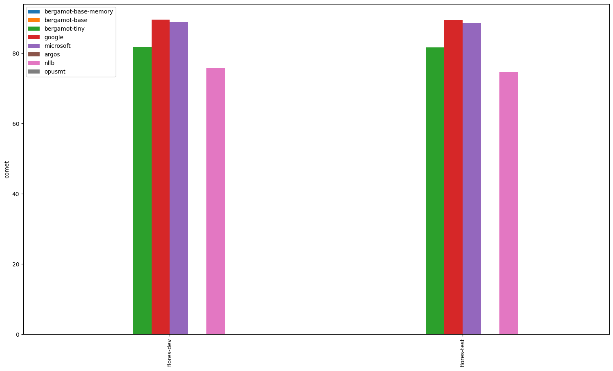
---

## he-en

| Translator/Dataset | flores-test | flores-dev |
| --- | --- | --- |
| bergamot-tiny | 0.86 | 0.86 |
| google | 0.88 (+0.03, +2.96%) | 0.88 (+0.02, +2.24%) |
| microsoft | 0.89 (+0.03, +3.64%) | 0.89 (+0.03, +3.10%) |
| argos | 0.82 (-0.04, -4.75%) | 0.81 (-0.05, -5.52%) |
| nllb | 0.85 (-0.01, -0.59%) | 0.85 (-0.01, -1.04%) |

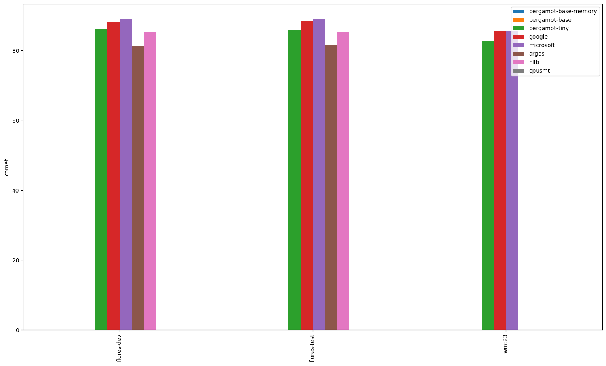
---

## en-sv

| Translator/Dataset | flores-dev | flores-test |
| --- | --- | --- |
| bergamot-tiny | 0.89 | 0.89 |
| google | 0.91 (+0.02, +2.05%) | 0.91 (+0.02, +2.21%) |
| microsoft | 0.92 (+0.03, +2.91%) | 0.92 (+0.03, +3.12%) |
| argos | 0.87 (-0.02, -2.56%) | 0.87 (-0.03, -2.80%) |
| nllb | 0.88 (-0.01, -1.32%) | 0.88 (-0.01, -1.63%) |
| opusmt | 0.89 (-0.00, -0.21%) | 0.89 (-0.00, -0.20%) |

---

## fa-en

| Translator/Dataset | flores-test | flores-dev |
| --- | --- | --- |
| bergamot-tiny | 0.86 | 0.85 |
| google | 0.89 (+0.03, +3.29%) | 0.89 (+0.03, +4.02%) |
| microsoft | 0.87 (+0.01, +1.26%) | 0.87 (+0.01, +1.64%) |
| argos | 0.82 (-0.04, -4.09%) | 0.82 (-0.03, -3.53%) |
| nllb | 0.83 (-0.03, -3.25%) | 0.83 (-0.02, -2.82%) |

---

## bn-en

| Translator/Dataset | flores-test | flores-dev |
| --- | --- | --- |
| bergamot-tiny | 0.85 | 0.85 |
| google | 0.89 (+0.03, +3.95%) | 0.89 (+0.04, +4.53%) |
| microsoft | 0.89 (+0.03, +3.72%) | 0.89 (+0.03, +4.08%) |
| nllb | 0.87 (+0.01, +1.46%) | 0.87 (+0.02, +1.97%) |
| opusmt | 0.79 (-0.07, -7.94%) | 0.79 (-0.07, -7.75%) |

---

## en-mt

| Translator/Dataset | flores-dev | flores-test |
| --- | --- | --- |
| google | 0.73 | 0.73 |
| microsoft | 0.74 | 0.74 |
| nllb | 0.69 | 0.69 |

---

## sr-en

| Translator/Dataset | flores-test | flores-dev |
| --- | --- | --- |
| bergamot-tiny | 0.85 | 0.85 |
| google | 0.88 (+0.03, +4.01%) | 0.89 (+0.04, +4.19%) |
| microsoft | 0.68 (-0.17, -20.05%) | 0.69 (-0.16, -19.31%) |
| nllb | 0.81 (-0.03, -4.10%) | 0.81 (-0.03, -4.06%) |

---

## mt-en

| Translator/Dataset | flores-test | flores-dev |
| --- | --- | --- |
| bergamot-tiny | 0.76 | 0.76 |
| google | 0.84 (+0.08, +10.41%) | 0.85 (+0.08, +11.01%) |
| microsoft | 0.83 (+0.07, +9.12%) | 0.83 (+0.07, +9.38%) |
| nllb | 0.62 (-0.14, -19.03%) | 0.63 (-0.13, -16.76%) |

---

## sk-en

| Translator/Dataset | flores-test | flores-dev |
| --- | --- | --- |
| bergamot-tiny | 0.86 | 0.86 |
| google | 0.89 (+0.03, +3.70%) | 0.89 (+0.03, +3.21%) |
| microsoft | 0.89 (+0.03, +3.53%) | 0.89 (+0.03, +2.91%) |
| argos | 0.78 (-0.08, -8.91%) | 0.78 (-0.08, -9.54%) |
| nllb | 0.76 (-0.10, -11.64%) | 0.77 (-0.09, -10.99%) |
| opusmt | 0.86 (+0.00, +0.49%) | 0.86 (+0.00, +0.16%) |

---

## is-en

| Translator/Dataset | flores-test | wmt21 | flores-dev |
| --- | --- | --- | --- |
| bergamot-tiny | 0.75 | 0.70 | 0.74 |
| google | 0.87 (+0.12, +16.35%) | 0.86 (+0.16, +22.76%) | 0.87 (+0.13, +17.18%) |
| microsoft | 0.86 (+0.11, +15.31%) | 0.86 (+0.16, +22.66%) | 0.86 (+0.12, +16.15%) |
| nllb | 0.63 (-0.12, -16.34%) | 0.63 (-0.07, -9.75%) | 0.63 (-0.11, -14.70%) |
| opusmt | 0.80 (+0.05, +6.64%) | 0.75 (+0.05, +7.62%) | 0.80 (+0.05, +7.03%) |

---

## en-es

| Translator/Dataset | flores-test | wmt10 | wmt08 | wmt13 | wmt09 | wmt12 | wmt11 | flores-dev |
| --- | --- | --- | --- | --- | --- | --- | --- | --- |
| bergamot-tiny | 0.84 | 0.84 | 0.81 | 0.84 | 0.83 | 0.84 | 0.83 | 0.84 |
| google | 0.87 (+0.03, +3.25%) | 0.86 (+0.02, +2.25%) | 0.84 (+0.02, +2.85%) | 0.86 (+0.02, +1.81%) | 0.84 (+0.02, +2.01%) | 0.85 (+0.01, +1.65%) | 0.85 (+0.02, +2.24%) | 0.87 (+0.03, +3.15%) |
| microsoft | 0.86 (+0.02, +2.95%) | 0.86 (+0.02, +2.55%) | 0.84 (+0.02, +2.96%) | 0.86 (+0.02, +2.23%) | 0.85 (+0.02, +2.45%) | 0.86 (+0.02, +2.39%) | 0.85 (+0.02, +2.92%) | 0.86 (+0.02, +2.77%) |
| argos | 0.83 (-0.01, -1.49%) | 0.83 (-0.02, -1.78%) | 0.80 (-0.01, -1.29%) | 0.83 (-0.01, -1.26%) | 0.82 (-0.01, -1.02%) | 0.82 (-0.02, -2.11%) | 0.82 (-0.01, -1.10%) | 0.82 (-0.02, -2.06%) |
| nllb | 0.85 (+0.01, +1.42%) | 0.85 (+0.00, +0.57%) | 0.82 (+0.01, +1.23%) | 0.85 (+0.01, +0.64%) | 0.83 (+0.01, +0.72%) | 0.84 (+0.00, +0.39%) | 0.84 (+0.01, +1.16%) | 0.85 (+0.01, +1.16%) |
| opusmt | 0.85 (+0.01, +1.18%) | 0.85 (+0.01, +1.13%) | 0.82 (+0.01, +1.29%) | 0.85 (+0.01, +1.04%) | 0.83 (+0.01, +1.05%) | 0.85 (+0.01, +0.87%) | 0.84 (+0.01, +1.29%) | 0.85 (+0.01, +1.07%) |

---

## it-en

| Translator/Dataset | mtedx_test | flores-test | wmt09 | flores-dev |
| --- | --- | --- | --- | --- |
| bergamot-tiny | 0.83 | 0.86 | 0.82 | 0.87 |
| google | 0.85 (+0.02, +2.04%) | 0.88 (+0.02, +1.86%) | 0.84 (+0.02, +2.09%) | 0.88 (+0.01, +1.44%) |
| microsoft | 0.85 (+0.02, +1.86%) | 0.88 (+0.02, +1.87%) | 0.84 (+0.02, +2.66%) | 0.88 (+0.01, +1.51%) |
| argos | 0.82 (-0.01, -1.30%) | 0.85 (-0.01, -1.36%) | 0.81 (-0.01, -1.62%) | 0.86 (-0.01, -1.48%) |
| nllb | 0.79 (-0.05, -5.58%) | 0.84 (-0.02, -2.59%) | 0.80 (-0.03, -3.21%) | 0.84 (-0.03, -2.89%) |
| opusmt | 0.84 (+0.00, +0.46%) | 0.87 (+0.00, +0.12%) | 0.83 (+0.00, +0.58%) | 0.87 (-0.00, -0.07%) |

---

## pt-en

| Translator/Dataset | mtedx_test | flores-test | flores-dev |
| --- | --- | --- | --- |
| bergamot-tiny | 0.85 | 0.88 | 0.89 |
| google | 0.87 (+0.02, +1.82%) | 0.90 (+0.01, +1.48%) | 0.90 (+0.01, +1.31%) |
| microsoft | 0.86 (+0.01, +1.55%) | 0.90 (+0.01, +1.46%) | 0.90 (+0.01, +1.30%) |
| argos | 0.84 (-0.01, -0.81%) | 0.88 (-0.01, -0.72%) | 0.88 (-0.01, -0.85%) |
| nllb | 0.80 (-0.05, -5.44%) | 0.85 (-0.03, -3.44%) | 0.85 (-0.03, -3.64%) |

---

## lv-en

| Translator/Dataset | flores-test | flores-dev | wmt17 |
| --- | --- | --- | --- |
| bergamot-tiny | 0.85 | 0.85 | 0.81 |
| google | 0.88 (+0.03, +3.95%) | 0.88 (+0.03, +3.97%) | 0.84 (+0.02, +2.69%) |
| microsoft | 0.87 (+0.02, +2.91%) | 0.87 (+0.02, +2.79%) | 0.83 (+0.02, +2.20%) |
| nllb | 0.68 (-0.17, -20.46%) | 0.68 (-0.17, -20.28%) | 0.65 (-0.16, -20.10%) |
| opusmt | 0.85 (+0.00, +0.29%) | 0.85 (+0.00, +0.34%) | 0.81 (-0.01, -0.71%) |

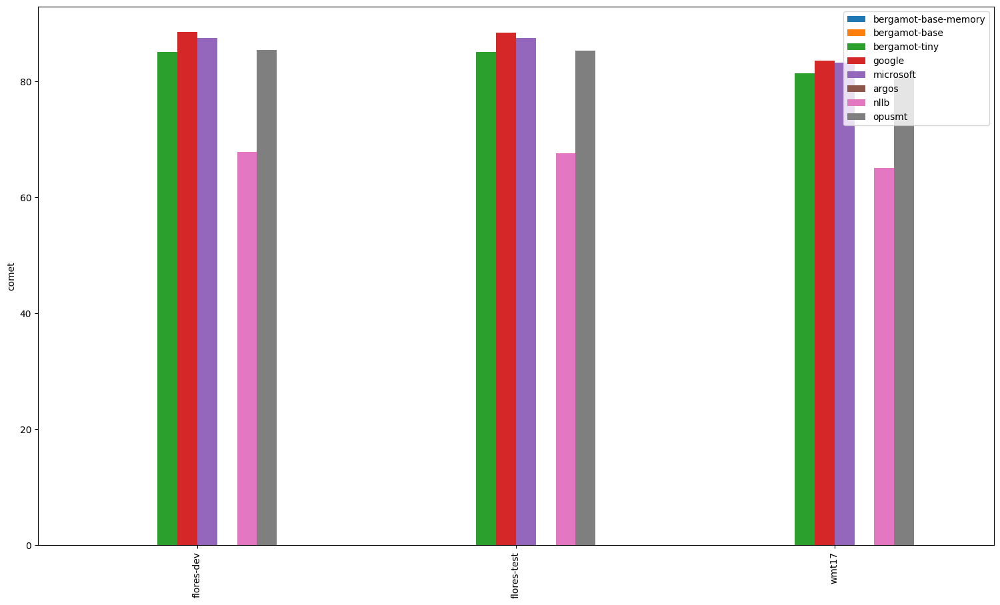
---

## en-sr

| Translator/Dataset | flores-dev | flores-test |
| --- | --- | --- |
| google | 0.91 | 0.90 |
| microsoft | 0.76 | 0.75 |
| nllb | 0.83 | 0.83 |

---

## tl-en

| Translator/Dataset | flores-test | flores-dev |
| --- | --- | --- |
| google | 0.89 | 0.89 |
| microsoft | 0.88 | 0.88 |
| nllb | 0.68 | 0.69 |
| opusmt | 0.81 | 0.81 |

---

## en-fa

| Translator/Dataset | flores-dev | flores-test |
| --- | --- | --- |
| bergamot-tiny | 0.79 | 0.79 |
| google | 0.88 (+0.09, +11.64%) | 0.88 (+0.09, +10.88%) |
| microsoft | 0.81 (+0.03, +3.49%) | 0.82 (+0.02, +2.58%) |
| argos | 0.80 (+0.01, +1.73%) | 0.80 (+0.01, +1.14%) |
| nllb | 0.84 (+0.05, +6.44%) | 0.84 (+0.04, +5.18%) |

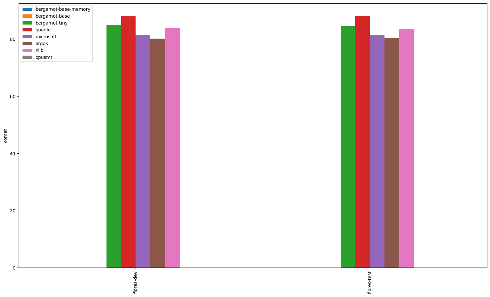
---

## de-en

| Translator/Dataset | flores-test | wmt09 | wmt19 | wmt18 | wmt08 | wmt12 | wmt22 | wmt13 | wmt16 | wmt14 | wmt15 | wmt11 | wmt20 | wmt21 | flores-dev | wmt10 | iwslt17 | wmt17 |
| --- | --- | --- | --- | --- | --- | --- | --- | --- | --- | --- | --- | --- | --- | --- | --- | --- | --- | --- |
| bergamot-tiny | 0.87 | 0.81 | 0.81 | 0.85 | 0.81 | 0.81 | 0.81 | 0.84 | 0.84 | 0.83 | 0.83 | 0.80 | 0.82 | 0.82 | 0.87 | 0.82 | 0.84 | 0.83 |
| google | 0.89 (+0.02, +2.42%) | 0.84 (+0.03, +3.24%) | 0.85 (+0.04, +4.32%) | 0.87 (+0.03, +2.94%) | 0.84 (+0.03, +3.53%) | 0.84 (+0.03, +3.80%) | 0.85 (+0.04, +4.45%) | 0.86 (+0.02, +2.54%) | 0.87 (+0.03, +3.41%) | 0.86 (+0.03, +3.81%) | 0.86 (+0.03, +3.34%) | 0.83 (+0.02, +2.82%) | 0.85 (+0.03, +3.74%) | 0.85 (+0.03, +3.62%) | 0.89 (+0.02, +2.50%) | 0.85 (+0.03, +3.85%) | 0.86 (+0.02, +2.62%) | 0.87 (+0.03, +3.87%) |
| microsoft | 0.90 (+0.03, +2.96%) | 0.84 (+0.03, +4.09%) | 0.85 (+0.04, +5.43%) | 0.89 (+0.04, +4.26%) | 0.84 (+0.03, +4.18%) | 0.85 (+0.04, +5.00%) | 0.85 (+0.04, +4.32%) | 0.86 (+0.03, +3.44%) | 0.88 (+0.04, +4.25%) | 0.87 (+0.04, +4.47%) | 0.87 (+0.03, +3.99%) | 0.84 (+0.04, +4.41%) | 0.86 (+0.04, +4.81%) | 0.86 (+0.04, +4.40%) | 0.90 (+0.03, +3.02%) | 0.85 (+0.04, +4.60%) | 0.86 (+0.03, +2.99%) | 0.87 (+0.04, +4.51%) |
| argos | 0.86 (-0.01, -0.88%) | 0.80 (-0.01, -0.85%) | 0.79 (-0.02, -2.37%) | 0.83 (-0.01, -1.73%) | 0.80 (-0.01, -1.05%) | 0.80 (-0.01, -1.05%) | 0.81 (-0.00, -0.55%) | 0.82 (-0.01, -1.26%) | 0.83 (-0.01, -1.62%) | 0.82 (-0.01, -1.42%) | 0.82 (-0.01, -1.51%) | 0.80 (-0.01, -0.68%) | 0.81 (-0.01, -1.52%) | 0.81 (-0.01, -1.65%) | 0.86 (-0.01, -1.10%) | 0.81 (-0.01, -0.96%) | 0.82 (-0.01, -1.28%) | 0.82 (-0.01, -1.68%) |
| nllb | 0.79 (-0.08, -8.79%) | 0.74 (-0.07, -8.53%) | 0.71 (-0.10, -12.54%) | 0.76 (-0.09, -10.63%) | 0.74 (-0.07, -8.50%) | 0.73 (-0.07, -9.12%) | 0.72 (-0.09, -11.62%) | 0.76 (-0.07, -8.68%) | 0.76 (-0.09, -10.13%) | 0.74 (-0.09, -10.25%) | 0.76 (-0.08, -9.33%) | 0.73 (-0.08, -9.68%) | 0.72 (-0.10, -12.40%) | 0.72 (-0.10, -12.00%) | 0.80 (-0.07, -8.21%) | 0.74 (-0.07, -8.67%) | 0.76 (-0.07, -8.49%) | 0.74 (-0.09, -11.02%) |
| opusmt | 0.88 (+0.01, +1.34%) | 0.82 (+0.01, +1.84%) | 0.82 (+0.01, +1.64%) | 0.86 (+0.01, +1.46%) | 0.82 (+0.02, +1.92%) | 0.83 (+0.02, +2.53%) | 0.83 (+0.01, +1.71%) | 0.85 (+0.01, +1.62%) | 0.85 (+0.01, +1.53%) | 0.85 (+0.02, +1.84%) | 0.85 (+0.01, +1.69%) | 0.82 (+0.02, +2.29%) | 0.84 (+0.02, +2.42%) | 0.84 (+0.02, +2.19%) | 0.88 (+0.01, +1.47%) | 0.83 (+0.02, +2.32%) | 0.85 (+0.01, +1.38%) | 0.85 (+0.02, +1.84%) |

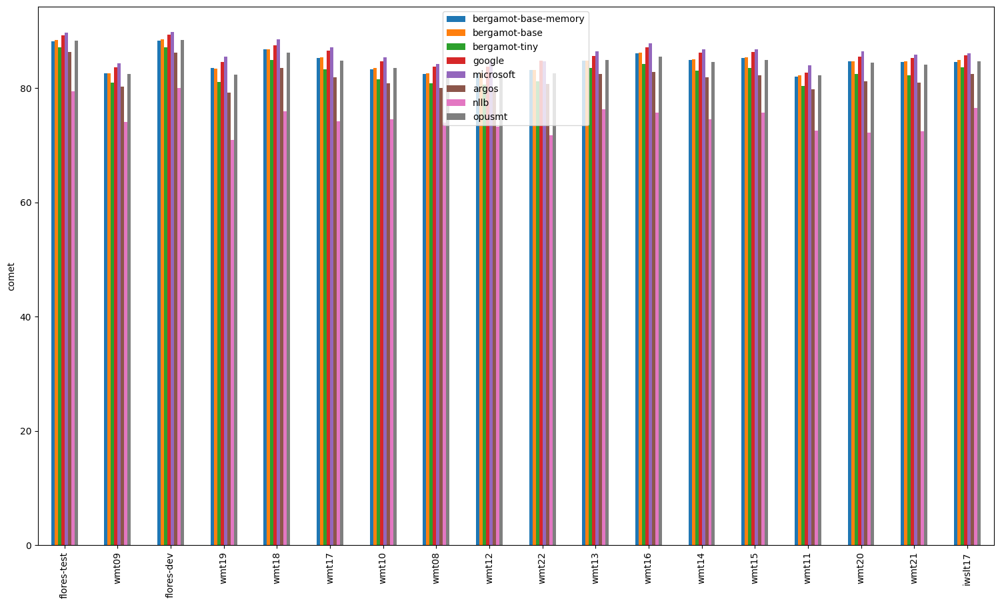
---

## vi-en

| Translator/Dataset | flores-test | flores-dev |
| --- | --- | --- |
| bergamot-tiny | 0.85 | 0.85 |
| google | 0.88 (+0.03, +3.94%) | 0.88 (+0.03, +3.41%) |
| microsoft | 0.88 (+0.03, +3.44%) | 0.88 (+0.03, +3.27%) |
| nllb | 0.84 (-0.01, -1.40%) | 0.84 (-0.01, -0.97%) |
| opusmt | 0.82 (-0.03, -3.88%) | 0.82 (-0.03, -3.79%) |

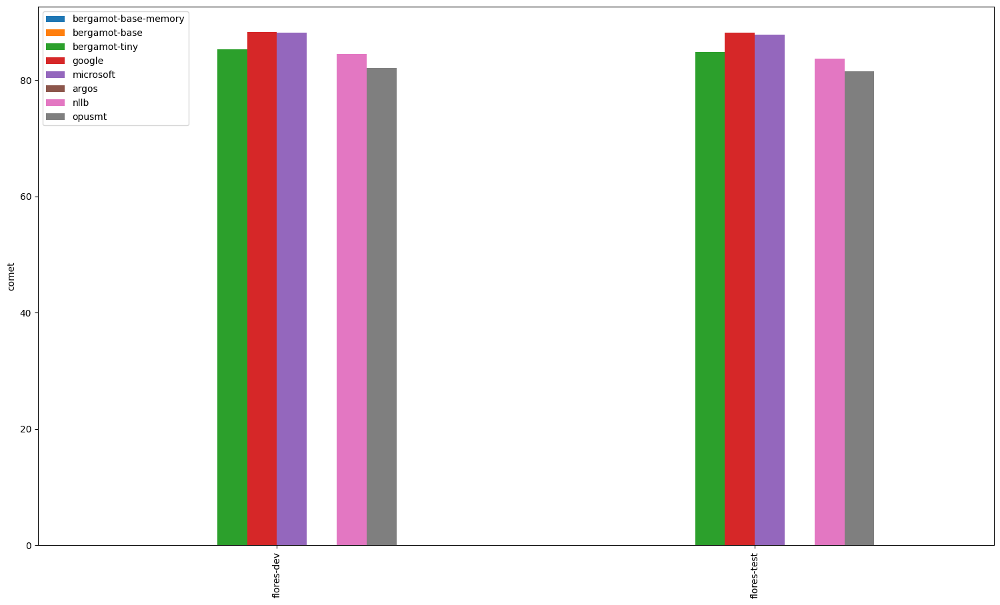
---

## en-te

| Translator/Dataset | flores-test | flores-dev |
| --- | --- | --- |
| google | 0.88 | 0.88 |
| microsoft | 0.88 | 0.88 |
| nllb | 0.85 | 0.85 |

---

## en-ru

| Translator/Dataset | wmt18 | wmt14 | wmt19 | wmt13 | flores-dev | flores-test | wmt21 | wmt20 | wmt15 | wmt16 | wmt22 | wmt17 |
| --- | --- | --- | --- | --- | --- | --- | --- | --- | --- | --- | --- | --- |
| bergamot-base | 0.89 | 0.90 | 0.85 | 0.87 | 0.87 | 0.88 | 0.84 | 0.85 | 0.89 | 0.88 | 0.84 | 0.89 |
| google | 0.91 (+0.02, +2.65%) | 0.92 (+0.02, +2.31%) | 0.88 (+0.03, +3.49%) | 0.89 (+0.02, +2.27%) | 0.90 (+0.03, +3.27%) | 0.90 (+0.03, +2.96%) | 0.87 (+0.03, +3.51%) | 0.88 (+0.03, +3.47%) | 0.91 (+0.02, +2.46%) | 0.90 (+0.02, +2.70%) | 0.89 (+0.04, +5.28%) | 0.91 (+0.03, +2.84%) |
| microsoft | 0.90 (+0.02, +1.73%) | 0.92 (+0.01, +1.58%) | 0.88 (+0.02, +2.55%) | 0.88 (+0.01, +1.60%) | 0.89 (+0.02, +1.93%) | 0.89 (+0.02, +1.79%) | 0.86 (+0.02, +2.04%) | 0.87 (+0.02, +2.09%) | 0.90 (+0.01, +1.54%) | 0.89 (+0.01, +1.66%) | 0.87 (+0.03, +3.54%) | 0.90 (+0.02, +2.00%) |
| argos | 0.86 (-0.03, -3.47%) | 0.88 (-0.02, -2.67%) | 0.81 (-0.04, -5.15%) | 0.85 (-0.02, -2.34%) | 0.85 (-0.03, -2.95%) | 0.85 (-0.03, -3.23%) | 0.80 (-0.05, -5.46%) | 0.81 (-0.04, -4.41%) | 0.86 (-0.03, -3.16%) | 0.85 (-0.03, -3.42%) | 0.81 (-0.04, -4.31%) | 0.86 (-0.03, -2.94%) |
| nllb | 0.87 (-0.02, -1.70%) | 0.89 (-0.01, -1.51%) | 0.84 (-0.02, -1.87%) | 0.86 (-0.01, -1.21%) | 0.86 (-0.02, -1.80%) | 0.86 (-0.02, -1.81%) | 0.83 (-0.02, -1.98%) | 0.84 (-0.01, -1.28%) | 0.87 (-0.02, -1.97%) | 0.86 (-0.01, -1.42%) | 0.83 (-0.01, -1.31%) | 0.87 (-0.02, -1.69%) |
| opusmt | 0.86 (-0.03, -3.16%) | 0.87 (-0.03, -2.97%) | 0.82 (-0.03, -4.07%) | 0.85 (-0.02, -1.90%) | 0.85 (-0.03, -2.91%) | 0.85 (-0.03, -3.26%) | 0.81 (-0.04, -4.17%) | 0.82 (-0.03, -3.45%) | 0.86 (-0.03, -3.39%) | 0.85 (-0.03, -3.38%) | 0.81 (-0.04, -4.32%) | 0.86 (-0.03, -2.90%) |

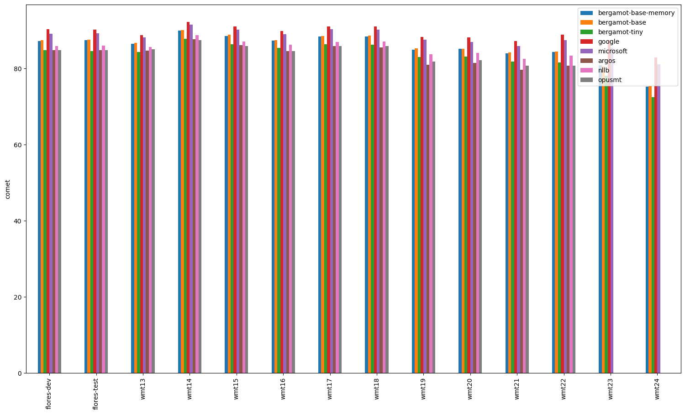
---

## en-pl

| Translator/Dataset | flores-dev | flores-test | wmt20 |
| --- | --- | --- | --- |
| bergamot-tiny | 0.86 | 0.86 | 0.85 |
| google | 0.90 (+0.04, +4.81%) | 0.90 (+0.04, +4.86%) | 0.89 (+0.04, +4.97%) |
| microsoft | 0.89 (+0.03, +3.83%) | 0.89 (+0.04, +4.14%) | 0.89 (+0.04, +4.45%) |
| argos | 0.85 (-0.01, -1.49%) | 0.85 (-0.01, -1.14%) | 0.82 (-0.02, -2.91%) |
| nllb | 0.85 (-0.01, -1.50%) | 0.84 (-0.02, -1.76%) | 0.84 (-0.01, -1.24%) |

---

## en-fi

| Translator/Dataset | wmt18 | wmt16 | wmt17 | wmt15 | wmt19 | flores-test | flores-dev |
| --- | --- | --- | --- | --- | --- | --- | --- |
| bergamot-tiny | 0.87 | 0.88 | 0.89 | 0.88 | 0.86 | 0.88 | 0.88 |
| google | 0.90 (+0.02, +2.78%) | 0.91 (+0.03, +3.16%) | 0.92 (+0.03, +3.38%) | 0.91 (+0.03, +3.31%) | 0.89 (+0.03, +3.17%) | 0.92 (+0.04, +4.39%) | 0.92 (+0.04, +4.04%) |
| microsoft | 0.91 (+0.03, +3.97%) | 0.92 (+0.04, +3.99%) | 0.93 (+0.04, +4.15%) | 0.92 (+0.04, +4.04%) | 0.90 (+0.05, +5.24%) | 0.93 (+0.04, +4.84%) | 0.93 (+0.04, +4.68%) |
| argos | 0.85 (-0.03, -3.15%) | 0.85 (-0.03, -3.96%) | 0.86 (-0.03, -3.70%) | 0.86 (-0.03, -2.94%) | 0.82 (-0.04, -5.06%) | 0.86 (-0.02, -2.75%) | 0.86 (-0.02, -2.48%) |
| nllb | 0.84 (-0.03, -3.97%) | 0.85 (-0.03, -3.67%) | 0.85 (-0.04, -4.33%) | 0.85 (-0.03, -3.65%) | 0.83 (-0.03, -3.56%) | 0.85 (-0.03, -3.86%) | 0.85 (-0.03, -3.83%) |
| opusmt | 0.90 (+0.02, +2.80%) | 0.91 (+0.03, +3.06%) | 0.92 (+0.03, +3.40%) | 0.91 (+0.03, +2.90%) | 0.88 (+0.02, +2.89%) | 0.91 (+0.03, +2.88%) | 0.91 (+0.02, +2.78%) |

---

## en-gl

| Translator/Dataset | flores-dev | flores-test |
| --- | --- | --- |
| google | 0.87 | 0.87 |
| microsoft | 0.86 | 0.86 |
| nllb | 0.86 | 0.86 |
| opusmt | 0.66 | 0.65 |

---

## ta-en

| Translator/Dataset | flores-test | wmt20 | flores-dev |
| --- | --- | --- | --- |
| bergamot-tiny | 0.83 | 0.81 | 0.83 |
| google | 0.88 (+0.05, +6.20%) | 0.87 (+0.06, +7.11%) | 0.88 (+0.05, +6.34%) |
| microsoft | 0.87 (+0.04, +4.94%) | 0.85 (+0.04, +5.12%) | 0.87 (+0.04, +5.42%) |
| nllb | 0.85 (+0.02, +2.79%) | 0.83 (+0.02, +2.73%) | 0.85 (+0.03, +3.03%) |

---

## en-sk

| Translator/Dataset | flores-test | flores-dev |
| --- | --- | --- |
| bergamot-base-memory | 0.89 | 0.89 |
| google | 0.91 (+0.03, +3.09%) | 0.92 (+0.03, +2.97%) |
| microsoft | 0.91 (+0.02, +2.55%) | 0.91 (+0.02, +2.52%) |
| argos | 0.71 (-0.17, -19.66%) | 0.73 (-0.16, -18.36%) |
| nllb | 0.85 (-0.03, -3.72%) | 0.86 (-0.03, -3.57%) |
| opusmt | 0.85 (-0.03, -3.77%) | 0.86 (-0.03, -3.71%) |

---

## nl-en

| Translator/Dataset | flores-test | flores-dev |
| --- | --- | --- |
| bergamot-tiny | 0.86 | 0.86 |
| google | 0.88 (+0.02, +2.07%) | 0.88 (+0.02, +2.14%) |
| microsoft | 0.87 (+0.02, +1.85%) | 0.87 (+0.02, +1.76%) |
| argos | 0.86 (+0.00, +0.27%) | 0.86 (+0.00, +0.47%) |
| nllb | 0.81 (-0.05, -5.75%) | 0.81 (-0.05, -5.82%) |
| opusmt | 0.86 (+0.00, +0.36%) | 0.86 (+0.00, +0.50%) |

---

## en-mr

| Translator/Dataset | flores-dev | flores-test |
| --- | --- | --- |
| google | 0.77 | 0.77 |
| microsoft | 0.76 | 0.76 |
| nllb | 0.72 | 0.72 |
| opusmt | 0.36 | 0.35 |

---

## be-en

| Translator/Dataset | flores-test | flores-dev |
| --- | --- | --- |
| bergamot-tiny | 0.79 | 0.79 |
| google | 0.84 (+0.05, +6.50%) | 0.84 (+0.05, +6.32%) |
| microsoft | 0.83 (+0.04, +4.98%) | 0.83 (+0.04, +4.66%) |
| nllb | 0.81 (+0.01, +1.74%) | 0.81 (+0.01, +1.78%) |

---

## pl-en

| Translator/Dataset | flores-test | wmt20 | flores-dev |
| --- | --- | --- | --- |
| bergamot-tiny | 0.84 | 0.82 | 0.84 |
| google | 0.86 (+0.03, +3.05%) | 0.84 (+0.02, +2.78%) | 0.86 (+0.02, +2.88%) |
| microsoft | 0.86 (+0.03, +3.15%) | 0.85 (+0.03, +3.47%) | 0.86 (+0.02, +2.77%) |
| argos | 0.84 (+0.00, +0.55%) | 0.82 (-0.00, -0.18%) | 0.85 (+0.01, +0.70%) |
| nllb | 0.78 (-0.06, -7.29%) | 0.74 (-0.08, -9.35%) | 0.79 (-0.05, -6.50%) |
| opusmt | 0.84 (+0.00, +0.11%) | 0.81 (-0.01, -1.05%) | 0.84 (+0.00, +0.23%) |

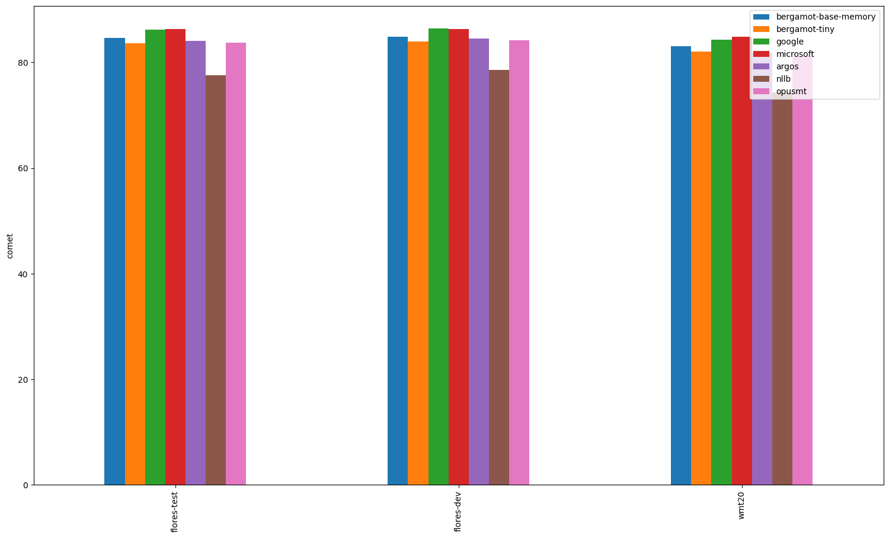
---

## ja-en

| Translator/Dataset | flores-dev | flores-test | wmt20 | wmt22 | wmt21 | iwslt17 |
| --- | --- | --- | --- | --- | --- | --- |
| bergamot-base | 0.86 | 0.86 | 0.79 | 0.78 | 0.77 | 0.79 |
| google | 0.89 (+0.02, +2.65%) | 0.89 (+0.02, +2.77%) | 0.85 (+0.06, +7.94%) | 0.83 (+0.05, +6.56%) | 0.84 (+0.07, +9.02%) | 0.82 (+0.03, +3.91%) |
| microsoft | 0.88 (+0.02, +2.18%) | 0.88 (+0.02, +2.42%) | 0.82 (+0.04, +4.63%) | 0.82 (+0.04, +4.80%) | 0.81 (+0.04, +4.93%) | 0.82 (+0.03, +3.33%) |
| argos | 0.78 (-0.08, -9.30%) | 0.78 (-0.08, -9.64%) | 0.69 (-0.10, -12.36%) | 0.70 (-0.08, -10.56%) | 0.66 (-0.11, -14.81%) | 0.69 (-0.10, -12.60%) |
| nllb | 0.85 (-0.01, -1.61%) | 0.85 (-0.01, -1.34%) | 0.72 (-0.07, -8.30%) | 0.73 (-0.06, -7.13%) | 0.70 (-0.06, -8.41%) | 0.78 (-0.01, -0.76%) |
| opusmt | 0.83 (-0.04, -4.17%) | 0.83 (-0.04, -4.32%) | 0.65 (-0.13, -16.93%) | 0.68 (-0.11, -13.50%) | 0.64 (-0.13, -16.33%) | 0.71 (-0.08, -10.14%) |

---

## en-it

| Translator/Dataset | flores-dev | wmt09 | flores-test |
| --- | --- | --- | --- |
| bergamot-tiny | 0.86 | 0.85 | 0.86 |
| google | 0.88 (+0.02, +2.28%) | 0.87 (+0.02, +2.06%) | 0.89 (+0.02, +2.63%) |
| microsoft | 0.88 (+0.02, +2.15%) | 0.87 (+0.02, +2.60%) | 0.88 (+0.02, +2.52%) |
| argos | 0.84 (-0.03, -3.16%) | 0.84 (-0.01, -1.54%) | 0.84 (-0.03, -2.99%) |
| nllb | 0.87 (+0.00, +0.19%) | 0.85 (+0.00, +0.33%) | 0.86 (+0.00, +0.10%) |
| opusmt | 0.85 (-0.01, -1.15%) | 0.85 (+0.00, +0.05%) | 0.85 (-0.01, -1.21%) |

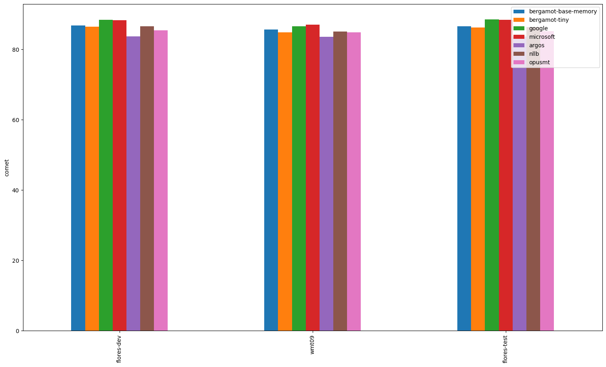
---

## uk-en

| Translator/Dataset | flores-test | wmt22 | flores-dev |
| --- | --- | --- | --- |
| bergamot-tiny | 0.85 | 0.81 | 0.84 |
| google | 0.88 (+0.03, +3.58%) | 0.86 (+0.04, +5.41%) | 0.88 (+0.03, +3.77%) |
| microsoft | 0.87 (+0.03, +3.13%) | 0.85 (+0.03, +4.18%) | 0.87 (+0.03, +3.33%) |
| argos | 0.80 (-0.05, -5.91%) | 0.70 (-0.12, -14.19%) | 0.80 (-0.05, -5.75%) |
| nllb | 0.83 (-0.01, -1.44%) | 0.78 (-0.03, -3.51%) | 0.83 (-0.01, -1.21%) |
| opusmt | 0.82 (-0.03, -3.63%) | 0.77 (-0.04, -5.17%) | 0.81 (-0.03, -3.86%) |

---

## az-en

| Translator/Dataset | flores-test | flores-dev |
| --- | --- | --- |
| bergamot-tiny | 0.83 | 0.83 |
| google | 0.88 (+0.05, +5.50%) | 0.88 (+0.04, +5.30%) |
| microsoft | 0.83 (-0.00, -0.31%) | 0.83 (+0.00, +0.01%) |
| argos | 0.64 (-0.19, -22.59%) | 0.65 (-0.18, -21.74%) |
| nllb | 0.81 (-0.03, -3.19%) | 0.81 (-0.02, -2.63%) |
| opusmt | 0.58 (-0.25, -29.80%) | 0.59 (-0.25, -29.43%) |

---

## ml-en

| Translator/Dataset | flores-test | flores-dev |
| --- | --- | --- |
| bergamot-tiny | 0.85 | 0.85 |
| google | 0.89 (+0.04, +5.20%) | 0.89 (+0.04, +5.23%) |
| microsoft | 0.88 (+0.03, +4.05%) | 0.88 (+0.04, +4.34%) |
| nllb | 0.87 (+0.02, +2.52%) | 0.87 (+0.02, +2.86%) |
| opusmt | 0.66 (-0.19, -22.49%) | 0.66 (-0.19, -22.33%) |

---

## ca-en

| Translator/Dataset | flores-test | flores-dev |
| --- | --- | --- |
| bergamot-tiny | 0.85 | 0.85 |
| google | 0.89 (+0.05, +5.53%) | 0.89 (+0.04, +5.11%) |
| microsoft | 0.89 (+0.04, +5.23%) | 0.89 (+0.04, +4.60%) |
| argos | 0.86 (+0.02, +2.31%) | 0.87 (+0.02, +2.16%) |
| nllb | 0.82 (-0.02, -2.60%) | 0.83 (-0.02, -2.76%) |
| opusmt | 0.78 (-0.06, -7.51%) | 0.79 (-0.07, -7.75%) |

---

## te-en

| Translator/Dataset | flores-test | flores-dev |
| --- | --- | --- |
| bergamot-tiny | 0.85 | 0.85 |
| google | 0.89 (+0.03, +3.89%) | 0.89 (+0.03, +3.90%) |
| microsoft | 0.88 (+0.03, +3.20%) | 0.88 (+0.03, +3.02%) |
| nllb | 0.87 (+0.02, +1.86%) | 0.87 (+0.02, +2.04%) |

---

## fi-en

| Translator/Dataset | flores-test | wmt19 | wmt18 | wmt16 | wmt15 | flores-dev | wmt17 |
| --- | --- | --- | --- | --- | --- | --- | --- |
| bergamot-tiny | 0.87 | 0.85 | 0.84 | 0.85 | 0.85 | 0.87 | 0.86 |
| google | 0.90 (+0.03, +3.46%) | 0.88 (+0.03, +3.89%) | 0.86 (+0.02, +2.89%) | 0.88 (+0.03, +3.49%) | 0.88 (+0.03, +3.40%) | 0.90 (+0.03, +3.49%) | 0.89 (+0.03, +3.33%) |
| microsoft | 0.90 (+0.03, +3.57%) | 0.89 (+0.04, +4.16%) | 0.87 (+0.03, +3.79%) | 0.89 (+0.03, +3.93%) | 0.89 (+0.04, +4.15%) | 0.90 (+0.03, +3.54%) | 0.90 (+0.03, +3.68%) |
| argos | 0.82 (-0.05, -5.96%) | 0.77 (-0.08, -9.90%) | 0.78 (-0.06, -7.50%) | 0.78 (-0.07, -8.29%) | 0.79 (-0.06, -7.43%) | 0.82 (-0.05, -6.01%) | 0.79 (-0.07, -8.26%) |
| nllb | 0.66 (-0.21, -23.86%) | 0.63 (-0.22, -25.67%) | 0.64 (-0.20, -23.42%) | 0.66 (-0.19, -22.27%) | 0.65 (-0.20, -23.43%) | 0.67 (-0.20, -23.33%) | 0.66 (-0.21, -24.25%) |
| opusmt | 0.88 (+0.01, +1.15%) | 0.85 (-0.00, -0.50%) | 0.85 (+0.01, +0.80%) | 0.86 (+0.00, +0.41%) | 0.86 (+0.01, +0.92%) | 0.88 (+0.01, +1.27%) | 0.87 (+0.00, +0.34%) |

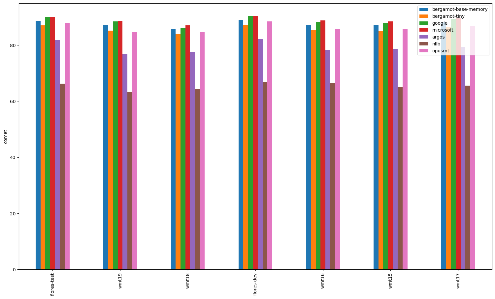
---

## en-ar

| Translator/Dataset | flores-dev | iwslt17 | flores-test |
| --- | --- | --- | --- |
| bergamot-base | 0.86 | 0.84 | 0.86 |
| google | 0.89 (+0.03, +3.06%) | 0.86 (+0.02, +2.05%) | 0.88 (+0.03, +3.09%) |
| microsoft | 0.87 (+0.01, +1.46%) | 0.84 (+0.01, +0.75%) | 0.87 (+0.01, +1.64%) |
| argos | 0.77 (-0.09, -10.95%) | 0.80 (-0.04, -4.38%) | 0.76 (-0.09, -10.90%) |
| nllb | 0.83 (-0.03, -2.96%) | 0.83 (-0.01, -1.23%) | 0.84 (-0.02, -2.39%) |
| opusmt | 0.83 (-0.03, -3.12%) | 0.82 (-0.02, -1.88%) | 0.83 (-0.03, -3.04%) |

---

## en-id

| Translator/Dataset | flores-test | flores-dev |
| --- | --- | --- |
| bergamot-tiny | 0.91 | 0.90 |
| google | 0.92 (+0.02, +2.13%) | 0.92 (+0.02, +2.38%) |
| microsoft | 0.92 (+0.01, +1.40%) | 0.92 (+0.01, +1.53%) |
| argos | 0.83 (-0.08, -8.54%) | 0.83 (-0.07, -7.98%) |
| nllb | 0.90 (-0.01, -0.77%) | 0.90 (-0.01, -0.57%) |
| opusmt | 0.88 (-0.03, -3.03%) | 0.88 (-0.03, -2.87%) |

---

## en-zh

| Translator/Dataset | wmt17 | wmt18 | wmt20 | wmt21 | wmt19 | flores-test | iwslt17 | wmt22 | flores-dev |
| --- | --- | --- | --- | --- | --- | --- | --- | --- | --- |
| bergamot-base | 0.83 | 0.85 | 0.84 | 0.81 | 0.81 | 0.86 | 0.81 | 0.83 | 0.85 |
| google | 0.88 (+0.05, +5.52%) | 0.89 (+0.04, +4.26%) | 0.88 (+0.05, +5.62%) | 0.86 (+0.05, +6.25%) | 0.87 (+0.05, +6.63%) | 0.89 (+0.04, +4.55%) | 0.85 (+0.04, +4.60%) | 0.88 (+0.05, +5.89%) | 0.89 (+0.04, +4.69%) |
| microsoft | 0.86 (+0.03, +3.82%) | 0.88 (+0.02, +2.76%) | 0.87 (+0.03, +3.63%) | 0.84 (+0.03, +4.03%) | 0.85 (+0.04, +4.54%) | 0.88 (+0.03, +3.37%) | 0.84 (+0.03, +3.48%) | 0.87 (+0.04, +4.42%) | 0.88 (+0.03, +3.58%) |
| argos | 0.81 (-0.02, -2.70%) | 0.83 (-0.02, -2.69%) | 0.80 (-0.04, -4.45%) | 0.77 (-0.04, -5.34%) | 0.77 (-0.04, -5.26%) | 0.83 (-0.02, -2.59%) | 0.79 (-0.01, -1.71%) | 0.78 (-0.05, -5.81%) | 0.82 (-0.03, -3.15%) |
| nllb | 0.80 (-0.04, -4.21%) | 0.81 (-0.04, -4.76%) | 0.80 (-0.04, -4.28%) | 0.77 (-0.03, -4.29%) | 0.78 (-0.04, -4.70%) | 0.82 (-0.04, -4.45%) | 0.79 (-0.02, -2.39%) | 0.80 (-0.03, -3.82%) | 0.81 (-0.04, -4.47%) |
| opusmt | 0.79 (-0.04, -4.56%) | 0.81 (-0.04, -4.92%) | 0.78 (-0.05, -6.41%) | 0.75 (-0.05, -6.73%) | 0.76 (-0.06, -7.07%) | 0.82 (-0.03, -3.65%) | 0.80 (-0.01, -1.50%) | 0.78 (-0.05, -5.89%) | 0.81 (-0.04, -4.22%) |

---

## en-be

| Translator/Dataset | flores-dev | flores-test |
| --- | --- | --- |
| google | 0.88 | 0.88 |
| microsoft | 0.85 | 0.85 |
| nllb | 0.81 | 0.81 |

---

## en-th

| Translator/Dataset | flores-test | flores-dev |
| --- | --- | --- |
| google | 0.89 | 0.89 |
| microsoft | 0.88 | 0.88 |
| nllb | 0.79 | 0.80 |

---

## sl-en

| Translator/Dataset | flores-test | flores-dev |
| --- | --- | --- |
| bergamot-base-memory | 0.86 | 0.86 |
| bergamot-tiny | 0.85 (-0.01, -1.49%) | 0.85 (-0.01, -1.37%) |
| google | 0.88 (+0.02, +2.43%) | 0.88 (+0.02, +2.21%) |
| microsoft | 0.88 (+0.02, +2.43%) | 0.88 (+0.02, +2.04%) |
| nllb | 0.68 (-0.18, -20.90%) | 0.69 (-0.18, -20.42%) |

---

## hr-en

| Translator/Dataset | flores-test | flores-dev |
| --- | --- | --- |
| bergamot-tiny | 0.86 | 0.86 |
| google | 0.88 (+0.02, +2.85%) | 0.88 (+0.02, +2.57%) |
| microsoft | 0.88 (+0.02, +2.47%) | 0.88 (+0.02, +2.46%) |
| nllb | 0.72 (-0.13, -15.44%) | 0.74 (-0.12, -14.05%) |

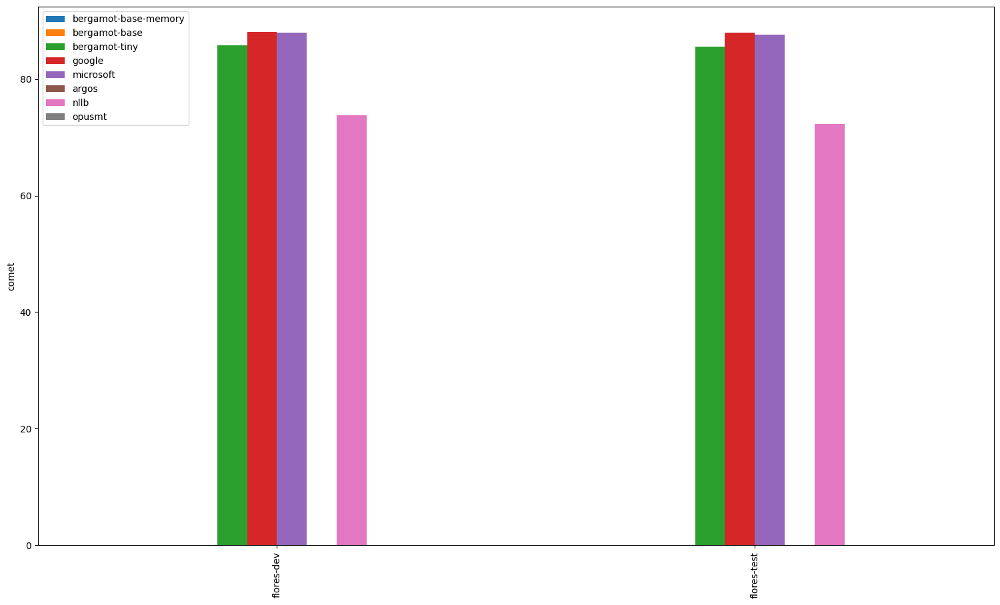
---

## en-el

| Translator/Dataset | flores-test | flores-dev |
| --- | --- | --- |
| bergamot-tiny | 0.87 | 0.88 |
| google | 0.89 (+0.02, +2.53%) | 0.90 (+0.02, +2.25%) |
| microsoft | 0.89 (+0.02, +2.60%) | 0.90 (+0.02, +2.44%) |
| argos | 0.87 (+0.00, +0.19%) | 0.87 (-0.00, -0.35%) |
| nllb | 0.87 (-0.01, -0.69%) | 0.87 (-0.01, -0.65%) |
| opusmt | 0.86 (-0.01, -1.01%) | 0.87 (-0.01, -1.32%) |

---

## mr-en

| Translator/Dataset | flores-test | flores-dev |
| --- | --- | --- |
| google | 0.89 | 0.89 |
| microsoft | 0.88 | 0.88 |
| nllb | 0.86 | 0.86 |
| opusmt | 0.45 | 0.45 |

---

## hu-en

| Translator/Dataset | flores-test | wmt09 | wmt08 | flores-dev |
| --- | --- | --- | --- | --- |
| bergamot-tiny | 0.86 | 0.82 | 0.81 | 0.86 |
| google | 0.89 (+0.03, +3.28%) | 0.84 (+0.02, +2.69%) | 0.83 (+0.03, +3.13%) | 0.89 (+0.03, +2.95%) |
| microsoft | 0.89 (+0.03, +3.33%) | 0.84 (+0.03, +3.23%) | 0.84 (+0.03, +3.55%) | 0.89 (+0.03, +3.07%) |
| argos | 0.68 (-0.18, -20.43%) | 0.63 (-0.18, -22.53%) | 0.63 (-0.18, -22.34%) | 0.69 (-0.17, -20.04%) |
| nllb | 0.70 (-0.16, -18.26%) | 0.69 (-0.13, -16.02%) | 0.68 (-0.13, -16.27%) | 0.72 (-0.15, -17.07%) |
| opusmt | 0.86 (+0.00, +0.45%) | 0.82 (+0.01, +0.67%) | 0.81 (+0.01, +0.68%) | 0.87 (+0.00, +0.51%) |

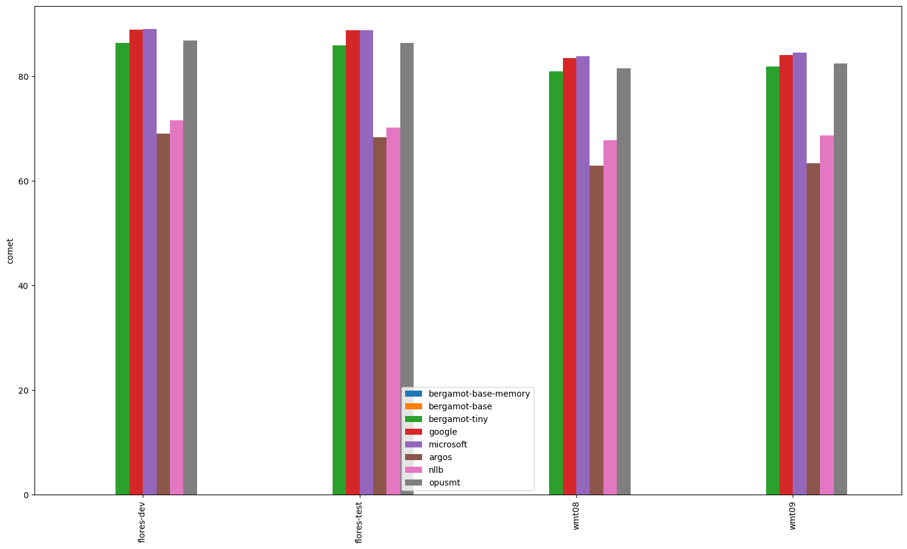
---

## en-ja

| Translator/Dataset | flores-dev | iwslt17 | flores-test | wmt20 | wmt22 | wmt21 |
| --- | --- | --- | --- | --- | --- | --- |
| bergamot-base | 0.90 | 0.82 | 0.89 | 0.87 | 0.86 | 0.87 |
| google | 0.92 (+0.03, +3.12%) | 0.86 (+0.04, +4.58%) | 0.92 (+0.03, +3.18%) | 0.92 (+0.05, +5.20%) | 0.90 (+0.04, +4.65%) | 0.91 (+0.05, +5.54%) |
| microsoft | 0.92 (+0.02, +2.49%) | 0.85 (+0.03, +3.61%) | 0.92 (+0.02, +2.70%) | 0.90 (+0.03, +3.26%) | 0.89 (+0.03, +3.32%) | 0.90 (+0.03, +3.34%) |
| argos | 0.79 (-0.11, -11.86%) | 0.73 (-0.10, -11.69%) | 0.79 (-0.11, -11.85%) | 0.74 (-0.13, -15.24%) | 0.77 (-0.09, -10.34%) | 0.71 (-0.16, -18.01%) |
| nllb | 0.87 (-0.02, -2.55%) | 0.82 (-0.00, -0.34%) | 0.87 (-0.02, -2.50%) | 0.86 (-0.01, -1.63%) | 0.84 (-0.02, -2.61%) | 0.85 (-0.02, -1.95%) |

---

## en-af

| Translator/Dataset | flores-dev | flores-test |
| --- | --- | --- |
| google | 0.87 | 0.87 |
| microsoft | 0.87 | 0.87 |
| nllb | 0.86 | 0.86 |
| opusmt | 0.82 | 0.82 |

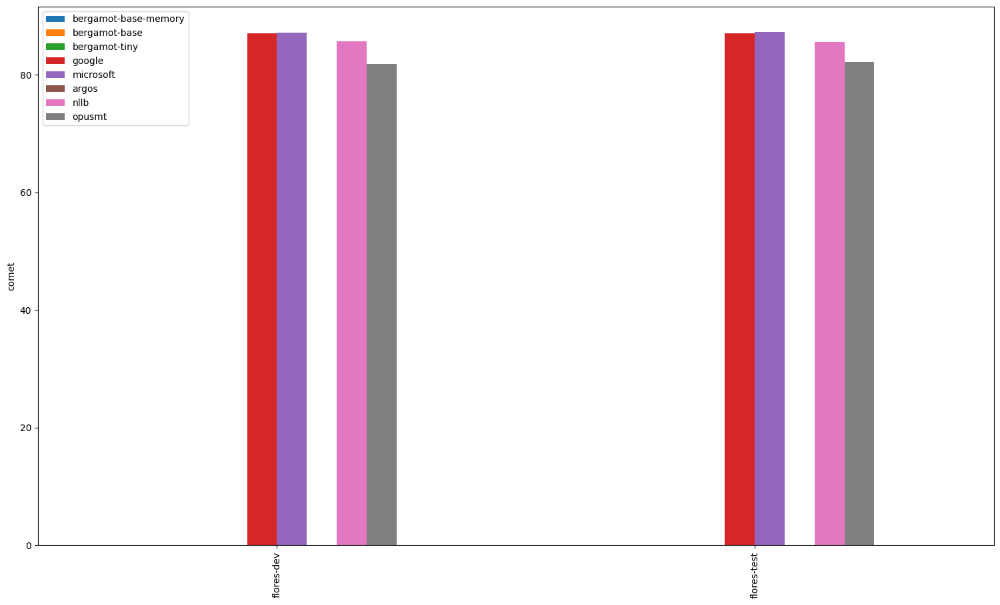
---

## ms-en

| Translator/Dataset | flores-test | flores-dev |
| --- | --- | --- |
| bergamot-tiny | 0.87 | 0.87 |
| google | 0.90 (+0.03, +4.03%) | 0.90 (+0.03, +3.68%) |
| microsoft | 0.89 (+0.02, +2.83%) | 0.89 (+0.02, +2.41%) |
| nllb | 0.84 (-0.03, -3.34%) | 0.84 (-0.03, -3.51%) |

---

## id-en

| Translator/Dataset | flores-test | flores-dev |
| --- | --- | --- |
| bergamot-tiny | 0.87 | 0.88 |
| google | 0.90 (+0.02, +2.77%) | 0.90 (+0.02, +2.55%) |
| microsoft | 0.90 (+0.02, +2.69%) | 0.90 (+0.02, +2.58%) |
| argos | 0.80 (-0.07, -8.25%) | 0.81 (-0.07, -7.56%) |
| nllb | 0.86 (-0.01, -1.48%) | 0.86 (-0.01, -1.28%) |
| opusmt | 0.86 (-0.01, -1.67%) | 0.86 (-0.02, -1.79%) |

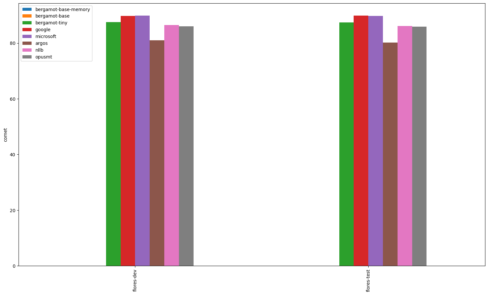
---

## en-he

| Translator/Dataset | flores-dev | flores-test |
| --- | --- | --- |
| google | 0.90 | 0.90 |
| microsoft | 0.90 | 0.90 |
| argos | 0.82 | 0.81 |
| nllb | 0.81 | 0.81 |
| opusmt | 0.85 | 0.85 |

---

## en-da

| Translator/Dataset | flores-dev | flores-test |
| --- | --- | --- |
| bergamot-tiny | 0.89 | 0.89 |
| google | 0.91 (+0.02, +2.71%) | 0.91 (+0.02, +2.58%) |
| microsoft | 0.91 (+0.02, +2.65%) | 0.91 (+0.02, +2.44%) |
| argos | 0.83 (-0.06, -6.40%) | 0.83 (-0.06, -7.11%) |
| nllb | 0.89 (-0.00, -0.33%) | 0.88 (-0.01, -1.03%) |
| opusmt | 0.88 (-0.01, -1.09%) | 0.88 (-0.01, -0.94%) |

---

## en-is

| Translator/Dataset | flores-test | wmt21 | flores-dev |
| --- | --- | --- | --- |
| google | 0.87 | 0.85 | 0.87 |
| microsoft | 0.86 | 0.85 | 0.86 |
| nllb | 0.79 | 0.78 | 0.79 |
| opusmt | 0.76 | 0.70 | 0.76 |

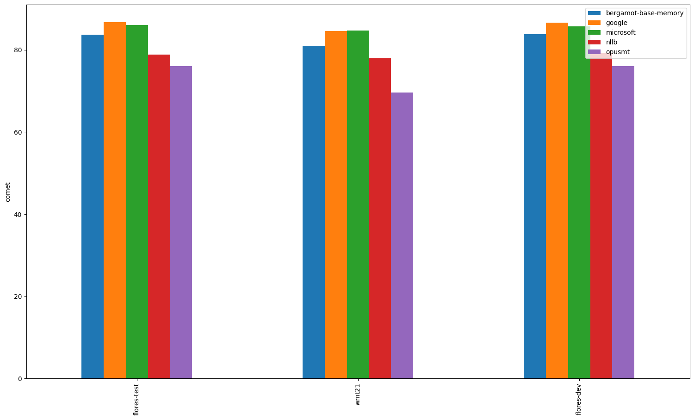
---

## fr-en

| Translator/Dataset | mtedx_test | flores-test | wmt09 | wmt08 | wmt12 | wmt13 | wmt14 | wmt15 | wmt11 | flores-dev | wmt10 | iwslt17 |
| --- | --- | --- | --- | --- | --- | --- | --- | --- | --- | --- | --- | --- |
| bergamot-tiny | 0.85 | 0.88 | 0.82 | 0.80 | 0.82 | 0.84 | 0.85 | 0.83 | 0.82 | 0.88 | 0.82 | 0.86 |
| google | 0.87 (+0.02, +2.03%) | 0.89 (+0.01, +1.44%) | 0.83 (+0.02, +2.12%) | 0.82 (+0.02, +2.56%) | 0.83 (+0.01, +1.48%) | 0.85 (+0.01, +1.27%) | 0.87 (+0.02, +1.89%) | 0.85 (+0.03, +3.04%) | 0.83 (+0.01, +1.50%) | 0.90 (+0.02, +1.76%) | 0.84 (+0.02, +2.49%) | 0.87 (+0.01, +0.95%) |
| microsoft | 0.87 (+0.02, +2.35%) | 0.90 (+0.01, +1.58%) | 0.84 (+0.02, +2.81%) | 0.83 (+0.02, +3.02%) | 0.84 (+0.02, +2.68%) | 0.86 (+0.02, +2.14%) | 0.87 (+0.02, +2.58%) | 0.85 (+0.03, +3.18%) | 0.84 (+0.02, +2.70%) | 0.90 (+0.02, +1.82%) | 0.85 (+0.02, +3.01%) | 0.88 (+0.01, +1.45%) |
| argos | 0.84 (-0.01, -1.01%) | 0.87 (-0.01, -1.12%) | 0.81 (-0.01, -0.61%) | 0.80 (-0.01, -0.78%) | 0.81 (-0.01, -0.97%) | 0.83 (-0.01, -1.07%) | 0.84 (-0.01, -1.41%) | 0.82 (-0.01, -1.22%) | 0.81 (-0.01, -0.77%) | 0.87 (-0.01, -0.95%) | 0.82 (-0.01, -0.68%) | 0.85 (-0.01, -1.33%) |
| nllb | 0.82 (-0.03, -3.14%) | 0.88 (-0.01, -0.65%) | 0.82 (+0.00, +0.15%) | 0.81 (+0.00, +0.34%) | 0.82 (+0.00, +0.23%) | 0.84 (-0.01, -0.69%) | 0.85 (-0.00, -0.57%) | 0.81 (-0.02, -2.17%) | 0.82 (+0.00, +0.28%) | 0.88 (-0.00, -0.43%) | 0.82 (-0.00, -0.13%) | 0.85 (-0.02, -2.25%) |
| opusmt | 0.85 (+0.01, +0.65%) | 0.88 (+0.00, +0.20%) | 0.82 (+0.01, +1.19%) | 0.81 (+0.01, +1.26%) | 0.83 (+0.01, +1.01%) | 0.85 (+0.00, +0.44%) | 0.86 (+0.00, +0.46%) | 0.84 (+0.01, +1.10%) | 0.83 (+0.01, +1.04%) | 0.88 (+0.00, +0.28%) | 0.83 (+0.01, +1.08%) | 0.87 (+0.00, +0.06%) |

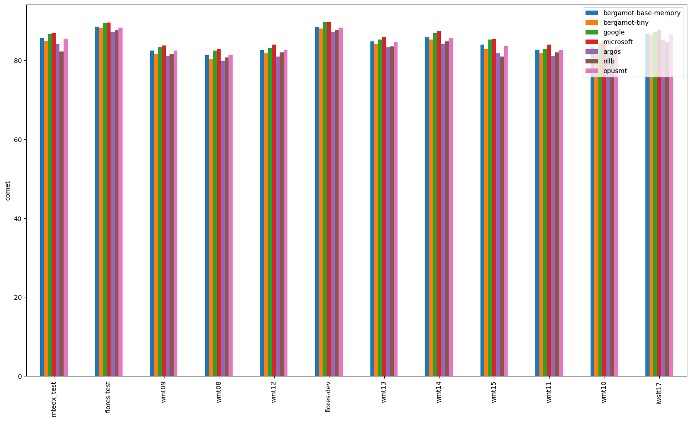
---

## ar-en

| Translator/Dataset | flores-dev | flores-test | iwslt17 |
| --- | --- | --- | --- |
| bergamot-base | 0.86 | 0.86 | 0.85 |
| google | 0.89 (+0.02, +2.49%) | 0.88 (+0.02, +2.62%) | 0.86 (+0.02, +2.03%) |
| microsoft | 0.88 (+0.01, +1.45%) | 0.87 (+0.01, +1.46%) | 0.86 (+0.01, +1.03%) |
| argos | 0.81 (-0.05, -5.98%) | 0.81 (-0.05, -5.82%) | 0.82 (-0.03, -3.53%) |
| nllb | 0.86 (-0.01, -0.89%) | 0.85 (-0.01, -0.99%) | 0.84 (-0.01, -1.24%) |
| opusmt | 0.84 (-0.02, -2.54%) | 0.84 (-0.02, -2.11%) | 0.84 (-0.01, -1.03%) |

---

## en-lv

| Translator/Dataset | flores-dev | flores-test | wmt17 |
| --- | --- | --- | --- |
| bergamot-base-memory | 0.87 | 0.87 | 0.84 |
| google | 0.91 (+0.04, +4.70%) | 0.91 (+0.04, +4.33%) | 0.88 (+0.03, +4.05%) |
| microsoft | 0.90 (+0.04, +4.28%) | 0.90 (+0.03, +3.73%) | 0.88 (+0.03, +4.06%) |
| nllb | 0.74 (-0.13, -14.80%) | 0.73 (-0.14, -15.77%) | 0.73 (-0.12, -13.85%) |

---

## cy-en

| Translator/Dataset | flores-test | flores-dev |
| --- | --- | --- |
| google | 0.90 | 0.90 |
| microsoft | 0.89 | 0.89 |
| nllb | 0.56 | 0.58 |
| opusmt | 0.52 | 0.53 |

---

## en-cy

| Translator/Dataset | flores-test | flores-dev |
| --- | --- | --- |
| google | 0.88 | 0.89 |
| microsoft | 0.88 | 0.88 |
| nllb | 0.79 | 0.81 |
| opusmt | 0.51 | 0.51 |

---

## en-nl

| Translator/Dataset | flores-test | flores-dev |
| --- | --- | --- |
| bergamot-tiny | 0.86 | 0.86 |
| google | 0.88 (+0.02, +2.74%) | 0.88 (+0.02, +2.38%) |
| microsoft | 0.88 (+0.02, +2.34%) | 0.88 (+0.02, +1.90%) |
| argos | 0.85 (-0.01, -1.32%) | 0.84 (-0.02, -2.13%) |
| nllb | 0.86 (-0.00, -0.43%) | 0.85 (-0.01, -1.09%) |
| opusmt | 0.85 (-0.01, -1.05%) | 0.85 (-0.01, -1.39%) |

---

## sv-en

| Translator/Dataset | flores-test | flores-dev |
| --- | --- | --- |
| bergamot-tiny | 0.89 | 0.89 |
| google | 0.90 (+0.01, +1.41%) | 0.90 (+0.01, +0.97%) |
| microsoft | 0.90 (+0.02, +2.19%) | 0.91 (+0.02, +1.93%) |
| argos | 0.88 (-0.01, -1.05%) | 0.88 (-0.01, -1.04%) |
| nllb | 0.77 (-0.11, -12.88%) | 0.78 (-0.11, -12.65%) |
| opusmt | 0.89 (+0.01, +0.62%) | 0.89 (+0.00, +0.37%) |

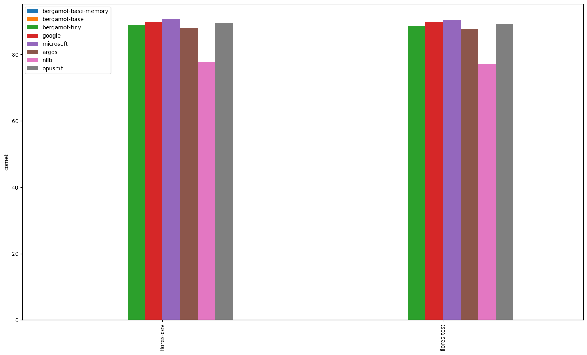
---

## am-en

| Translator/Dataset | flores-dev | flores-test |
| --- | --- | --- |
| google | 0.88 | 0.89 |
| microsoft | 0.87 | 0.87 |
| nllb | 0.85 | 0.85 |

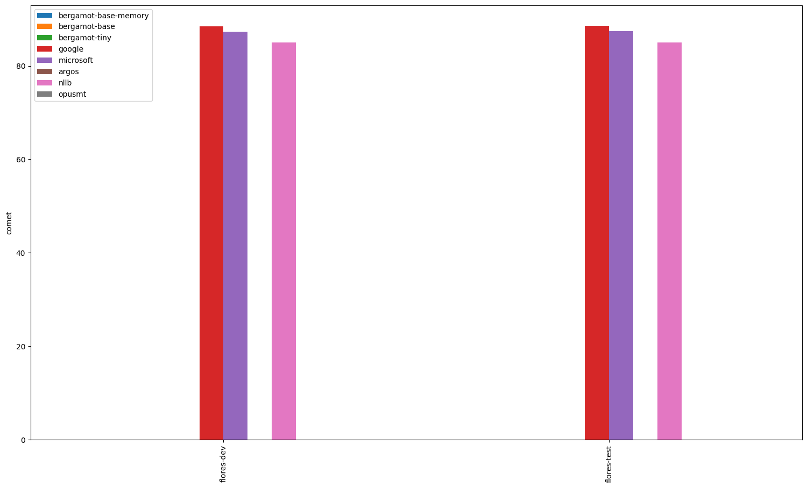
---

## cs-en

| Translator/Dataset | flores-test | wmt09 | wmt18 | wmt08 | wmt12 | wmt22 | wmt13 | wmt16 | wmt14 | wmt15 | wmt11 | wmt20 | wmt21 | flores-dev | wmt10 | wmt17 |
| --- | --- | --- | --- | --- | --- | --- | --- | --- | --- | --- | --- | --- | --- | --- | --- | --- |
| bergamot-tiny | 0.87 | 0.81 | 0.83 | 0.81 | 0.82 | 0.84 | 0.83 | 0.82 | 0.85 | 0.83 | 0.81 | 0.79 | 0.83 | 0.86 | 0.81 | 0.82 |
| google | 0.89 (+0.02, +2.58%) | 0.84 (+0.03, +3.11%) | 0.85 (+0.02, +2.40%) | 0.83 (+0.03, +3.18%) | 0.84 (+0.02, +2.66%) | 0.87 (+0.03, +3.68%) | 0.85 (+0.02, +2.50%) | 0.85 (+0.03, +3.58%) | 0.87 (+0.03, +3.12%) | 0.85 (+0.02, +2.93%) | 0.83 (+0.02, +2.55%) | 0.82 (+0.03, +3.54%) | 0.85 (+0.02, +2.53%) | 0.89 (+0.02, +2.74%) | 0.84 (+0.03, +3.36%) | 0.85 (+0.03, +3.07%) |
| microsoft | 0.89 (+0.02, +2.53%) | 0.84 (+0.03, +3.56%) | 0.85 (+0.02, +3.00%) | 0.84 (+0.03, +3.23%) | 0.84 (+0.03, +3.48%) | 0.87 (+0.04, +4.22%) | 0.86 (+0.03, +3.31%) | 0.85 (+0.03, +3.70%) | 0.88 (+0.03, +3.76%) | 0.86 (+0.03, +3.42%) | 0.84 (+0.03, +3.57%) | 0.82 (+0.03, +3.88%) | 0.85 (+0.02, +2.59%) | 0.89 (+0.02, +2.62%) | 0.84 (+0.03, +3.51%) | 0.85 (+0.03, +3.23%) |
| argos | 0.78 (-0.09, -10.45%) | 0.70 (-0.11, -13.59%) | 0.70 (-0.13, -15.42%) | 0.69 (-0.12, -14.36%) | 0.70 (-0.11, -13.88%) | 0.68 (-0.16, -18.95%) | 0.73 (-0.11, -12.82%) | 0.71 (-0.11, -13.82%) | 0.72 (-0.12, -14.69%) | 0.70 (-0.13, -15.64%) | 0.71 (-0.10, -12.38%) | 0.65 (-0.14, -18.09%) | 0.70 (-0.13, -15.41%) | 0.77 (-0.09, -10.61%) | 0.71 (-0.11, -12.93%) | 0.70 (-0.12, -14.53%) |
| nllb | 0.78 (-0.08, -9.51%) | 0.73 (-0.09, -10.84%) | 0.72 (-0.11, -12.97%) | 0.72 (-0.09, -10.72%) | 0.72 (-0.09, -11.13%) | 0.71 (-0.13, -15.61%) | 0.74 (-0.09, -11.10%) | 0.72 (-0.10, -12.24%) | 0.74 (-0.10, -12.03%) | 0.72 (-0.11, -13.69%) | 0.72 (-0.09, -10.74%) | 0.67 (-0.12, -14.84%) | 0.72 (-0.10, -12.52%) | 0.79 (-0.08, -9.02%) | 0.73 (-0.08, -10.15%) | 0.72 (-0.10, -12.29%) |
| opusmt | 0.87 (-0.00, -0.21%) | 0.82 (+0.00, +0.29%) | 0.82 (-0.01, -0.98%) | 0.80 (-0.01, -0.72%) | 0.82 (0.00, 0.00%) | 0.83 (-0.01, -0.80%) | 0.83 (+0.00, +0.01%) | 0.82 (-0.00, -0.33%) | 0.84 (-0.00, -0.52%) | 0.82 (-0.01, -0.60%) | 0.81 (+0.00, +0.04%) | 0.76 (-0.02, -2.96%) | 0.82 (-0.01, -0.96%) | 0.86 (-0.00, -0.07%) | 0.81 (-0.00, -0.15%) | 0.82 (-0.01, -0.94%) |

---

## en-ca

| Translator/Dataset | flores-test | flores-dev |
| --- | --- | --- |
| bergamot-tiny | 0.86 | 0.86 |
| google | 0.88 (+0.01, +1.71%) | 0.88 (+0.01, +1.70%) |
| microsoft | 0.88 (+0.02, +2.38%) | 0.88 (+0.02, +2.24%) |
| argos | 0.77 (-0.09, -10.71%) | 0.77 (-0.09, -10.73%) |
| nllb | 0.85 (-0.01, -1.53%) | 0.85 (-0.01, -1.45%) |
| opusmt | 0.76 (-0.10, -11.16%) | 0.77 (-0.09, -10.93%) |

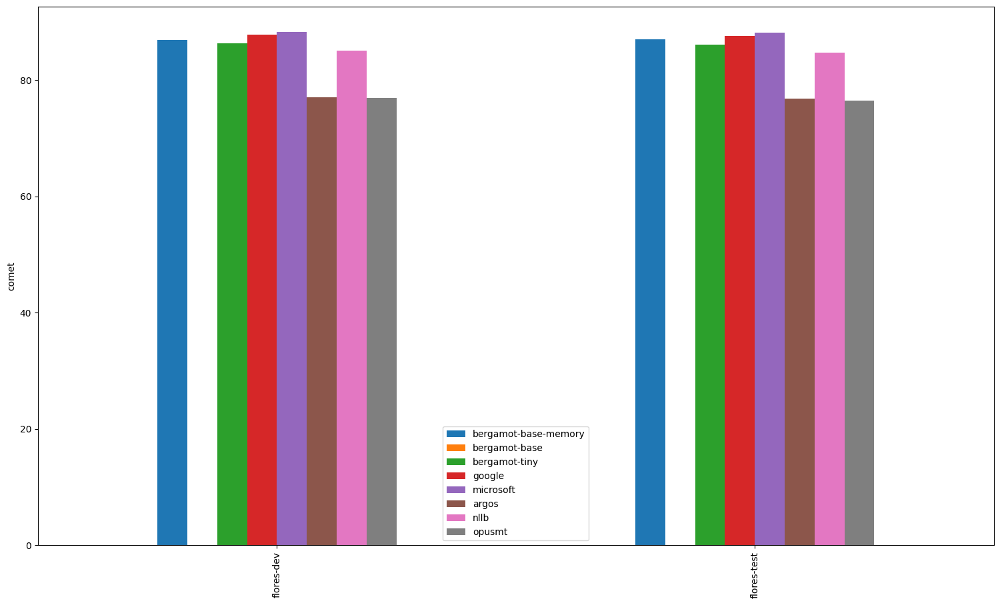
---

## en-cs

| Translator/Dataset | flores-test | wmt10 | wmt20 | wmt22 | wmt09 | wmt12 | flores-dev | wmt21 | wmt16 | wmt13 | wmt08 | wmt19 | wmt14 | wmt18 | wmt17 | wmt11 | wmt15 |
| --- | --- | --- | --- | --- | --- | --- | --- | --- | --- | --- | --- | --- | --- | --- | --- | --- | --- |
| bergamot-tiny | 0.88 | 0.85 | 0.85 | 0.86 | 0.85 | 0.84 | 0.87 | 0.82 | 0.85 | 0.86 | 0.84 | 0.84 | 0.88 | 0.86 | 0.85 | 0.84 | 0.86 |
| google | 0.91 (+0.04, +4.53%) | 0.89 (+0.04, +4.30%) | 0.89 (+0.04, +4.64%) | 0.91 (+0.05, +6.37%) | 0.89 (+0.04, +4.78%) | 0.88 (+0.04, +4.26%) | 0.92 (+0.04, +4.83%) | 0.86 (+0.04, +4.91%) | 0.89 (+0.04, +4.35%) | 0.90 (+0.03, +3.88%) | 0.88 (+0.05, +5.48%) | 0.87 (+0.04, +4.66%) | 0.92 (+0.04, +4.13%) | 0.89 (+0.03, +4.04%) | 0.89 (+0.04, +4.43%) | 0.88 (+0.04, +4.54%) | 0.90 (+0.04, +4.40%) |
| microsoft | 0.91 (+0.04, +4.37%) | 0.89 (+0.04, +4.69%) | 0.90 (+0.05, +5.71%) | 0.91 (+0.05, +5.52%) | 0.89 (+0.04, +5.01%) | 0.89 (+0.04, +4.94%) | 0.92 (+0.04, +4.78%) | 0.87 (+0.05, +5.97%) | 0.90 (+0.04, +4.71%) | 0.90 (+0.04, +4.45%) | 0.89 (+0.05, +5.78%) | 0.89 (+0.05, +6.30%) | 0.92 (+0.04, +4.73%) | 0.90 (+0.04, +4.44%) | 0.89 (+0.04, +4.83%) | 0.89 (+0.05, +5.43%) | 0.90 (+0.04, +4.59%) |
| argos | 0.71 (-0.16, -18.73%) | 0.68 (-0.17, -20.08%) | 0.59 (-0.26, -30.65%) | 0.74 (-0.12, -14.02%) | 0.69 (-0.16, -18.49%) | 0.67 (-0.17, -20.53%) | 0.72 (-0.15, -17.59%) | 0.59 (-0.23, -28.08%) | 0.68 (-0.17, -19.97%) | 0.72 (-0.15, -17.17%) | 0.66 (-0.17, -20.75%) | 0.60 (-0.23, -27.62%) | 0.69 (-0.19, -21.28%) | 0.68 (-0.18, -20.87%) | 0.68 (-0.17, -20.08%) | 0.69 (-0.15, -18.02%) | 0.68 (-0.18, -20.62%) |
| nllb | 0.87 (-0.01, -0.96%) | 0.85 (-0.01, -0.74%) | 0.83 (-0.02, -2.55%) | 0.85 (-0.01, -1.57%) | 0.84 (-0.01, -0.98%) | 0.84 (-0.01, -1.04%) | 0.86 (-0.01, -1.05%) | 0.81 (-0.01, -1.54%) | 0.84 (-0.01, -1.47%) | 0.86 (-0.01, -0.59%) | 0.84 (-0.00, -0.06%) | 0.82 (-0.02, -2.02%) | 0.87 (-0.01, -1.46%) | 0.85 (-0.01, -1.31%) | 0.84 (-0.01, -1.18%) | 0.84 (-0.00, -0.05%) | 0.85 (-0.01, -1.57%) |
| opusmt | 0.86 (-0.02, -1.78%) | 0.85 (-0.01, -0.61%) | 0.81 (-0.04, -4.29%) | 0.85 (-0.01, -0.86%) | 0.85 (-0.00, -0.31%) | 0.84 (-0.00, -0.58%) | 0.86 (-0.01, -1.53%) | 0.80 (-0.03, -3.28%) | 0.85 (-0.01, -1.08%) | 0.87 (+0.00, +0.28%) | 0.83 (-0.00, -0.57%) | 0.80 (-0.03, -4.00%) | 0.87 (-0.01, -0.88%) | 0.85 (-0.01, -0.82%) | 0.85 (-0.01, -0.63%) | 0.84 (+0.00, +0.50%) | 0.86 (-0.01, -0.58%) |

---

## en-hy

| Translator/Dataset | flores-dev | flores-test |
| --- | --- | --- |
| google | 0.90 | 0.90 |
| microsoft | 0.88 | 0.88 |
| nllb | 0.87 | 0.87 |
| opusmt | 0.68 | 0.68 |

---

## en-vi

| Translator/Dataset | flores-test | flores-dev |
| --- | --- | --- |
| google | 0.90 | 0.90 |
| microsoft | 0.89 | 0.89 |
| nllb | 0.86 | 0.86 |
| opusmt | 0.76 | 0.76 |

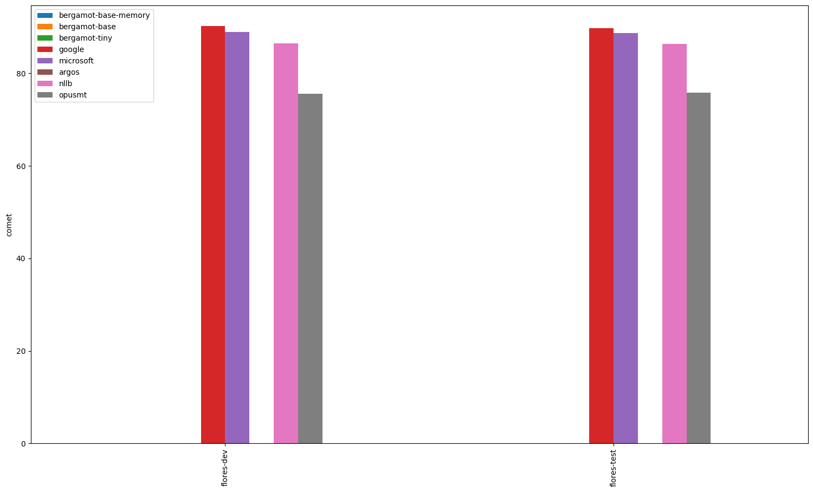
---

## ig-en

| Translator/Dataset | flores-test | flores-dev |
| --- | --- | --- |
| google | 0.74 | 0.73 |
| microsoft | 0.68 | 0.67 |
| nllb | 0.66 | 0.65 |
| opusmt | 0.52 | 0.52 |

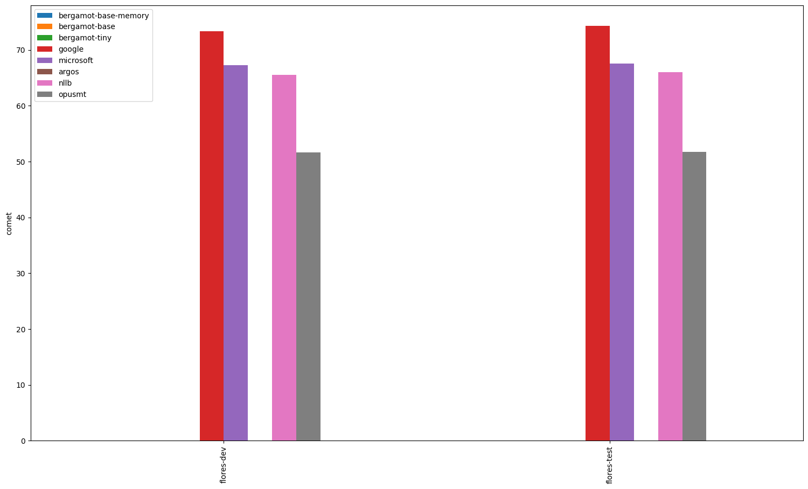
---

## nb-en

| Translator/Dataset | flores-test | flores-dev |
| --- | --- | --- |
| bergamot-tiny | 0.85 | 0.85 |
| google | 0.89 (+0.04, +4.91%) | 0.89 (+0.05, +5.56%) |
| microsoft | 0.89 (+0.04, +4.86%) | 0.89 (+0.05, +5.39%) |
| argos | 0.86 (+0.01, +1.72%) | 0.87 (+0.02, +2.48%) |
| nllb | 0.75 (-0.10, -11.46%) | 0.77 (-0.08, -9.51%) |

---

## my-en

| Translator/Dataset | flores-dev | flores-test |
| --- | --- | --- |
| google | 0.87 | 0.87 |
| microsoft | 0.84 | 0.84 |
| nllb | 0.84 | 0.85 |

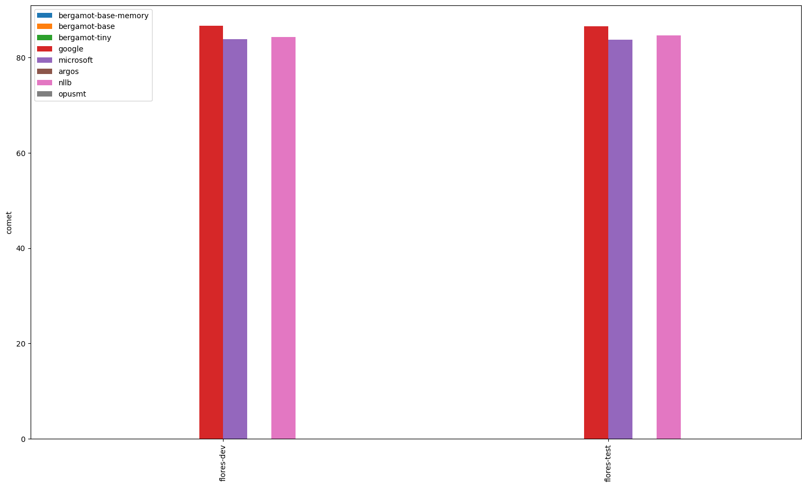
---

## en-et

| Translator/Dataset | flores-test | wmt18 | flores-dev |
| --- | --- | --- | --- |
| bergamot-tiny | 0.87 | 0.86 | 0.87 |
| google | 0.92 (+0.04, +4.84%) | 0.91 (+0.04, +4.78%) | 0.92 (+0.05, +5.24%) |
| microsoft | 0.91 (+0.04, +4.63%) | 0.91 (+0.04, +4.72%) | 0.91 (+0.04, +4.66%) |
| argos | 0.86 (-0.01, -1.46%) | 0.85 (-0.02, -2.20%) | 0.86 (-0.01, -1.54%) |
| nllb | 0.83 (-0.04, -5.00%) | 0.83 (-0.04, -4.50%) | 0.84 (-0.04, -4.27%) |
| opusmt | 0.86 (-0.01, -1.16%) | 0.85 (-0.01, -1.55%) | 0.86 (-0.01, -1.20%) |

---

## lt-en

| Translator/Dataset | flores-test | wmt19 | flores-dev |
| --- | --- | --- | --- |
| bergamot-tiny | 0.84 | 0.83 | 0.84 |
| google | 0.87 (+0.03, +4.09%) | 0.85 (+0.02, +2.40%) | 0.87 (+0.03, +3.84%) |
| microsoft | 0.86 (+0.02, +2.55%) | 0.85 (+0.02, +2.16%) | 0.86 (+0.02, +2.26%) |
| nllb | 0.66 (-0.18, -21.08%) | 0.68 (-0.15, -18.54%) | 0.67 (-0.17, -20.67%) |

---

## en-de

| Translator/Dataset | wmt12 | wmt21 | wmt15 | wmt19 | wmt14 | wmt22 | wmt08 | iwslt17 | wmt13 | wmt10 | wmt16 | flores-test | wmt09 | wmt18 | wmt20 | wmt11 | flores-dev | wmt17 |
| --- | --- | --- | --- | --- | --- | --- | --- | --- | --- | --- | --- | --- | --- | --- | --- | --- | --- | --- |
| bergamot-tiny | 0.82 | 0.82 | 0.84 | 0.84 | 0.85 | 0.82 | 0.82 | 0.82 | 0.84 | 0.83 | 0.86 | 0.86 | 0.82 | 0.87 | 0.84 | 0.81 | 0.86 | 0.85 |
| google | 0.84 (+0.02, +3.01%) | 0.85 (+0.02, +2.98%) | 0.87 (+0.03, +3.39%) | 0.87 (+0.02, +2.75%) | 0.88 (+0.03, +3.68%) | 0.87 (+0.05, +5.66%) | 0.85 (+0.03, +3.62%) | 0.85 (+0.03, +3.16%) | 0.86 (+0.02, +2.90%) | 0.85 (+0.02, +2.88%) | 0.88 (+0.03, +2.99%) | 0.89 (+0.03, +3.63%) | 0.84 (+0.03, +3.44%) | 0.89 (+0.02, +2.82%) | 0.87 (+0.03, +3.77%) | 0.84 (+0.03, +3.55%) | 0.89 (+0.03, +4.06%) | 0.87 (+0.03, +3.32%) |
| microsoft | 0.85 (+0.03, +3.50%) | 0.85 (+0.03, +3.43%) | 0.87 (+0.03, +3.48%) | 0.87 (+0.03, +3.44%) | 0.88 (+0.03, +3.77%) | 0.87 (+0.05, +5.69%) | 0.85 (+0.03, +3.89%) | 0.85 (+0.03, +3.23%) | 0.87 (+0.03, +3.28%) | 0.86 (+0.03, +3.37%) | 0.89 (+0.03, +3.41%) | 0.89 (+0.03, +3.67%) | 0.85 (+0.03, +3.86%) | 0.90 (+0.03, +3.21%) | 0.87 (+0.03, +4.12%) | 0.84 (+0.03, +4.22%) | 0.89 (+0.03, +3.85%) | 0.88 (+0.03, +3.59%) |
| argos | 0.78 (-0.04, -5.28%) | 0.74 (-0.09, -10.36%) | 0.79 (-0.05, -6.11%) | 0.76 (-0.08, -9.63%) | 0.80 (-0.05, -6.12%) | 0.79 (-0.03, -3.97%) | 0.77 (-0.05, -5.57%) | 0.79 (-0.04, -4.28%) | 0.81 (-0.03, -3.91%) | 0.79 (-0.04, -5.21%) | 0.80 (-0.05, -6.15%) | 0.81 (-0.04, -5.22%) | 0.78 (-0.03, -3.92%) | 0.82 (-0.05, -5.82%) | 0.75 (-0.09, -10.40%) | 0.77 (-0.03, -4.27%) | 0.81 (-0.04, -5.15%) | 0.80 (-0.05, -6.01%) |
| nllb | 0.81 (-0.01, -0.90%) | 0.81 (-0.02, -1.90%) | 0.83 (-0.01, -1.14%) | 0.82 (-0.02, -2.32%) | 0.84 (-0.01, -1.37%) | 0.82 (-0.00, -0.27%) | 0.81 (-0.01, -0.76%) | 0.81 (-0.01, -1.07%) | 0.83 (-0.00, -0.58%) | 0.83 (-0.00, -0.53%) | 0.84 (-0.02, -1.79%) | 0.85 (-0.01, -0.82%) | 0.82 (-0.00, -0.17%) | 0.85 (-0.02, -1.98%) | 0.82 (-0.02, -1.90%) | 0.81 (+0.00, +0.04%) | 0.85 (-0.00, -0.55%) | 0.83 (-0.01, -1.56%) |
| opusmt | 0.81 (-0.01, -0.88%) | 0.79 (-0.03, -4.13%) | 0.83 (-0.01, -1.10%) | 0.81 (-0.03, -3.47%) | 0.84 (-0.01, -1.26%) | 0.82 (-0.00, -0.21%) | 0.81 (-0.01, -0.81%) | 0.82 (-0.00, -0.27%) | 0.84 (-0.00, -0.25%) | 0.83 (-0.00, -0.54%) | 0.84 (-0.02, -1.81%) | 0.85 (-0.01, -1.13%) | 0.82 (-0.00, -0.13%) | 0.86 (-0.01, -0.70%) | 0.80 (-0.03, -3.76%) | 0.80 (-0.00, -0.42%) | 0.84 (-0.01, -1.51%) | 0.84 (-0.01, -1.09%) |

---

## ru-en

| Translator/Dataset | mtedx_test | flores-test | wmt19 | wmt18 | wmt22 | wmt13 | wmt16 | wmt14 | wmt15 | wmt20 | wmt21 | flores-dev | wmt17 |
| --- | --- | --- | --- | --- | --- | --- | --- | --- | --- | --- | --- | --- | --- |
| bergamot-tiny | 0.77 | 0.84 | 0.83 | 0.83 | 0.82 | 0.82 | 0.82 | 0.85 | 0.83 | 0.83 | 0.83 | 0.84 | 0.83 |
| google | 0.79 (+0.02, +2.41%) | 0.87 (+0.03, +2.98%) | 0.84 (+0.01, +1.66%) | 0.85 (+0.02, +2.85%) | 0.85 (+0.03, +3.44%) | 0.84 (+0.02, +2.42%) | 0.85 (+0.02, +3.00%) | 0.87 (+0.02, +2.59%) | 0.85 (+0.02, +2.81%) | 0.85 (+0.02, +1.89%) | 0.85 (+0.02, +2.20%) | 0.87 (+0.03, +3.17%) | 0.86 (+0.03, +3.01%) |
| microsoft | 0.79 (+0.02, +2.75%) | 0.87 (+0.02, +2.84%) | 0.85 (+0.02, +2.97%) | 0.85 (+0.03, +3.33%) | 0.85 (+0.03, +3.78%) | 0.84 (+0.02, +3.04%) | 0.85 (+0.03, +3.28%) | 0.87 (+0.02, +2.90%) | 0.85 (+0.03, +3.19%) | 0.86 (+0.02, +2.52%) | 0.86 (+0.02, +2.78%) | 0.87 (+0.02, +2.94%) | 0.86 (+0.03, +3.36%) |
| argos | 0.73 (-0.04, -4.84%) | 0.80 (-0.04, -4.84%) | 0.76 (-0.07, -8.32%) | 0.78 (-0.05, -5.72%) | 0.75 (-0.07, -8.18%) | 0.77 (-0.04, -5.11%) | 0.78 (-0.05, -5.75%) | 0.79 (-0.05, -6.12%) | 0.78 (-0.05, -5.58%) | 0.77 (-0.06, -7.19%) | 0.77 (-0.06, -7.60%) | 0.80 (-0.04, -4.66%) | 0.78 (-0.05, -5.88%) |
| nllb | 0.78 (+0.00, +0.64%) | 0.85 (+0.01, +1.19%) | 0.83 (+0.00, +0.34%) | 0.83 (+0.01, +0.97%) | 0.82 (-0.00, -0.18%) | 0.83 (+0.01, +1.08%) | 0.84 (+0.01, +1.42%) | 0.85 (+0.00, +0.43%) | 0.84 (+0.01, +0.94%) | 0.84 (+0.00, +0.35%) | 0.83 (+0.00, +0.17%) | 0.86 (+0.01, +1.53%) | 0.84 (+0.01, +0.79%) |
| opusmt | 0.77 (-0.00, -0.44%) | 0.84 (-0.00, -0.40%) | 0.80 (-0.02, -2.80%) | 0.82 (-0.01, -0.83%) | 0.80 (-0.02, -2.61%) | 0.81 (-0.00, -0.42%) | 0.82 (-0.01, -0.98%) | 0.83 (-0.01, -1.51%) | 0.82 (-0.01, -0.85%) | 0.81 (-0.02, -2.49%) | 0.81 (-0.02, -2.72%) | 0.84 (-0.00, -0.39%) | 0.82 (-0.01, -1.14%) |

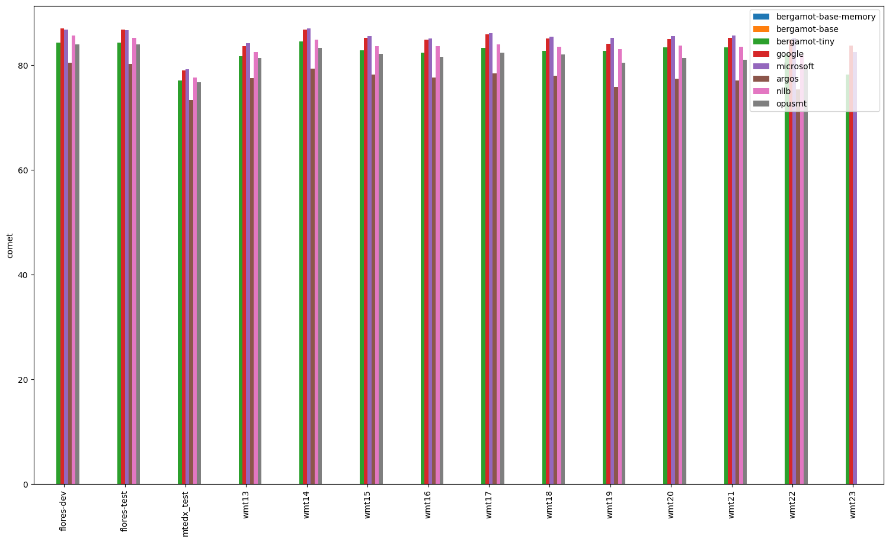
---

## da-en

| Translator/Dataset | flores-test | flores-dev |
| --- | --- | --- |
| bergamot-tiny | 0.89 | 0.89 |
| google | 0.90 (+0.01, +1.48%) | 0.91 (+0.01, +1.59%) |
| microsoft | 0.91 (+0.01, +1.53%) | 0.91 (+0.02, +1.71%) |
| argos | 0.84 (-0.05, -5.66%) | 0.85 (-0.04, -4.81%) |
| nllb | 0.78 (-0.11, -12.38%) | 0.78 (-0.11, -12.24%) |
| opusmt | 0.89 (-0.00, -0.06%) | 0.89 (+0.00, +0.09%) |

---

## en-bg

| Translator/Dataset | flores-test | flores-dev |
| --- | --- | --- |
| bergamot-tiny | 0.89 | 0.89 |
| google | 0.92 (+0.02, +2.56%) | 0.92 (+0.02, +2.50%) |
| microsoft | 0.91 (+0.02, +1.87%) | 0.91 (+0.02, +1.71%) |
| argos | 0.88 (-0.01, -1.30%) | 0.88 (-0.01, -1.63%) |
| nllb | 0.88 (-0.01, -1.43%) | 0.88 (-0.01, -1.66%) |
| opusmt | 0.82 (-0.07, -7.92%) | 0.82 (-0.07, -7.81%) |

---

## en-uk

| Translator/Dataset | flores-test | wmt22 | flores-dev |
| --- | --- | --- | --- |
| bergamot-base-memory | 0.88 | 0.83 | 0.88 |
| google | 0.91 (+0.03, +3.16%) | 0.89 (+0.05, +6.39%) | 0.91 (+0.03, +3.22%) |
| microsoft | 0.90 (+0.02, +2.26%) | 0.87 (+0.04, +4.94%) | 0.90 (+0.02, +2.34%) |
| argos | 0.70 (-0.18, -20.46%) | 0.69 (-0.15, -17.50%) | 0.70 (-0.18, -20.25%) |
| nllb | 0.84 (-0.04, -4.46%) | 0.80 (-0.03, -3.94%) | 0.84 (-0.03, -3.93%) |
| opusmt | 0.82 (-0.06, -7.22%) | 0.76 (-0.08, -9.21%) | 0.81 (-0.07, -7.46%) |

---

## en-az

| Translator/Dataset | flores-test | flores-dev |
| --- | --- | --- |
| google | 0.87 | 0.88 |
| microsoft | 0.84 | 0.85 |
| argos | 0.52 | 0.53 |
| nllb | 0.84 | 0.84 |
| opusmt | 0.56 | 0.56 |

---

## en-am

| Translator/Dataset | flores-dev | flores-test |
| --- | --- | --- |
| google | 0.87 | 0.88 |
| microsoft | 0.87 | 0.87 |
| nllb | 0.87 | 0.87 |

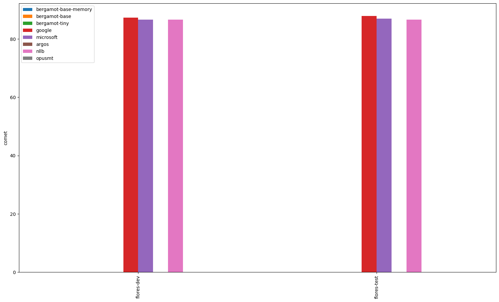
---

## en-tr

| Translator/Dataset | flores-test | flores-dev | wmt16 | wmt17 | wmt18 |
| --- | --- | --- | --- | --- | --- |
| bergamot-tiny | 0.88 | 0.88 | 0.86 | 0.86 | 0.87 |
| google | 0.91 (+0.03, +3.87%) | 0.91 (+0.04, +4.06%) | 0.90 (+0.04, +4.22%) | 0.90 (+0.04, +4.91%) | 0.90 (+0.03, +3.80%) |
| microsoft | 0.91 (+0.03, +3.86%) | 0.91 (+0.03, +3.62%) | 0.89 (+0.03, +3.73%) | 0.90 (+0.04, +4.32%) | 0.90 (+0.03, +3.57%) |
| argos | 0.78 (-0.09, -10.55%) | 0.79 (-0.09, -10.10%) | 0.78 (-0.08, -9.72%) | 0.77 (-0.09, -10.46%) | 0.78 (-0.08, -9.63%) |
| nllb | 0.86 (-0.01, -1.29%) | 0.87 (-0.01, -0.84%) | 0.85 (-0.01, -1.14%) | 0.86 (-0.01, -0.64%) | 0.86 (-0.01, -0.94%) |

---

## ko-en

| Translator/Dataset | flores-dev | flores-test | iwslt17 |
| --- | --- | --- | --- |
| bergamot-base | 0.87 | 0.86 | 0.81 |
| google | 0.89 (+0.02, +2.54%) | 0.89 (+0.02, +2.87%) | 0.83 (+0.03, +3.12%) |
| microsoft | 0.89 (+0.02, +2.28%) | 0.89 (+0.02, +2.67%) | 0.83 (+0.02, +2.14%) |
| argos | 0.74 (-0.13, -14.60%) | 0.74 (-0.13, -14.67%) | 0.67 (-0.14, -17.35%) |
| nllb | 0.86 (-0.01, -1.52%) | 0.85 (-0.01, -1.45%) | 0.80 (-0.01, -1.00%) |
| opusmt | 0.83 (-0.04, -4.53%) | 0.83 (-0.04, -4.36%) | 0.80 (-0.01, -1.55%) |

---

## en-hi

| Translator/Dataset | flores-test | wmt14 | flores-dev |
| --- | --- | --- | --- |
| google | 0.83 | 0.83 | 0.83 |
| microsoft | 0.81 | 0.81 | 0.80 |
| argos | 0.74 | 0.73 | 0.74 |
| nllb | 0.79 | 0.80 | 0.79 |
| opusmt | 0.60 | 0.60 | 0.60 |

---

## tr-en

| Translator/Dataset | flores-test | wmt18 | wmt16 | flores-dev | wmt17 |
| --- | --- | --- | --- | --- | --- |
| bergamot-tiny | 0.87 | 0.83 | 0.83 | 0.87 | 0.84 |
| google | 0.90 (+0.04, +4.21%) | 0.88 (+0.04, +5.07%) | 0.88 (+0.04, +5.32%) | 0.90 (+0.03, +3.79%) | 0.88 (+0.04, +5.24%) |
| microsoft | 0.90 (+0.04, +4.07%) | 0.88 (+0.04, +5.21%) | 0.87 (+0.04, +4.88%) | 0.90 (+0.03, +3.58%) | 0.88 (+0.04, +4.81%) |
| argos | 0.79 (-0.08, -8.95%) | 0.73 (-0.10, -12.05%) | 0.74 (-0.09, -11.05%) | 0.80 (-0.07, -8.08%) | 0.74 (-0.10, -12.03%) |
| nllb | 0.80 (-0.07, -8.00%) | 0.75 (-0.08, -9.69%) | 0.75 (-0.08, -9.69%) | 0.80 (-0.07, -7.89%) | 0.75 (-0.09, -10.70%) |
| opusmt | 0.87 (+0.00, +0.52%) | 0.83 (+0.00, +0.08%) | 0.83 (-0.00, -0.19%) | 0.87 (+0.00, +0.22%) | 0.83 (-0.01, -0.91%) |

---

## en-ml

| Translator/Dataset | flores-test | flores-dev |
| --- | --- | --- |
| google | 0.90 | 0.90 |
| microsoft | 0.89 | 0.89 |
| nllb | 0.86 | 0.86 |
| opusmt | 0.71 | 0.71 |

---

## ro-en

| Translator/Dataset | flores-test | wmt16 | flores-dev |
| --- | --- | --- | --- |
| bergamot-tiny | 0.88 | 0.85 | 0.88 |
| google | 0.90 (+0.02, +2.04%) | 0.87 (+0.01, +1.51%) | 0.90 (+0.02, +2.10%) |
| microsoft | 0.90 (+0.02, +2.18%) | 0.87 (+0.02, +2.06%) | 0.90 (+0.02, +2.13%) |
| nllb | 0.81 (-0.06, -7.30%) | 0.77 (-0.09, -10.02%) | 0.81 (-0.06, -7.37%) |

---

## en-hr

| Translator/Dataset | flores-test | wmt22 | flores-dev |
| --- | --- | --- | --- |
| bergamot-tiny | 0.87 | 0.82 | 0.88 |
| google | 0.91 (+0.04, +4.65%) | 0.88 (+0.06, +7.01%) | 0.92 (+0.04, +4.56%) |
| microsoft | 0.91 (+0.03, +3.57%) | 0.86 (+0.04, +4.87%) | 0.91 (+0.03, +3.30%) |
| nllb | 0.86 (-0.02, -1.80%) | 0.81 (-0.01, -1.53%) | 0.86 (-0.02, -1.75%) |

---

## el-en

| Translator/Dataset | mtedx_test | flores-test | flores-dev |
| --- | --- | --- | --- |
| bergamot-tiny | 0.82 | 0.85 | 0.86 |
| google | 0.84 (+0.02, +2.05%) | 0.88 (+0.03, +3.15%) | 0.89 (+0.03, +2.91%) |
| microsoft | 0.84 (+0.02, +2.57%) | 0.88 (+0.02, +2.73%) | 0.88 (+0.02, +2.53%) |
| argos | 0.82 (-0.00, -0.04%) | 0.86 (+0.00, +0.40%) | 0.86 (+0.00, +0.34%) |
| nllb | 0.82 (-0.00, -0.28%) | 0.86 (+0.01, +0.98%) | 0.87 (+0.01, +0.71%) |

---

## bg-en

| Translator/Dataset | flores-test | flores-dev |
| --- | --- | --- |
| bergamot-tiny | 0.87 | 0.87 |
| google | 0.89 (+0.02, +2.23%) | 0.89 (+0.02, +2.35%) |
| microsoft | 0.88 (+0.01, +1.63%) | 0.88 (+0.01, +1.63%) |
| argos | 0.85 (-0.01, -1.29%) | 0.85 (-0.01, -1.45%) |
| nllb | 0.86 (-0.01, -1.19%) | 0.86 (-0.01, -1.15%) |
| opusmt | 0.86 (-0.00, -0.35%) | 0.86 (-0.01, -0.69%) |

---

## en-ms

| Translator/Dataset | flores-dev | flores-test |
| --- | --- | --- |
| google | 0.90 | 0.90 |
| microsoft | 0.90 | 0.90 |
| nllb | 0.88 | 0.88 |

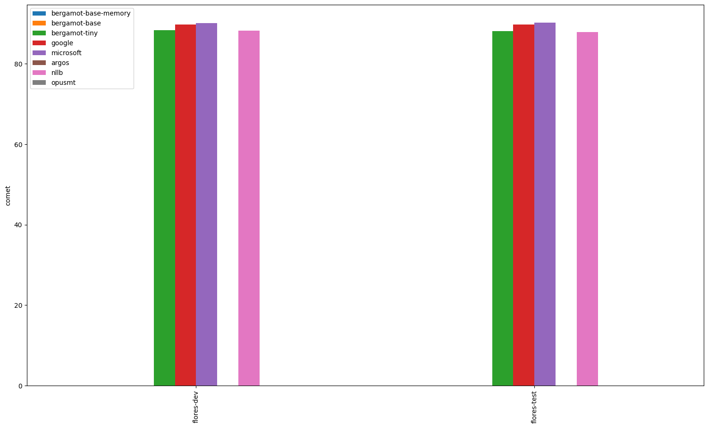
---

## et-en

| Translator/Dataset | flores-test | wmt18 | flores-dev |
| --- | --- | --- | --- |
| bergamot-tiny | 0.86 | 0.83 | 0.85 |
| google | 0.90 (+0.04, +4.70%) | 0.88 (+0.04, +5.16%) | 0.90 (+0.05, +5.55%) |
| microsoft | 0.89 (+0.03, +3.77%) | 0.87 (+0.04, +4.50%) | 0.89 (+0.04, +4.49%) |
| argos | 0.87 (+0.01, +1.24%) | 0.85 (+0.01, +1.61%) | 0.87 (+0.02, +2.04%) |
| nllb | 0.60 (-0.26, -29.85%) | 0.58 (-0.25, -30.42%) | 0.60 (-0.25, -29.76%) |
| opusmt | 0.87 (+0.01, +1.54%) | 0.85 (+0.02, +1.98%) | 0.88 (+0.02, +2.63%) |

---

## th-en

| Translator/Dataset | flores-test | flores-dev |
| --- | --- | --- |
| google | 0.88 | 0.88 |
| microsoft | 0.88 | 0.88 |
| nllb | 0.84 | 0.85 |
| opusmt | 0.82 | 0.82 |

---

## es-en

| Translator/Dataset | mtedx_test | flores-test | wmt09 | wmt08 | wmt12 | wmt13 | wmt11 | flores-dev | wmt10 |
| --- | --- | --- | --- | --- | --- | --- | --- | --- | --- |
| bergamot-tiny | 0.81 | 0.85 | 0.81 | 0.81 | 0.83 | 0.84 | 0.82 | 0.85 | 0.83 |
| google | 0.83 (+0.02, +2.17%) | 0.87 (+0.02, +2.49%) | 0.82 (+0.02, +2.07%) | 0.82 (+0.01, +1.75%) | 0.84 (+0.01, +0.93%) | 0.85 (+0.01, +1.01%) | 0.83 (+0.01, +0.84%) | 0.87 (+0.02, +2.60%) | 0.85 (+0.02, +1.90%) |
| microsoft | 0.83 (+0.02, +2.97%) | 0.87 (+0.02, +2.46%) | 0.83 (+0.02, +2.50%) | 0.82 (+0.02, +2.26%) | 0.85 (+0.02, +2.10%) | 0.86 (+0.02, +1.92%) | 0.84 (+0.02, +2.17%) | 0.87 (+0.02, +2.36%) | 0.85 (+0.02, +2.35%) |
| argos | 0.81 (-0.00, -0.46%) | 0.84 (-0.01, -0.66%) | 0.80 (-0.01, -0.90%) | 0.80 (-0.01, -1.07%) | 0.82 (-0.01, -1.25%) | 0.83 (-0.01, -1.00%) | 0.81 (-0.01, -1.13%) | 0.84 (-0.01, -0.96%) | 0.83 (-0.01, -0.96%) |
| nllb | 0.80 (-0.01, -1.63%) | 0.85 (+0.00, +0.56%) | 0.81 (+0.01, +0.78%) | 0.81 (+0.00, +0.35%) | 0.83 (-0.01, -0.66%) | 0.84 (-0.00, -0.53%) | 0.82 (-0.00, -0.43%) | 0.86 (+0.01, +0.67%) | 0.83 (-0.00, -0.01%) |
| opusmt | 0.83 (+0.01, +1.84%) | 0.86 (+0.01, +1.15%) | 0.82 (+0.01, +0.97%) | 0.81 (+0.01, +0.87%) | 0.84 (+0.00, +0.52%) | 0.85 (+0.01, +0.72%) | 0.83 (+0.01, +0.73%) | 0.86 (+0.01, +0.96%) | 0.84 (+0.01, +0.95%) |

---

## en-my

| Translator/Dataset | flores-dev | flores-test |
| --- | --- | --- |
| google | 0.87 | 0.87 |
| microsoft | 0.86 | 0.86 |
| nllb | 0.85 | 0.85 |

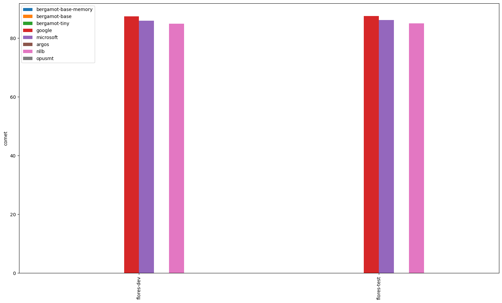
---

## gl-en

| Translator/Dataset | flores-test | flores-dev |
| --- | --- | --- |
| google | 0.89 | 0.89 |
| microsoft | 0.88 | 0.87 |
| nllb | 0.83 | 0.83 |
| opusmt | 0.72 | 0.73 |

---

## en-bn

| Translator/Dataset | flores-test | flores-dev |
| --- | --- | --- |
| google | 0.87 | 0.86 |
| microsoft | 0.87 | 0.87 |
| nllb | 0.85 | 0.85 |

---

## en-tl

| Translator/Dataset | flores-test | flores-dev |
| --- | --- | --- |
| google | 0.85 | 0.85 |
| microsoft | 0.85 | 0.85 |
| nllb | 0.81 | 0.81 |
| opusmt | 0.83 | 0.82 |

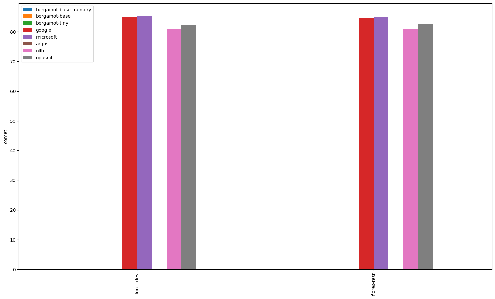
---

## en-ro

| Translator/Dataset | wmt16 | flores-test | flores-dev |
| --- | --- | --- | --- |
| bergamot-tiny | 0.87 | 0.88 | 0.88 |
| google | 0.88 (+0.02, +1.99%) | 0.91 (+0.02, +2.44%) | 0.91 (+0.02, +2.51%) |
| microsoft | 0.89 (+0.02, +2.80%) | 0.91 (+0.02, +2.69%) | 0.91 (+0.02, +2.79%) |
| nllb | 0.86 (-0.01, -0.66%) | 0.88 (-0.01, -0.77%) | 0.88 (-0.01, -0.74%) |
| opusmt | 0.86 (-0.01, -1.39%) | 0.87 (-0.02, -1.82%) | 0.87 (-0.01, -1.48%) |

---

## en-nb

| Translator/Dataset | flores-dev | flores-test |
| --- | --- | --- |
| google | 0.90 | 0.90 |
| microsoft | 0.90 | 0.90 |
| nllb | 0.87 | 0.87 |

---

## en-bs

| Translator/Dataset | flores-test | flores-dev |
| --- | --- | --- |
| google | 0.91 | 0.92 |
| microsoft | 0.91 | 0.91 |
| nllb | 0.86 | 0.87 |

---

## gu-en

| Translator/Dataset | flores-test | wmt19 | flores-dev |
| --- | --- | --- | --- |
| bergamot-tiny | 0.87 | 0.86 | 0.87 |
| google | 0.90 (+0.03, +3.73%) | 0.90 (+0.04, +4.64%) | 0.90 (+0.03, +3.58%) |
| microsoft | 0.89 (+0.02, +2.63%) | 0.89 (+0.03, +3.37%) | 0.89 (+0.02, +2.53%) |
| nllb | 0.89 (+0.02, +1.91%) | 0.87 (+0.01, +0.93%) | 0.89 (+0.02, +2.09%) |

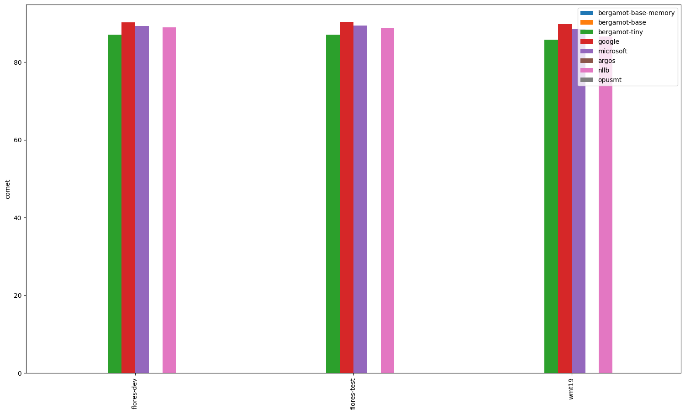
---