# What is COMET

COMET is a neural framework its developers present for training multilingual machine translation evaluation models. The framework has been reported to obtain new state-of-the-art levels of correlation with human judgments. Recent breakthroughs in cross-lingual pre-trained language modeling have been leveraged by the framework resulting in highly multilingual and adaptable MT evaluation models.

Three models with different human judgments have been trained to showcase the framework. These include Direct Assessments, Human-mediated Translation Edit Rate, and Multidimensional Quality Metrics. These models are designed to exploit information from source input and a target-language reference translation to more accurately predict MT quality.

The models developed by COMET have achieved new state-of-the-art performance on the WMT 2019 Metrics shared task, demonstrating robustness to high-performing systems.

## Interpreting Scores:

When using COMET to evaluate machine translation, it's important to understand how to interpret the scores it produces.

In general, COMET models are trained to predict quality scores for translations. These scores are typically normalized using a z-score transformation to account for individual differences among annotators. While the raw score itself does not have a direct interpretation, it is useful for ranking translations and systems according to their quality.

However, for the latest COMET models like Unbabel/wmt22-comet-da, we have introduced a new training approach that scales the scores between 0 and 1. This makes it easier to interpret the scores: a score close to 1 indicates a high-quality translation, while a score close to 0 indicates a translation that is no better than random chance.

It's worth noting that when using COMET to compare the performance of two different translation systems, it's important to run the comet-compare command to obtain statistical significance measures. This command compares the output of two systems using a statistical hypothesis test, providing an estimate of the probability that the observed difference in scores between the systems is due to chance. This is an important step to ensure that any differences in scores between systems are statistically significant.

Overall, the added interpretability of scores in the latest COMET models, combined with the ability to assess statistical significance between systems using comet-compare, make COMET a valuable tool for evaluating machine translation.

Source: https://aclanthology.org/2020.emnlp-main.213.pdf

Tool: https://github.com/Unbabel/COMET

# What are these benchmarks

## Translators

1. **bergamot** - uses compiled  [bergamot-translator](https://github.com/mozilla/bergamot-translator)  (wrapper for marian that is used by Firefox Translations web extension)
2. **google** - uses Google Translation [API](https://cloud.google.com/translate)
3. **microsoft** - uses Azure Cognitive Services Translator [API](https://azure.microsoft.com/en-us/services/cognitive-services/translator/)
4. **argos** - uses [Argos Translate](https://github.com/argosopentech/argos-translate)
5. **nllb** - uses [No Language Left Behind (NLLB)](https://github.com/facebookresearch/fairseq/tree/nllb)
6. **opus-mt** - uses [Opus-MT models](https://github.com/Helsinki-NLP/Opus-MT)

## Method

We use official WMT ([Conference on Machine Translation](http://statmt.org/wmt21/)) parallel datasets. Available datasets are discovered automatically based on a language pair.

We perform the translation from source to target language using one of the three translation systems, compare the result with the dataset reference, and then calculate the [COMET](https://github.com/Unbabel/COMET) score.

Both absolute and relative differences in the scores between Bergamot and other systems are reported.

We also compare the systems using the `comet-compare` tool that calculates the statistical significance with Paired T-Test and bootstrap resampling.

# Evaluation results

`avg` = average on all datasets

## avg

| Translator/Dataset | af-en | zh-en | en-gu | hy-en | en-fr | en-lt | en-pt | en-hu | en-kn | kn-en | en-sl | en-ta | en-ig | hi-en | en-ko | bs-en | he-en | en-sv | fa-en | bn-en | en-mt | sr-en | mt-en | sk-en | is-en | en-es | it-en | pt-en | lv-en | en-sr | tl-en | en-fa | de-en | vi-en | en-te | en-ru | en-pl | en-fi | en-gl | ta-en | en-sk | nl-en | en-mr | be-en | pl-en | ja-en | en-it | uk-en | az-en | ml-en | ca-en | te-en | fi-en | en-ar | en-id | en-zh | en-be | en-th | sl-en | hr-en | en-el | mr-en | hu-en | en-ja | en-af | ms-en | id-en | en-he | en-da | en-is | fr-en | ar-en | en-lv | cy-en | en-cy | en-nl | sv-en | am-en | cs-en | en-ca | en-cs | en-hy | en-vi | ig-en | nb-en | my-en | en-et | lt-en | en-de | ru-en | da-en | en-bg | en-uk | en-az | en-am | en-tr | ko-en | en-hi | tr-en | en-ml | ro-en | en-hr | el-en | bg-en | en-ms | et-en | th-en | es-en | en-my | gl-en | en-bn | en-tl | en-ro | en-nb | en-bs | gu-en |
| --- | --- | --- | --- | --- | --- | --- | --- | --- | --- | --- | --- | --- | --- | --- | --- | --- | --- | --- | --- | --- | --- | --- | --- | --- | --- | --- | --- | --- | --- | --- | --- | --- | --- | --- | --- | --- | --- | --- | --- | --- | --- | --- | --- | --- | --- | --- | --- | --- | --- | --- | --- | --- | --- | --- | --- | --- | --- | --- | --- | --- | --- | --- | --- | --- | --- | --- | --- | --- | --- | --- | --- | --- | --- | --- | --- | --- | --- | --- | --- | --- | --- | --- | --- | --- | --- | --- | --- | --- | --- | --- | --- | --- | --- | --- | --- | --- | --- | --- | --- | --- | --- | --- | --- | --- | --- | --- | --- | --- | --- | --- | --- | --- | --- | --- | --- | --- |
| bergamot-base-memory | N/A | 81.68 | N/A | N/A | N/A | 86.89 | N/A | 86.36 | N/A | N/A | 88.00 | N/A | N/A | N/A | 85.50 | N/A | N/A | N/A | N/A | N/A | N/A | N/A | N/A | N/A | N/A | N/A | N/A | N/A | N/A | N/A | N/A | N/A | N/A | N/A | N/A | N/A | N/A | N/A | N/A | N/A | 88.92 | 86.34 | N/A | N/A | N/A | 81.03 | N/A | N/A | N/A | N/A | 87.89 | N/A | N/A | N/A | N/A | 83.11 | N/A | N/A | 86.23 | N/A | N/A | N/A | N/A | 86.74 | N/A | N/A | N/A | N/A | N/A | N/A | N/A | N/A | 86.01 | N/A | N/A | N/A | N/A | N/A | N/A | 86.95 | N/A | N/A | N/A | N/A | N/A | N/A | N/A | N/A | N/A | N/A | N/A | N/A | 86.33 | N/A | N/A | N/A | 84.48 | N/A | N/A | N/A | N/A | N/A | N/A | N/A | N/A | N/A | N/A | N/A | N/A | N/A | N/A | N/A | N/A | N/A | N/A | N/A |
| bergamot-base | N/A | 81.86 (+0.18, +0.22%) | N/A | N/A | N/A | N/A | N/A | N/A | N/A | N/A | N/A | N/A | N/A | N/A | 84.86 (-0.64, -0.75%) | N/A | N/A | N/A | N/A | N/A | N/A | N/A | N/A | N/A | N/A | N/A | N/A | N/A | N/A | N/A | N/A | N/A | 84.70 | N/A | N/A | 87.07 | N/A | N/A | N/A | N/A | N/A | N/A | N/A | N/A | N/A | 80.92 (-0.11, -0.13%) | N/A | N/A | N/A | N/A | N/A | N/A | N/A | 85.23 | N/A | 83.23 (+0.11, +0.14%) | N/A | N/A | N/A | N/A | N/A | N/A | N/A | 86.88 (+0.13, +0.16%) | N/A | N/A | N/A | N/A | N/A | N/A | N/A | 85.79 | N/A | N/A | N/A | N/A | N/A | N/A | N/A | N/A | 87.00 | N/A | N/A | N/A | N/A | N/A | N/A | N/A | N/A | N/A | N/A | N/A | N/A | N/A | N/A | N/A | 84.74 (+0.26, +0.31%) | N/A | N/A | N/A | N/A | N/A | N/A | N/A | N/A | N/A | N/A | N/A | N/A | N/A | N/A | N/A | N/A | N/A | N/A | N/A |
| bergamot-tiny | N/A | N/A | N/A | N/A | 82.10 | 83.87 (-3.02, -3.48%) | 88.83 | 83.67 (-2.68, -3.11%) | N/A | 84.38 | 85.78 (-2.22, -2.52%) | N/A | N/A | 86.74 | N/A | 81.60 | 86.00 | 89.25 | 85.54 | 85.37 | N/A | 84.96 | 76.11 | 85.91 | 73.06 | 83.38 | 84.72 | 87.37 | 83.83 | N/A | N/A | 79.12 | 82.85 (-1.84, -2.18%) | 85.08 | N/A | 84.65 (-2.43, -2.79%) | 85.53 | 87.91 | N/A | 82.14 | 85.81 (-3.11, -3.49%) | 85.85 (-0.49, -0.57%) | N/A | 79.27 | 83.23 | N/A | 85.86 | 83.39 | 83.21 | 84.85 | 84.82 (-3.08, -3.50%) | 85.25 | 85.75 | N/A | 90.38 | N/A | N/A | N/A | 85.00 (-1.23, -1.43%) | 85.70 | 87.44 | N/A | 83.76 | N/A | N/A | 86.80 | 87.49 | N/A | 88.95 | N/A | 83.99 | N/A | 85.02 (-0.99, -1.15%) | N/A | N/A | 86.06 | 88.78 | N/A | 82.71 | 86.19 (-0.77, -0.89%) | 85.34 (-1.67, -1.92%) | N/A | N/A | N/A | 84.84 | N/A | 87.08 | 83.68 | 83.65 | 82.67 | 89.13 | 89.33 | 84.42 (-1.91, -2.21%) | N/A | N/A | 86.85 | N/A | N/A | 84.80 | N/A | 86.97 | 85.84 | 84.61 | 86.66 | N/A | 84.74 | N/A | 82.82 | N/A | N/A | N/A | N/A | 87.87 | N/A | N/A | 86.61 |
| google | 89.98 | 84.31 (+2.63, +3.22%) | 88.83 | 89.35 | 84.99 (+2.89, +3.51%) | 89.29 (+2.40, +2.76%) | 90.36 (+1.53, +1.73%) | 88.26 (+1.90, +2.20%) | 87.73 | 89.13 (+4.75, +5.64%) | 90.70 (+2.70, +3.07%) | 90.32 | 71.56 | 89.87 (+3.13, +3.61%) | 88.97 (+3.47, +4.06%) | 89.43 (+7.83, +9.59%) | 88.23 (+2.23, +2.60%) | 91.16 (+1.90, +2.13%) | 88.66 (+3.12, +3.65%) | 88.98 (+3.62, +4.24%) | 73.15 | 88.44 (+3.48, +4.10%) | 84.25 (+8.15, +10.71%) | 88.89 (+2.97, +3.46%) | 86.71 (+13.65, +18.68%) | 85.38 (+2.00, +2.40%) | 86.28 (+1.57, +1.85%) | 88.71 (+1.34, +1.53%) | 86.81 (+2.98, +3.55%) | 90.37 | 89.05 | 88.02 (+8.91, +11.26%) | 85.64 (+0.95, +1.12%) | 88.20 (+3.12, +3.67%) | 88.47 | 89.76 (+2.69, +3.09%) | 89.70 (+4.18, +4.88%) | 90.95 (+3.04, +3.46%) | 87.31 | 87.52 (+5.38, +6.55%) | 91.61 (+2.69, +3.03%) | 87.66 (+1.32, +1.52%) | 77.31 | 84.35 (+5.08, +6.41%) | 85.65 (+2.42, +2.90%) | 85.27 (+4.24, +5.24%) | 87.85 (+2.00, +2.33%) | 86.92 (+3.53, +4.24%) | 87.70 (+4.49, +5.40%) | 89.27 (+4.42, +5.22%) | 89.33 (+1.44, +1.63%) | 88.57 (+3.32, +3.89%) | 88.68 (+2.93, +3.42%) | 87.56 (+2.33, +2.74%) | 92.42 (+2.04, +2.26%) | 87.66 (+4.54, +5.47%) | 88.31 | 88.89 | 88.23 (+2.00, +2.32%) | 88.02 (+2.32, +2.71%) | 89.53 (+2.09, +2.39%) | 88.72 | 86.28 (+2.53, +3.01%) | 90.67 (+3.93, +4.53%) | 87.05 | 90.14 (+3.34, +3.85%) | 89.81 (+2.33, +2.66%) | 89.85 | 91.30 (+2.35, +2.65%) | 85.98 | 85.56 (+1.57, +1.87%) | 87.83 (+2.04, +2.38%) | 89.76 (+3.75, +4.36%) | 90.15 | 88.47 | 88.26 (+2.20, +2.56%) | 89.83 (+1.06, +1.19%) | 88.49 | 85.17 (+2.45, +2.97%) | 87.66 (+0.70, +0.81%) | 89.28 (+2.27, +2.61%) | 90.34 | 89.98 | 73.81 | 89.28 (+4.44, +5.23%) | 86.56 | 91.39 (+4.31, +4.95%) | 86.56 (+2.88, +3.44%) | 86.51 (+2.86, +3.42%) | 84.86 (+2.19, +2.65%) | 90.50 (+1.37, +1.54%) | 91.59 (+2.26, +2.53%) | 89.98 (+3.64, +4.22%) | 87.44 | 87.58 | 90.47 (+3.62, +4.17%) | 87.14 (+2.67, +3.16%) | 82.59 | 88.80 (+4.00, +4.71%) | 89.80 | 88.61 (+1.64, +1.89%) | 90.45 (+4.61, +5.37%) | 86.90 (+2.29, +2.71%) | 88.65 (+1.99, +2.29%) | 89.71 | 89.10 (+4.35, +5.14%) | 87.95 | 84.27 (+1.45, +1.75%) | 87.42 | 88.72 | 86.55 | 84.69 | 89.91 (+2.04, +2.32%) | 90.23 | 91.64 | 90.06 (+3.45, +3.98%) |
| microsoft | 89.03 | 83.87 (+2.19, +2.69%) | 88.68 | 85.06 | 85.51 (+3.41, +4.15%) | 88.88 (+1.99, +2.29%) | 89.97 (+1.14, +1.28%) | 88.62 (+2.27, +2.63%) | 87.25 | 87.66 (+3.28, +3.88%) | 89.20 (+1.20, +1.36%) | 89.41 | 70.50 | 89.07 (+2.33, +2.69%) | 88.76 (+3.26, +3.82%) | 88.63 (+7.03, +8.61%) | 88.89 (+2.89, +3.37%) | 91.94 (+2.69, +3.01%) | 86.78 (+1.24, +1.45%) | 88.70 (+3.33, +3.90%) | 73.70 | 68.24 (-16.72, -19.68%) | 83.14 (+7.04, +9.25%) | 88.68 (+2.77, +3.22%) | 86.17 (+13.11, +17.94%) | 85.59 (+2.21, +2.65%) | 86.38 (+1.67, +1.97%) | 88.62 (+1.25, +1.43%) | 86.04 (+2.21, +2.64%) | 75.41 | 87.83 | 81.52 (+2.40, +3.03%) | 86.30 (+1.61, +1.90%) | 87.94 (+2.86, +3.36%) | 87.79 | 88.81 (+1.74, +2.00%) | 89.07 (+3.54, +4.14%) | 91.79 (+3.88, +4.41%) | 85.60 | 86.38 (+4.24, +5.16%) | 91.17 (+2.25, +2.54%) | 87.40 (+1.06, +1.22%) | 76.10 | 83.09 (+3.82, +4.82%) | 85.84 (+2.61, +3.13%) | 83.89 (+2.86, +3.53%) | 87.94 (+2.08, +2.42%) | 86.34 (+2.95, +3.54%) | 83.08 (-0.13, -0.15%) | 88.41 (+3.56, +4.20%) | 88.99 (+1.09, +1.25%) | 87.90 (+2.65, +3.11%) | 89.03 (+3.28, +3.83%) | 86.33 (+1.10, +1.29%) | 91.70 (+1.33, +1.47%) | 86.33 (+3.22, +3.87%) | 84.98 | 88.09 | 88.16 (+1.93, +2.23%) | 87.81 (+2.11, +2.46%) | 89.65 (+2.21, +2.52%) | 87.83 | 86.51 (+2.76, +3.29%) | 89.58 (+2.84, +3.27%) | 87.21 | 89.07 (+2.28, +2.62%) | 89.80 (+2.31, +2.63%) | 89.68 | 91.20 (+2.26, +2.54%) | 85.46 | 86.02 (+2.04, +2.43%) | 86.91 (+1.13, +1.31%) | 89.47 (+3.46, +4.02%) | 89.06 | 88.00 | 87.88 (+1.82, +2.12%) | 90.61 (+1.83, +2.06%) | 87.37 | 85.48 (+2.77, +3.35%) | 88.17 (+1.22, +1.40%) | 89.66 (+2.65, +3.05%) | 88.02 | 88.81 | 67.39 | 89.20 (+4.35, +5.13%) | 83.74 | 91.15 (+4.07, +4.67%) | 85.62 (+1.94, +2.32%) | 86.76 (+3.11, +3.72%) | 85.19 (+2.52, +3.05%) | 90.57 (+1.44, +1.62%) | 90.93 (+1.60, +1.79%) | 89.05 (+2.72, +3.15%) | 84.53 | 86.74 | 90.17 (+3.32, +3.82%) | 86.75 (+2.27, +2.69%) | 80.69 | 88.61 (+3.81, +4.50%) | 89.31 | 88.82 (+1.85, +2.12%) | 89.18 (+3.34, +3.89%) | 86.81 (+2.21, +2.61%) | 88.07 (+1.41, +1.63%) | 90.16 | 88.35 (+3.60, +4.25%) | 87.66 | 84.76 (+1.94, +2.34%) | 86.02 | 87.45 | 86.80 | 85.16 | 90.30 (+2.43, +2.76%) | 90.02 | 90.70 | 89.07 (+2.46, +2.84%) |
| argos | N/A | 78.85 (-2.83, -3.46%) | N/A | N/A | 80.90 (-1.21, -1.47%) | N/A | 86.50 (-2.33, -2.62%) | 77.64 (-8.71, -10.09%) | N/A | N/A | N/A | N/A | N/A | 81.93 (-4.81, -5.55%) | 70.71 (-14.79, -17.30%) | N/A | 81.58 (-4.42, -5.13%) | 86.86 (-2.39, -2.68%) | 82.28 (-3.26, -3.81%) | N/A | N/A | N/A | N/A | 77.99 (-7.92, -9.22%) | N/A | 82.12 (-1.26, -1.52%) | 83.49 (-1.22, -1.44%) | 86.68 (-0.69, -0.79%) | N/A | N/A | N/A | 80.25 (+1.13, +1.43%) | 81.78 (-2.91, -3.44%) | N/A | N/A | 83.93 (-3.14, -3.61%) | 83.95 (-1.58, -1.84%) | 84.89 (-3.01, -3.43%) | N/A | N/A | 72.02 (-16.90, -19.01%) | 86.17 (-0.18, -0.21%) | N/A | N/A | 83.53 (+0.30, +0.36%) | 71.64 (-9.39, -11.58%) | 83.65 (-2.21, -2.57%) | 76.27 (-7.12, -8.54%) | 64.77 (-18.44, -22.16%) | N/A | 86.72 (-1.18, -1.34%) | N/A | 79.22 (-6.53, -7.61%) | 77.75 (-7.48, -8.78%) | 82.92 (-7.46, -8.26%) | 80.12 (-3.00, -3.61%) | N/A | N/A | N/A | N/A | 87.38 (-0.07, -0.08%) | N/A | 65.92 (-17.84, -21.30%) | 75.44 (-11.30, -13.03%) | N/A | N/A | 80.58 (-6.91, -7.90%) | 81.53 | 82.94 (-6.01, -6.75%) | N/A | 83.15 (-0.84, -1.00%) | 81.39 (-4.39, -5.12%) | N/A | N/A | N/A | 84.58 (-1.48, -1.73%) | 87.84 (-0.93, -1.05%) | N/A | 70.97 (-11.74, -14.20%) | 76.94 (-10.01, -11.51%) | 67.57 (-19.44, -22.34%) | N/A | N/A | N/A | 86.62 (+1.78, +2.10%) | N/A | 85.57 (-1.51, -1.73%) | N/A | 78.65 (-5.00, -5.97%) | 77.59 (-5.08, -6.14%) | 84.46 (-4.67, -5.24%) | 88.02 (-1.31, -1.47%) | 69.55 (-16.78, -19.44%) | 52.45 | N/A | 78.09 (-8.77, -10.09%) | 71.61 (-12.87, -15.23%) | 73.50 | 75.98 (-8.82, -10.40%) | N/A | N/A | N/A | 84.81 (+0.20, +0.24%) | 85.47 (-1.19, -1.37%) | N/A | 86.12 (+1.38, +1.63%) | N/A | 82.05 (-0.77, -0.93%) | N/A | N/A | N/A | N/A | N/A | N/A | N/A | N/A |
| nllb | 76.23 | 78.88 (-2.81, -3.43%) | 86.60 | 85.50 | 83.59 (+1.48, +1.81%) | 80.78 (-6.11, -7.03%) | 88.28 (-0.54, -0.61%) | 82.54 (-3.82, -4.42%) | 84.53 | 86.30 (+1.92, +2.28%) | 83.91 (-4.09, -4.65%) | 87.02 | 70.98 | 87.81 (+1.07, +1.23%) | 85.50 (+0.00, +0.00%) | 75.16 (-6.44, -7.89%) | 85.29 (-0.71, -0.82%) | 87.94 (-1.31, -1.47%) | 82.94 (-2.60, -3.04%) | 86.83 (+1.46, +1.72%) | 69.36 | 81.49 (-3.47, -4.08%) | 62.48 (-13.62, -17.90%) | 76.20 (-9.72, -11.31%) | 63.07 (-9.99, -13.68%) | 84.14 (+0.76, +0.91%) | 81.70 (-3.01, -3.55%) | 83.74 (-3.63, -4.16%) | 66.83 (-17.00, -20.28%) | 83.45 | 68.63 | 83.71 (+4.59, +5.81%) | 74.64 (-10.06, -11.87%) | 84.07 (-1.01, -1.19%) | 84.95 | 85.65 (-1.42, -1.63%) | 84.24 (-1.28, -1.50%) | 84.53 (-3.38, -3.84%) | 85.61 | 84.49 (+2.34, +2.85%) | 85.67 (-3.24, -3.64%) | 80.88 (-5.47, -6.33%) | 72.00 | 80.67 (+1.40, +1.76%) | 76.82 (-6.41, -7.70%) | 77.30 (-3.73, -4.60%) | 86.03 (+0.18, +0.21%) | 81.69 (-1.70, -2.03%) | 80.79 (-2.42, -2.91%) | 87.13 (+2.28, +2.69%) | 82.55 (-5.35, -6.09%) | 86.92 (+1.67, +1.95%) | 65.38 (-20.36, -23.75%) | 83.35 (-1.88, -2.20%) | 89.78 (-0.60, -0.67%) | 79.76 (-3.35, -4.03%) | 81.16 | 79.59 | 68.42 (-17.81, -20.66%) | 73.06 (-12.64, -14.74%) | 86.86 (-0.58, -0.67%) | 85.66 | 69.58 (-14.18, -16.93%) | 85.19 (-1.56, -1.79%) | 85.59 | 83.82 (-2.97, -3.42%) | 86.28 (-1.20, -1.38%) | 81.14 | 88.34 (-0.61, -0.68%) | 78.65 | 83.34 (-0.64, -0.77%) | 84.90 (-0.89, -1.04%) | 73.27 (-12.74, -14.82%) | 57.06 | 79.95 | 85.41 (-0.66, -0.76%) | 77.44 (-11.33, -12.76%) | 84.98 | 72.93 (-9.78, -11.82%) | 84.90 (-2.06, -2.36%) | 84.32 (-2.68, -3.08%) | 86.74 | 86.43 | 65.76 | 75.94 (-8.90, -10.49%) | 84.44 | 83.08 (-4.00, -4.59%) | 66.86 (-16.82, -20.10%) | 82.73 (-0.91, -1.09%) | 83.28 (+0.61, +0.74%) | 78.16 (-10.97, -12.31%) | 87.95 (-1.38, -1.54%) | 82.78 (-3.55, -4.11%) | 84.15 | 86.58 | 86.01 (-0.84, -0.97%) | 83.61 (-0.86, -1.02%) | 79.16 | 77.02 (-7.78, -9.17%) | 85.91 | 79.83 (-7.14, -8.21%) | 84.38 (-1.46, -1.70%) | 85.01 (+0.41, +0.48%) | 85.65 (-1.01, -1.17%) | 88.07 | 59.32 (-25.43, -30.00%) | 84.80 | 82.74 (-0.08, -0.10%) | 84.93 | 83.27 | 84.84 | 80.91 | 87.24 (-0.63, -0.72%) | 87.36 | 86.80 | 88.04 (+1.43, +1.65%) |
| opusmt | 81.48 | 79.22 (-2.46, -3.01%) | N/A | 66.40 | 83.28 (+1.18, +1.43%) | N/A | N/A | 84.10 (-2.25, -2.61%) | N/A | N/A | N/A | N/A | 68.29 | 74.60 (-12.13, -13.99%) | N/A | N/A | N/A | 89.07 (-0.18, -0.21%) | N/A | 78.67 (-6.70, -7.85%) | N/A | N/A | N/A | 86.19 (+0.28, +0.33%) | 78.24 (+5.18, +7.09%) | 84.31 (+0.93, +1.12%) | 84.94 (+0.22, +0.27%) | N/A | 83.82 (-0.01, -0.02%) | N/A | 81.06 | N/A | 84.37 (-0.33, -0.39%) | 81.82 (-3.26, -3.83%) | N/A | 84.19 (-2.89, -3.32%) | N/A | 90.51 (+2.60, +2.96%) | 65.68 | N/A | 85.59 (-3.33, -3.74%) | 86.22 (-0.12, -0.14%) | 35.80 | N/A | 83.04 (-0.19, -0.23%) | 72.29 (-8.73, -10.78%) | 85.19 (-0.66, -0.77%) | 79.88 (-3.51, -4.21%) | 58.56 (-24.65, -29.62%) | 65.83 (-19.02, -22.41%) | 78.34 (-9.55, -10.87%) | N/A | 86.28 (+0.54, +0.63%) | 82.94 (-2.29, -2.69%) | 87.72 (-2.66, -2.95%) | 79.08 (-4.04, -4.86%) | N/A | N/A | N/A | N/A | 86.42 (-1.02, -1.17%) | 45.35 | 84.24 (+0.48, +0.58%) | N/A | 81.98 | N/A | 85.97 (-1.52, -1.73%) | 84.82 | 88.04 (-0.91, -1.02%) | 73.84 | 84.59 (+0.60, +0.72%) | 84.16 (-1.63, -1.90%) | N/A | 52.46 | 51.05 | 85.01 (-1.05, -1.22%) | 89.22 (+0.44, +0.50%) | N/A | 82.26 (-0.45, -0.55%) | 76.67 (-10.29, -11.83%) | 84.29 (-2.72, -3.12%) | 68.12 | 75.70 | 51.71 | N/A | N/A | 85.95 (-1.13, -1.30%) | N/A | 82.56 (-1.09, -1.31%) | 81.55 (-1.12, -1.36%) | 89.15 (+0.02, +0.02%) | 82.31 (-7.02, -7.86%) | 79.48 (-6.86, -7.94%) | 56.08 | N/A | N/A | 81.75 (-2.72, -3.22%) | 60.02 | 84.76 (-0.04, -0.05%) | 71.03 | N/A | N/A | N/A | 86.22 (-0.45, -0.52%) | N/A | 86.48 (+1.74, +2.05%) | 82.06 | 83.62 (+0.80, +0.97%) | N/A | 72.39 | N/A | 82.36 | 86.49 (-1.38, -1.57%) | N/A | N/A | N/A |
---

## af-en

| Translator/Dataset | flores-test | flores-dev |
| --- | --- | --- |
| google | 89.91 | 90.06 |
| microsoft | 89.07 | 88.99 |
| nllb | 75.98 | 76.48 |
| opusmt | 81.92 | 81.04 |

---

## zh-en

| Translator/Dataset | flores-dev | wmt19 | wmt18 | wmt17 | flores-test | wmt20 | wmt22 | wmt21 | iwslt17 |
| --- | --- | --- | --- | --- | --- | --- | --- | --- | --- |
| bergamot-base-memory | 85.65 | 81.57 | 81.67 | 81.83 | 86.04 | 80.70 | 76.80 | 78.98 | 81.89 |
| bergamot-base | 85.91 (+0.26, +0.30%) | 81.73 (+0.16, +0.20%) | 81.87 (+0.20, +0.24%) | 81.88 (+0.05, +0.06%) | 86.22 (+0.18, +0.21%) | 80.81 (+0.11, +0.14%) | 77.06 (+0.26, +0.34%) | 79.06 (+0.08, +0.10%) | 82.18 (+0.29, +0.35%) |
| google | 87.60 (+1.95, +2.28%) | 83.95 (+2.38, +2.92%) | 84.30 (+2.63, +3.22%) | 83.85 (+2.02, +2.47%) | 87.71 (+1.67, +1.94%) | 83.25 (+2.55, +3.16%) | 82.19 (+5.39, +7.02%) | 82.35 (+3.37, +4.27%) | 83.59 (+1.70, +2.08%) |
| microsoft | 87.32 (+1.67, +1.95%) | 83.62 (+2.05, +2.51%) | 83.68 (+2.01, +2.46%) | 83.32 (+1.49, +1.82%) | 87.55 (+1.51, +1.75%) | 83.16 (+2.46, +3.05%) | 80.66 (+3.86, +5.03%) | 82.05 (+3.07, +3.89%) | 83.51 (+1.62, +1.98%) |
| argos | 83.83 (-1.82, -2.12%) | 77.70 (-3.87, -4.74%) | 78.47 (-3.20, -3.92%) | 79.08 (-2.75, -3.36%) | 84.15 (-1.89, -2.20%) | 77.43 (-3.27, -4.05%) | 72.77 (-4.03, -5.25%) | 75.22 (-3.76, -4.76%) | 81.02 (-0.87, -1.06%) |
| nllb | 84.08 (-1.57, -1.83%) | 77.66 (-3.91, -4.79%) | 78.65 (-3.02, -3.70%) | 78.96 (-2.87, -3.51%) | 84.23 (-1.81, -2.10%) | 77.22 (-3.48, -4.31%) | 73.50 (-3.30, -4.30%) | 74.88 (-4.10, -5.19%) | 80.70 (-1.19, -1.45%) |
| opusmt | 83.95 (-1.70, -1.98%) | 78.23 (-3.34, -4.09%) | 78.64 (-3.03, -3.71%) | 79.29 (-2.54, -3.10%) | 84.39 (-1.65, -1.92%) | 77.91 (-2.79, -3.46%) | 73.91 (-2.89, -3.76%) | 75.55 (-3.43, -4.34%) | 81.11 (-0.78, -0.95%) |

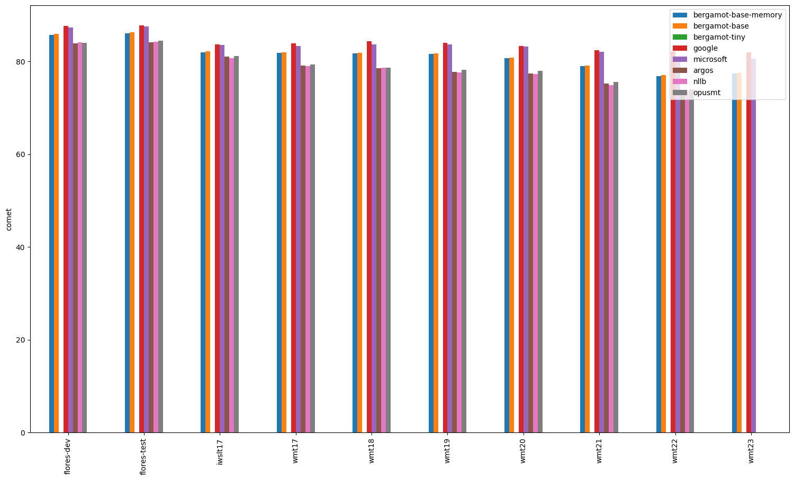
---

## en-gu

| Translator/Dataset | wmt19 | flores-dev | flores-test |
| --- | --- | --- | --- |
| google | 87.49 | 89.50 | 89.49 |
| microsoft | 88.28 | 88.91 | 88.85 |
| nllb | 85.96 | 86.97 | 86.86 |

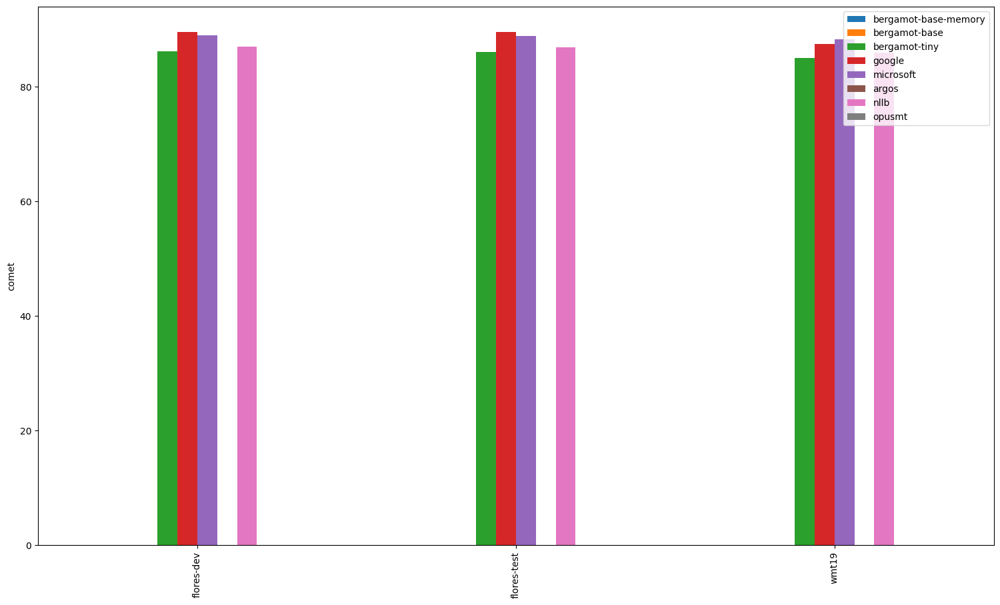
---

## hy-en

| Translator/Dataset | flores-test | flores-dev |
| --- | --- | --- |
| google | 89.20 | 89.49 |
| microsoft | 85.15 | 84.97 |
| nllb | 85.33 | 85.66 |
| opusmt | 66.75 | 66.04 |

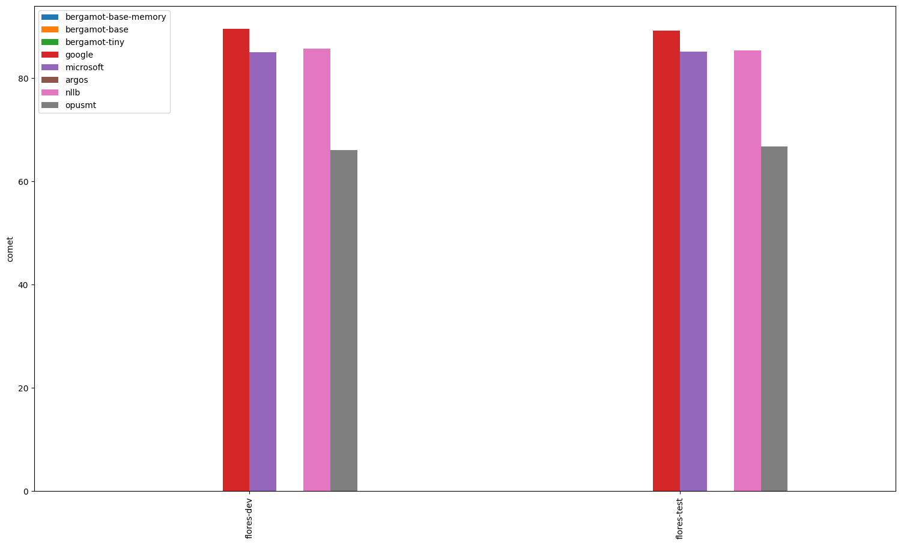
---

## en-fr

| Translator/Dataset | wmt10 | wmt11 | wmt15 | wmt12 | wmt14 | wmt08 | flores-dev | iwslt17 | flores-test | wmt09 | wmt13 |
| --- | --- | --- | --- | --- | --- | --- | --- | --- | --- | --- | --- |
| bergamot-tiny | 81.42 | 80.93 | 79.98 | 80.89 | 83.83 | 79.18 | 85.73 | 82.94 | 85.14 | 80.76 | 82.35 |
| google | 84.58 (+3.16, +3.88%) | 83.36 (+2.43, +3.00%) | 84.28 (+4.30, +5.38%) | 83.12 (+2.23, +2.76%) | 86.84 (+3.01, +3.59%) | 82.48 (+3.30, +4.17%) | 88.48 (+2.75, +3.21%) | 85.09 (+2.15, +2.59%) | 88.48 (+3.34, +3.92%) | 83.39 (+2.63, +3.26%) | 84.79 (+2.44, +2.96%) |
| microsoft | 85.07 (+3.65, +4.48%) | 84.01 (+3.08, +3.81%) | 84.59 (+4.61, +5.76%) | 83.93 (+3.04, +3.76%) | 87.67 (+3.84, +4.58%) | 82.76 (+3.58, +4.52%) | 88.87 (+3.14, +3.66%) | 85.61 (+2.67, +3.22%) | 88.74 (+3.60, +4.23%) | 84.05 (+3.29, +4.07%) | 85.36 (+3.01, +3.66%) |
| argos | 80.37 (-1.05, -1.29%) | 80.08 (-0.85, -1.05%) | 79.29 (-0.69, -0.86%) | 79.92 (-0.97, -1.20%) | 82.02 (-1.81, -2.16%) | 78.39 (-0.79, -1.00%) | 83.54 (-2.19, -2.55%) | 81.42 (-1.52, -1.83%) | 83.54 (-1.60, -1.88%) | 80.12 (-0.64, -0.79%) | 81.16 (-1.19, -1.45%) |
| nllb | 83.24 (+1.82, +2.24%) | 82.57 (+1.64, +2.03%) | 81.91 (+1.93, +2.41%) | 82.29 (+1.40, +1.73%) | 85.47 (+1.64, +1.96%) | 81.09 (+1.91, +2.41%) | 86.67 (+0.94, +1.10%) | 83.96 (+1.02, +1.23%) | 86.58 (+1.44, +1.69%) | 82.18 (+1.42, +1.76%) | 83.50 (+1.15, +1.40%) |
| opusmt | 82.97 (+1.55, +1.90%) | 82.15 (+1.22, +1.51%) | 81.47 (+1.49, +1.86%) | 82.22 (+1.33, +1.64%) | 85.01 (+1.18, +1.41%) | 80.49 (+1.31, +1.65%) | 86.36 (+0.63, +0.73%) | 83.55 (+0.61, +0.74%) | 86.17 (+1.03, +1.21%) | 82.25 (+1.49, +1.84%) | 83.45 (+1.10, +1.34%) |

---

## en-lt

| Translator/Dataset | flores-test | wmt19 | flores-dev |
| --- | --- | --- | --- |
| bergamot-base-memory | 88.22 | 84.31 | 88.14 |
| bergamot-tiny | 85.11 (-3.11, -3.53%) | 81.46 (-2.85, -3.38%) | 85.04 (-3.10, -3.52%) |
| google | 90.67 (+2.45, +2.78%) | 86.33 (+2.02, +2.40%) | 90.86 (+2.72, +3.09%) |
| microsoft | 90.32 (+2.10, +2.38%) | 86.05 (+1.74, +2.06%) | 90.26 (+2.12, +2.41%) |
| nllb | 82.65 (-5.57, -6.31%) | 77.82 (-6.49, -7.70%) | 81.87 (-6.27, -7.11%) |

---

## en-pt

| Translator/Dataset | flores-dev | flores-test |
| --- | --- | --- |
| bergamot-tiny | 88.95 | 88.70 |
| google | 90.44 (+1.49, +1.68%) | 90.28 (+1.58, +1.78%) |
| microsoft | 90.01 (+1.06, +1.19%) | 89.92 (+1.22, +1.38%) |
| argos | 86.51 (-2.44, -2.74%) | 86.48 (-2.22, -2.50%) |
| nllb | 88.41 (-0.54, -0.61%) | 88.16 (-0.54, -0.61%) |

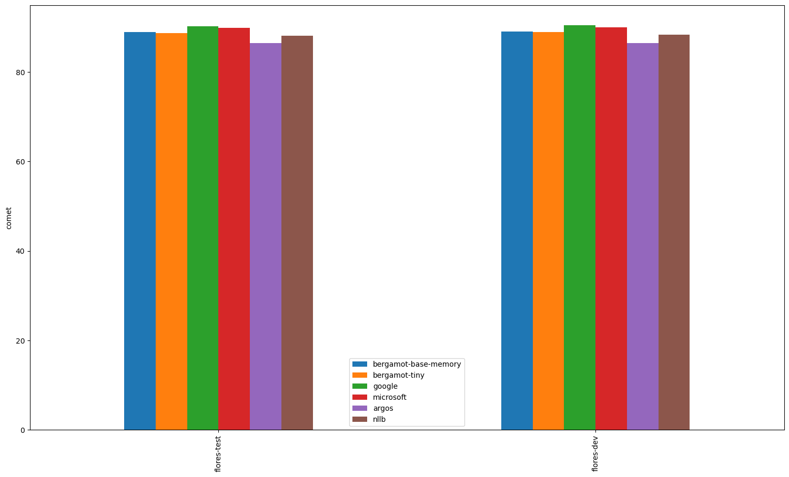
---

## en-hu

| Translator/Dataset | flores-dev | wmt09 | flores-test | wmt08 |
| --- | --- | --- | --- | --- |
| bergamot-base-memory | 88.28 | 84.83 | 88.02 | 84.29 |
| bergamot-tiny | 85.52 (-2.76, -3.13%) | 82.10 (-2.73, -3.22%) | 85.23 (-2.79, -3.17%) | 81.84 (-2.45, -2.91%) |
| google | 90.02 (+1.74, +1.97%) | 86.45 (+1.62, +1.91%) | 89.95 (+1.93, +2.19%) | 86.61 (+2.32, +2.75%) |
| microsoft | 90.23 (+1.95, +2.21%) | 87.21 (+2.38, +2.81%) | 90.23 (+2.21, +2.51%) | 86.82 (+2.53, +3.00%) |
| argos | 78.99 (-9.29, -10.52%) | 76.75 (-8.08, -9.52%) | 78.80 (-9.22, -10.47%) | 76.04 (-8.25, -9.79%) |
| nllb | 83.56 (-4.72, -5.35%) | 81.34 (-3.49, -4.11%) | 83.97 (-4.05, -4.60%) | 81.28 (-3.01, -3.57%) |
| opusmt | 85.12 (-3.16, -3.58%) | 83.35 (-1.48, -1.74%) | 85.04 (-2.98, -3.39%) | 82.90 (-1.39, -1.65%) |

---

## en-kn

| Translator/Dataset | flores-dev | flores-test |
| --- | --- | --- |
| google | 87.61 | 87.85 |
| microsoft | 87.19 | 87.32 |
| nllb | 84.55 | 84.51 |

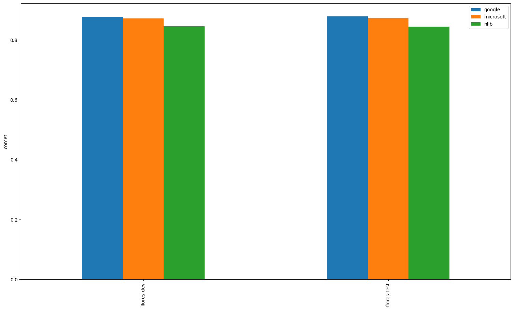
---

## kn-en

| Translator/Dataset | flores-test | flores-dev |
| --- | --- | --- |
| bergamot-tiny | 84.40 | 84.36 |
| google | 89.05 (+4.65, +5.51%) | 89.22 (+4.86, +5.76%) |
| microsoft | 87.49 (+3.09, +3.66%) | 87.82 (+3.46, +4.10%) |
| nllb | 86.18 (+1.78, +2.11%) | 86.42 (+2.06, +2.44%) |

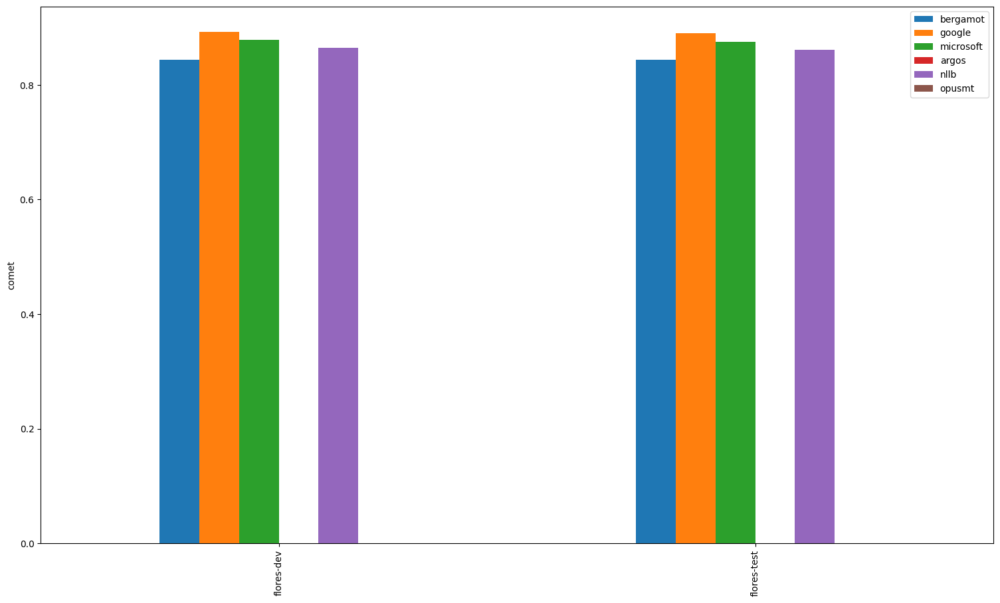
---

## en-sl

| Translator/Dataset | flores-dev | flores-test |
| --- | --- | --- |
| bergamot-base-memory | 88.12 | 87.88 |
| bergamot-tiny | 85.91 (-2.21, -2.51%) | 85.66 (-2.22, -2.53%) |
| google | 90.73 (+2.61, +2.96%) | 90.68 (+2.80, +3.19%) |
| microsoft | 89.26 (+1.14, +1.29%) | 89.14 (+1.26, +1.43%) |
| nllb | 84.14 (-3.98, -4.52%) | 83.68 (-4.20, -4.78%) |

---

## en-ta

| Translator/Dataset | flores-dev | flores-test | wmt20 |
| --- | --- | --- | --- |
| google | 90.81 | 90.62 | 89.53 |
| microsoft | 89.82 | 89.78 | 88.62 |
| nllb | 87.28 | 87.35 | 86.43 |

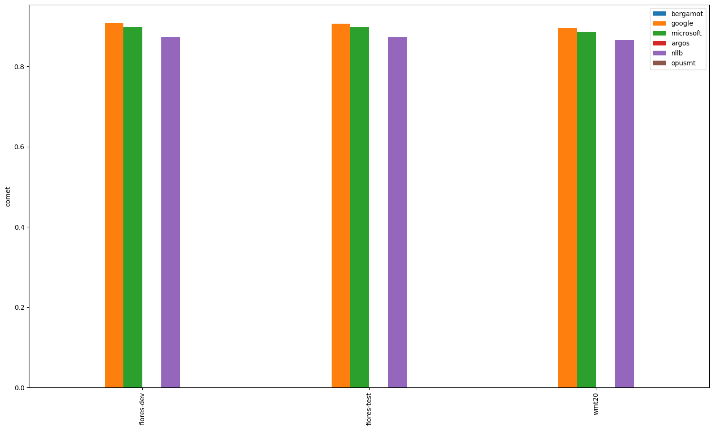
---

## en-ig

| Translator/Dataset | flores-test | flores-dev |
| --- | --- | --- |
| google | 72.07 | 71.06 |
| microsoft | 71.05 | 69.96 |
| nllb | 71.43 | 70.52 |
| opusmt | 68.69 | 67.89 |

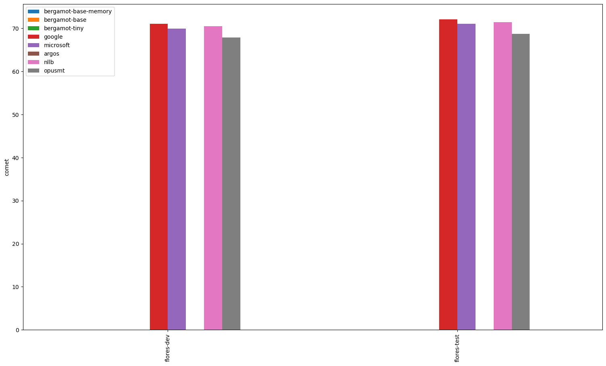
---

## hi-en

| Translator/Dataset | flores-test | wmt14 | flores-dev |
| --- | --- | --- | --- |
| bergamot-tiny | 87.30 | 85.68 | 87.23 |
| google | 90.49 (+3.19, +3.65%) | 88.49 (+2.81, +3.28%) | 90.63 (+3.40, +3.90%) |
| microsoft | 89.62 (+2.32, +2.66%) | 87.95 (+2.27, +2.65%) | 89.64 (+2.41, +2.76%) |
| argos | 82.92 (-4.38, -5.02%) | 79.61 (-6.07, -7.08%) | 83.25 (-3.98, -4.56%) |
| nllb | 88.32 (+1.02, +1.17%) | 86.73 (+1.05, +1.23%) | 88.37 (+1.14, +1.31%) |
| opusmt | 75.82 (-11.48, -13.15%) | 71.78 (-13.90, -16.22%) | 76.21 (-11.02, -12.63%) |

---

## en-ko

| Translator/Dataset | iwslt17 | flores-test | flores-dev |
| --- | --- | --- | --- |
| bergamot-base-memory | 82.15 | 87.09 | 87.26 |
| bergamot-base | 81.56 (-0.59, -0.72%) | 86.52 (-0.57, -0.65%) | 86.50 (-0.76, -0.87%) |
| google | 86.11 (+3.96, +4.82%) | 90.22 (+3.13, +3.59%) | 90.58 (+3.32, +3.80%) |
| microsoft | 85.68 (+3.53, +4.30%) | 90.15 (+3.06, +3.51%) | 90.46 (+3.20, +3.67%) |
| argos | 67.99 (-14.16, -17.24%) | 71.63 (-15.46, -17.75%) | 72.51 (-14.75, -16.90%) |
| nllb | 83.11 (+0.96, +1.17%) | 86.60 (-0.49, -0.56%) | 86.80 (-0.46, -0.53%) |

---

## bs-en

| Translator/Dataset | flores-test | flores-dev |
| --- | --- | --- |
| bergamot-tiny | 81.55 | 81.66 |
| google | 89.39 (+7.84, +9.61%) | 89.47 (+7.81, +9.56%) |
| microsoft | 88.51 (+6.96, +8.53%) | 88.76 (+7.10, +8.69%) |
| nllb | 74.62 (-6.93, -8.50%) | 75.71 (-5.95, -7.29%) |

---

## he-en

| Translator/Dataset | flores-test | flores-dev |
| --- | --- | --- |
| bergamot-tiny | 85.76 | 86.23 |
| google | 88.30 (+2.54, +2.96%) | 88.16 (+1.93, +2.24%) |
| microsoft | 88.88 (+3.12, +3.64%) | 88.90 (+2.67, +3.10%) |
| argos | 81.69 (-4.07, -4.75%) | 81.47 (-4.76, -5.52%) |
| nllb | 85.25 (-0.51, -0.59%) | 85.33 (-0.90, -1.04%) |

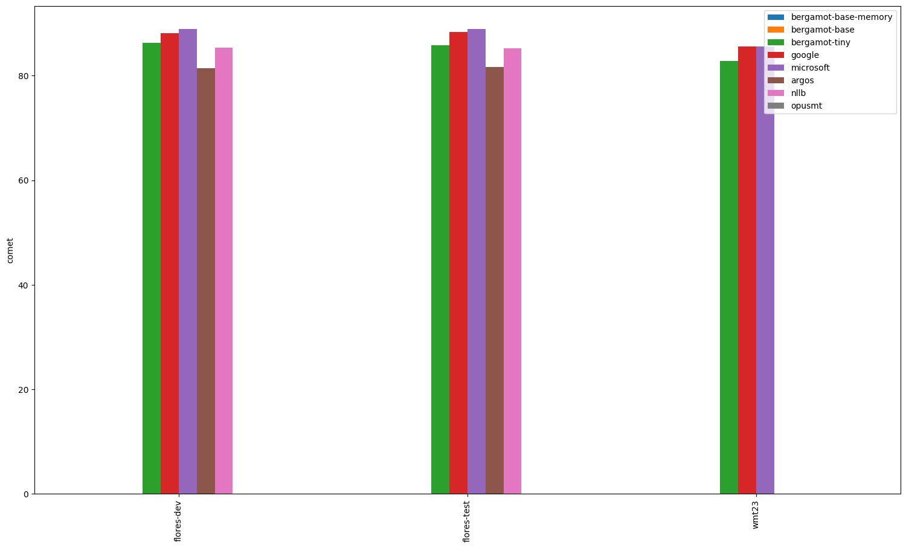
---

## en-sv

| Translator/Dataset | flores-dev | flores-test |
| --- | --- | --- |
| bergamot-tiny | 89.33 | 89.18 |
| google | 91.16 (+1.83, +2.05%) | 91.15 (+1.97, +2.21%) |
| microsoft | 91.93 (+2.60, +2.91%) | 91.96 (+2.78, +3.12%) |
| argos | 87.04 (-2.29, -2.56%) | 86.68 (-2.50, -2.80%) |
| nllb | 88.15 (-1.18, -1.32%) | 87.73 (-1.45, -1.63%) |
| opusmt | 89.14 (-0.19, -0.21%) | 89.00 (-0.18, -0.20%) |

---

## fa-en

| Translator/Dataset | flores-test | flores-dev |
| --- | --- | --- |
| bergamot-tiny | 85.75 | 85.32 |
| google | 88.57 (+2.82, +3.29%) | 88.75 (+3.43, +4.02%) |
| microsoft | 86.83 (+1.08, +1.26%) | 86.72 (+1.40, +1.64%) |
| argos | 82.24 (-3.51, -4.09%) | 82.31 (-3.01, -3.53%) |
| nllb | 82.96 (-2.79, -3.25%) | 82.91 (-2.41, -2.82%) |

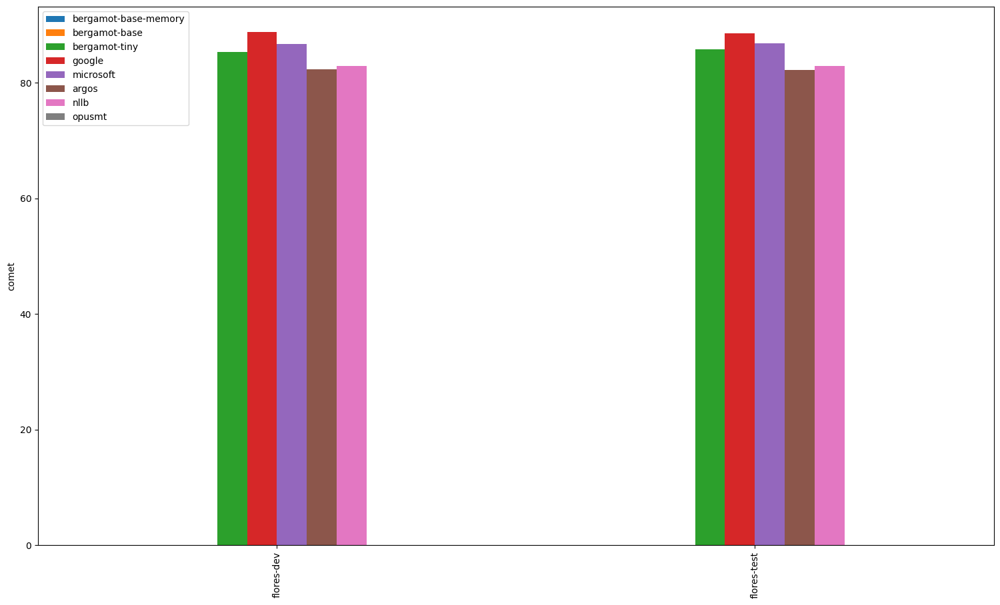
---

## bn-en

| Translator/Dataset | flores-test | flores-dev |
| --- | --- | --- |
| bergamot-tiny | 85.49 | 85.24 |
| google | 88.87 (+3.38, +3.95%) | 89.10 (+3.86, +4.53%) |
| microsoft | 88.67 (+3.18, +3.72%) | 88.72 (+3.48, +4.08%) |
| nllb | 86.74 (+1.25, +1.46%) | 86.92 (+1.68, +1.97%) |
| opusmt | 78.70 (-6.79, -7.94%) | 78.63 (-6.61, -7.75%) |

---

## en-mt

| Translator/Dataset | flores-dev | flores-test |
| --- | --- | --- |
| google | 73.15 | 73.14 |
| microsoft | 73.69 | 73.72 |
| nllb | 69.40 | 69.32 |

---

## sr-en

| Translator/Dataset | flores-test | flores-dev |
| --- | --- | --- |
| bergamot-tiny | 84.98 | 84.94 |
| google | 88.39 (+3.41, +4.01%) | 88.50 (+3.56, +4.19%) |
| microsoft | 67.94 (-17.04, -20.05%) | 68.54 (-16.40, -19.31%) |
| nllb | 81.50 (-3.48, -4.10%) | 81.49 (-3.45, -4.06%) |

---

## mt-en

| Translator/Dataset | flores-test | flores-dev |
| --- | --- | --- |
| bergamot-tiny | 76.02 | 76.19 |
| google | 83.93 (+7.91, +10.41%) | 84.58 (+8.39, +11.01%) |
| microsoft | 82.95 (+6.93, +9.12%) | 83.34 (+7.15, +9.38%) |
| nllb | 61.55 (-14.47, -19.03%) | 63.42 (-12.77, -16.76%) |

---

## sk-en

| Translator/Dataset | flores-test | flores-dev |
| --- | --- | --- |
| bergamot-tiny | 85.63 | 86.20 |
| google | 88.80 (+3.17, +3.70%) | 88.97 (+2.77, +3.21%) |
| microsoft | 88.65 (+3.02, +3.53%) | 88.71 (+2.51, +2.91%) |
| argos | 78.00 (-7.63, -8.91%) | 77.98 (-8.22, -9.54%) |
| nllb | 75.66 (-9.97, -11.64%) | 76.73 (-9.47, -10.99%) |
| opusmt | 86.05 (+0.42, +0.49%) | 86.34 (+0.14, +0.16%) |

---

## is-en

| Translator/Dataset | flores-test | wmt21 | flores-dev |
| --- | --- | --- | --- |
| bergamot-tiny | 74.73 | 70.04 | 74.41 |
| google | 86.95 (+12.22, +16.35%) | 85.98 (+15.94, +22.76%) | 87.19 (+12.78, +17.18%) |
| microsoft | 86.17 (+11.44, +15.31%) | 85.91 (+15.87, +22.66%) | 86.43 (+12.02, +16.15%) |
| nllb | 62.52 (-12.21, -16.34%) | 63.21 (-6.83, -9.75%) | 63.47 (-10.94, -14.70%) |
| opusmt | 79.69 (+4.96, +6.64%) | 75.38 (+5.34, +7.62%) | 79.64 (+5.23, +7.03%) |

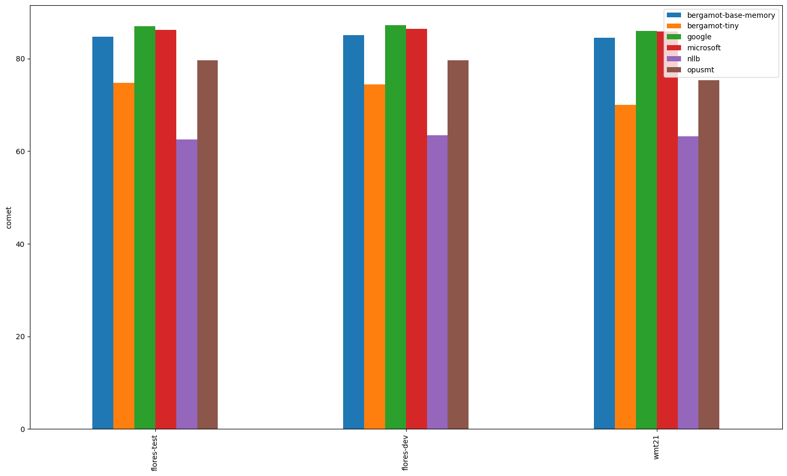
---

## en-es

| Translator/Dataset | flores-test | wmt10 | wmt08 | wmt13 | wmt09 | wmt12 | wmt11 | flores-dev |
| --- | --- | --- | --- | --- | --- | --- | --- | --- |
| bergamot-tiny | 84.00 | 84.15 | 81.41 | 84.40 | 82.51 | 83.79 | 82.66 | 84.14 |
| google | 86.73 (+2.73, +3.25%) | 86.04 (+1.89, +2.25%) | 83.73 (+2.32, +2.85%) | 85.93 (+1.53, +1.81%) | 84.17 (+1.66, +2.01%) | 85.17 (+1.38, +1.65%) | 84.51 (+1.85, +2.24%) | 86.79 (+2.65, +3.15%) |
| microsoft | 86.48 (+2.48, +2.95%) | 86.30 (+2.15, +2.55%) | 83.82 (+2.41, +2.96%) | 86.28 (+1.88, +2.23%) | 84.53 (+2.02, +2.45%) | 85.79 (+2.00, +2.39%) | 85.07 (+2.41, +2.92%) | 86.47 (+2.33, +2.77%) |
| argos | 82.75 (-1.25, -1.49%) | 82.65 (-1.50, -1.78%) | 80.36 (-1.05, -1.29%) | 83.34 (-1.06, -1.26%) | 81.67 (-0.84, -1.02%) | 82.02 (-1.77, -2.11%) | 81.75 (-0.91, -1.10%) | 82.41 (-1.73, -2.06%) |
| nllb | 85.19 (+1.19, +1.42%) | 84.63 (+0.48, +0.57%) | 82.41 (+1.00, +1.23%) | 84.94 (+0.54, +0.64%) | 83.10 (+0.59, +0.72%) | 84.12 (+0.33, +0.39%) | 83.62 (+0.96, +1.16%) | 85.12 (+0.98, +1.16%) |
| opusmt | 84.99 (+0.99, +1.18%) | 85.10 (+0.95, +1.13%) | 82.46 (+1.05, +1.29%) | 85.28 (+0.88, +1.04%) | 83.38 (+0.87, +1.05%) | 84.52 (+0.73, +0.87%) | 83.73 (+1.07, +1.29%) | 85.04 (+0.90, +1.07%) |

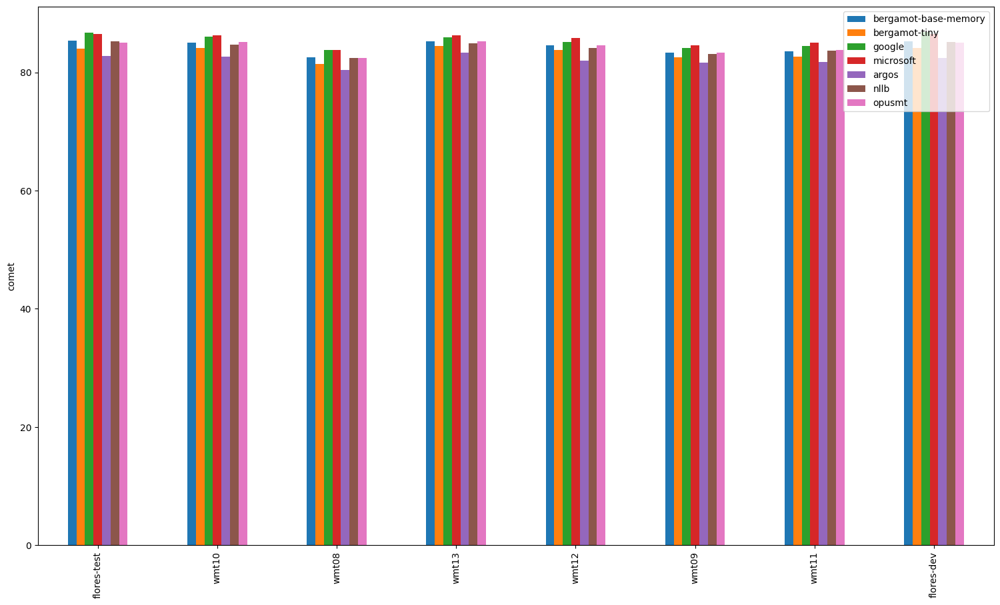
---

## it-en

| Translator/Dataset | mtedx_test | flores-test | wmt09 | flores-dev |
| --- | --- | --- | --- | --- |
| bergamot-tiny | 83.27 | 86.46 | 82.21 | 86.92 |
| google | 84.97 (+1.70, +2.04%) | 88.07 (+1.61, +1.86%) | 83.93 (+1.72, +2.09%) | 88.17 (+1.25, +1.44%) |
| microsoft | 84.82 (+1.55, +1.86%) | 88.08 (+1.62, +1.87%) | 84.40 (+2.19, +2.66%) | 88.23 (+1.31, +1.51%) |
| argos | 82.19 (-1.08, -1.30%) | 85.28 (-1.18, -1.36%) | 80.88 (-1.33, -1.62%) | 85.63 (-1.29, -1.48%) |
| nllb | 78.62 (-4.65, -5.58%) | 84.22 (-2.24, -2.59%) | 79.57 (-2.64, -3.21%) | 84.41 (-2.51, -2.89%) |
| opusmt | 83.65 (+0.38, +0.46%) | 86.56 (+0.10, +0.12%) | 82.69 (+0.48, +0.58%) | 86.86 (-0.06, -0.07%) |

---

## pt-en

| Translator/Dataset | mtedx_test | flores-test | flores-dev |
| --- | --- | --- | --- |
| bergamot-tiny | 85.06 | 88.39 | 88.66 |
| google | 86.61 (+1.55, +1.82%) | 89.70 (+1.31, +1.48%) | 89.82 (+1.16, +1.31%) |
| microsoft | 86.38 (+1.32, +1.55%) | 89.68 (+1.29, +1.46%) | 89.81 (+1.15, +1.30%) |
| argos | 84.37 (-0.69, -0.81%) | 87.75 (-0.64, -0.72%) | 87.91 (-0.75, -0.85%) |
| nllb | 80.43 (-4.63, -5.44%) | 85.35 (-3.04, -3.44%) | 85.43 (-3.23, -3.64%) |

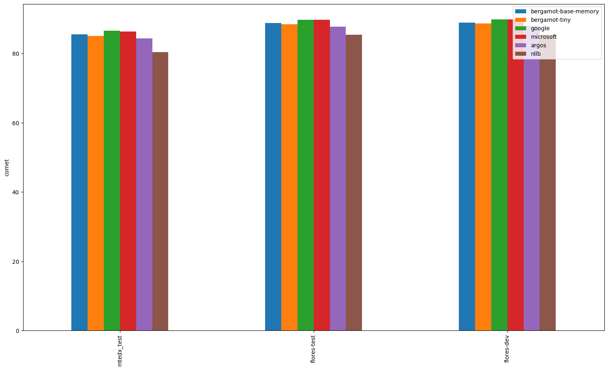
---

## lv-en

| Translator/Dataset | flores-test | flores-dev | wmt17 |
| --- | --- | --- | --- |
| bergamot-tiny | 85.00 | 85.09 | 81.41 |
| google | 88.36 (+3.36, +3.95%) | 88.47 (+3.38, +3.97%) | 83.60 (+2.19, +2.69%) |
| microsoft | 87.47 (+2.47, +2.91%) | 87.46 (+2.37, +2.79%) | 83.20 (+1.79, +2.20%) |
| nllb | 67.61 (-17.39, -20.46%) | 67.83 (-17.26, -20.28%) | 65.05 (-16.36, -20.10%) |
| opusmt | 85.25 (+0.25, +0.29%) | 85.38 (+0.29, +0.34%) | 80.83 (-0.58, -0.71%) |

---

## en-sr

| Translator/Dataset | flores-dev | flores-test |
| --- | --- | --- |
| google | 90.55 | 90.18 |
| microsoft | 75.55 | 75.26 |
| nllb | 83.46 | 83.45 |

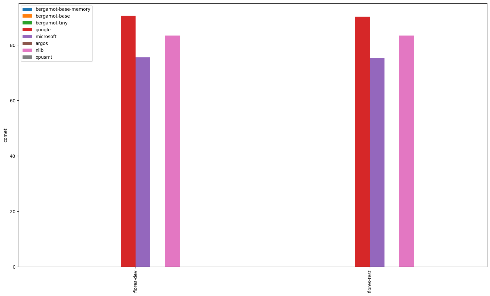
---

## tl-en

| Translator/Dataset | flores-test | flores-dev |
| --- | --- | --- |
| google | 88.91 | 89.18 |
| microsoft | 87.71 | 87.94 |
| nllb | 67.94 | 69.32 |
| opusmt | 80.86 | 81.27 |

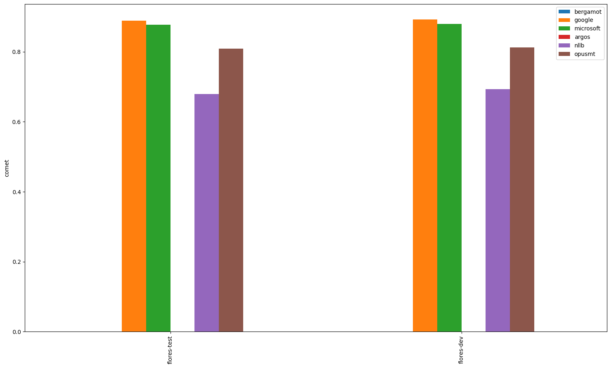
---

## en-fa

| Translator/Dataset | flores-dev | flores-test |
| --- | --- | --- |
| bergamot-tiny | 78.75 | 79.48 |
| google | 87.92 (+9.17, +11.64%) | 88.13 (+8.65, +10.88%) |
| microsoft | 81.50 (+2.75, +3.49%) | 81.53 (+2.05, +2.58%) |
| argos | 80.11 (+1.36, +1.73%) | 80.39 (+0.91, +1.14%) |
| nllb | 83.82 (+5.07, +6.44%) | 83.60 (+4.12, +5.18%) |

---

## de-en

| Translator/Dataset | flores-test | wmt09 | flores-dev | wmt19 | wmt18 | wmt17 | wmt10 | wmt08 | wmt12 | wmt22 | wmt13 | wmt16 | wmt14 | wmt15 | wmt11 | wmt20 | wmt21 | iwslt17 |
| --- | --- | --- | --- | --- | --- | --- | --- | --- | --- | --- | --- | --- | --- | --- | --- | --- | --- | --- |
| bergamot-base | 88.37 | 82.59 | 88.54 | 83.36 | 86.77 | 85.36 | 83.43 | 82.56 | 82.68 | 83.19 | 84.81 | 86.12 | 85.03 | 85.36 | 82.19 | 84.61 | 84.67 | 84.88 |
| bergamot-tiny | 87.10 (-1.27, -1.44%) | 80.97 (-1.62, -1.96%) | 87.12 (-1.42, -1.60%) | 81.05 (-2.31, -2.77%) | 84.92 (-1.85, -2.13%) | 83.29 (-2.07, -2.43%) | 81.55 (-1.88, -2.25%) | 80.83 (-1.73, -2.10%) | 80.61 (-2.07, -2.50%) | 81.17 (-2.02, -2.43%) | 83.51 (-1.30, -1.53%) | 84.20 (-1.92, -2.23%) | 83.00 (-2.03, -2.39%) | 83.47 (-1.89, -2.21%) | 80.36 (-1.83, -2.23%) | 82.40 (-2.21, -2.61%) | 82.25 (-2.42, -2.86%) | 83.55 (-1.33, -1.57%) |
| google | 89.21 (+0.84, +0.95%) | 83.59 (+1.00, +1.21%) | 89.30 (+0.76, +0.86%) | 84.55 (+1.19, +1.43%) | 87.42 (+0.65, +0.75%) | 86.51 (+1.15, +1.35%) | 84.69 (+1.26, +1.51%) | 83.68 (+1.12, +1.36%) | 83.67 (+0.99, +1.20%) | 84.78 (+1.59, +1.91%) | 85.63 (+0.82, +0.97%) | 87.07 (+0.95, +1.10%) | 86.16 (+1.13, +1.33%) | 86.26 (+0.90, +1.05%) | 82.63 (+0.44, +0.54%) | 85.48 (+0.87, +1.03%) | 85.23 (+0.56, +0.66%) | 85.74 (+0.86, +1.01%) |
| microsoft | 89.68 (+1.31, +1.48%) | 84.28 (+1.69, +2.05%) | 89.75 (+1.21, +1.37%) | 85.45 (+2.09, +2.51%) | 88.54 (+1.77, +2.04%) | 87.05 (+1.69, +1.98%) | 85.30 (+1.87, +2.24%) | 84.21 (+1.65, +2.00%) | 84.64 (+1.96, +2.37%) | 84.68 (+1.49, +1.79%) | 86.38 (+1.57, +1.85%) | 87.78 (+1.66, +1.93%) | 86.71 (+1.68, +1.98%) | 86.80 (+1.44, +1.69%) | 83.90 (+1.71, +2.08%) | 86.36 (+1.75, +2.07%) | 85.87 (+1.20, +1.42%) | 86.05 (+1.17, +1.38%) |
| argos | 86.33 (-2.04, -2.31%) | 80.28 (-2.31, -2.80%) | 86.16 (-2.38, -2.69%) | 79.13 (-4.23, -5.07%) | 83.45 (-3.32, -3.83%) | 81.89 (-3.47, -4.07%) | 80.77 (-2.66, -3.19%) | 79.98 (-2.58, -3.13%) | 79.76 (-2.92, -3.53%) | 80.72 (-2.47, -2.97%) | 82.46 (-2.35, -2.77%) | 82.84 (-3.28, -3.81%) | 81.82 (-3.21, -3.78%) | 82.21 (-3.15, -3.69%) | 79.81 (-2.38, -2.90%) | 81.15 (-3.46, -4.09%) | 80.89 (-3.78, -4.46%) | 82.48 (-2.40, -2.83%) |
| nllb | 79.44 (-8.93, -10.11%) | 74.06 (-8.53, -10.33%) | 79.97 (-8.57, -9.68%) | 70.89 (-12.47, -14.96%) | 75.89 (-10.88, -12.54%) | 74.11 (-11.25, -13.18%) | 74.48 (-8.95, -10.73%) | 73.96 (-8.60, -10.42%) | 73.26 (-9.42, -11.39%) | 71.74 (-11.45, -13.76%) | 76.26 (-8.55, -10.08%) | 75.67 (-10.45, -12.13%) | 74.49 (-10.54, -12.40%) | 75.68 (-9.68, -11.34%) | 72.58 (-9.61, -11.69%) | 72.18 (-12.43, -14.69%) | 72.38 (-12.29, -14.52%) | 76.46 (-8.42, -9.92%) |
| opusmt | 88.27 (-0.10, -0.11%) | 82.46 (-0.13, -0.16%) | 88.40 (-0.14, -0.16%) | 82.38 (-0.98, -1.18%) | 86.16 (-0.61, -0.70%) | 84.82 (-0.54, -0.63%) | 83.44 (+0.01, +0.01%) | 82.38 (-0.18, -0.22%) | 82.65 (-0.03, -0.04%) | 82.56 (-0.63, -0.76%) | 84.86 (+0.05, +0.06%) | 85.49 (-0.63, -0.73%) | 84.53 (-0.50, -0.59%) | 84.88 (-0.48, -0.56%) | 82.20 (+0.01, +0.01%) | 84.39 (-0.22, -0.26%) | 84.05 (-0.62, -0.73%) | 84.70 (-0.18, -0.21%) |

---

## vi-en

| Translator/Dataset | flores-test | flores-dev |
| --- | --- | --- |
| bergamot-tiny | 84.84 | 85.32 |
| google | 88.18 (+3.34, +3.94%) | 88.23 (+2.91, +3.41%) |
| microsoft | 87.76 (+2.92, +3.44%) | 88.11 (+2.79, +3.27%) |
| nllb | 83.65 (-1.19, -1.40%) | 84.49 (-0.83, -0.97%) |
| opusmt | 81.55 (-3.29, -3.88%) | 82.09 (-3.23, -3.79%) |

---

## en-te

| Translator/Dataset | flores-test | flores-dev |
| --- | --- | --- |
| google | 88.47 | 88.46 |
| microsoft | 87.82 | 87.76 |
| nllb | 85.13 | 84.78 |

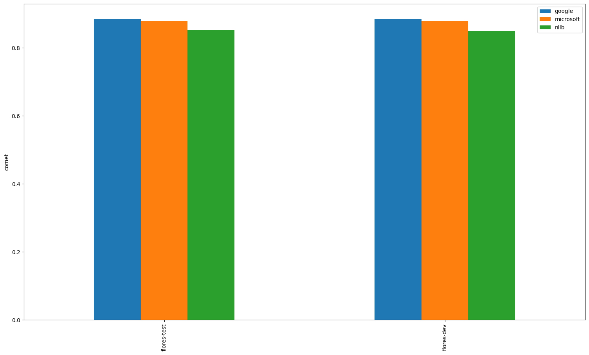
---

## en-ru

| Translator/Dataset | wmt18 | wmt14 | wmt15 | wmt19 | wmt13 | flores-dev | flores-test | wmt21 | wmt20 | wmt16 | wmt22 | wmt17 |
| --- | --- | --- | --- | --- | --- | --- | --- | --- | --- | --- | --- | --- |
| bergamot-base | 88.66 | 90.15 | 88.91 | 85.36 | 86.78 | 87.43 | 87.64 | 84.25 | 85.20 | 87.53 | 84.46 | 88.52 |
| bergamot-tiny | 86.29 (-2.37, -2.67%) | 87.79 (-2.36, -2.62%) | 86.45 (-2.46, -2.77%) | 83.01 (-2.35, -2.75%) | 84.41 (-2.37, -2.73%) | 84.78 (-2.65, -3.03%) | 84.61 (-3.03, -3.46%) | 81.90 (-2.35, -2.79%) | 83.16 (-2.04, -2.39%) | 85.48 (-2.05, -2.34%) | 81.55 (-2.91, -3.45%) | 86.35 (-2.17, -2.45%) |
| google | 91.01 (+2.35, +2.65%) | 92.23 (+2.08, +2.31%) | 91.10 (+2.19, +2.46%) | 88.34 (+2.98, +3.49%) | 88.75 (+1.97, +2.27%) | 90.29 (+2.86, +3.27%) | 90.23 (+2.59, +2.96%) | 87.21 (+2.96, +3.51%) | 88.16 (+2.96, +3.47%) | 89.89 (+2.36, +2.70%) | 88.92 (+4.46, +5.28%) | 91.03 (+2.51, +2.84%) |
| microsoft | 90.19 (+1.53, +1.73%) | 91.57 (+1.42, +1.58%) | 90.28 (+1.37, +1.54%) | 87.54 (+2.18, +2.55%) | 88.17 (+1.39, +1.60%) | 89.12 (+1.69, +1.93%) | 89.21 (+1.57, +1.79%) | 85.97 (+1.72, +2.04%) | 86.98 (+1.78, +2.09%) | 88.98 (+1.45, +1.66%) | 87.45 (+2.99, +3.54%) | 90.29 (+1.77, +2.00%) |
| argos | 85.58 (-3.08, -3.47%) | 87.74 (-2.41, -2.67%) | 86.10 (-2.81, -3.16%) | 80.96 (-4.40, -5.15%) | 84.75 (-2.03, -2.34%) | 84.85 (-2.58, -2.95%) | 84.81 (-2.83, -3.23%) | 79.65 (-4.60, -5.46%) | 81.44 (-3.76, -4.41%) | 84.54 (-2.99, -3.42%) | 80.82 (-3.64, -4.31%) | 85.92 (-2.60, -2.94%) |
| nllb | 87.15 (-1.51, -1.70%) | 88.79 (-1.36, -1.51%) | 87.16 (-1.75, -1.97%) | 83.76 (-1.60, -1.87%) | 85.73 (-1.05, -1.21%) | 85.86 (-1.57, -1.80%) | 86.05 (-1.59, -1.81%) | 82.58 (-1.67, -1.98%) | 84.11 (-1.09, -1.28%) | 86.29 (-1.24, -1.42%) | 83.35 (-1.11, -1.31%) | 87.02 (-1.50, -1.69%) |
| opusmt | 85.86 (-2.80, -3.16%) | 87.47 (-2.68, -2.97%) | 85.90 (-3.01, -3.39%) | 81.89 (-3.47, -4.07%) | 85.13 (-1.65, -1.90%) | 84.89 (-2.54, -2.91%) | 84.78 (-2.86, -3.26%) | 80.74 (-3.51, -4.17%) | 82.26 (-2.94, -3.45%) | 84.57 (-2.96, -3.38%) | 80.81 (-3.65, -4.32%) | 85.95 (-2.57, -2.90%) |

---

## en-pl

| Translator/Dataset | flores-dev | flores-test | wmt20 |
| --- | --- | --- | --- |
| bergamot-tiny | 86.00 | 85.73 | 84.85 |
| google | 90.14 (+4.14, +4.81%) | 89.90 (+4.17, +4.86%) | 89.07 (+4.22, +4.97%) |
| microsoft | 89.29 (+3.29, +3.83%) | 89.28 (+3.55, +4.14%) | 88.63 (+3.78, +4.45%) |
| argos | 84.72 (-1.28, -1.49%) | 84.75 (-0.98, -1.14%) | 82.38 (-2.47, -2.91%) |
| nllb | 84.71 (-1.29, -1.50%) | 84.22 (-1.51, -1.76%) | 83.80 (-1.05, -1.24%) |

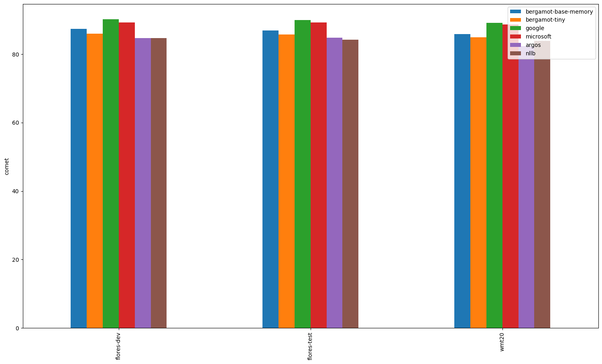
---

## en-fi

| Translator/Dataset | wmt18 | wmt16 | wmt17 | wmt15 | wmt19 | flores-test | flores-dev |
| --- | --- | --- | --- | --- | --- | --- | --- |
| bergamot-tiny | 87.38 | 88.17 | 88.88 | 88.31 | 85.90 | 88.25 | 88.45 |
| google | 89.81 (+2.43, +2.78%) | 90.96 (+2.79, +3.16%) | 91.88 (+3.00, +3.38%) | 91.23 (+2.92, +3.31%) | 88.62 (+2.72, +3.17%) | 92.12 (+3.87, +4.39%) | 92.02 (+3.57, +4.04%) |
| microsoft | 90.85 (+3.47, +3.97%) | 91.69 (+3.52, +3.99%) | 92.57 (+3.69, +4.15%) | 91.88 (+3.57, +4.04%) | 90.40 (+4.50, +5.24%) | 92.52 (+4.27, +4.84%) | 92.59 (+4.14, +4.68%) |
| argos | 84.63 (-2.75, -3.15%) | 84.68 (-3.49, -3.96%) | 85.59 (-3.29, -3.70%) | 85.71 (-2.60, -2.94%) | 81.55 (-4.35, -5.06%) | 85.82 (-2.43, -2.75%) | 86.26 (-2.19, -2.48%) |
| nllb | 83.91 (-3.47, -3.97%) | 84.93 (-3.24, -3.67%) | 85.03 (-3.85, -4.33%) | 85.09 (-3.22, -3.65%) | 82.84 (-3.06, -3.56%) | 84.84 (-3.41, -3.86%) | 85.06 (-3.39, -3.83%) |
| opusmt | 89.83 (+2.45, +2.80%) | 90.87 (+2.70, +3.06%) | 91.90 (+3.02, +3.40%) | 90.87 (+2.56, +2.90%) | 88.38 (+2.48, +2.89%) | 90.79 (+2.54, +2.88%) | 90.91 (+2.46, +2.78%) |

---

## en-gl

| Translator/Dataset | flores-dev | flores-test |
| --- | --- | --- |
| google | 87.17 | 87.45 |
| microsoft | 85.64 | 85.56 |
| nllb | 85.65 | 85.56 |
| opusmt | 65.93 | 65.44 |

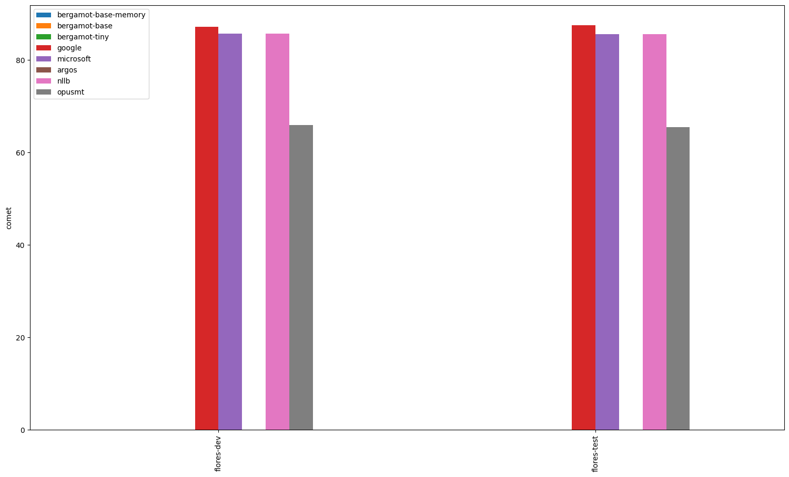
---

## ta-en

| Translator/Dataset | flores-test | wmt20 | flores-dev |
| --- | --- | --- | --- |
| bergamot-tiny | 82.80 | 80.84 | 82.79 |
| google | 87.93 (+5.13, +6.20%) | 86.59 (+5.75, +7.11%) | 88.04 (+5.25, +6.34%) |
| microsoft | 86.89 (+4.09, +4.94%) | 84.98 (+4.14, +5.12%) | 87.28 (+4.49, +5.42%) |
| nllb | 85.11 (+2.31, +2.79%) | 83.05 (+2.21, +2.73%) | 85.30 (+2.51, +3.03%) |

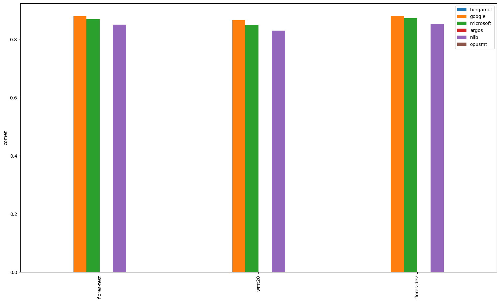
---

## en-sk

| Translator/Dataset | flores-test | flores-dev |
| --- | --- | --- |
| bergamot-base-memory | 88.67 | 89.16 |
| bergamot-tiny | 85.52 (-3.15, -3.55%) | 86.10 (-3.06, -3.43%) |
| google | 91.41 (+2.74, +3.09%) | 91.81 (+2.65, +2.97%) |
| microsoft | 90.93 (+2.26, +2.55%) | 91.41 (+2.25, +2.52%) |
| argos | 71.24 (-17.43, -19.66%) | 72.79 (-16.37, -18.36%) |
| nllb | 85.37 (-3.30, -3.72%) | 85.98 (-3.18, -3.57%) |
| opusmt | 85.33 (-3.34, -3.77%) | 85.85 (-3.31, -3.71%) |

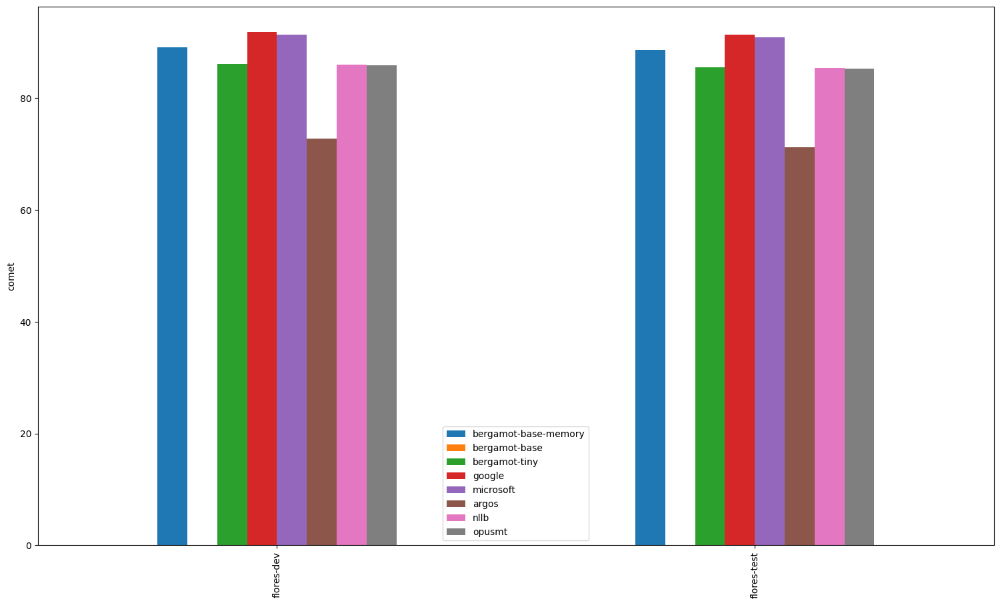
---

## nl-en

| Translator/Dataset | flores-test | flores-dev |
| --- | --- | --- |
| bergamot-base-memory | 86.36 | 86.33 |
| bergamot-tiny | 85.84 (-0.52, -0.60%) | 85.86 (-0.47, -0.54%) |
| google | 87.62 (+1.26, +1.46%) | 87.70 (+1.37, +1.59%) |
| microsoft | 87.43 (+1.07, +1.24%) | 87.37 (+1.04, +1.20%) |
| argos | 86.07 (-0.29, -0.34%) | 86.26 (-0.07, -0.08%) |
| nllb | 80.90 (-5.46, -6.32%) | 80.86 (-5.47, -6.34%) |
| opusmt | 86.15 (-0.21, -0.24%) | 86.29 (-0.04, -0.05%) |

---

## en-mr

| Translator/Dataset | flores-dev | flores-test |
| --- | --- | --- |
| google | 77.26 | 77.37 |
| microsoft | 75.92 | 76.28 |
| nllb | 71.91 | 72.10 |
| opusmt | 36.12 | 35.49 |

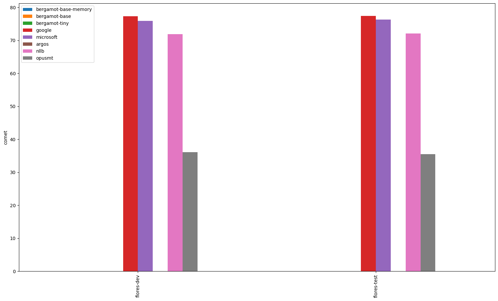
---

## be-en

| Translator/Dataset | flores-test | flores-dev |
| --- | --- | --- |
| bergamot-tiny | 79.13 | 79.41 |
| google | 84.27 (+5.14, +6.50%) | 84.43 (+5.02, +6.32%) |
| microsoft | 83.07 (+3.94, +4.98%) | 83.11 (+3.70, +4.66%) |
| nllb | 80.51 (+1.38, +1.74%) | 80.82 (+1.41, +1.78%) |

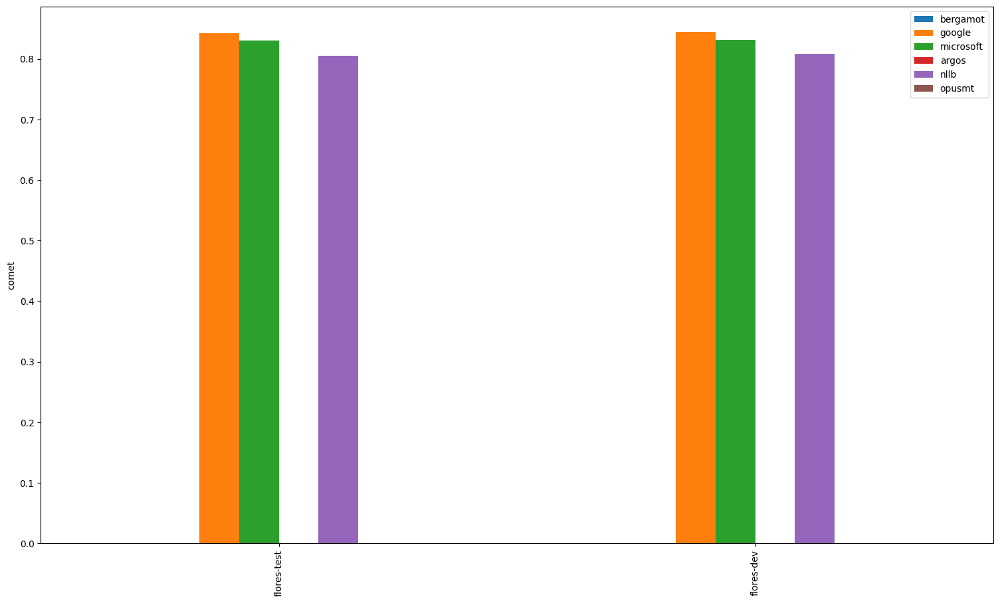
---

## pl-en

| Translator/Dataset | flores-test | wmt20 | flores-dev |
| --- | --- | --- | --- |
| bergamot-tiny | 83.68 | 82.03 | 83.99 |
| google | 86.23 (+2.55, +3.05%) | 84.31 (+2.28, +2.78%) | 86.41 (+2.42, +2.88%) |
| microsoft | 86.32 (+2.64, +3.15%) | 84.88 (+2.85, +3.47%) | 86.32 (+2.33, +2.77%) |
| argos | 84.14 (+0.46, +0.55%) | 81.88 (-0.15, -0.18%) | 84.58 (+0.59, +0.70%) |
| nllb | 77.58 (-6.10, -7.29%) | 74.36 (-7.67, -9.35%) | 78.53 (-5.46, -6.50%) |
| opusmt | 83.77 (+0.09, +0.11%) | 81.17 (-0.86, -1.05%) | 84.18 (+0.19, +0.23%) |

---

## ja-en

| Translator/Dataset | flores-dev | flores-test | wmt20 | wmt22 | wmt21 | iwslt17 |
| --- | --- | --- | --- | --- | --- | --- |
| bergamot-base-memory | 86.44 | 86.34 | 79.11 | 78.45 | 76.93 | 78.90 |
| bergamot-base | 86.42 (-0.02, -0.02%) | 86.32 (-0.02, -0.02%) | 78.63 (-0.48, -0.61%) | 78.31 (-0.14, -0.18%) | 76.90 (-0.03, -0.04%) | 78.96 (+0.06, +0.08%) |
| google | 88.71 (+2.27, +2.63%) | 88.71 (+2.37, +2.74%) | 84.87 (+5.76, +7.28%) | 83.45 (+5.00, +6.37%) | 83.84 (+6.91, +8.98%) | 82.05 (+3.15, +3.99%) |
| microsoft | 88.30 (+1.86, +2.15%) | 88.41 (+2.07, +2.40%) | 82.27 (+3.16, +3.99%) | 82.07 (+3.62, +4.61%) | 80.69 (+3.76, +4.89%) | 81.59 (+2.69, +3.41%) |
| argos | 78.38 (-8.06, -9.32%) | 78.00 (-8.34, -9.66%) | 68.91 (-10.20, -12.89%) | 70.04 (-8.41, -10.72%) | 65.51 (-11.42, -14.84%) | 69.01 (-9.89, -12.53%) |
| nllb | 85.03 (-1.41, -1.63%) | 85.16 (-1.18, -1.37%) | 72.10 (-7.01, -8.86%) | 72.73 (-5.72, -7.29%) | 70.43 (-6.50, -8.45%) | 78.36 (-0.54, -0.68%) |
| opusmt | 82.82 (-3.62, -4.19%) | 82.59 (-3.75, -4.34%) | 65.32 (-13.79, -17.43%) | 67.74 (-10.71, -13.65%) | 64.34 (-12.59, -16.37%) | 70.95 (-7.95, -10.08%) |

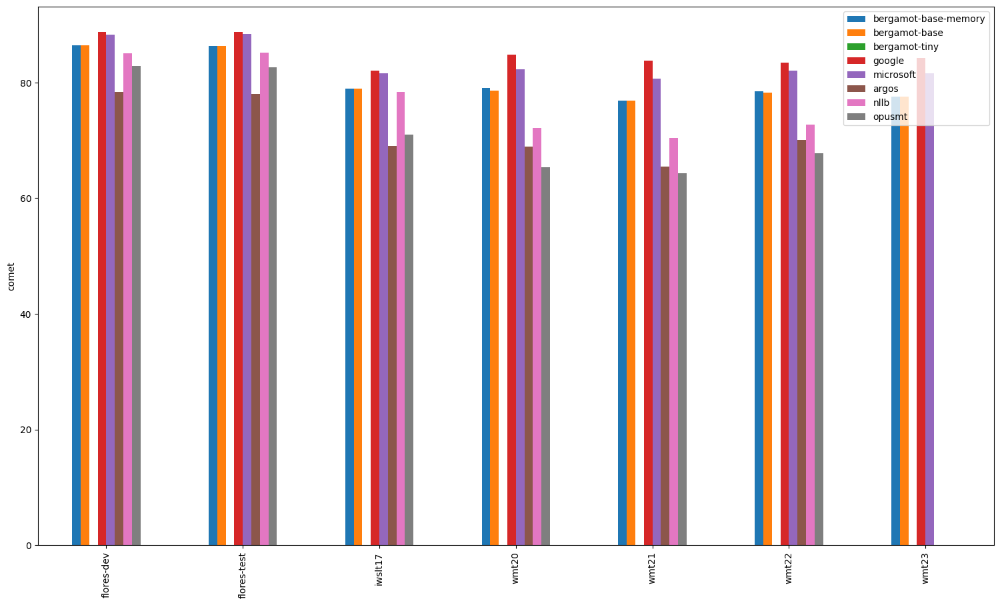
---

## en-it

| Translator/Dataset | flores-dev | wmt09 | flores-test |
| --- | --- | --- | --- |
| bergamot-tiny | 86.46 | 84.87 | 86.24 |
| google | 88.43 (+1.97, +2.28%) | 86.62 (+1.75, +2.06%) | 88.51 (+2.27, +2.63%) |
| microsoft | 88.32 (+1.86, +2.15%) | 87.08 (+2.21, +2.60%) | 88.41 (+2.17, +2.52%) |
| argos | 83.73 (-2.73, -3.16%) | 83.56 (-1.31, -1.54%) | 83.66 (-2.58, -2.99%) |
| nllb | 86.62 (+0.16, +0.19%) | 85.15 (+0.28, +0.33%) | 86.33 (+0.09, +0.10%) |
| opusmt | 85.47 (-0.99, -1.15%) | 84.91 (+0.04, +0.05%) | 85.20 (-1.04, -1.21%) |

---

## uk-en

| Translator/Dataset | flores-test | wmt22 | flores-dev |
| --- | --- | --- | --- |
| bergamot-tiny | 84.62 | 81.16 | 84.39 |
| google | 87.65 (+3.03, +3.58%) | 85.55 (+4.39, +5.41%) | 87.57 (+3.18, +3.77%) |
| microsoft | 87.27 (+2.65, +3.13%) | 84.55 (+3.39, +4.18%) | 87.20 (+2.81, +3.33%) |
| argos | 79.62 (-5.00, -5.91%) | 69.64 (-11.52, -14.19%) | 79.54 (-4.85, -5.75%) |
| nllb | 83.40 (-1.22, -1.44%) | 78.31 (-2.85, -3.51%) | 83.37 (-1.02, -1.21%) |
| opusmt | 81.55 (-3.07, -3.63%) | 76.96 (-4.20, -5.17%) | 81.13 (-3.26, -3.86%) |

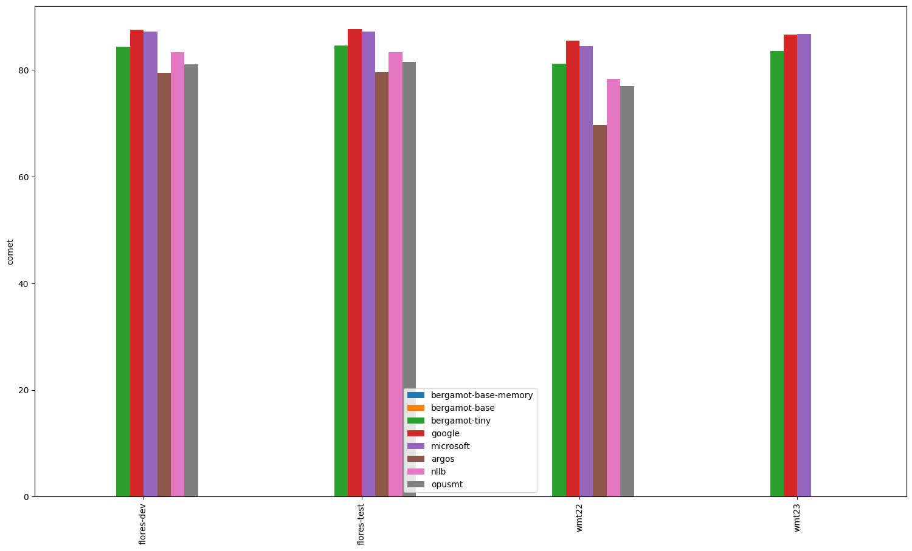
---

## az-en

| Translator/Dataset | flores-test | flores-dev |
| --- | --- | --- |
| bergamot-tiny | 83.15 | 83.27 |
| google | 87.72 (+4.57, +5.50%) | 87.68 (+4.41, +5.30%) |
| microsoft | 82.89 (-0.26, -0.31%) | 83.28 (+0.01, +0.01%) |
| argos | 64.37 (-18.78, -22.59%) | 65.17 (-18.10, -21.74%) |
| nllb | 80.50 (-2.65, -3.19%) | 81.08 (-2.19, -2.63%) |
| opusmt | 58.37 (-24.78, -29.80%) | 58.76 (-24.51, -29.43%) |

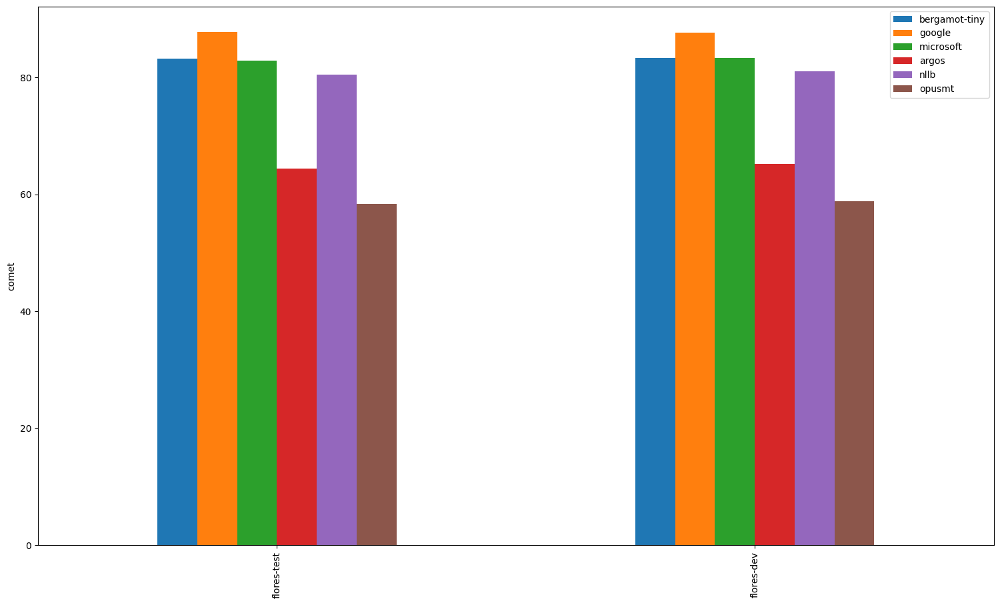
---

## ml-en

| Translator/Dataset | flores-test | flores-dev |
| --- | --- | --- |
| bergamot-tiny | 84.97 | 84.73 |
| google | 89.39 (+4.42, +5.20%) | 89.16 (+4.43, +5.23%) |
| microsoft | 88.41 (+3.44, +4.05%) | 88.41 (+3.68, +4.34%) |
| nllb | 87.11 (+2.14, +2.52%) | 87.15 (+2.42, +2.86%) |
| opusmt | 65.86 (-19.11, -22.49%) | 65.81 (-18.92, -22.33%) |

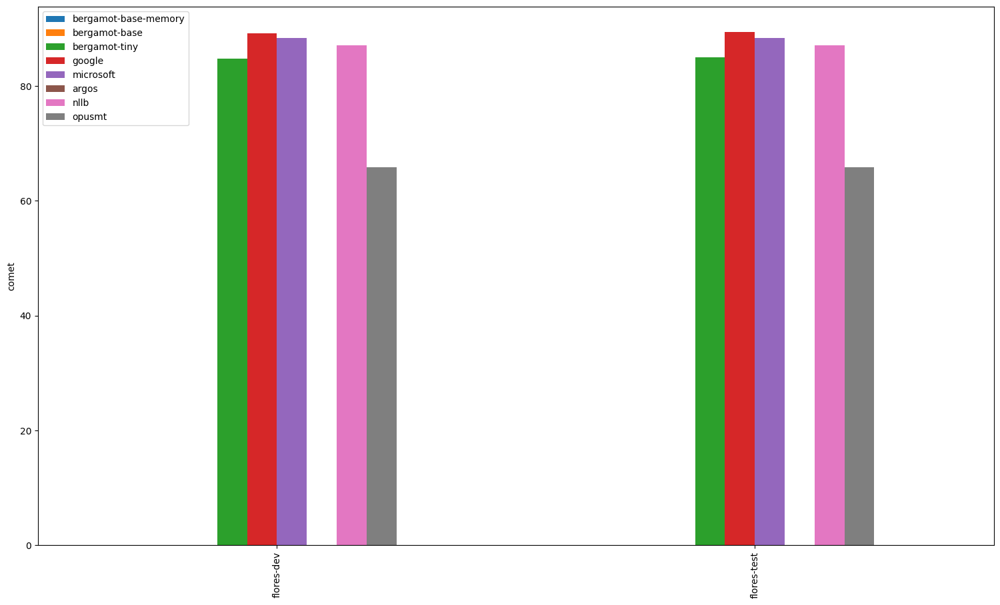
---

## ca-en

| Translator/Dataset | flores-test | flores-dev |
| --- | --- | --- |
| bergamot-base-memory | 87.71 | 88.08 |
| bergamot-tiny | 84.51 (-3.20, -3.65%) | 85.13 (-2.95, -3.35%) |
| google | 89.18 (+1.47, +1.68%) | 89.48 (+1.40, +1.59%) |
| microsoft | 88.93 (+1.22, +1.39%) | 89.05 (+0.97, +1.10%) |
| argos | 86.46 (-1.25, -1.43%) | 86.97 (-1.11, -1.26%) |
| nllb | 82.31 (-5.40, -6.16%) | 82.78 (-5.30, -6.02%) |
| opusmt | 78.16 (-9.55, -10.89%) | 78.53 (-9.55, -10.84%) |

---

## te-en

| Translator/Dataset | flores-test | flores-dev |
| --- | --- | --- |
| bergamot-tiny | 85.28 | 85.22 |
| google | 88.60 (+3.32, +3.89%) | 88.54 (+3.32, +3.90%) |
| microsoft | 88.01 (+2.73, +3.20%) | 87.79 (+2.57, +3.02%) |
| nllb | 86.87 (+1.59, +1.86%) | 86.96 (+1.74, +2.04%) |

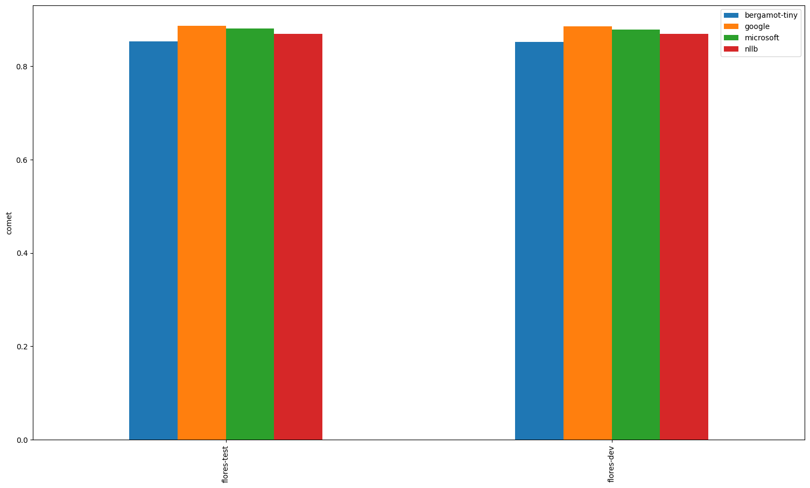
---

## fi-en

| Translator/Dataset | flores-test | wmt19 | wmt18 | wmt16 | wmt15 | flores-dev | wmt17 |
| --- | --- | --- | --- | --- | --- | --- | --- |
| bergamot-tiny | 87.02 | 85.17 | 83.86 | 85.39 | 84.98 | 87.33 | 86.47 |
| google | 90.03 (+3.01, +3.46%) | 88.48 (+3.31, +3.89%) | 86.28 (+2.42, +2.89%) | 88.37 (+2.98, +3.49%) | 87.87 (+2.89, +3.40%) | 90.38 (+3.05, +3.49%) | 89.35 (+2.88, +3.33%) |
| microsoft | 90.13 (+3.11, +3.57%) | 88.71 (+3.54, +4.16%) | 87.04 (+3.18, +3.79%) | 88.75 (+3.36, +3.93%) | 88.51 (+3.53, +4.15%) | 90.42 (+3.09, +3.54%) | 89.65 (+3.18, +3.68%) |
| argos | 81.83 (-5.19, -5.96%) | 76.74 (-8.43, -9.90%) | 77.57 (-6.29, -7.50%) | 78.31 (-7.08, -8.29%) | 78.67 (-6.31, -7.43%) | 82.08 (-5.25, -6.01%) | 79.33 (-7.14, -8.26%) |
| nllb | 66.26 (-20.76, -23.86%) | 63.31 (-21.86, -25.67%) | 64.22 (-19.64, -23.42%) | 66.37 (-19.02, -22.27%) | 65.07 (-19.91, -23.43%) | 66.96 (-20.37, -23.33%) | 65.50 (-20.97, -24.25%) |
| opusmt | 88.02 (+1.00, +1.15%) | 84.74 (-0.43, -0.50%) | 84.53 (+0.67, +0.80%) | 85.74 (+0.35, +0.41%) | 85.76 (+0.78, +0.92%) | 88.44 (+1.11, +1.27%) | 86.76 (+0.29, +0.34%) |

---

## en-ar

| Translator/Dataset | flores-dev | iwslt17 | flores-test |
| --- | --- | --- | --- |
| bergamot-base | 86.02 | 83.87 | 85.80 |
| google | 88.65 (+2.63, +3.06%) | 85.59 (+1.72, +2.05%) | 88.45 (+2.65, +3.09%) |
| microsoft | 87.28 (+1.26, +1.46%) | 84.50 (+0.63, +0.75%) | 87.21 (+1.41, +1.64%) |
| argos | 76.60 (-9.42, -10.95%) | 80.20 (-3.67, -4.38%) | 76.45 (-9.35, -10.90%) |
| nllb | 83.47 (-2.55, -2.96%) | 82.84 (-1.03, -1.23%) | 83.75 (-2.05, -2.39%) |
| opusmt | 83.34 (-2.68, -3.12%) | 82.29 (-1.58, -1.88%) | 83.19 (-2.61, -3.04%) |

---

## en-id

| Translator/Dataset | flores-test | flores-dev |
| --- | --- | --- |
| bergamot-tiny | 90.53 | 90.23 |
| google | 92.46 (+1.93, +2.13%) | 92.38 (+2.15, +2.38%) |
| microsoft | 91.80 (+1.27, +1.40%) | 91.61 (+1.38, +1.53%) |
| argos | 82.80 (-7.73, -8.54%) | 83.03 (-7.20, -7.98%) |
| nllb | 89.83 (-0.70, -0.77%) | 89.72 (-0.51, -0.57%) |
| opusmt | 87.79 (-2.74, -3.03%) | 87.64 (-2.59, -2.87%) |

---

## en-zh

| Translator/Dataset | wmt17 | wmt21 | wmt18 | wmt20 | wmt19 | flores-test | iwslt17 | wmt22 | flores-dev |
| --- | --- | --- | --- | --- | --- | --- | --- | --- | --- |
| bergamot-base-memory | 82.97 | 80.82 | 85.18 | 83.80 | 81.26 | 85.56 | 80.69 | 82.87 | 84.88 |
| bergamot-base | 83.08 (+0.11, +0.13%) | 80.84 (+0.02, +0.02%) | 85.45 (+0.27, +0.32%) | 83.66 (-0.14, -0.17%) | 81.32 (+0.06, +0.07%) | 85.56 (0.00, 0.00%) | 80.86 (+0.17, +0.21%) | 83.24 (+0.37, +0.45%) | 85.03 (+0.15, +0.18%) |
| google | 87.67 (+4.70, +5.66%) | 85.89 (+5.07, +6.27%) | 89.09 (+3.91, +4.59%) | 88.36 (+4.56, +5.44%) | 86.71 (+5.45, +6.71%) | 89.45 (+3.89, +4.55%) | 84.58 (+3.89, +4.82%) | 88.14 (+5.27, +6.36%) | 89.02 (+4.14, +4.88%) |
| microsoft | 86.25 (+3.28, +3.95%) | 84.10 (+3.28, +4.06%) | 87.81 (+2.63, +3.09%) | 86.70 (+2.90, +3.46%) | 85.01 (+3.75, +4.61%) | 88.44 (+2.88, +3.37%) | 83.67 (+2.98, +3.69%) | 86.92 (+4.05, +4.89%) | 88.07 (+3.19, +3.76%) |
| argos | 80.84 (-2.13, -2.57%) | 76.52 (-4.30, -5.32%) | 83.15 (-2.03, -2.38%) | 79.94 (-3.86, -4.61%) | 77.04 (-4.22, -5.19%) | 83.34 (-2.22, -2.59%) | 79.48 (-1.21, -1.50%) | 78.40 (-4.47, -5.39%) | 82.35 (-2.53, -2.98%) |
| nllb | 79.58 (-3.39, -4.09%) | 77.37 (-3.45, -4.27%) | 81.38 (-3.80, -4.46%) | 80.08 (-3.72, -4.44%) | 77.50 (-3.76, -4.63%) | 81.75 (-3.81, -4.45%) | 78.93 (-1.76, -2.18%) | 80.06 (-2.81, -3.39%) | 81.23 (-3.65, -4.30%) |
| opusmt | 79.29 (-3.68, -4.44%) | 75.40 (-5.42, -6.71%) | 81.25 (-3.93, -4.61%) | 78.30 (-5.50, -6.56%) | 75.57 (-5.69, -7.00%) | 82.44 (-3.12, -3.65%) | 79.65 (-1.04, -1.29%) | 78.34 (-4.53, -5.47%) | 81.44 (-3.44, -4.05%) |

---

## en-be

| Translator/Dataset | flores-dev | flores-test |
| --- | --- | --- |
| google | 88.33 | 88.30 |
| microsoft | 84.86 | 85.11 |
| nllb | 81.12 | 81.21 |

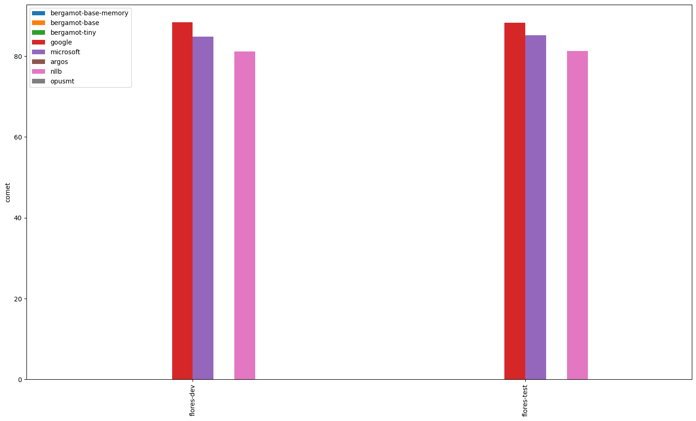
---

## en-th

| Translator/Dataset | flores-test | flores-dev |
| --- | --- | --- |
| google | 88.62 | 89.17 |
| microsoft | 87.71 | 88.47 |
| nllb | 78.85 | 80.33 |

---

## sl-en

| Translator/Dataset | flores-test | flores-dev |
| --- | --- | --- |
| bergamot-base-memory | 86.02 | 86.44 |
| bergamot-tiny | 84.74 (-1.28, -1.49%) | 85.26 (-1.18, -1.37%) |
| google | 88.11 (+2.09, +2.43%) | 88.35 (+1.91, +2.21%) |
| microsoft | 88.11 (+2.09, +2.43%) | 88.20 (+1.76, +2.04%) |
| nllb | 68.04 (-17.98, -20.90%) | 68.79 (-17.65, -20.42%) |

---

## hr-en

| Translator/Dataset | flores-test | flores-dev |
| --- | --- | --- |
| bergamot-tiny | 85.56 | 85.84 |
| google | 88.00 (+2.44, +2.85%) | 88.05 (+2.21, +2.57%) |
| microsoft | 87.67 (+2.11, +2.47%) | 87.95 (+2.11, +2.46%) |
| nllb | 72.35 (-13.21, -15.44%) | 73.78 (-12.06, -14.05%) |

---

## en-el

| Translator/Dataset | flores-test | flores-dev |
| --- | --- | --- |
| bergamot-tiny | 87.22 | 87.67 |
| google | 89.43 (+2.21, +2.53%) | 89.64 (+1.97, +2.25%) |
| microsoft | 89.49 (+2.27, +2.60%) | 89.81 (+2.14, +2.44%) |
| argos | 87.39 (+0.17, +0.19%) | 87.36 (-0.31, -0.35%) |
| nllb | 86.62 (-0.60, -0.69%) | 87.10 (-0.57, -0.65%) |
| opusmt | 86.34 (-0.88, -1.01%) | 86.51 (-1.16, -1.32%) |

---

## mr-en

| Translator/Dataset | flores-test | flores-dev |
| --- | --- | --- |
| google | 88.85 | 88.59 |
| microsoft | 87.97 | 87.70 |
| nllb | 85.65 | 85.67 |
| opusmt | 45.26 | 45.44 |

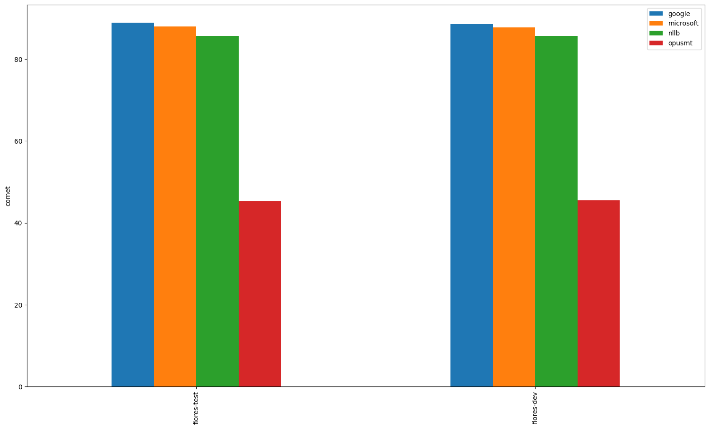
---

## hu-en

| Translator/Dataset | flores-test | wmt09 | wmt08 | flores-dev |
| --- | --- | --- | --- | --- |
| bergamot-tiny | 85.92 | 81.83 | 80.94 | 86.34 |
| google | 88.74 (+2.82, +3.28%) | 84.03 (+2.20, +2.69%) | 83.47 (+2.53, +3.13%) | 88.89 (+2.55, +2.95%) |
| microsoft | 88.78 (+2.86, +3.33%) | 84.47 (+2.64, +3.23%) | 83.81 (+2.87, +3.55%) | 88.99 (+2.65, +3.07%) |
| argos | 68.37 (-17.55, -20.43%) | 63.39 (-18.44, -22.53%) | 62.86 (-18.08, -22.34%) | 69.04 (-17.30, -20.04%) |
| nllb | 70.23 (-15.69, -18.26%) | 68.72 (-13.11, -16.02%) | 67.77 (-13.17, -16.27%) | 71.60 (-14.74, -17.07%) |
| opusmt | 86.31 (+0.39, +0.45%) | 82.38 (+0.55, +0.67%) | 81.49 (+0.55, +0.68%) | 86.78 (+0.44, +0.51%) |

---

## en-ja

| Translator/Dataset | flores-dev | iwslt17 | flores-test | wmt20 | wmt22 | wmt21 |
| --- | --- | --- | --- | --- | --- | --- |
| bergamot-base-memory | 89.33 | 82.21 | 89.28 | 87.09 | 85.78 | 86.76 |
| bergamot-base | 89.55 (+0.22, +0.25%) | 82.46 (+0.25, +0.30%) | 89.35 (+0.07, +0.08%) | 87.09 (0.00, 0.00%) | 86.20 (+0.42, +0.49%) | 86.61 (-0.15, -0.17%) |
| google | 92.34 (+3.01, +3.37%) | 86.24 (+4.03, +4.90%) | 92.19 (+2.91, +3.26%) | 91.62 (+4.53, +5.20%) | 90.21 (+4.43, +5.16%) | 91.41 (+4.65, +5.36%) |
| microsoft | 91.78 (+2.45, +2.74%) | 85.44 (+3.23, +3.93%) | 91.76 (+2.48, +2.78%) | 89.93 (+2.84, +3.26%) | 89.06 (+3.28, +3.82%) | 89.50 (+2.74, +3.16%) |
| argos | 78.93 (-10.40, -11.64%) | 72.82 (-9.39, -11.42%) | 78.76 (-10.52, -11.78%) | 73.82 (-13.27, -15.24%) | 77.29 (-8.49, -9.90%) | 71.01 (-15.75, -18.15%) |
| nllb | 87.27 (-2.06, -2.31%) | 82.18 (-0.03, -0.04%) | 87.12 (-2.16, -2.42%) | 85.67 (-1.42, -1.63%) | 83.95 (-1.83, -2.13%) | 84.92 (-1.84, -2.12%) |

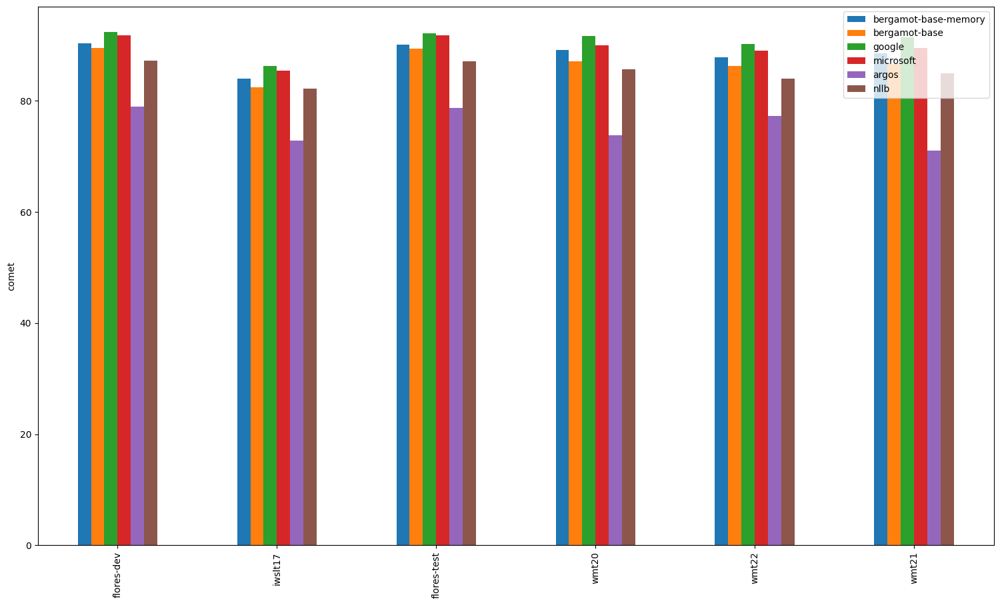
---

## en-af

| Translator/Dataset | flores-dev | flores-test |
| --- | --- | --- |
| google | 87.08 | 87.02 |
| microsoft | 87.19 | 87.23 |
| nllb | 85.66 | 85.52 |
| opusmt | 81.77 | 82.20 |

---

## ms-en

| Translator/Dataset | flores-test | flores-dev |
| --- | --- | --- |
| bergamot-tiny | 86.58 | 87.01 |
| google | 90.07 (+3.49, +4.03%) | 90.21 (+3.20, +3.68%) |
| microsoft | 89.03 (+2.45, +2.83%) | 89.11 (+2.10, +2.41%) |
| nllb | 83.69 (-2.89, -3.34%) | 83.96 (-3.05, -3.51%) |

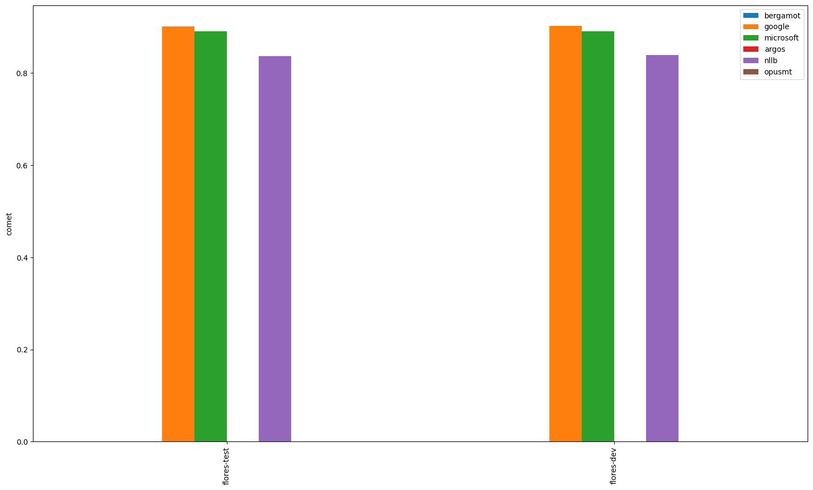
---

## id-en

| Translator/Dataset | flores-test | flores-dev |
| --- | --- | --- |
| bergamot-tiny | 87.40 | 87.58 |
| google | 89.82 (+2.42, +2.77%) | 89.81 (+2.23, +2.55%) |
| microsoft | 89.75 (+2.35, +2.69%) | 89.84 (+2.26, +2.58%) |
| argos | 80.19 (-7.21, -8.25%) | 80.96 (-6.62, -7.56%) |
| nllb | 86.11 (-1.29, -1.48%) | 86.46 (-1.12, -1.28%) |
| opusmt | 85.94 (-1.46, -1.67%) | 86.01 (-1.57, -1.79%) |

---

## en-he

| Translator/Dataset | flores-dev | flores-test |
| --- | --- | --- |
| google | 89.65 | 90.05 |
| microsoft | 89.50 | 89.86 |
| argos | 81.73 | 81.32 |
| nllb | 81.14 | 81.14 |
| opusmt | 84.72 | 84.92 |

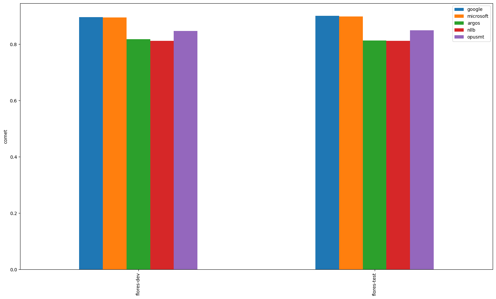
---

## en-da

| Translator/Dataset | flores-dev | flores-test |
| --- | --- | --- |
| bergamot-tiny | 88.81 | 89.08 |
| google | 91.22 (+2.41, +2.71%) | 91.38 (+2.30, +2.58%) |
| microsoft | 91.16 (+2.35, +2.65%) | 91.25 (+2.17, +2.44%) |
| argos | 83.13 (-5.68, -6.40%) | 82.75 (-6.33, -7.11%) |
| nllb | 88.52 (-0.29, -0.33%) | 88.16 (-0.92, -1.03%) |
| opusmt | 87.84 (-0.97, -1.09%) | 88.24 (-0.84, -0.94%) |

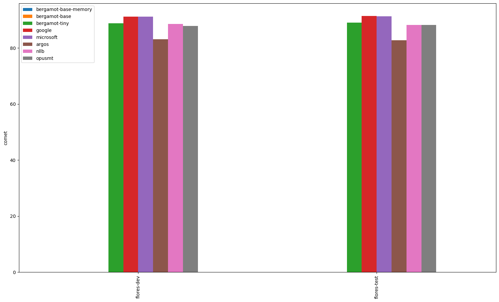
---

## en-is

| Translator/Dataset | flores-test | wmt21 | flores-dev |
| --- | --- | --- | --- |
| google | 86.68 | 84.60 | 86.65 |
| microsoft | 85.98 | 84.66 | 85.74 |
| nllb | 78.83 | 77.93 | 79.19 |
| opusmt | 75.97 | 69.58 | 75.98 |

---

## fr-en

| Translator/Dataset | mtedx_test | flores-test | wmt09 | wmt08 | wmt12 | wmt13 | wmt14 | wmt15 | wmt11 | flores-dev | wmt10 | iwslt17 |
| --- | --- | --- | --- | --- | --- | --- | --- | --- | --- | --- | --- | --- |
| bergamot-tiny | 84.93 | 88.17 | 81.53 | 80.42 | 81.81 | 84.16 | 85.27 | 82.79 | 81.74 | 88.10 | 82.43 | 86.48 |
| google | 86.65 (+1.72, +2.03%) | 89.44 (+1.27, +1.44%) | 83.26 (+1.73, +2.12%) | 82.48 (+2.06, +2.56%) | 83.02 (+1.21, +1.48%) | 85.23 (+1.07, +1.27%) | 86.88 (+1.61, +1.89%) | 85.31 (+2.52, +3.04%) | 82.97 (+1.23, +1.50%) | 89.65 (+1.55, +1.76%) | 84.48 (+2.05, +2.49%) | 87.30 (+0.82, +0.95%) |
| microsoft | 86.93 (+2.00, +2.35%) | 89.56 (+1.39, +1.58%) | 83.82 (+2.29, +2.81%) | 82.85 (+2.43, +3.02%) | 84.00 (+2.19, +2.68%) | 85.96 (+1.80, +2.14%) | 87.47 (+2.20, +2.58%) | 85.42 (+2.63, +3.18%) | 83.95 (+2.21, +2.70%) | 89.70 (+1.60, +1.82%) | 84.91 (+2.48, +3.01%) | 87.73 (+1.25, +1.45%) |
| argos | 84.07 (-0.86, -1.01%) | 87.18 (-0.99, -1.12%) | 81.03 (-0.50, -0.61%) | 79.79 (-0.63, -0.78%) | 81.02 (-0.79, -0.97%) | 83.26 (-0.90, -1.07%) | 84.07 (-1.20, -1.41%) | 81.78 (-1.01, -1.22%) | 81.11 (-0.63, -0.77%) | 87.26 (-0.84, -0.95%) | 81.87 (-0.56, -0.68%) | 85.33 (-1.15, -1.33%) |
| nllb | 82.26 (-2.67, -3.14%) | 87.60 (-0.57, -0.65%) | 81.65 (+0.12, +0.15%) | 80.69 (+0.27, +0.34%) | 82.00 (+0.19, +0.23%) | 83.58 (-0.58, -0.69%) | 84.78 (-0.49, -0.57%) | 80.99 (-1.80, -2.17%) | 81.97 (+0.23, +0.28%) | 87.72 (-0.38, -0.43%) | 82.32 (-0.11, -0.13%) | 84.53 (-1.95, -2.25%) |
| opusmt | 85.48 (+0.55, +0.65%) | 88.35 (+0.18, +0.20%) | 82.50 (+0.97, +1.19%) | 81.43 (+1.01, +1.26%) | 82.64 (+0.83, +1.01%) | 84.53 (+0.37, +0.44%) | 85.66 (+0.39, +0.46%) | 83.70 (+0.91, +1.10%) | 82.59 (+0.85, +1.04%) | 88.35 (+0.25, +0.28%) | 83.32 (+0.89, +1.08%) | 86.53 (+0.05, +0.06%) |

---

## ar-en

| Translator/Dataset | flores-dev | flores-test | iwslt17 |
| --- | --- | --- | --- |
| bergamot-base | 86.49 | 86.21 | 84.66 |
| google | 88.64 (+2.15, +2.49%) | 88.47 (+2.26, +2.62%) | 86.38 (+1.72, +2.03%) |
| microsoft | 87.74 (+1.25, +1.45%) | 87.47 (+1.26, +1.46%) | 85.53 (+0.87, +1.03%) |
| argos | 81.32 (-5.17, -5.98%) | 81.19 (-5.02, -5.82%) | 81.67 (-2.99, -3.53%) |
| nllb | 85.72 (-0.77, -0.89%) | 85.36 (-0.85, -0.99%) | 83.61 (-1.05, -1.24%) |
| opusmt | 84.29 (-2.20, -2.54%) | 84.39 (-1.82, -2.11%) | 83.79 (-0.87, -1.03%) |

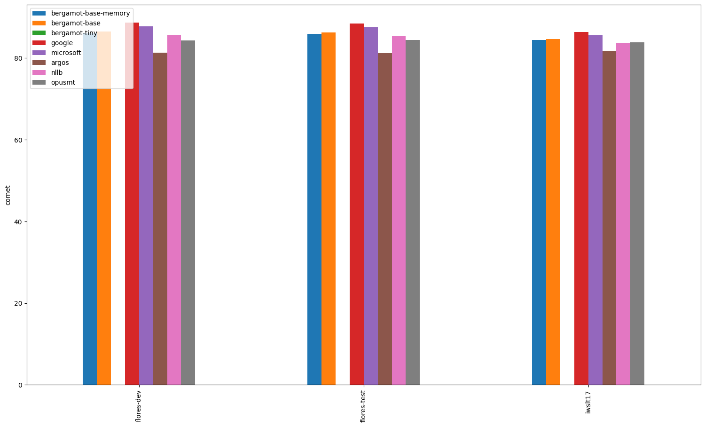
---

## en-lv

| Translator/Dataset | flores-dev | flores-test | wmt17 |
| --- | --- | --- | --- |
| bergamot-base-memory | 86.66 | 86.88 | 84.49 |
| bergamot-tiny | 85.63 (-1.03, -1.19%) | 85.80 (-1.08, -1.24%) | 83.63 (-0.86, -1.02%) |
| google | 90.73 (+4.07, +4.70%) | 90.64 (+3.76, +4.33%) | 87.91 (+3.42, +4.05%) |
| microsoft | 90.37 (+3.71, +4.28%) | 90.12 (+3.24, +3.73%) | 87.92 (+3.43, +4.06%) |
| nllb | 73.83 (-12.83, -14.80%) | 73.18 (-13.70, -15.77%) | 72.79 (-11.70, -13.85%) |

---

## cy-en

| Translator/Dataset | flores-test | flores-dev |
| --- | --- | --- |
| google | 90.10 | 90.20 |
| microsoft | 88.93 | 89.20 |
| nllb | 56.21 | 57.91 |
| opusmt | 51.92 | 53.00 |

---

## en-cy

| Translator/Dataset | flores-test | flores-dev |
| --- | --- | --- |
| google | 88.36 | 88.57 |
| microsoft | 87.88 | 88.11 |
| nllb | 79.29 | 80.62 |
| opusmt | 50.62 | 51.47 |

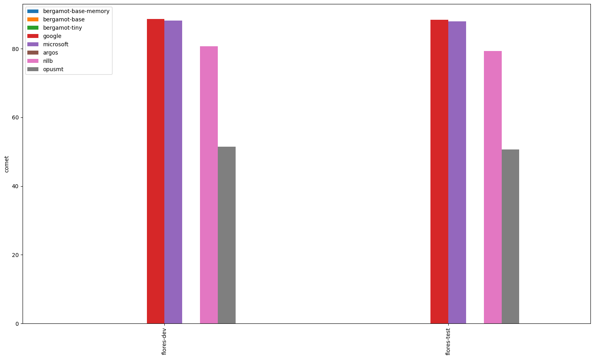
---

## en-nl

| Translator/Dataset | flores-test | flores-dev |
| --- | --- | --- |
| bergamot-tiny | 85.91 | 86.21 |
| google | 88.26 (+2.35, +2.74%) | 88.26 (+2.05, +2.38%) |
| microsoft | 87.92 (+2.01, +2.34%) | 87.85 (+1.64, +1.90%) |
| argos | 84.78 (-1.13, -1.32%) | 84.37 (-1.84, -2.13%) |
| nllb | 85.54 (-0.37, -0.43%) | 85.27 (-0.94, -1.09%) |
| opusmt | 85.01 (-0.90, -1.05%) | 85.01 (-1.20, -1.39%) |

---

## sv-en

| Translator/Dataset | flores-test | flores-dev |
| --- | --- | --- |
| bergamot-tiny | 88.54 | 89.01 |
| google | 89.79 (+1.25, +1.41%) | 89.87 (+0.86, +0.97%) |
| microsoft | 90.48 (+1.94, +2.19%) | 90.73 (+1.72, +1.93%) |
| argos | 87.61 (-0.93, -1.05%) | 88.08 (-0.93, -1.04%) |
| nllb | 77.14 (-11.40, -12.88%) | 77.75 (-11.26, -12.65%) |
| opusmt | 89.09 (+0.55, +0.62%) | 89.34 (+0.33, +0.37%) |

---

## am-en

| Translator/Dataset | flores-dev | flores-test |
| --- | --- | --- |
| google | 88.45 | 88.54 |
| microsoft | 87.28 | 87.45 |
| nllb | 84.99 | 84.98 |

---

## cs-en

| Translator/Dataset | flores-test | wmt09 | wmt18 | wmt08 | wmt12 | wmt22 | wmt13 | wmt16 | wmt14 | wmt15 | wmt11 | wmt20 | wmt21 | flores-dev | wmt10 | wmt17 |
| --- | --- | --- | --- | --- | --- | --- | --- | --- | --- | --- | --- | --- | --- | --- | --- | --- |
| bergamot-tiny | 86.69 | 81.38 | 83.01 | 80.90 | 81.51 | 83.90 | 83.32 | 82.37 | 84.67 | 82.93 | 81.03 | 78.79 | 82.56 | 86.50 | 81.47 | 82.33 |
| google | 88.93 (+2.24, +2.58%) | 83.91 (+2.53, +3.11%) | 85.00 (+1.99, +2.40%) | 83.47 (+2.57, +3.18%) | 83.68 (+2.17, +2.66%) | 86.99 (+3.09, +3.68%) | 85.40 (+2.08, +2.50%) | 85.32 (+2.95, +3.58%) | 87.31 (+2.64, +3.12%) | 85.36 (+2.43, +2.93%) | 83.10 (+2.07, +2.55%) | 81.58 (+2.79, +3.54%) | 84.65 (+2.09, +2.53%) | 88.87 (+2.37, +2.74%) | 84.21 (+2.74, +3.36%) | 84.86 (+2.53, +3.07%) |
| microsoft | 88.88 (+2.19, +2.53%) | 84.28 (+2.90, +3.56%) | 85.50 (+2.49, +3.00%) | 83.51 (+2.61, +3.23%) | 84.35 (+2.84, +3.48%) | 87.44 (+3.54, +4.22%) | 86.08 (+2.76, +3.31%) | 85.42 (+3.05, +3.70%) | 87.85 (+3.18, +3.76%) | 85.77 (+2.84, +3.42%) | 83.92 (+2.89, +3.57%) | 81.85 (+3.06, +3.88%) | 84.70 (+2.14, +2.59%) | 88.77 (+2.27, +2.62%) | 84.33 (+2.86, +3.51%) | 84.99 (+2.66, +3.23%) |
| argos | 77.63 (-9.06, -10.45%) | 70.32 (-11.06, -13.59%) | 70.21 (-12.80, -15.42%) | 69.28 (-11.62, -14.36%) | 70.20 (-11.31, -13.88%) | 68.00 (-15.90, -18.95%) | 72.64 (-10.68, -12.82%) | 70.99 (-11.38, -13.82%) | 72.23 (-12.44, -14.69%) | 69.96 (-12.97, -15.64%) | 71.00 (-10.03, -12.38%) | 64.54 (-14.25, -18.09%) | 69.84 (-12.72, -15.41%) | 77.32 (-9.18, -10.61%) | 70.94 (-10.53, -12.93%) | 70.37 (-11.96, -14.53%) |
| nllb | 78.45 (-8.24, -9.51%) | 72.56 (-8.82, -10.84%) | 72.24 (-10.77, -12.97%) | 72.23 (-8.67, -10.72%) | 72.44 (-9.07, -11.13%) | 70.80 (-13.10, -15.61%) | 74.07 (-9.25, -11.10%) | 72.29 (-10.08, -12.24%) | 74.48 (-10.19, -12.03%) | 71.58 (-11.35, -13.69%) | 72.33 (-8.70, -10.74%) | 67.10 (-11.69, -14.84%) | 72.22 (-10.34, -12.52%) | 78.70 (-7.80, -9.02%) | 73.20 (-8.27, -10.15%) | 72.21 (-10.12, -12.29%) |
| opusmt | 86.51 (-0.18, -0.21%) | 81.62 (+0.24, +0.29%) | 82.20 (-0.81, -0.98%) | 80.32 (-0.58, -0.72%) | 81.51 (0.00, 0.00%) | 83.23 (-0.67, -0.80%) | 83.33 (+0.01, +0.01%) | 82.10 (-0.27, -0.33%) | 84.23 (-0.44, -0.52%) | 82.43 (-0.50, -0.60%) | 81.06 (+0.03, +0.04%) | 76.46 (-2.33, -2.96%) | 81.77 (-0.79, -0.96%) | 86.44 (-0.06, -0.07%) | 81.35 (-0.12, -0.15%) | 81.56 (-0.77, -0.94%) |

---

## en-ca

| Translator/Dataset | flores-test | flores-dev |
| --- | --- | --- |
| bergamot-base-memory | 86.96 | 86.95 |
| bergamot-tiny | 86.06 (-0.90, -1.03%) | 86.31 (-0.64, -0.74%) |
| google | 87.53 (+0.57, +0.66%) | 87.78 (+0.83, +0.95%) |
| microsoft | 88.11 (+1.15, +1.32%) | 88.24 (+1.29, +1.48%) |
| argos | 76.84 (-10.12, -11.64%) | 77.05 (-9.90, -11.39%) |
| nllb | 84.74 (-2.22, -2.55%) | 85.06 (-1.89, -2.17%) |
| opusmt | 76.46 (-10.50, -12.07%) | 76.88 (-10.07, -11.58%) |

---

## en-cs

| Translator/Dataset | flores-test | wmt10 | wmt16 | wmt20 | wmt22 | wmt09 | wmt12 | flores-dev | wmt21 | wmt13 | wmt08 | wmt19 | wmt14 | wmt18 | wmt17 | wmt11 | wmt15 |
| --- | --- | --- | --- | --- | --- | --- | --- | --- | --- | --- | --- | --- | --- | --- | --- | --- | --- |
| bergamot-base | 88.69 | 86.97 | 87.08 | 86.66 | 86.75 | 86.43 | 86.16 | 89.30 | 84.07 | 88.28 | 85.68 | 84.91 | 89.77 | 87.73 | 87.11 | 85.56 | 87.93 |
| bergamot-tiny | 87.51 (-1.18, -1.33%) | 85.36 (-1.61, -1.85%) | 85.48 (-1.60, -1.84%) | 84.75 (-1.91, -2.20%) | 85.89 (-0.86, -0.99%) | 84.80 (-1.63, -1.89%) | 84.47 (-1.69, -1.96%) | 87.36 (-1.94, -2.17%) | 82.30 (-1.77, -2.11%) | 86.38 (-1.90, -2.15%) | 83.74 (-1.94, -2.26%) | 83.54 (-1.37, -1.61%) | 87.89 (-1.88, -2.09%) | 85.82 (-1.91, -2.18%) | 85.32 (-1.79, -2.05%) | 83.95 (-1.61, -1.88%) | 86.15 (-1.78, -2.02%) |
| google | 91.47 (+2.78, +3.13%) | 89.03 (+2.06, +2.37%) | 89.20 (+2.12, +2.43%) | 88.68 (+2.02, +2.33%) | 91.36 (+4.61, +5.31%) | 88.85 (+2.42, +2.80%) | 88.07 (+1.91, +2.22%) | 91.58 (+2.28, +2.55%) | 86.34 (+2.27, +2.70%) | 89.73 (+1.45, +1.64%) | 88.33 (+2.65, +3.09%) | 87.43 (+2.52, +2.97%) | 91.52 (+1.75, +1.95%) | 89.29 (+1.56, +1.78%) | 89.10 (+1.99, +2.28%) | 87.76 (+2.20, +2.57%) | 89.94 (+2.01, +2.29%) |
| microsoft | 91.33 (+2.64, +2.98%) | 89.36 (+2.39, +2.75%) | 89.51 (+2.43, +2.79%) | 89.59 (+2.93, +3.38%) | 90.63 (+3.88, +4.47%) | 89.05 (+2.62, +3.03%) | 88.64 (+2.48, +2.88%) | 91.54 (+2.24, +2.51%) | 87.21 (+3.14, +3.73%) | 90.22 (+1.94, +2.20%) | 88.58 (+2.90, +3.38%) | 88.80 (+3.89, +4.58%) | 92.05 (+2.28, +2.54%) | 89.63 (+1.90, +2.17%) | 89.44 (+2.33, +2.67%) | 88.51 (+2.95, +3.45%) | 90.10 (+2.17, +2.47%) |
| argos | 71.12 (-17.57, -19.81%) | 68.22 (-18.75, -21.56%) | 68.41 (-18.67, -21.44%) | 58.77 (-27.89, -32.18%) | 73.85 (-12.90, -14.87%) | 69.12 (-17.31, -20.03%) | 67.13 (-19.03, -22.09%) | 71.99 (-17.31, -19.38%) | 59.19 (-24.88, -29.59%) | 71.55 (-16.73, -18.95%) | 66.36 (-19.32, -22.55%) | 60.47 (-24.44, -28.78%) | 69.19 (-20.58, -22.93%) | 67.91 (-19.82, -22.59%) | 68.19 (-18.92, -21.72%) | 68.82 (-16.74, -19.57%) | 68.39 (-19.54, -22.22%) |
| nllb | 86.67 (-2.02, -2.28%) | 84.73 (-2.24, -2.58%) | 84.22 (-2.86, -3.28%) | 82.59 (-4.07, -4.70%) | 84.54 (-2.21, -2.55%) | 83.97 (-2.46, -2.85%) | 83.59 (-2.57, -2.98%) | 86.44 (-2.86, -3.20%) | 81.03 (-3.04, -3.62%) | 85.87 (-2.41, -2.73%) | 83.69 (-1.99, -2.32%) | 81.85 (-3.06, -3.60%) | 86.61 (-3.16, -3.52%) | 84.70 (-3.03, -3.45%) | 84.31 (-2.80, -3.21%) | 83.91 (-1.65, -1.93%) | 84.80 (-3.13, -3.56%) |
| opusmt | 85.95 (-2.74, -3.09%) | 84.84 (-2.13, -2.45%) | 84.56 (-2.52, -2.89%) | 81.11 (-5.55, -6.40%) | 85.15 (-1.60, -1.84%) | 84.54 (-1.89, -2.19%) | 83.98 (-2.18, -2.53%) | 86.02 (-3.28, -3.67%) | 79.60 (-4.47, -5.32%) | 86.62 (-1.66, -1.88%) | 83.26 (-2.42, -2.82%) | 80.20 (-4.71, -5.55%) | 87.12 (-2.65, -2.95%) | 85.12 (-2.61, -2.98%) | 84.78 (-2.33, -2.67%) | 84.37 (-1.19, -1.39%) | 85.65 (-2.28, -2.59%) |

---

## en-hy

| Translator/Dataset | flores-dev | flores-test |
| --- | --- | --- |
| google | 90.42 | 90.26 |
| microsoft | 87.98 | 88.05 |
| nllb | 86.79 | 86.68 |
| opusmt | 68.22 | 68.02 |

---

## en-vi

| Translator/Dataset | flores-test | flores-dev |
| --- | --- | --- |
| google | 89.79 | 90.18 |
| microsoft | 88.69 | 88.92 |
| nllb | 86.39 | 86.47 |
| opusmt | 75.85 | 75.56 |

---

## ig-en

| Translator/Dataset | flores-test | flores-dev |
| --- | --- | --- |
| google | 74.27 | 73.35 |
| microsoft | 67.50 | 67.28 |
| nllb | 66.04 | 65.48 |
| opusmt | 51.77 | 51.65 |

---

## nb-en

| Translator/Dataset | flores-test | flores-dev |
| --- | --- | --- |
| bergamot-tiny | 84.97 | 84.72 |
| google | 89.14 (+4.17, +4.91%) | 89.43 (+4.71, +5.56%) |
| microsoft | 89.10 (+4.13, +4.86%) | 89.29 (+4.57, +5.39%) |
| argos | 86.43 (+1.46, +1.72%) | 86.82 (+2.10, +2.48%) |
| nllb | 75.23 (-9.74, -11.46%) | 76.66 (-8.06, -9.51%) |

---

## my-en

| Translator/Dataset | flores-dev | flores-test |
| --- | --- | --- |
| google | 86.60 | 86.51 |
| microsoft | 83.79 | 83.69 |
| nllb | 84.22 | 84.66 |

---

## en-et

| Translator/Dataset | flores-test | wmt18 | flores-dev |
| --- | --- | --- | --- |
| bergamot-tiny | 87.38 | 86.47 | 87.39 |
| google | 91.61 (+4.23, +4.84%) | 90.60 (+4.13, +4.78%) | 91.97 (+4.58, +5.24%) |
| microsoft | 91.43 (+4.05, +4.63%) | 90.55 (+4.08, +4.72%) | 91.46 (+4.07, +4.66%) |
| argos | 86.10 (-1.28, -1.46%) | 84.57 (-1.90, -2.20%) | 86.04 (-1.35, -1.54%) |
| nllb | 83.01 (-4.37, -5.00%) | 82.58 (-3.89, -4.50%) | 83.66 (-3.73, -4.27%) |
| opusmt | 86.37 (-1.01, -1.16%) | 85.13 (-1.34, -1.55%) | 86.34 (-1.05, -1.20%) |

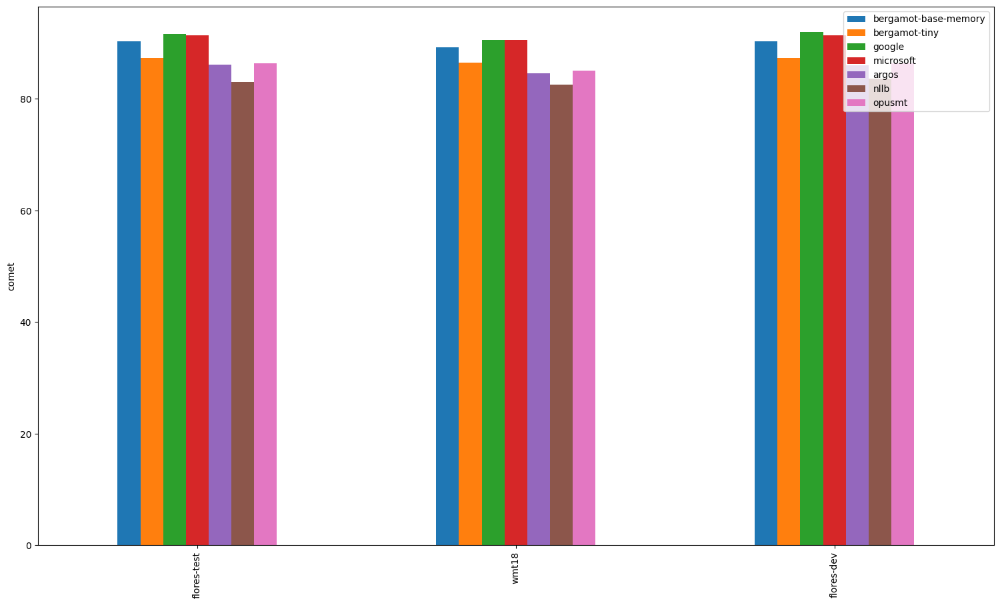
---

## lt-en

| Translator/Dataset | flores-test | wmt19 | flores-dev |
| --- | --- | --- | --- |
| bergamot-tiny | 83.64 | 83.46 | 83.93 |
| google | 87.06 (+3.42, +4.09%) | 85.46 (+2.00, +2.40%) | 87.15 (+3.22, +3.84%) |
| microsoft | 85.77 (+2.13, +2.55%) | 85.26 (+1.80, +2.16%) | 85.83 (+1.90, +2.26%) |
| nllb | 66.01 (-17.63, -21.08%) | 67.99 (-15.47, -18.54%) | 66.58 (-17.35, -20.67%) |

---

## en-de

| Translator/Dataset | wmt12 | wmt21 | wmt15 | wmt19 | wmt14 | wmt22 | wmt08 | iwslt17 | wmt13 | wmt10 | wmt16 | flores-test | wmt09 | wmt18 | wmt20 | wmt11 | flores-dev | wmt17 |
| --- | --- | --- | --- | --- | --- | --- | --- | --- | --- | --- | --- | --- | --- | --- | --- | --- | --- | --- |
| bergamot-tiny | 81.96 | 82.30 | 84.39 | 84.39 | 84.95 | 82.40 | 81.71 | 82.23 | 83.88 | 83.06 | 85.64 | 85.67 | 81.65 | 86.97 | 83.57 | 80.77 | 85.51 | 84.64 |
| google | 84.43 (+2.47, +3.01%) | 84.75 (+2.45, +2.98%) | 87.25 (+2.86, +3.39%) | 86.71 (+2.32, +2.75%) | 88.08 (+3.13, +3.68%) | 87.06 (+4.66, +5.66%) | 84.67 (+2.96, +3.62%) | 84.83 (+2.60, +3.16%) | 86.31 (+2.43, +2.90%) | 85.45 (+2.39, +2.88%) | 88.20 (+2.56, +2.99%) | 88.78 (+3.11, +3.63%) | 84.46 (+2.81, +3.44%) | 89.42 (+2.45, +2.82%) | 86.72 (+3.15, +3.77%) | 83.64 (+2.87, +3.55%) | 88.98 (+3.47, +4.06%) | 87.45 (+2.81, +3.32%) |
| microsoft | 84.83 (+2.87, +3.50%) | 85.12 (+2.82, +3.43%) | 87.33 (+2.94, +3.48%) | 87.29 (+2.90, +3.44%) | 88.15 (+3.20, +3.77%) | 87.09 (+4.69, +5.69%) | 84.89 (+3.18, +3.89%) | 84.89 (+2.66, +3.23%) | 86.63 (+2.75, +3.28%) | 85.86 (+2.80, +3.37%) | 88.56 (+2.92, +3.41%) | 88.81 (+3.14, +3.67%) | 84.80 (+3.15, +3.86%) | 89.76 (+2.79, +3.21%) | 87.01 (+3.44, +4.12%) | 84.18 (+3.41, +4.22%) | 88.80 (+3.29, +3.85%) | 87.68 (+3.04, +3.59%) |
| argos | 77.63 (-4.33, -5.28%) | 73.77 (-8.53, -10.36%) | 79.23 (-5.16, -6.11%) | 76.26 (-8.13, -9.63%) | 79.75 (-5.20, -6.12%) | 79.13 (-3.27, -3.97%) | 77.16 (-4.55, -5.57%) | 78.71 (-3.52, -4.28%) | 80.60 (-3.28, -3.91%) | 78.73 (-4.33, -5.21%) | 80.37 (-5.27, -6.15%) | 81.20 (-4.47, -5.22%) | 78.45 (-3.20, -3.92%) | 81.91 (-5.06, -5.82%) | 74.88 (-8.69, -10.40%) | 77.32 (-3.45, -4.27%) | 81.11 (-4.40, -5.15%) | 79.55 (-5.09, -6.01%) |
| nllb | 81.22 (-0.74, -0.90%) | 80.74 (-1.56, -1.90%) | 83.43 (-0.96, -1.14%) | 82.43 (-1.96, -2.32%) | 83.79 (-1.16, -1.37%) | 82.18 (-0.22, -0.27%) | 81.09 (-0.62, -0.76%) | 81.35 (-0.88, -1.07%) | 83.39 (-0.49, -0.58%) | 82.62 (-0.44, -0.53%) | 84.11 (-1.53, -1.79%) | 84.97 (-0.70, -0.82%) | 81.51 (-0.14, -0.17%) | 85.25 (-1.72, -1.98%) | 81.98 (-1.59, -1.90%) | 80.80 (+0.03, +0.04%) | 85.04 (-0.47, -0.55%) | 83.32 (-1.32, -1.56%) |
| opusmt | 81.24 (-0.72, -0.88%) | 78.90 (-3.40, -4.13%) | 83.46 (-0.93, -1.10%) | 81.46 (-2.93, -3.47%) | 83.88 (-1.07, -1.26%) | 82.23 (-0.17, -0.21%) | 81.05 (-0.66, -0.81%) | 82.01 (-0.22, -0.27%) | 83.67 (-0.21, -0.25%) | 82.61 (-0.45, -0.54%) | 84.09 (-1.55, -1.81%) | 84.70 (-0.97, -1.13%) | 81.54 (-0.11, -0.13%) | 86.36 (-0.61, -0.70%) | 80.43 (-3.14, -3.76%) | 80.43 (-0.34, -0.42%) | 84.22 (-1.29, -1.51%) | 83.72 (-0.92, -1.09%) |

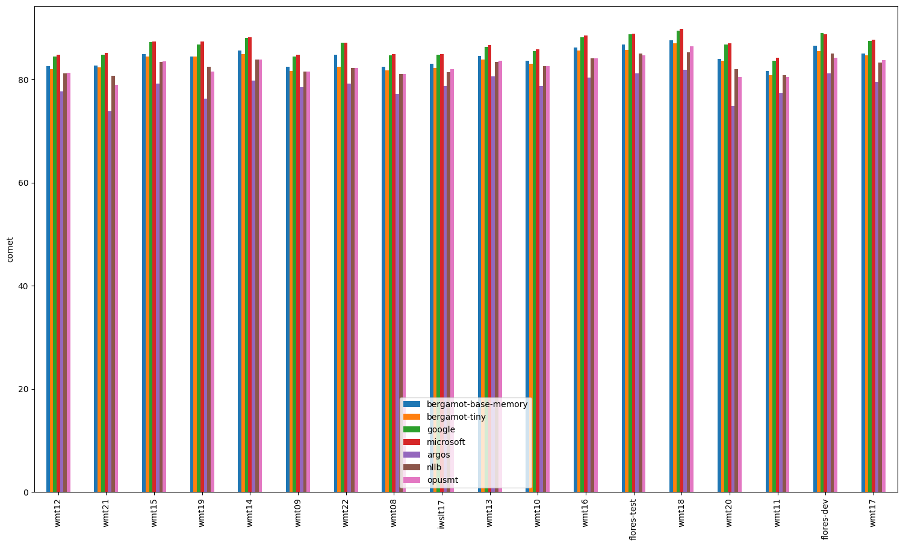
---

## ru-en

| Translator/Dataset | mtedx_test | flores-test | wmt19 | wmt18 | wmt22 | wmt13 | wmt16 | wmt14 | wmt15 | wmt20 | wmt21 | flores-dev | wmt17 |
| --- | --- | --- | --- | --- | --- | --- | --- | --- | --- | --- | --- | --- | --- |
| bergamot-tiny | 77.11 | 84.25 | 82.73 | 82.69 | 82.06 | 81.65 | 82.40 | 84.54 | 82.84 | 83.44 | 83.34 | 84.33 | 83.32 |
| google | 78.97 (+1.86, +2.41%) | 86.76 (+2.51, +2.98%) | 84.10 (+1.37, +1.66%) | 85.05 (+2.36, +2.85%) | 84.88 (+2.82, +3.44%) | 83.63 (+1.98, +2.42%) | 84.87 (+2.47, +3.00%) | 86.73 (+2.19, +2.59%) | 85.17 (+2.33, +2.81%) | 85.02 (+1.58, +1.89%) | 85.17 (+1.83, +2.20%) | 87.00 (+2.67, +3.17%) | 85.83 (+2.51, +3.01%) |
| microsoft | 79.23 (+2.12, +2.75%) | 86.64 (+2.39, +2.84%) | 85.19 (+2.46, +2.97%) | 85.44 (+2.75, +3.33%) | 85.16 (+3.10, +3.78%) | 84.13 (+2.48, +3.04%) | 85.10 (+2.70, +3.28%) | 86.99 (+2.45, +2.90%) | 85.48 (+2.64, +3.19%) | 85.54 (+2.10, +2.52%) | 85.66 (+2.32, +2.78%) | 86.81 (+2.48, +2.94%) | 86.12 (+2.80, +3.36%) |
| argos | 73.38 (-3.73, -4.84%) | 80.17 (-4.08, -4.84%) | 75.85 (-6.88, -8.32%) | 77.96 (-4.73, -5.72%) | 75.35 (-6.71, -8.18%) | 77.48 (-4.17, -5.11%) | 77.66 (-4.74, -5.75%) | 79.37 (-5.17, -6.12%) | 78.22 (-4.62, -5.58%) | 77.44 (-6.00, -7.19%) | 77.01 (-6.33, -7.60%) | 80.40 (-3.93, -4.66%) | 78.42 (-4.90, -5.88%) |
| nllb | 77.60 (+0.49, +0.64%) | 85.25 (+1.00, +1.19%) | 83.01 (+0.28, +0.34%) | 83.49 (+0.80, +0.97%) | 81.91 (-0.15, -0.18%) | 82.53 (+0.88, +1.08%) | 83.57 (+1.17, +1.42%) | 84.90 (+0.36, +0.43%) | 83.62 (+0.78, +0.94%) | 83.73 (+0.29, +0.35%) | 83.48 (+0.14, +0.17%) | 85.62 (+1.29, +1.53%) | 83.98 (+0.66, +0.79%) |
| opusmt | 76.77 (-0.34, -0.44%) | 83.91 (-0.34, -0.40%) | 80.41 (-2.32, -2.80%) | 82.00 (-0.69, -0.83%) | 79.92 (-2.14, -2.61%) | 81.31 (-0.34, -0.42%) | 81.59 (-0.81, -0.98%) | 83.26 (-1.28, -1.51%) | 82.14 (-0.70, -0.85%) | 81.36 (-2.08, -2.49%) | 81.07 (-2.27, -2.72%) | 84.00 (-0.33, -0.39%) | 82.37 (-0.95, -1.14%) |

---

## da-en

| Translator/Dataset | flores-test | flores-dev |
| --- | --- | --- |
| bergamot-tiny | 89.15 | 89.11 |
| google | 90.47 (+1.32, +1.48%) | 90.53 (+1.42, +1.59%) |
| microsoft | 90.51 (+1.36, +1.53%) | 90.63 (+1.52, +1.71%) |
| argos | 84.10 (-5.05, -5.66%) | 84.82 (-4.29, -4.81%) |
| nllb | 78.11 (-11.04, -12.38%) | 78.20 (-10.91, -12.24%) |
| opusmt | 89.10 (-0.05, -0.06%) | 89.19 (+0.08, +0.09%) |

---

## en-bg

| Translator/Dataset | flores-test | flores-dev |
| --- | --- | --- |
| bergamot-tiny | 89.30 | 89.36 |
| google | 91.59 (+2.29, +2.56%) | 91.59 (+2.23, +2.50%) |
| microsoft | 90.97 (+1.67, +1.87%) | 90.89 (+1.53, +1.71%) |
| argos | 88.14 (-1.16, -1.30%) | 87.90 (-1.46, -1.63%) |
| nllb | 88.02 (-1.28, -1.43%) | 87.88 (-1.48, -1.66%) |
| opusmt | 82.23 (-7.07, -7.92%) | 82.38 (-6.98, -7.81%) |

---

## en-uk

| Translator/Dataset | flores-test | wmt22 | flores-dev |
| --- | --- | --- | --- |
| bergamot-base-memory | 87.96 | 83.28 | 87.76 |
| bergamot-tiny | 86.06 (-1.90, -2.16%) | 81.30 (-1.98, -2.38%) | 85.91 (-1.85, -2.11%) |
| google | 90.74 (+2.78, +3.16%) | 88.60 (+5.32, +6.39%) | 90.59 (+2.83, +3.22%) |
| microsoft | 89.95 (+1.99, +2.26%) | 87.39 (+4.11, +4.94%) | 89.81 (+2.05, +2.34%) |
| argos | 69.96 (-18.00, -20.46%) | 68.71 (-14.57, -17.50%) | 69.99 (-17.77, -20.25%) |
| nllb | 84.04 (-3.92, -4.46%) | 80.00 (-3.28, -3.94%) | 84.31 (-3.45, -3.93%) |
| opusmt | 81.61 (-6.35, -7.22%) | 75.61 (-7.67, -9.21%) | 81.21 (-6.55, -7.46%) |

---

## en-az

| Translator/Dataset | flores-test | flores-dev |
| --- | --- | --- |
| google | 87.37 | 87.51 |
| microsoft | 84.50 | 84.55 |
| argos | 51.94 | 52.97 |
| nllb | 84.02 | 84.28 |
| opusmt | 55.79 | 56.37 |

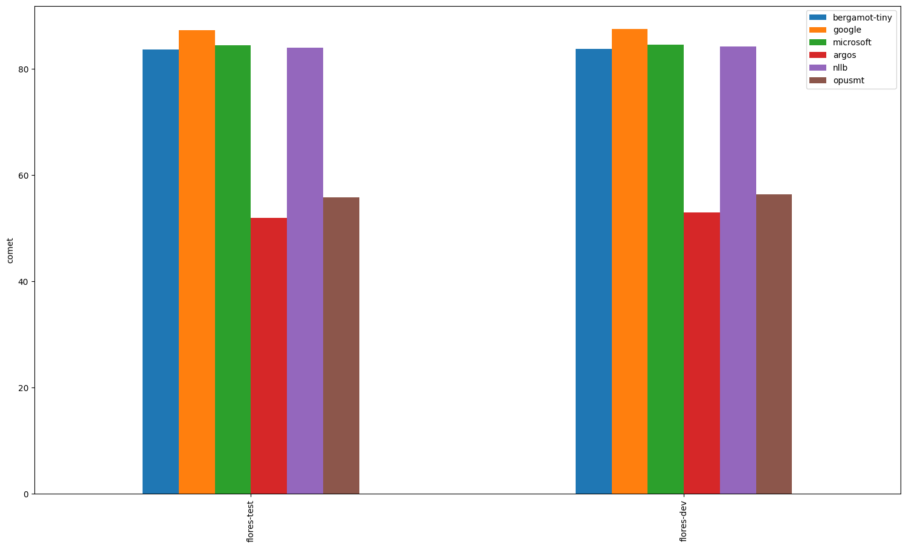
---

## en-am

| Translator/Dataset | flores-dev | flores-test |
| --- | --- | --- |
| google | 87.32 | 87.84 |
| microsoft | 86.57 | 86.91 |
| nllb | 86.57 | 86.58 |

---

## en-tr

| Translator/Dataset | flores-test | flores-dev | wmt16 | wmt17 | wmt18 |
| --- | --- | --- | --- | --- | --- |
| bergamot-tiny | 87.51 | 87.75 | 86.08 | 86.11 | 86.81 |
| google | 90.90 (+3.39, +3.87%) | 91.31 (+3.56, +4.06%) | 89.71 (+3.63, +4.22%) | 90.34 (+4.23, +4.91%) | 90.11 (+3.30, +3.80%) |
| microsoft | 90.89 (+3.38, +3.86%) | 90.93 (+3.18, +3.62%) | 89.29 (+3.21, +3.73%) | 89.83 (+3.72, +4.32%) | 89.91 (+3.10, +3.57%) |
| argos | 78.28 (-9.23, -10.55%) | 78.89 (-8.86, -10.10%) | 77.71 (-8.37, -9.72%) | 77.10 (-9.01, -10.46%) | 78.45 (-8.36, -9.63%) |
| nllb | 86.38 (-1.13, -1.29%) | 87.01 (-0.74, -0.84%) | 85.10 (-0.98, -1.14%) | 85.56 (-0.55, -0.64%) | 85.99 (-0.82, -0.94%) |

---

## ko-en

| Translator/Dataset | flores-dev | flores-test | iwslt17 |
| --- | --- | --- | --- |
| bergamot-base-memory | 86.58 | 86.31 | 80.54 |
| bergamot-base | 86.90 (+0.32, +0.37%) | 86.46 (+0.15, +0.17%) | 80.86 (+0.32, +0.40%) |
| google | 89.11 (+2.53, +2.92%) | 88.94 (+2.63, +3.05%) | 83.38 (+2.84, +3.53%) |
| microsoft | 88.88 (+2.30, +2.66%) | 88.77 (+2.46, +2.85%) | 82.59 (+2.05, +2.55%) |
| argos | 74.21 (-12.37, -14.29%) | 73.78 (-12.53, -14.52%) | 66.83 (-13.71, -17.02%) |
| nllb | 85.58 (-1.00, -1.16%) | 85.21 (-1.10, -1.27%) | 80.05 (-0.49, -0.61%) |
| opusmt | 82.96 (-3.62, -4.18%) | 82.69 (-3.62, -4.19%) | 79.61 (-0.93, -1.15%) |

---

## en-hi

| Translator/Dataset | flores-test | wmt14 | flores-dev |
| --- | --- | --- | --- |
| google | 82.56 | 82.67 | 82.54 |
| microsoft | 80.63 | 80.97 | 80.46 |
| argos | 73.80 | 73.02 | 73.68 |
| nllb | 78.92 | 79.58 | 78.97 |
| opusmt | 59.56 | 60.16 | 60.33 |

---

## tr-en

| Translator/Dataset | flores-test | wmt18 | wmt16 | flores-dev | wmt17 |
| --- | --- | --- | --- | --- | --- |
| bergamot-tiny | 86.55 | 83.37 | 83.26 | 87.18 | 83.65 |
| google | 90.19 (+3.64, +4.21%) | 87.60 (+4.23, +5.07%) | 87.69 (+4.43, +5.32%) | 90.48 (+3.30, +3.79%) | 88.03 (+4.38, +5.24%) |
| microsoft | 90.07 (+3.52, +4.07%) | 87.71 (+4.34, +5.21%) | 87.32 (+4.06, +4.88%) | 90.30 (+3.12, +3.58%) | 87.67 (+4.02, +4.81%) |
| argos | 78.80 (-7.75, -8.95%) | 73.32 (-10.05, -12.05%) | 74.06 (-9.20, -11.05%) | 80.14 (-7.04, -8.08%) | 73.59 (-10.06, -12.03%) |
| nllb | 79.63 (-6.92, -8.00%) | 75.29 (-8.08, -9.69%) | 75.19 (-8.07, -9.69%) | 80.30 (-6.88, -7.89%) | 74.70 (-8.95, -10.70%) |
| opusmt | 87.00 (+0.45, +0.52%) | 83.44 (+0.07, +0.08%) | 83.10 (-0.16, -0.19%) | 87.37 (+0.19, +0.22%) | 82.89 (-0.76, -0.91%) |

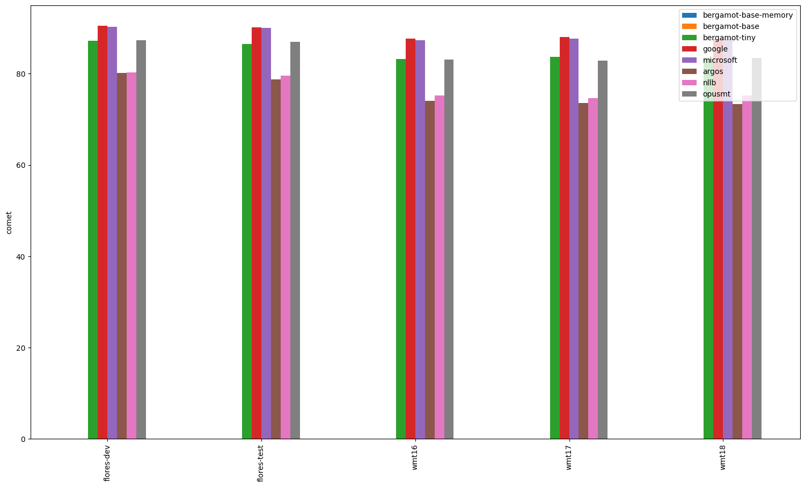
---

## en-ml

| Translator/Dataset | flores-test | flores-dev |
| --- | --- | --- |
| google | 89.88 | 89.71 |
| microsoft | 89.34 | 89.27 |
| nllb | 85.90 | 85.92 |
| opusmt | 70.85 | 71.22 |

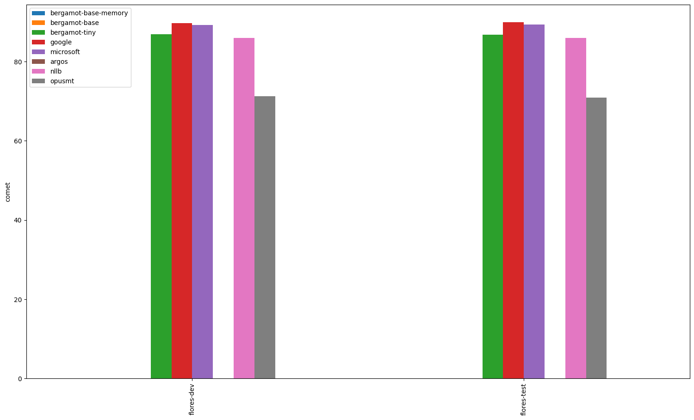
---

## ro-en

| Translator/Dataset | flores-test | wmt16 | flores-dev |
| --- | --- | --- | --- |
| bergamot-tiny | 87.75 | 85.34 | 87.82 |
| google | 89.54 (+1.79, +2.04%) | 86.63 (+1.29, +1.51%) | 89.66 (+1.84, +2.10%) |
| microsoft | 89.66 (+1.91, +2.18%) | 87.10 (+1.76, +2.06%) | 89.69 (+1.87, +2.13%) |
| nllb | 81.34 (-6.41, -7.30%) | 76.79 (-8.55, -10.02%) | 81.35 (-6.47, -7.37%) |

---

## en-hr

| Translator/Dataset | flores-test | wmt22 | flores-dev |
| --- | --- | --- | --- |
| bergamot-tiny | 87.39 | 82.36 | 87.77 |
| google | 91.45 (+4.06, +4.65%) | 88.13 (+5.77, +7.01%) | 91.77 (+4.00, +4.56%) |
| microsoft | 90.51 (+3.12, +3.57%) | 86.37 (+4.01, +4.87%) | 90.67 (+2.90, +3.30%) |
| nllb | 85.82 (-1.57, -1.80%) | 81.10 (-1.26, -1.53%) | 86.23 (-1.54, -1.75%) |

---

## el-en

| Translator/Dataset | mtedx_test | flores-test | flores-dev |
| --- | --- | --- | --- |
| bergamot-tiny | 82.15 | 85.50 | 86.17 |
| google | 83.83 (+1.68, +2.05%) | 88.19 (+2.69, +3.15%) | 88.68 (+2.51, +2.91%) |
| microsoft | 84.26 (+2.11, +2.57%) | 87.83 (+2.33, +2.73%) | 88.35 (+2.18, +2.53%) |
| argos | 82.12 (-0.03, -0.04%) | 85.84 (+0.34, +0.40%) | 86.46 (+0.29, +0.34%) |
| nllb | 81.92 (-0.23, -0.28%) | 86.34 (+0.84, +0.98%) | 86.78 (+0.61, +0.71%) |

---

## bg-en

| Translator/Dataset | flores-test | flores-dev |
| --- | --- | --- |
| bergamot-tiny | 86.59 | 86.74 |
| google | 88.52 (+1.93, +2.23%) | 88.78 (+2.04, +2.35%) |
| microsoft | 88.00 (+1.41, +1.63%) | 88.15 (+1.41, +1.63%) |
| argos | 85.47 (-1.12, -1.29%) | 85.48 (-1.26, -1.45%) |
| nllb | 85.56 (-1.03, -1.19%) | 85.74 (-1.00, -1.15%) |
| opusmt | 86.29 (-0.30, -0.35%) | 86.14 (-0.60, -0.69%) |

---

## en-ms

| Translator/Dataset | flores-dev | flores-test |
| --- | --- | --- |
| google | 89.69 | 89.73 |
| microsoft | 90.14 | 90.17 |
| nllb | 88.23 | 87.91 |

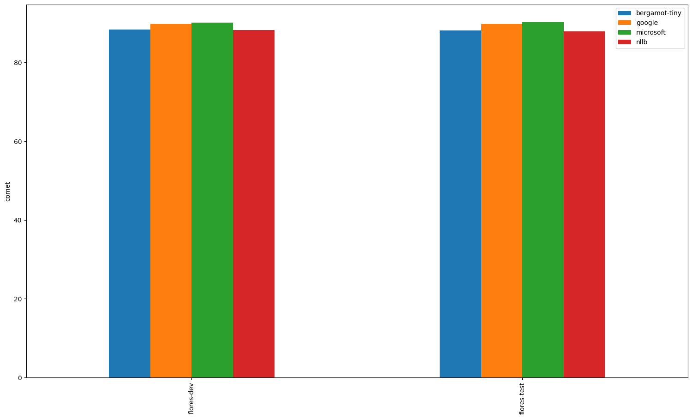
---

## et-en

| Translator/Dataset | flores-test | wmt18 | flores-dev |
| --- | --- | --- | --- |
| bergamot-tiny | 85.60 | 83.30 | 85.33 |
| google | 89.62 (+4.02, +4.70%) | 87.60 (+4.30, +5.16%) | 90.07 (+4.74, +5.55%) |
| microsoft | 88.83 (+3.23, +3.77%) | 87.05 (+3.75, +4.50%) | 89.16 (+3.83, +4.49%) |
| argos | 86.66 (+1.06, +1.24%) | 84.64 (+1.34, +1.61%) | 87.07 (+1.74, +2.04%) |
| nllb | 60.05 (-25.55, -29.85%) | 57.96 (-25.34, -30.42%) | 59.94 (-25.39, -29.76%) |
| opusmt | 86.92 (+1.32, +1.54%) | 84.95 (+1.65, +1.98%) | 87.57 (+2.24, +2.63%) |

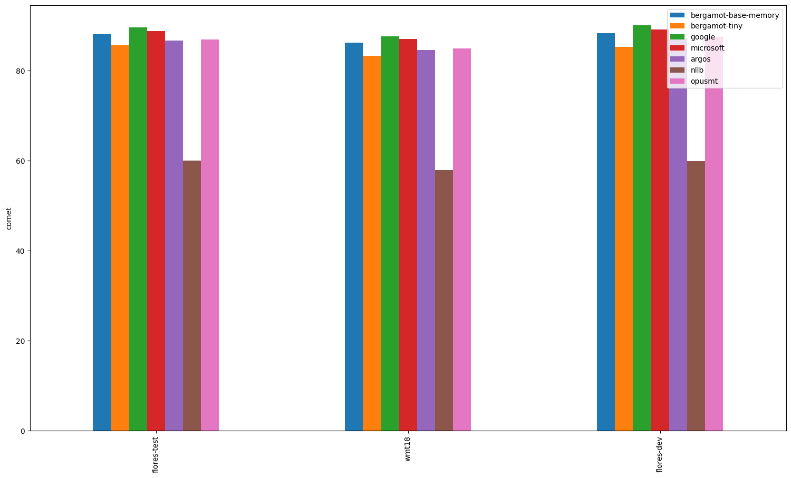
---

## th-en

| Translator/Dataset | flores-test | flores-dev |
| --- | --- | --- |
| google | 87.74 | 88.16 |
| microsoft | 87.51 | 87.81 |
| nllb | 84.46 | 85.14 |
| opusmt | 81.67 | 82.45 |

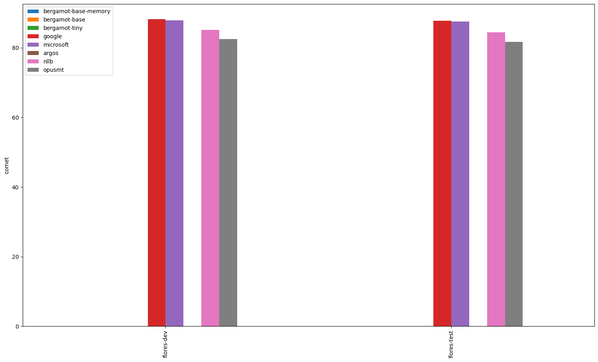
---

## es-en

| Translator/Dataset | mtedx_test | flores-test | wmt09 | wmt08 | wmt12 | wmt13 | wmt11 | flores-dev | wmt10 |
| --- | --- | --- | --- | --- | --- | --- | --- | --- | --- |
| bergamot-tiny | 81.04 | 85.01 | 80.79 | 80.54 | 83.16 | 84.25 | 82.17 | 85.13 | 83.31 |
| google | 82.80 (+1.76, +2.17%) | 87.13 (+2.12, +2.49%) | 82.46 (+1.67, +2.07%) | 81.95 (+1.41, +1.75%) | 83.93 (+0.77, +0.93%) | 85.10 (+0.85, +1.01%) | 82.86 (+0.69, +0.84%) | 87.34 (+2.21, +2.60%) | 84.89 (+1.58, +1.90%) |
| microsoft | 83.45 (+2.41, +2.97%) | 87.10 (+2.09, +2.46%) | 82.81 (+2.02, +2.50%) | 82.36 (+1.82, +2.26%) | 84.91 (+1.75, +2.10%) | 85.87 (+1.62, +1.92%) | 83.95 (+1.78, +2.17%) | 87.14 (+2.01, +2.36%) | 85.27 (+1.96, +2.35%) |
| argos | 80.67 (-0.37, -0.46%) | 84.45 (-0.56, -0.66%) | 80.06 (-0.73, -0.90%) | 79.68 (-0.86, -1.07%) | 82.12 (-1.04, -1.25%) | 83.41 (-0.84, -1.00%) | 81.24 (-0.93, -1.13%) | 84.31 (-0.82, -0.96%) | 82.51 (-0.80, -0.96%) |
| nllb | 79.72 (-1.32, -1.63%) | 85.49 (+0.48, +0.56%) | 81.42 (+0.63, +0.78%) | 80.82 (+0.28, +0.35%) | 82.61 (-0.55, -0.66%) | 83.80 (-0.45, -0.53%) | 81.82 (-0.35, -0.43%) | 85.70 (+0.57, +0.67%) | 83.30 (-0.01, -0.01%) |
| opusmt | 82.53 (+1.49, +1.84%) | 85.99 (+0.98, +1.15%) | 81.57 (+0.78, +0.97%) | 81.24 (+0.70, +0.87%) | 83.59 (+0.43, +0.52%) | 84.86 (+0.61, +0.72%) | 82.77 (+0.60, +0.73%) | 85.95 (+0.82, +0.96%) | 84.10 (+0.79, +0.95%) |

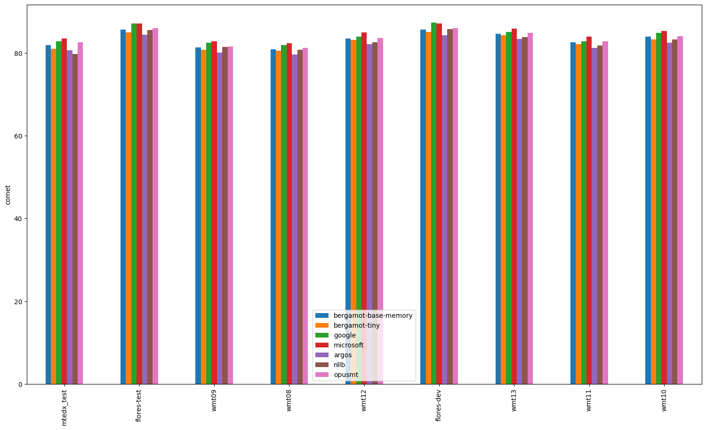
---

## en-my

| Translator/Dataset | flores-dev | flores-test |
| --- | --- | --- |
| google | 87.38 | 87.47 |
| microsoft | 85.90 | 86.13 |
| nllb | 84.84 | 85.01 |

---

## gl-en

| Translator/Dataset | flores-test | flores-dev |
| --- | --- | --- |
| google | 88.73 | 88.71 |
| microsoft | 87.50 | 87.41 |
| nllb | 83.23 | 83.30 |
| opusmt | 72.02 | 72.76 |

---

## en-bn

| Translator/Dataset | flores-test | flores-dev |
| --- | --- | --- |
| google | 86.63 | 86.47 |
| microsoft | 86.91 | 86.68 |
| nllb | 84.64 | 85.04 |

---

## en-tl

| Translator/Dataset | flores-test | flores-dev |
| --- | --- | --- |
| google | 84.57 | 84.80 |
| microsoft | 85.02 | 85.29 |
| nllb | 80.87 | 80.95 |
| opusmt | 82.57 | 82.16 |

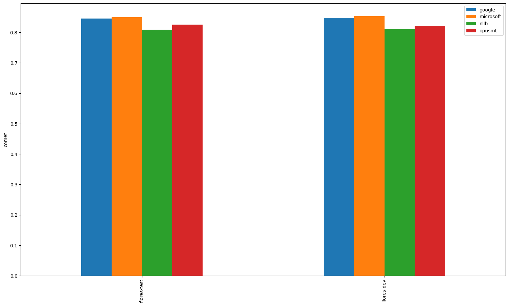
---

## en-ro

| Translator/Dataset | wmt16 | flores-test | flores-dev |
| --- | --- | --- | --- |
| bergamot-tiny | 86.75 | 88.48 | 88.38 |
| google | 88.48 (+1.73, +1.99%) | 90.64 (+2.16, +2.44%) | 90.60 (+2.22, +2.51%) |
| microsoft | 89.18 (+2.43, +2.80%) | 90.86 (+2.38, +2.69%) | 90.85 (+2.47, +2.79%) |
| nllb | 86.18 (-0.57, -0.66%) | 87.80 (-0.68, -0.77%) | 87.73 (-0.65, -0.74%) |
| opusmt | 85.54 (-1.21, -1.39%) | 86.87 (-1.61, -1.82%) | 87.07 (-1.31, -1.48%) |

---

## en-nb

| Translator/Dataset | flores-dev | flores-test |
| --- | --- | --- |
| google | 90.27 | 90.19 |
| microsoft | 90.05 | 89.98 |
| nllb | 87.45 | 87.26 |

---

## en-bs

| Translator/Dataset | flores-test | flores-dev |
| --- | --- | --- |
| google | 91.45 | 91.82 |
| microsoft | 90.50 | 90.89 |
| nllb | 86.50 | 87.11 |

---

## gu-en

| Translator/Dataset | flores-test | wmt19 | flores-dev |
| --- | --- | --- | --- |
| bergamot-tiny | 87.04 | 85.73 | 87.06 |
| google | 90.29 (+3.25, +3.73%) | 89.71 (+3.98, +4.64%) | 90.18 (+3.12, +3.58%) |
| microsoft | 89.33 (+2.29, +2.63%) | 88.62 (+2.89, +3.37%) | 89.26 (+2.20, +2.53%) |
| nllb | 88.70 (+1.66, +1.91%) | 86.53 (+0.80, +0.93%) | 88.88 (+1.82, +2.09%) |

---