# What is BLEU

[BLEU (BiLingual Evaluation Understudy)](https://en.wikipedia.org/wiki/BLEU) is a metric for automatically evaluating machine-translated text. The BLEU score is a number between zero and one that measures the similarity of the machine-translated text to a set of high quality reference translations. A value of 0 means that the machine-translated output has no overlap with the reference translation (low quality) while a value of 1 means there is perfect overlap with the reference translations (high quality).

It has been shown that BLEU scores correlate well with human judgment of translation quality. Note that even human translators do not achieve a perfect score of 1.0.

BLEU scores are expressed as a percentage rather than a decimal between 0 and 1.
Trying to compare BLEU scores across different corpora and languages is strongly discouraged. Even comparing BLEU scores for the same corpus but with different numbers of reference translations can be highly misleading.

However, as a rough guideline, the following interpretation of BLEU scores (expressed as percentages rather than decimals) might be helpful.

BLEU Score |	Interpretation
--- | ---
< 10 |	Almost useless
10 - 19 |	Hard to get the gist
20 - 29 |	The gist is clear, but has significant grammatical errors
30 - 40 |	Understandable to good translations
40 - 50 |	High quality translations
50 - 60 |	Very high quality, adequate, and fluent translations
\> 60 |	Quality often better than human

[More mathematical details](https://cloud.google.com/translate/automl/docs/evaluate#the_mathematical_details)

Source: https://cloud.google.com/translate/automl/docs/evaluate#bleu

BLEU is the most popular becnhmark in academia, so using BLEU allows us also to compare with reserach papers results and competitions (see [Conference on Machine Translation Conference (WMT)](http://statmt.org/wmt21/)).

Read [this article](https://www.rws.com/blog/understanding-mt-quality-bleu-scores/) to better understand what BLEU is and why it is not perfect.

# What are these benchmarks

## Translators

1. **bergamot** - uses compiled  [bergamot-translator](https://github.com/mozilla/bergamot-translator)  (wrapper for marian that is used by Firefox Translations web extension)
2. **google** - uses Google Translation [API](https://cloud.google.com/translate)
3. **microsoft** - uses Azure Cognitive Services Translator [API](https://azure.microsoft.com/en-us/services/cognitive-services/translator/)

Translation quality of Marian and Bergamot is supposed to be very similar.

## Method

We use official WMT ([Conference on Machine Translation](http://statmt.org/wmt21/)) parallel datasets. Available datasets are discovered automatically based on a language pair.

We perform translation from source to target language using one of three translation systems and then compare the result with the dataset reference and calculate BLEU score.

Evaluation is done using [SacreBLEU](https://github.com/mjpost/sacrebleu) tool which is reliable and widely used in academic world.

Both absolute and relative differences in BLEU scores between Bergamot and other systems are reported.

# Evaluation results

`avg` = average on all datasets

## avg

| Translator/Dataset | en-ru | ca-en | ru-en | en-nl | fa-en | uk-en | en-fa | is-en | nl-en | en-uk |
| --- | --- | --- | --- | --- | --- | --- | --- | --- | --- | --- |
| bergamot | 29.50 | 38.05 | 33.75 | 27.35 | 28.70 | 35.93 | 17.30 | 23.40 | 29.75 | 26.33 |
| google | 34.49 (+4.99, +16.92%) | 48.95 (+10.90, +28.65%) | 38.20 (+4.45, +13.20%) | 29.30 (+1.95, +7.13%) | 40.85 (+12.15, +42.33%) | 42.43 (+6.50, +18.09%) | 27.80 (+10.50, +60.69%) | 38.90 (+15.50, +66.24%) | 33.05 (+3.30, +11.09%) | 32.63 (+6.30, +23.92%) |
| microsoft | 33.62 (+4.12, +13.98%) | 46.50 (+8.45, +22.21%) | 38.38 (+4.63, +13.72%) | 28.80 (+1.45, +5.30%) | 36.15 (+7.45, +25.96%) | 42.30 (+6.37, +17.72%) | 20.50 (+3.20, +18.50%) | 38.17 (+14.77, +63.11%) | 32.60 (+2.85, +9.58%) | 32.03 (+5.70, +21.65%) |

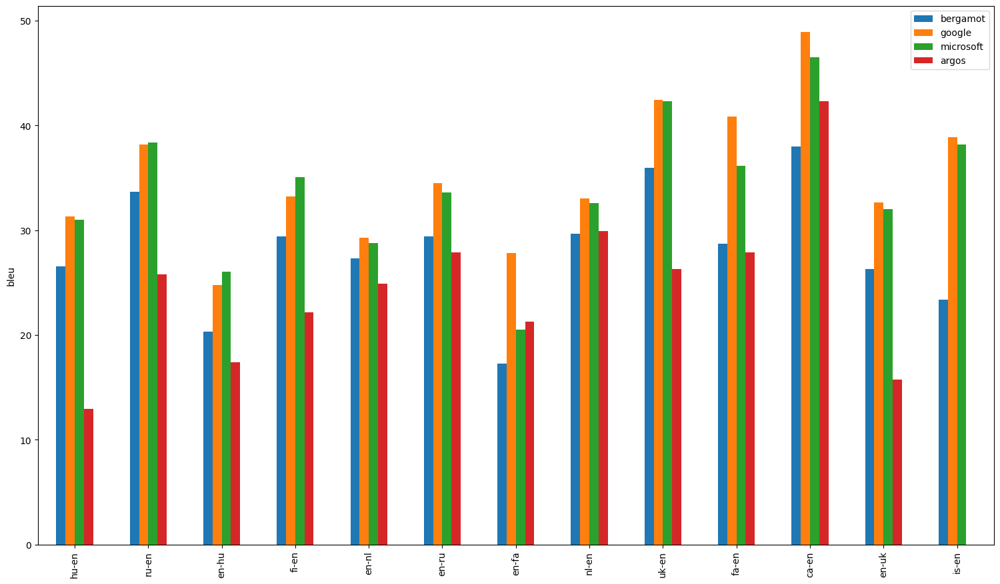
---

## en-ru

| Translator/Dataset | wmt20 | wmt13 | flores-test | flores-dev | wmt21 | wmt19 | wmt17 | wmt16 | wmt15 | wmt14 | wmt22 | wmt18 |
| --- | --- | --- | --- | --- | --- | --- | --- | --- | --- | --- | --- | --- |
| bergamot | 22.10 | 26.20 | 29.20 | 30.00 | 25.60 | 31.50 | 33.70 | 30.90 | 31.50 | 38.20 | 26.60 | 28.50 |
| google | 27.20 (+5.10, +23.08%) | 28.00 (+1.80, +6.87%) | 34.40 (+5.20, +17.81%) | 34.90 (+4.90, +16.33%) | 30.00 (+4.40, +17.19%) | 32.90 (+1.40, +4.44%) | 38.90 (+5.20, +15.43%) | 35.00 (+4.10, +13.27%) | 36.90 (+5.40, +17.14%) | 45.70 (+7.50, +19.63%) | 35.00 (+8.40, +31.58%) | 35.00 (+6.50, +22.81%) |
| microsoft | 26.30 (+4.20, +19.00%) | 27.30 (+1.10, +4.20%) | 33.60 (+4.40, +15.07%) | 33.50 (+3.50, +11.67%) | 29.20 (+3.60, +14.06%) | 33.20 (+1.70, +5.40%) | 38.60 (+4.90, +14.54%) | 34.20 (+3.30, +10.68%) | 36.10 (+4.60, +14.60%) | 44.70 (+6.50, +17.02%) | 33.10 (+6.50, +24.44%) | 33.70 (+5.20, +18.25%) |

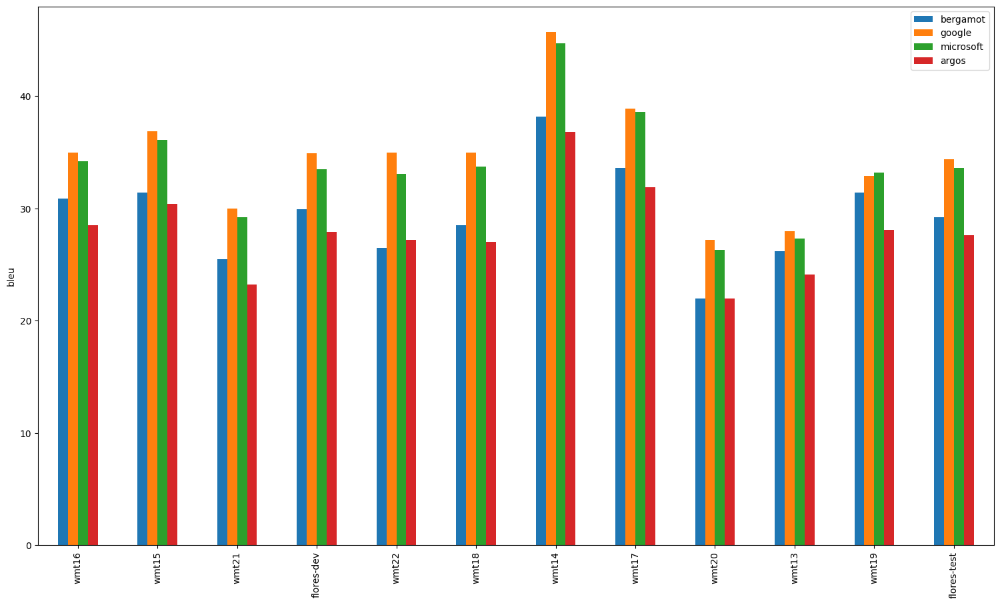
---

## ca-en

| Translator/Dataset | flores-dev | flores-test |
| --- | --- | --- |
| bergamot | 38.70 | 37.40 |
| google | 49.60 (+10.90, +28.17%) | 48.30 (+10.90, +29.14%) |
| microsoft | 46.80 (+8.10, +20.93%) | 46.20 (+8.80, +23.53%) |

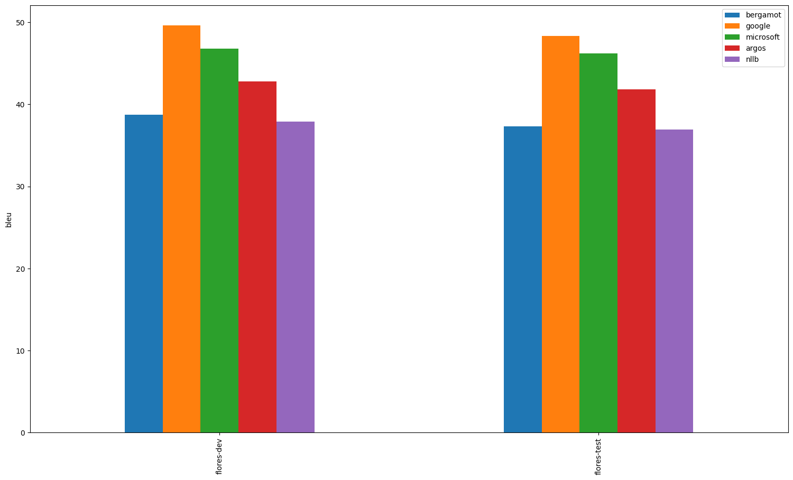
---

## ru-en

| Translator/Dataset | flores-dev | mtedx_test | wmt18 | wmt20 | wmt19 | wmt15 | wmt17 | wmt14 | wmt16 | wmt22 | wmt13 | flores-test | wmt21 |
| --- | --- | --- | --- | --- | --- | --- | --- | --- | --- | --- | --- | --- | --- |
| bergamot | 31.90 | 24.10 | 31.90 | 35.00 | 39.10 | 33.50 | 37.70 | 37.80 | 33.10 | 38.60 | 29.40 | 31.10 | 35.50 |
| google | 38.40 (+6.50, +20.38%) | 25.10 (+1.00, +4.15%) | 37.30 (+5.40, +16.93%) | 38.40 (+3.40, +9.71%) | 42.80 (+3.70, +9.46%) | 38.60 (+5.10, +15.22%) | 42.70 (+5.00, +13.26%) | 42.70 (+4.90, +12.96%) | 37.60 (+4.50, +13.60%) | 43.70 (+5.10, +13.21%) | 32.20 (+2.80, +9.52%) | 37.30 (+6.20, +19.94%) | 39.80 (+4.30, +12.11%) |
| microsoft | 36.50 (+4.60, +14.42%) | 26.20 (+2.10, +8.71%) | 37.40 (+5.50, +17.24%) | 38.80 (+3.80, +10.86%) | 43.80 (+4.70, +12.02%) | 38.50 (+5.00, +14.93%) | 43.70 (+6.00, +15.92%) | 44.10 (+6.30, +16.67%) | 38.40 (+5.30, +16.01%) | 43.90 (+5.30, +13.73%) | 32.50 (+3.10, +10.54%) | 36.10 (+5.00, +16.08%) | 39.00 (+3.50, +9.86%) |

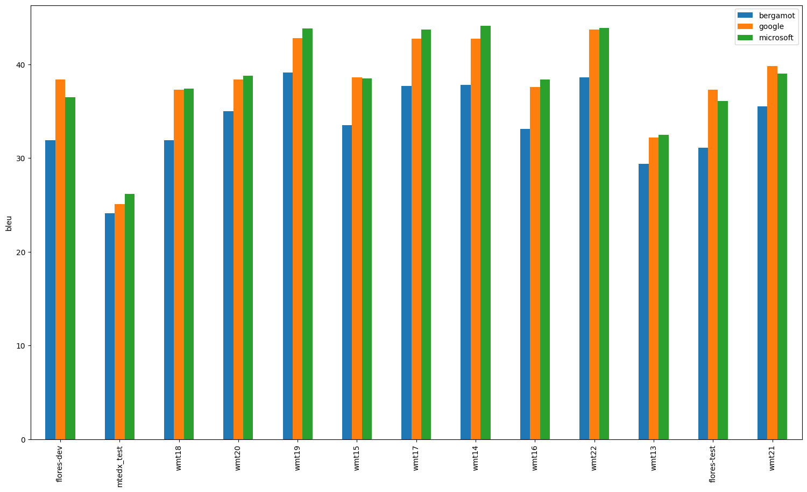
---

## en-nl

| Translator/Dataset | flores-test | flores-dev |
| --- | --- | --- |
| bergamot | 27.00 | 27.70 |
| google | 29.20 (+2.20, +8.15%) | 29.40 (+1.70, +6.14%) |
| microsoft | 28.60 (+1.60, +5.93%) | 29.00 (+1.30, +4.69%) |

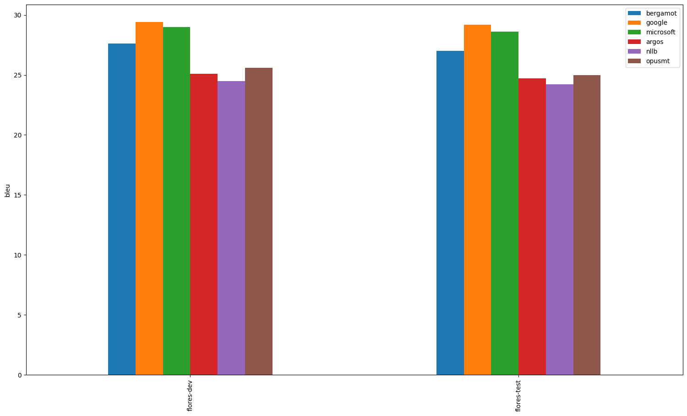
---

## fa-en

| Translator/Dataset | flores-dev | flores-test |
| --- | --- | --- |
| bergamot | 29.10 | 28.30 |
| google | 42.00 (+12.90, +44.33%) | 39.70 (+11.40, +40.28%) |
| microsoft | 36.50 (+7.40, +25.43%) | 35.80 (+7.50, +26.50%) |

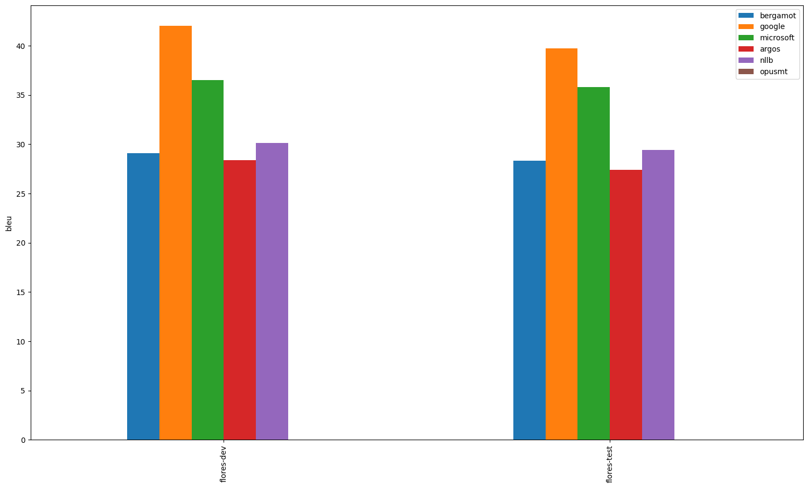
---

## uk-en

| Translator/Dataset | flores-dev | wmt22 | flores-test |
| --- | --- | --- | --- |
| bergamot | 35.60 | 36.60 | 35.60 |
| google | 43.10 (+7.50, +21.07%) | 41.60 (+5.00, +13.66%) | 42.60 (+7.00, +19.66%) |
| microsoft | 41.80 (+6.20, +17.42%) | 44.40 (+7.80, +21.31%) | 40.70 (+5.10, +14.33%) |

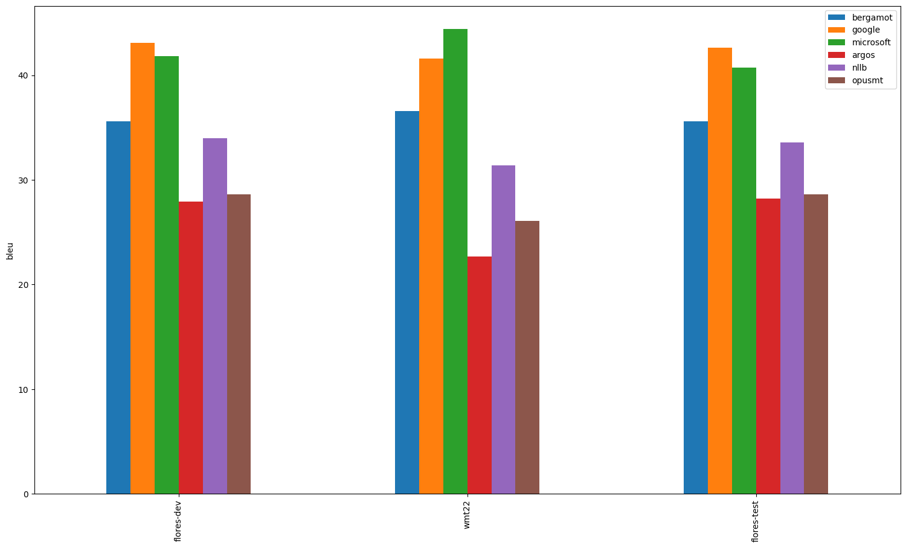
---

## en-fa

| Translator/Dataset | flores-dev | flores-test |
| --- | --- | --- |
| bergamot | 17.20 | 17.40 |
| google | 27.20 (+10.00, +58.14%) | 28.40 (+11.00, +63.22%) |
| microsoft | 19.90 (+2.70, +15.70%) | 21.10 (+3.70, +21.26%) |

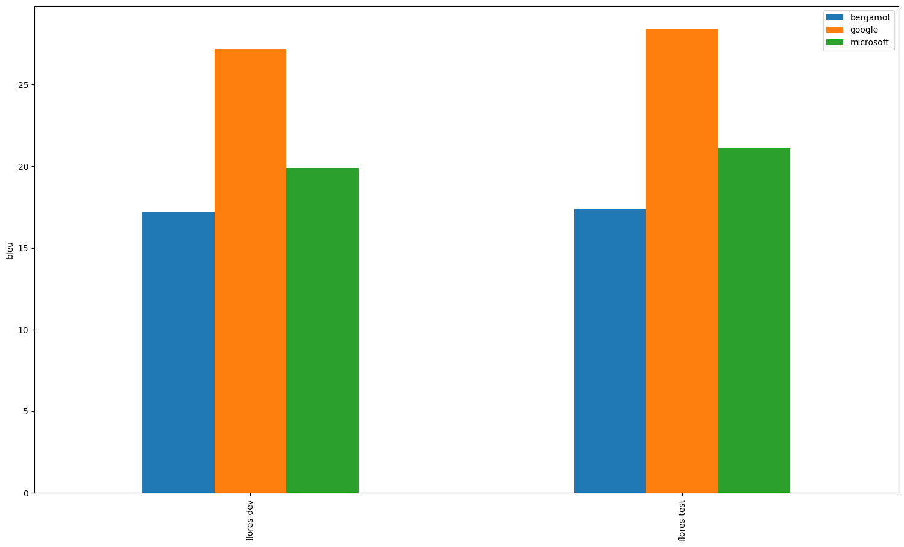
---

## is-en

| Translator/Dataset | flores-dev | flores-test | wmt21 |
| --- | --- | --- | --- |
| bergamot | 23.60 | 23.40 | 23.20 |
| google | 39.40 (+15.80, +66.95%) | 38.60 (+15.20, +64.96%) | 38.70 (+15.50, +66.81%) |
| microsoft | 37.30 (+13.70, +58.05%) | 36.70 (+13.30, +56.84%) | 40.50 (+17.30, +74.57%) |

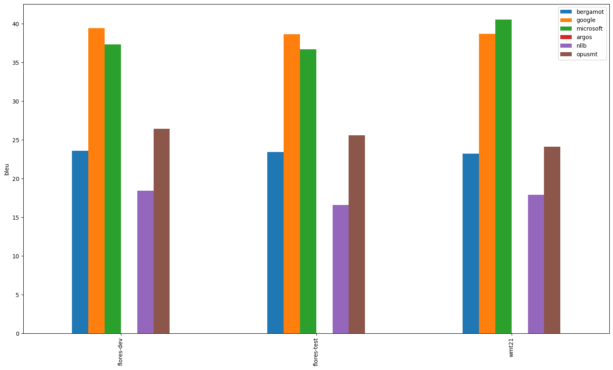
---

## nl-en

| Translator/Dataset | flores-dev | flores-test |
| --- | --- | --- |
| bergamot | 29.80 | 29.70 |
| google | 33.00 (+3.20, +10.74%) | 33.10 (+3.40, +11.45%) |
| microsoft | 32.40 (+2.60, +8.72%) | 32.80 (+3.10, +10.44%) |

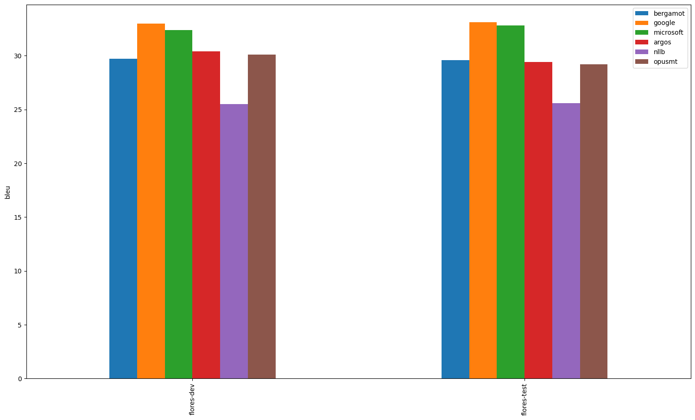
---

## en-uk

| Translator/Dataset | flores-test | wmt22 | flores-dev |
| --- | --- | --- | --- |
| bergamot | 28.30 | 22.90 | 27.80 |
| google | 33.10 (+4.80, +16.96%) | 32.00 (+9.10, +39.74%) | 32.80 (+5.00, +17.99%) |
| microsoft | 33.50 (+5.20, +18.37%) | 30.40 (+7.50, +32.75%) | 32.20 (+4.40, +15.83%) |

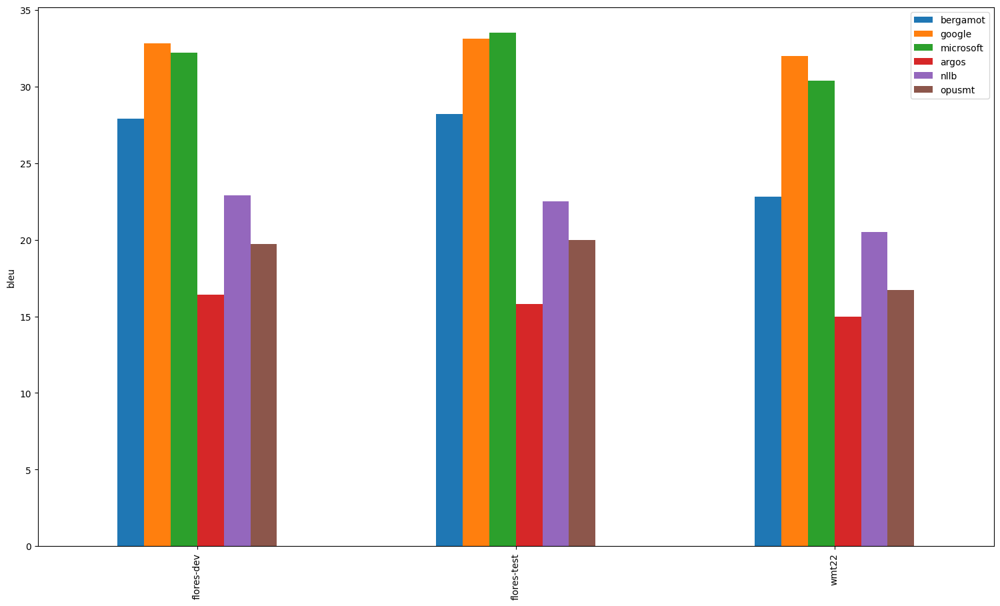
---