# What is COMET

COMET is a neural framework its developers present for training multilingual machine translation evaluation models. The framework has been reported to obtain new state-of-the-art levels of correlation with human judgments. Recent breakthroughs in cross-lingual pre-trained language modeling have been leveraged by the framework resulting in highly multilingual and adaptable MT evaluation models.

Three models with different human judgments have been trained to showcase the framework. These include Direct Assessments, Human-mediated Translation Edit Rate, and Multidimensional Quality Metrics. These models are designed to exploit information from source input and a target-language reference translation to more accurately predict MT quality.

The models developed by COMET have achieved new state-of-the-art performance on the WMT 2019 Metrics shared task, demonstrating robustness to high-performing systems.

## Interpreting Scores:

When using COMET to evaluate machine translation, it's important to understand how to interpret the scores it produces.

In general, COMET models are trained to predict quality scores for translations. These scores are typically normalized using a z-score transformation to account for individual differences among annotators. While the raw score itself does not have a direct interpretation, it is useful for ranking translations and systems according to their quality.

However, for the latest COMET models like Unbabel/wmt22-comet-da, we have introduced a new training approach that scales the scores between 0 and 1. This makes it easier to interpret the scores: a score close to 1 indicates a high-quality translation, while a score close to 0 indicates a translation that is no better than random chance.

It's worth noting that when using COMET to compare the performance of two different translation systems, it's important to run the comet-compare command to obtain statistical significance measures. This command compares the output of two systems using a statistical hypothesis test, providing an estimate of the probability that the observed difference in scores between the systems is due to chance. This is an important step to ensure that any differences in scores between systems are statistically significant.

Overall, the added interpretability of scores in the latest COMET models, combined with the ability to assess statistical significance between systems using comet-compare, make COMET a valuable tool for evaluating machine translation.

Source: https://aclanthology.org/2020.emnlp-main.213.pdf

Tool: https://github.com/Unbabel/COMET

# What are these benchmarks

## Translators

1. **bergamot** - uses compiled  [bergamot-translator](https://github.com/mozilla/bergamot-translator)  (wrapper for marian that is used by Firefox Translations web extension)
2. **google** - uses Google Translation [API](https://cloud.google.com/translate)
3. **microsoft** - uses Azure Cognitive Services Translator [API](https://azure.microsoft.com/en-us/services/cognitive-services/translator/)
4. **argos** - uses [Argos Translate](https://github.com/argosopentech/argos-translate)
5. **nllb** - uses [No Language Left Behind (NLLB)](https://github.com/facebookresearch/fairseq/tree/nllb)
6. **opus-mt** - uses [Opus-MT models](https://github.com/Helsinki-NLP/Opus-MT)

## Method

We use official WMT ([Conference on Machine Translation](http://statmt.org/wmt21/)) parallel datasets. Available datasets are discovered automatically based on a language pair.

We perform the translation from source to target language using one of the three translation systems, compare the result with the dataset reference, and then calculate the [COMET](https://github.com/Unbabel/COMET) score.

Both absolute and relative differences in the scores between Bergamot and other systems are reported.

We also compare the systems using the `comet-compare` tool that calculates the statistical significance with Paired T-Test and bootstrap resampling.

# Evaluation results

`avg` = average on all datasets

## avg

| Translator/Dataset | en-it | fr-en | en-pt | en-nl | nl-en | bg-en | en-es | en-bg | de-en | it-en | pl-en | en-fr | en-pl | pt-en | es-en | en-de |
| --- | --- | --- | --- | --- | --- | --- | --- | --- | --- | --- | --- | --- | --- | --- | --- | --- |
| bergamot | 0.86 | 0.84 | 0.89 | 0.86 | 0.86 | 0.87 | 0.83 | 0.89 | 0.83 | 0.85 | 0.83 | 0.82 | 0.86 | 0.87 | 0.83 | 0.84 |
| google | 0.88 (+0.02, +2.33%) | 0.86 (+0.02, +1.87%) | 0.90 (+0.02, +1.73%) | 0.88 (+0.02, +2.56%) | 0.88 (+0.02, +2.11%) | 0.89 (+0.02, +2.29%) | 0.85 (+0.02, +2.40%) | 0.92 (+0.02, +2.53%) | 0.86 (+0.03, +3.37%) | 0.86 (+0.02, +1.85%) | 0.86 (+0.02, +2.90%) | 0.85 (+0.03, +3.51%) | 0.90 (+0.04, +4.88%) | 0.89 (+0.01, +1.53%) | 0.84 (+0.01, +1.75%) | 0.87 (+0.03, +3.42%) |
| microsoft | 0.88 (+0.02, +2.42%) | 0.86 (+0.02, +2.43%) | 0.90 (+0.01, +1.28%) | 0.88 (+0.02, +2.12%) | 0.87 (+0.02, +1.81%) | 0.88 (+0.01, +1.63%) | 0.86 (+0.02, +2.65%) | 0.91 (+0.02, +1.79%) | 0.86 (+0.03, +4.16%) | 0.86 (+0.02, +1.97%) | 0.86 (+0.03, +3.13%) | 0.86 (+0.03, +4.15%) | 0.89 (+0.04, +4.14%) | 0.89 (+0.01, +1.43%) | 0.85 (+0.02, +2.34%) | 0.87 (+0.03, +3.72%) |
| argos | 0.84 (-0.02, -2.57%) | 0.83 (-0.01, -1.00%) | 0.86 (-0.02, -2.62%) | 0.85 (-0.01, -1.73%) | 0.86 (+0.00, +0.37%) | 0.85 (-0.01, -1.37%) | 0.82 (-0.01, -1.52%) | 0.88 (-0.01, -1.47%) | 0.82 (-0.01, -1.29%) | 0.83 (-0.01, -1.44%) | 0.84 (+0.00, +0.36%) | 0.81 (-0.01, -1.47%) | 0.84 (-0.02, -1.84%) | 0.87 (-0.01, -0.79%) | 0.82 (-0.01, -0.93%) | 0.79 (-0.05, -5.97%) |
| nllb | 0.86 (+0.00, +0.21%) | 0.83 (-0.01, -0.77%) | 0.88 (-0.01, -0.61%) | 0.85 (-0.01, -0.76%) | 0.81 (-0.05, -5.79%) | 0.86 (-0.01, -1.17%) | 0.84 (+0.01, +0.91%) | 0.88 (-0.01, -1.54%) | 0.75 (-0.08, -9.91%) | 0.82 (-0.03, -3.55%) | 0.77 (-0.06, -7.70%) | 0.84 (+0.01, +1.81%) | 0.84 (-0.01, -1.50%) | 0.84 (-0.04, -4.16%) | 0.83 (-0.00, -0.10%) | 0.83 (-0.01, -1.09%) |
| opusmt | 0.85 (-0.01, -0.77%) | 0.85 (+0.01, +0.72%) | N/A | 0.85 (-0.01, -1.22%) | 0.86 (+0.00, +0.43%) | 0.86 (-0.00, -0.52%) | 0.84 (+0.01, +1.12%) | 0.82 (-0.07, -7.86%) | 0.84 (+0.02, +1.83%) | 0.85 (+0.00, +0.27%) | 0.83 (-0.00, -0.23%) | 0.83 (+0.01, +1.43%) | N/A | N/A | 0.84 (+0.01, +0.97%) | 0.83 (-0.01, -1.31%) |

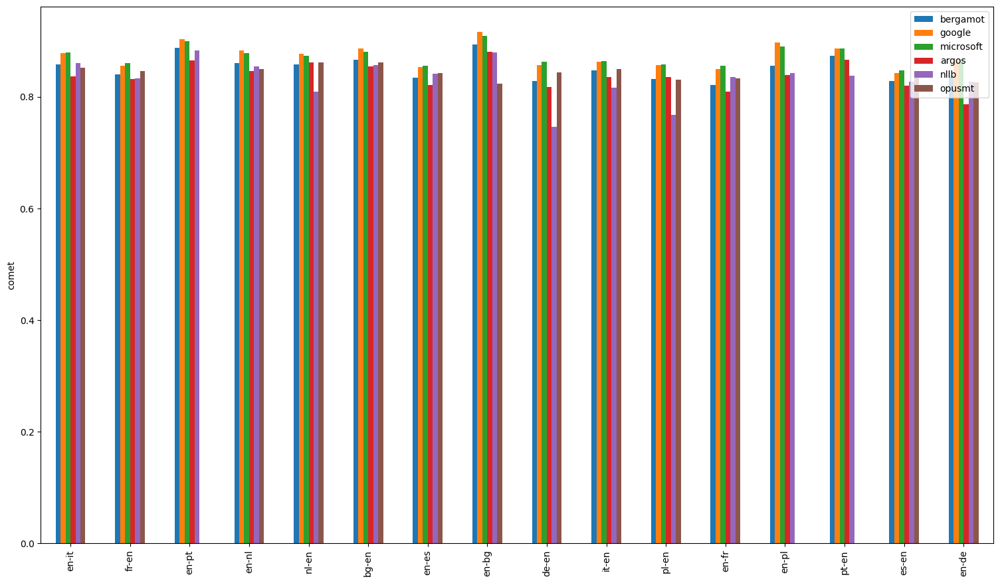
---

## en-it

| Translator/Dataset | flores-dev | flores-test | wmt09 |
| --- | --- | --- | --- |
| bergamot | 0.86 | 0.86 | 0.85 |
| google | 0.88 (+0.02, +2.28%) | 0.89 (+0.02, +2.63%) | 0.87 (+0.02, +2.06%) |
| microsoft | 0.88 (+0.02, +2.15%) | 0.88 (+0.02, +2.52%) | 0.87 (+0.02, +2.60%) |
| argos | 0.84 (-0.03, -3.16%) | 0.84 (-0.03, -2.99%) | 0.84 (-0.01, -1.54%) |
| nllb | 0.87 (+0.00, +0.19%) | 0.86 (+0.00, +0.10%) | 0.85 (+0.00, +0.33%) |
| opusmt | 0.85 (-0.01, -1.15%) | 0.85 (-0.01, -1.21%) | 0.85 (+0.00, +0.05%) |

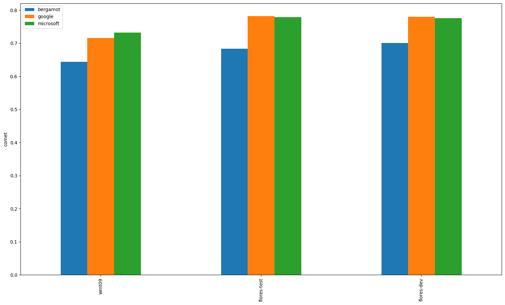
### Comparisons between systems
*If a comparison is omitted, the systems have equal averages (tie). Click on the dataset for a complete report*
#### [flores-dev.en-it](en-it/flores-dev.en-it.cometcompare)
- flores-dev.microsoft.it outperforms flores-dev.bergamot.it.
- flores-dev.google.it outperforms flores-dev.bergamot.it.

#### [flores-test.en-it](en-it/flores-test.en-it.cometcompare)
- flores-test.microsoft.it outperforms flores-test.bergamot.it.
- flores-test.google.it outperforms flores-test.bergamot.it.

#### [wmt09.en-it](en-it/wmt09.en-it.cometcompare)
- wmt09.microsoft.it outperforms wmt09.bergamot.it.
- wmt09.google.it outperforms wmt09.bergamot.it.
- wmt09.microsoft.it outperforms wmt09.google.it.

---

## fr-en

| Translator/Dataset | flores-test | wmt08 | wmt12 | wmt15 | mtedx_test | wmt11 | iwslt17 | wmt09 | wmt14 | wmt10 | wmt13 | flores-dev |
| --- | --- | --- | --- | --- | --- | --- | --- | --- | --- | --- | --- | --- |
| bergamot | 0.88 | 0.80 | 0.82 | 0.83 | 0.85 | 0.82 | 0.86 | 0.82 | 0.85 | 0.82 | 0.84 | 0.88 |
| google | 0.89 (+0.01, +1.44%) | 0.82 (+0.02, +2.56%) | 0.83 (+0.01, +1.48%) | 0.85 (+0.03, +3.04%) | 0.87 (+0.02, +2.03%) | 0.83 (+0.01, +1.50%) | 0.87 (+0.01, +0.95%) | 0.83 (+0.02, +2.12%) | 0.87 (+0.02, +1.89%) | 0.84 (+0.02, +2.49%) | 0.85 (+0.01, +1.27%) | 0.90 (+0.02, +1.76%) |
| microsoft | 0.90 (+0.01, +1.58%) | 0.83 (+0.02, +3.02%) | 0.84 (+0.02, +2.68%) | 0.85 (+0.03, +3.18%) | 0.87 (+0.02, +2.35%) | 0.84 (+0.02, +2.70%) | 0.88 (+0.01, +1.45%) | 0.84 (+0.02, +2.81%) | 0.87 (+0.02, +2.58%) | 0.85 (+0.02, +3.01%) | 0.86 (+0.02, +2.14%) | 0.90 (+0.02, +1.82%) |
| argos | 0.87 (-0.01, -1.12%) | 0.80 (-0.01, -0.78%) | 0.81 (-0.01, -0.97%) | 0.82 (-0.01, -1.22%) | 0.84 (-0.01, -1.01%) | 0.81 (-0.01, -0.77%) | 0.85 (-0.01, -1.33%) | 0.81 (-0.01, -0.61%) | 0.84 (-0.01, -1.41%) | 0.82 (-0.01, -0.68%) | 0.83 (-0.01, -1.07%) | 0.87 (-0.01, -0.95%) |
| nllb | 0.88 (-0.01, -0.65%) | 0.81 (+0.00, +0.34%) | 0.82 (+0.00, +0.23%) | 0.81 (-0.02, -2.17%) | 0.82 (-0.03, -3.14%) | 0.82 (+0.00, +0.28%) | 0.85 (-0.02, -2.25%) | 0.82 (+0.00, +0.15%) | 0.85 (-0.00, -0.57%) | 0.82 (-0.00, -0.13%) | 0.84 (-0.01, -0.69%) | 0.88 (-0.00, -0.43%) |
| opusmt | 0.88 (+0.00, +0.20%) | 0.81 (+0.01, +1.26%) | 0.83 (+0.01, +1.01%) | 0.84 (+0.01, +1.10%) | 0.85 (+0.01, +0.65%) | 0.83 (+0.01, +1.04%) | 0.87 (+0.00, +0.06%) | 0.82 (+0.01, +1.19%) | 0.86 (+0.00, +0.46%) | 0.83 (+0.01, +1.08%) | 0.85 (+0.00, +0.44%) | 0.88 (+0.00, +0.28%) |

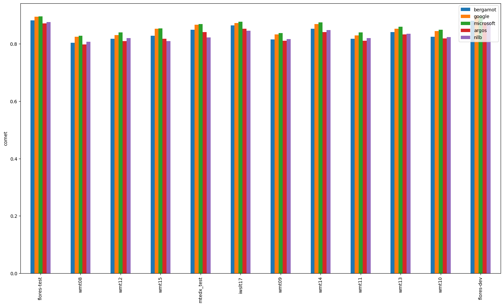
### Comparisons between systems
*If a comparison is omitted, the systems have equal averages (tie). Click on the dataset for a complete report*
#### [flores-test.fr-en](fr-en/flores-test.fr-en.cometcompare)
- flores-test.microsoft.en outperforms flores-test.bergamot.en.
- flores-test.google.en outperforms flores-test.bergamot.en.

#### [wmt08.fr-en](fr-en/wmt08.fr-en.cometcompare)
- wmt08.microsoft.en outperforms wmt08.bergamot.en.
- wmt08.google.en outperforms wmt08.bergamot.en.
- wmt08.microsoft.en outperforms wmt08.google.en.

#### [wmt12.fr-en](fr-en/wmt12.fr-en.cometcompare)
- wmt12.microsoft.en outperforms wmt12.bergamot.en.
- wmt12.google.en outperforms wmt12.bergamot.en.
- wmt12.microsoft.en outperforms wmt12.google.en.

#### [wmt15.fr-en](fr-en/wmt15.fr-en.cometcompare)
- wmt15.microsoft.en outperforms wmt15.bergamot.en.
- wmt15.google.en outperforms wmt15.bergamot.en.

#### [mtedx_test.fr-en](fr-en/mtedx_test.fr-en.cometcompare)
- mtedx_test.microsoft.en outperforms mtedx_test.bergamot.en.
- mtedx_test.google.en outperforms mtedx_test.bergamot.en.

#### [wmt11.fr-en](fr-en/wmt11.fr-en.cometcompare)
- wmt11.microsoft.en outperforms wmt11.bergamot.en.
- wmt11.google.en outperforms wmt11.bergamot.en.
- wmt11.microsoft.en outperforms wmt11.google.en.

#### [iwslt17.fr-en](fr-en/iwslt17.fr-en.cometcompare)
- iwslt17.microsoft.en outperforms iwslt17.bergamot.en.
- iwslt17.google.en outperforms iwslt17.bergamot.en.
- iwslt17.microsoft.en outperforms iwslt17.google.en.

#### [wmt09.fr-en](fr-en/wmt09.fr-en.cometcompare)
- wmt09.microsoft.en outperforms wmt09.bergamot.en.
- wmt09.google.en outperforms wmt09.bergamot.en.
- wmt09.microsoft.en outperforms wmt09.google.en.

#### [wmt14.fr-en](fr-en/wmt14.fr-en.cometcompare)
- wmt14.microsoft.en outperforms wmt14.bergamot.en.
- wmt14.google.en outperforms wmt14.bergamot.en.
- wmt14.microsoft.en outperforms wmt14.google.en.

#### [wmt10.fr-en](fr-en/wmt10.fr-en.cometcompare)
- wmt10.microsoft.en outperforms wmt10.bergamot.en.
- wmt10.google.en outperforms wmt10.bergamot.en.
- wmt10.microsoft.en outperforms wmt10.google.en.

#### [wmt13.fr-en](fr-en/wmt13.fr-en.cometcompare)
- wmt13.microsoft.en outperforms wmt13.bergamot.en.
- wmt13.google.en outperforms wmt13.bergamot.en.
- wmt13.microsoft.en outperforms wmt13.google.en.

#### [flores-dev.fr-en](fr-en/flores-dev.fr-en.cometcompare)
- flores-dev.microsoft.en outperforms flores-dev.bergamot.en.
- flores-dev.google.en outperforms flores-dev.bergamot.en.

---

## en-pt

| Translator/Dataset | flores-test | flores-dev |
| --- | --- | --- |
| bergamot | 0.89 | 0.89 |
| google | 0.90 (+0.02, +1.78%) | 0.90 (+0.01, +1.68%) |
| microsoft | 0.90 (+0.01, +1.38%) | 0.90 (+0.01, +1.19%) |
| argos | 0.86 (-0.02, -2.50%) | 0.87 (-0.02, -2.74%) |
| nllb | 0.88 (-0.01, -0.61%) | 0.88 (-0.01, -0.61%) |
| opusmt | N/A | N/A |

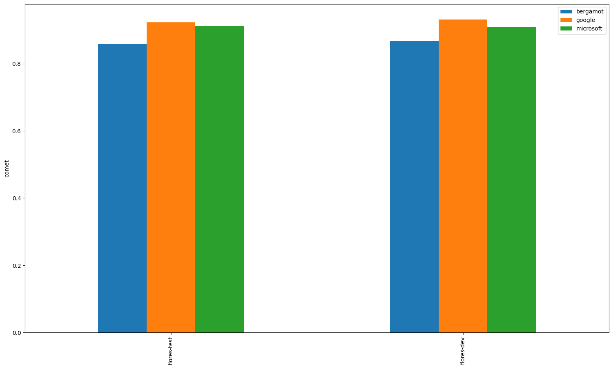
### Comparisons between systems
*If a comparison is omitted, the systems have equal averages (tie). Click on the dataset for a complete report*
#### [flores-test.en-pt](en-pt/flores-test.en-pt.cometcompare)
- flores-test.microsoft.pt outperforms flores-test.bergamot.pt.
- flores-test.google.pt outperforms flores-test.bergamot.pt.
- flores-test.google.pt outperforms flores-test.microsoft.pt.

#### [flores-dev.en-pt](en-pt/flores-dev.en-pt.cometcompare)
- flores-dev.microsoft.pt outperforms flores-dev.bergamot.pt.
- flores-dev.google.pt outperforms flores-dev.bergamot.pt.
- flores-dev.google.pt outperforms flores-dev.microsoft.pt.

---

## en-nl

| Translator/Dataset | flores-dev | flores-test |
| --- | --- | --- |
| bergamot | 0.86 | 0.86 |
| google | 0.88 (+0.02, +2.38%) | 0.88 (+0.02, +2.74%) |
| microsoft | 0.88 (+0.02, +1.90%) | 0.88 (+0.02, +2.34%) |
| argos | 0.84 (-0.02, -2.13%) | 0.85 (-0.01, -1.32%) |
| nllb | 0.85 (-0.01, -1.09%) | 0.86 (-0.00, -0.43%) |
| opusmt | 0.85 (-0.01, -1.39%) | 0.85 (-0.01, -1.05%) |

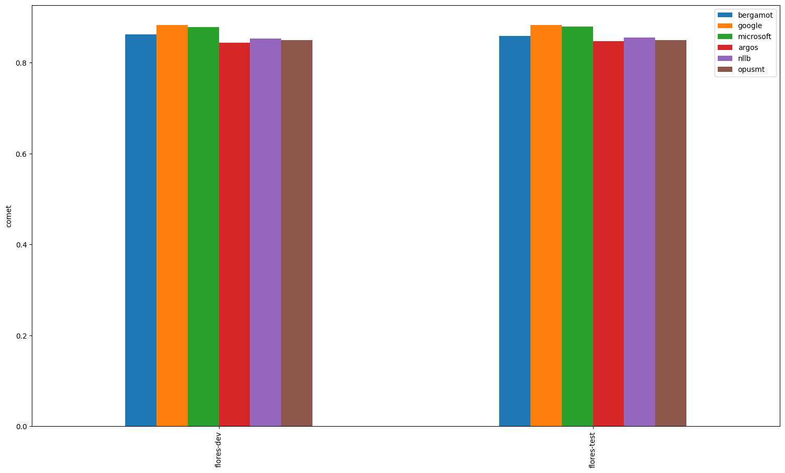
### Comparisons between systems
*If a comparison is omitted, the systems have equal averages (tie). Click on the dataset for a complete report*
#### [flores-dev.en-nl](en-nl/flores-dev.en-nl.cometcompare)
- flores-dev.microsoft.nl outperforms flores-dev.bergamot.nl.
- flores-dev.google.nl outperforms flores-dev.bergamot.nl.
- flores-dev.google.nl outperforms flores-dev.microsoft.nl.

#### [flores-test.en-nl](en-nl/flores-test.en-nl.cometcompare)
- flores-test.microsoft.nl outperforms flores-test.bergamot.nl.
- flores-test.google.nl outperforms flores-test.bergamot.nl.
- flores-test.google.nl outperforms flores-test.microsoft.nl.

---

## nl-en

| Translator/Dataset | flores-test | flores-dev |
| --- | --- | --- |
| bergamot | 0.86 | 0.86 |
| google | 0.88 (+0.02, +2.07%) | 0.88 (+0.02, +2.14%) |
| microsoft | 0.87 (+0.02, +1.85%) | 0.87 (+0.02, +1.76%) |
| argos | 0.86 (+0.00, +0.27%) | 0.86 (+0.00, +0.47%) |
| nllb | 0.81 (-0.05, -5.75%) | 0.81 (-0.05, -5.82%) |
| opusmt | 0.86 (+0.00, +0.36%) | 0.86 (+0.00, +0.50%) |

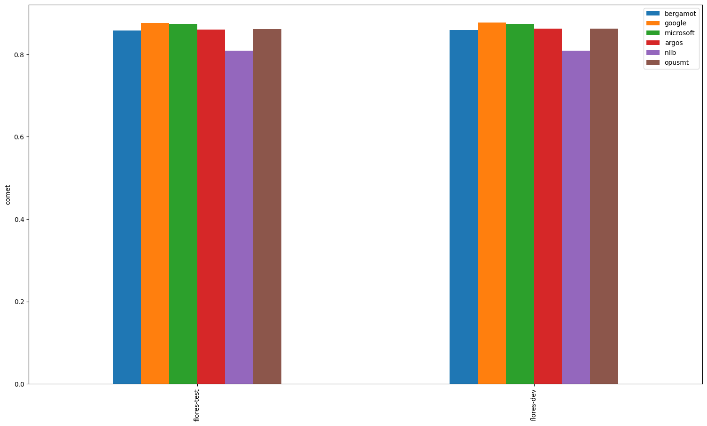
### Comparisons between systems
*If a comparison is omitted, the systems have equal averages (tie). Click on the dataset for a complete report*
#### [flores-test.nl-en](nl-en/flores-test.nl-en.cometcompare)
- flores-test.microsoft.en outperforms flores-test.bergamot.en.
- flores-test.google.en outperforms flores-test.bergamot.en.
- flores-test.google.en outperforms flores-test.microsoft.en.

#### [flores-dev.nl-en](nl-en/flores-dev.nl-en.cometcompare)
- flores-dev.microsoft.en outperforms flores-dev.bergamot.en.
- flores-dev.google.en outperforms flores-dev.bergamot.en.
- flores-dev.google.en outperforms flores-dev.microsoft.en.

---

## bg-en

| Translator/Dataset | flores-test | flores-dev |
| --- | --- | --- |
| bergamot | 0.87 | 0.87 |
| google | 0.89 (+0.02, +2.23%) | 0.89 (+0.02, +2.35%) |
| microsoft | 0.88 (+0.01, +1.63%) | 0.88 (+0.01, +1.63%) |
| argos | 0.85 (-0.01, -1.29%) | 0.85 (-0.01, -1.45%) |
| nllb | 0.86 (-0.01, -1.19%) | 0.86 (-0.01, -1.15%) |
| opusmt | 0.86 (-0.00, -0.35%) | 0.86 (-0.01, -0.69%) |

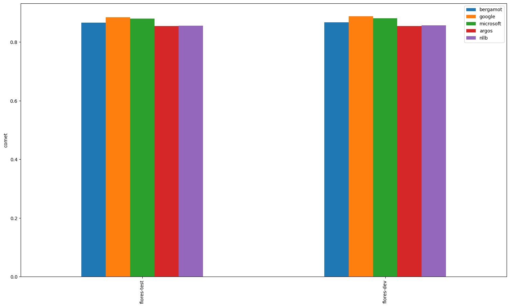
### Comparisons between systems
*If a comparison is omitted, the systems have equal averages (tie). Click on the dataset for a complete report*
#### [flores-test.bg-en](bg-en/flores-test.bg-en.cometcompare)
- flores-test.microsoft.en outperforms flores-test.bergamot.en.
- flores-test.google.en outperforms flores-test.bergamot.en.
- flores-test.google.en outperforms flores-test.microsoft.en.

#### [flores-dev.bg-en](bg-en/flores-dev.bg-en.cometcompare)
- flores-dev.microsoft.en outperforms flores-dev.bergamot.en.
- flores-dev.google.en outperforms flores-dev.bergamot.en.
- flores-dev.google.en outperforms flores-dev.microsoft.en.

---

## en-es

| Translator/Dataset | wmt11 | wmt08 | wmt13 | flores-dev | flores-test | wmt09 | wmt12 | wmt10 |
| --- | --- | --- | --- | --- | --- | --- | --- | --- |
| bergamot | 0.83 | 0.81 | 0.84 | 0.84 | 0.84 | 0.83 | 0.84 | 0.84 |
| google | 0.85 (+0.02, +2.24%) | 0.84 (+0.02, +2.85%) | 0.86 (+0.02, +1.81%) | 0.87 (+0.03, +3.15%) | 0.87 (+0.03, +3.25%) | 0.84 (+0.02, +2.01%) | 0.85 (+0.01, +1.65%) | 0.86 (+0.02, +2.25%) |
| microsoft | 0.85 (+0.02, +2.92%) | 0.84 (+0.02, +2.96%) | 0.86 (+0.02, +2.23%) | 0.86 (+0.02, +2.77%) | 0.86 (+0.02, +2.95%) | 0.85 (+0.02, +2.45%) | 0.86 (+0.02, +2.39%) | 0.86 (+0.02, +2.55%) |
| argos | 0.82 (-0.01, -1.10%) | 0.80 (-0.01, -1.29%) | 0.83 (-0.01, -1.26%) | 0.82 (-0.02, -2.06%) | 0.83 (-0.01, -1.49%) | 0.82 (-0.01, -1.02%) | 0.82 (-0.02, -2.11%) | 0.83 (-0.02, -1.78%) |
| nllb | 0.84 (+0.01, +1.16%) | 0.82 (+0.01, +1.23%) | 0.85 (+0.01, +0.64%) | 0.85 (+0.01, +1.16%) | 0.85 (+0.01, +1.42%) | 0.83 (+0.01, +0.72%) | 0.84 (+0.00, +0.39%) | 0.85 (+0.00, +0.57%) |
| opusmt | 0.84 (+0.01, +1.29%) | 0.82 (+0.01, +1.29%) | 0.85 (+0.01, +1.04%) | 0.85 (+0.01, +1.07%) | 0.85 (+0.01, +1.18%) | 0.83 (+0.01, +1.05%) | 0.85 (+0.01, +0.87%) | 0.85 (+0.01, +1.13%) |

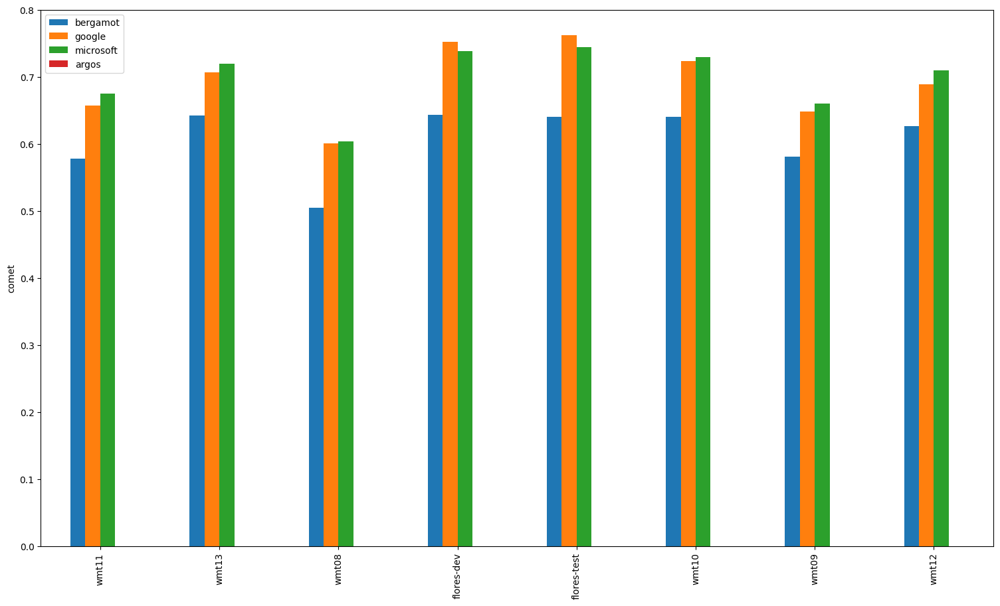
### Comparisons between systems
*If a comparison is omitted, the systems have equal averages (tie). Click on the dataset for a complete report*
#### [wmt11.en-es](en-es/wmt11.en-es.cometcompare)
- wmt11.microsoft.es outperforms wmt11.bergamot.es.
- wmt11.google.es outperforms wmt11.bergamot.es.
- wmt11.microsoft.es outperforms wmt11.google.es.

#### [wmt08.en-es](en-es/wmt08.en-es.cometcompare)
- wmt08.microsoft.es outperforms wmt08.bergamot.es.
- wmt08.google.es outperforms wmt08.bergamot.es.

#### [wmt13.en-es](en-es/wmt13.en-es.cometcompare)
- wmt13.microsoft.es outperforms wmt13.bergamot.es.
- wmt13.google.es outperforms wmt13.bergamot.es.
- wmt13.microsoft.es outperforms wmt13.google.es.

#### [flores-dev.en-es](en-es/flores-dev.en-es.cometcompare)
- flores-dev.microsoft.es outperforms flores-dev.bergamot.es.
- flores-dev.google.es outperforms flores-dev.bergamot.es.
- flores-dev.google.es outperforms flores-dev.microsoft.es.

#### [flores-test.en-es](en-es/flores-test.en-es.cometcompare)
- flores-test.microsoft.es outperforms flores-test.bergamot.es.
- flores-test.google.es outperforms flores-test.bergamot.es.
- flores-test.google.es outperforms flores-test.microsoft.es.

#### [wmt09.en-es](en-es/wmt09.en-es.cometcompare)
- wmt09.microsoft.es outperforms wmt09.bergamot.es.
- wmt09.google.es outperforms wmt09.bergamot.es.
- wmt09.microsoft.es outperforms wmt09.google.es.

#### [wmt12.en-es](en-es/wmt12.en-es.cometcompare)
- wmt12.microsoft.es outperforms wmt12.bergamot.es.
- wmt12.google.es outperforms wmt12.bergamot.es.
- wmt12.microsoft.es outperforms wmt12.google.es.

#### [wmt10.en-es](en-es/wmt10.en-es.cometcompare)
- wmt10.microsoft.es outperforms wmt10.bergamot.es.
- wmt10.google.es outperforms wmt10.bergamot.es.

---

## en-bg

| Translator/Dataset | flores-test | flores-dev |
| --- | --- | --- |
| bergamot | 0.89 | 0.89 |
| google | 0.92 (+0.02, +2.56%) | 0.92 (+0.02, +2.50%) |
| microsoft | 0.91 (+0.02, +1.87%) | 0.91 (+0.02, +1.71%) |
| argos | 0.88 (-0.01, -1.30%) | 0.88 (-0.01, -1.63%) |
| nllb | 0.88 (-0.01, -1.43%) | 0.88 (-0.01, -1.66%) |
| opusmt | 0.82 (-0.07, -7.92%) | 0.82 (-0.07, -7.81%) |

### Comparisons between systems
*If a comparison is omitted, the systems have equal averages (tie). Click on the dataset for a complete report*
#### [flores-test.en-bg](en-bg/flores-test.en-bg.cometcompare)
- flores-test.microsoft.bg outperforms flores-test.bergamot.bg.
- flores-test.google.bg outperforms flores-test.bergamot.bg.
- flores-test.google.bg outperforms flores-test.microsoft.bg.

#### [flores-dev.en-bg](en-bg/flores-dev.en-bg.cometcompare)
- flores-dev.microsoft.bg outperforms flores-dev.bergamot.bg.
- flores-dev.google.bg outperforms flores-dev.bergamot.bg.
- flores-dev.google.bg outperforms flores-dev.microsoft.bg.

---

## de-en

| Translator/Dataset | wmt20 | wmt17 | wmt22 | flores-test | wmt08 | wmt12 | wmt15 | wmt21 | wmt11 | wmt18 | iwslt17 | wmt09 | wmt14 | wmt10 | wmt16 | wmt13 | wmt19 | flores-dev |
| --- | --- | --- | --- | --- | --- | --- | --- | --- | --- | --- | --- | --- | --- | --- | --- | --- | --- | --- |
| bergamot | 0.82 | 0.83 | 0.81 | 0.87 | 0.81 | 0.81 | 0.83 | 0.82 | 0.80 | 0.85 | 0.84 | 0.81 | 0.83 | 0.82 | 0.84 | 0.84 | 0.81 | 0.87 |
| google | 0.85 (+0.03, +3.74%) | 0.87 (+0.03, +3.87%) | 0.85 (+0.04, +4.45%) | 0.89 (+0.02, +2.42%) | 0.84 (+0.03, +3.53%) | 0.84 (+0.03, +3.80%) | 0.86 (+0.03, +3.34%) | 0.85 (+0.03, +3.62%) | 0.83 (+0.02, +2.82%) | 0.87 (+0.03, +2.94%) | 0.86 (+0.02, +2.62%) | 0.84 (+0.03, +3.24%) | 0.86 (+0.03, +3.81%) | 0.85 (+0.03, +3.85%) | 0.87 (+0.03, +3.41%) | 0.86 (+0.02, +2.54%) | 0.85 (+0.04, +4.32%) | 0.89 (+0.02, +2.50%) |
| microsoft | 0.86 (+0.04, +4.81%) | 0.87 (+0.04, +4.51%) | 0.85 (+0.04, +4.32%) | 0.90 (+0.03, +2.96%) | 0.84 (+0.03, +4.18%) | 0.85 (+0.04, +5.00%) | 0.87 (+0.03, +3.99%) | 0.86 (+0.04, +4.40%) | 0.84 (+0.04, +4.41%) | 0.89 (+0.04, +4.26%) | 0.86 (+0.03, +2.99%) | 0.84 (+0.03, +4.09%) | 0.87 (+0.04, +4.47%) | 0.85 (+0.04, +4.60%) | 0.88 (+0.04, +4.25%) | 0.86 (+0.03, +3.44%) | 0.85 (+0.04, +5.43%) | 0.90 (+0.03, +3.02%) |
| argos | 0.81 (-0.01, -1.52%) | 0.82 (-0.01, -1.68%) | 0.81 (-0.00, -0.55%) | 0.86 (-0.01, -0.88%) | 0.80 (-0.01, -1.05%) | 0.80 (-0.01, -1.05%) | 0.82 (-0.01, -1.51%) | 0.81 (-0.01, -1.65%) | 0.80 (-0.01, -0.68%) | 0.83 (-0.01, -1.73%) | 0.82 (-0.01, -1.28%) | 0.80 (-0.01, -0.85%) | 0.82 (-0.01, -1.42%) | 0.81 (-0.01, -0.96%) | 0.83 (-0.01, -1.62%) | 0.82 (-0.01, -1.26%) | 0.79 (-0.02, -2.37%) | 0.86 (-0.01, -1.10%) |
| nllb | 0.72 (-0.10, -12.40%) | 0.74 (-0.09, -11.02%) | 0.72 (-0.09, -11.62%) | 0.79 (-0.08, -8.79%) | 0.74 (-0.07, -8.50%) | 0.73 (-0.07, -9.12%) | 0.76 (-0.08, -9.33%) | 0.72 (-0.10, -12.00%) | 0.73 (-0.08, -9.68%) | 0.76 (-0.09, -10.63%) | 0.76 (-0.07, -8.49%) | 0.74 (-0.07, -8.53%) | 0.74 (-0.09, -10.25%) | 0.74 (-0.07, -8.67%) | 0.76 (-0.09, -10.13%) | 0.76 (-0.07, -8.68%) | 0.71 (-0.10, -12.54%) | 0.80 (-0.07, -8.21%) |
| opusmt | 0.84 (+0.02, +2.42%) | 0.85 (+0.02, +1.84%) | 0.83 (+0.01, +1.71%) | 0.88 (+0.01, +1.34%) | 0.82 (+0.02, +1.92%) | 0.83 (+0.02, +2.53%) | 0.85 (+0.01, +1.69%) | 0.84 (+0.02, +2.19%) | 0.82 (+0.02, +2.29%) | 0.86 (+0.01, +1.46%) | 0.85 (+0.01, +1.38%) | 0.82 (+0.01, +1.84%) | 0.85 (+0.02, +1.84%) | 0.83 (+0.02, +2.32%) | 0.85 (+0.01, +1.53%) | 0.85 (+0.01, +1.62%) | 0.82 (+0.01, +1.64%) | 0.88 (+0.01, +1.47%) |

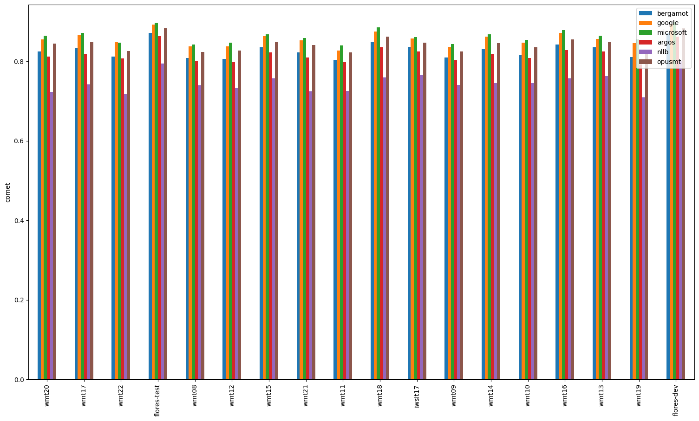
### Comparisons between systems
*If a comparison is omitted, the systems have equal averages (tie). Click on the dataset for a complete report*
#### [wmt20.de-en](de-en/wmt20.de-en.cometcompare)
- wmt20.microsoft.en outperforms wmt20.bergamot.en.
- wmt20.google.en outperforms wmt20.bergamot.en.
- wmt20.microsoft.en outperforms wmt20.google.en.

#### [wmt17.de-en](de-en/wmt17.de-en.cometcompare)
- wmt17.microsoft.en outperforms wmt17.bergamot.en.
- wmt17.google.en outperforms wmt17.bergamot.en.
- wmt17.microsoft.en outperforms wmt17.google.en.

#### [wmt22.de-en](de-en/wmt22.de-en.cometcompare)
- wmt22.microsoft.en outperforms wmt22.bergamot.en.
- wmt22.google.en outperforms wmt22.bergamot.en.

#### [flores-test.de-en](de-en/flores-test.de-en.cometcompare)
- flores-test.microsoft.en outperforms flores-test.bergamot.en.
- flores-test.google.en outperforms flores-test.bergamot.en.
- flores-test.microsoft.en outperforms flores-test.google.en.

#### [wmt08.de-en](de-en/wmt08.de-en.cometcompare)
- wmt08.microsoft.en outperforms wmt08.bergamot.en.
- wmt08.google.en outperforms wmt08.bergamot.en.
- wmt08.microsoft.en outperforms wmt08.google.en.

#### [wmt12.de-en](de-en/wmt12.de-en.cometcompare)
- wmt12.microsoft.en outperforms wmt12.bergamot.en.
- wmt12.google.en outperforms wmt12.bergamot.en.
- wmt12.microsoft.en outperforms wmt12.google.en.

#### [wmt15.de-en](de-en/wmt15.de-en.cometcompare)
- wmt15.microsoft.en outperforms wmt15.bergamot.en.
- wmt15.google.en outperforms wmt15.bergamot.en.
- wmt15.microsoft.en outperforms wmt15.google.en.

#### [wmt21.de-en](de-en/wmt21.de-en.cometcompare)
- wmt21.microsoft.en outperforms wmt21.bergamot.en.
- wmt21.google.en outperforms wmt21.bergamot.en.
- wmt21.microsoft.en outperforms wmt21.google.en.

#### [wmt11.de-en](de-en/wmt11.de-en.cometcompare)
- wmt11.microsoft.en outperforms wmt11.bergamot.en.
- wmt11.google.en outperforms wmt11.bergamot.en.
- wmt11.microsoft.en outperforms wmt11.google.en.

#### [wmt18.de-en](de-en/wmt18.de-en.cometcompare)
- wmt18.microsoft.en outperforms wmt18.bergamot.en.
- wmt18.google.en outperforms wmt18.bergamot.en.
- wmt18.microsoft.en outperforms wmt18.google.en.

#### [iwslt17.de-en](de-en/iwslt17.de-en.cometcompare)
- iwslt17.microsoft.en outperforms iwslt17.bergamot.en.
- iwslt17.google.en outperforms iwslt17.bergamot.en.
- iwslt17.microsoft.en outperforms iwslt17.google.en.

#### [wmt09.de-en](de-en/wmt09.de-en.cometcompare)
- wmt09.microsoft.en outperforms wmt09.bergamot.en.
- wmt09.google.en outperforms wmt09.bergamot.en.
- wmt09.microsoft.en outperforms wmt09.google.en.

#### [wmt14.de-en](de-en/wmt14.de-en.cometcompare)
- wmt14.microsoft.en outperforms wmt14.bergamot.en.
- wmt14.google.en outperforms wmt14.bergamot.en.
- wmt14.microsoft.en outperforms wmt14.google.en.

#### [wmt10.de-en](de-en/wmt10.de-en.cometcompare)
- wmt10.microsoft.en outperforms wmt10.bergamot.en.
- wmt10.google.en outperforms wmt10.bergamot.en.
- wmt10.microsoft.en outperforms wmt10.google.en.

#### [wmt16.de-en](de-en/wmt16.de-en.cometcompare)
- wmt16.microsoft.en outperforms wmt16.bergamot.en.
- wmt16.google.en outperforms wmt16.bergamot.en.
- wmt16.microsoft.en outperforms wmt16.google.en.

#### [wmt13.de-en](de-en/wmt13.de-en.cometcompare)
- wmt13.microsoft.en outperforms wmt13.bergamot.en.
- wmt13.google.en outperforms wmt13.bergamot.en.
- wmt13.microsoft.en outperforms wmt13.google.en.

#### [wmt19.de-en](de-en/wmt19.de-en.cometcompare)
- wmt19.microsoft.en outperforms wmt19.bergamot.en.
- wmt19.google.en outperforms wmt19.bergamot.en.
- wmt19.microsoft.en outperforms wmt19.google.en.

#### [flores-dev.de-en](de-en/flores-dev.de-en.cometcompare)
- flores-dev.microsoft.en outperforms flores-dev.bergamot.en.
- flores-dev.google.en outperforms flores-dev.bergamot.en.
- flores-dev.microsoft.en outperforms flores-dev.google.en.

---

## it-en

| Translator/Dataset | flores-test | mtedx_test | wmt09 | flores-dev |
| --- | --- | --- | --- | --- |
| bergamot | 0.86 | 0.83 | 0.82 | 0.87 |
| google | 0.88 (+0.02, +1.86%) | 0.85 (+0.02, +2.04%) | 0.84 (+0.02, +2.09%) | 0.88 (+0.01, +1.44%) |
| microsoft | 0.88 (+0.02, +1.87%) | 0.85 (+0.02, +1.86%) | 0.84 (+0.02, +2.66%) | 0.88 (+0.01, +1.51%) |
| argos | 0.85 (-0.01, -1.36%) | 0.82 (-0.01, -1.30%) | 0.81 (-0.01, -1.62%) | 0.86 (-0.01, -1.48%) |
| nllb | 0.84 (-0.02, -2.59%) | 0.79 (-0.05, -5.58%) | 0.80 (-0.03, -3.21%) | 0.84 (-0.03, -2.89%) |
| opusmt | 0.87 (+0.00, +0.12%) | 0.84 (+0.00, +0.46%) | 0.83 (+0.00, +0.58%) | 0.87 (-0.00, -0.07%) |

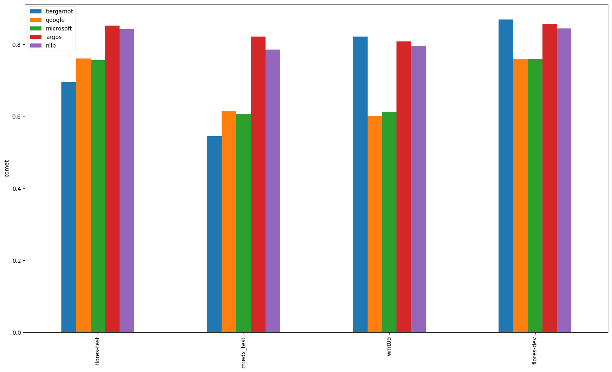
### Comparisons between systems
*If a comparison is omitted, the systems have equal averages (tie). Click on the dataset for a complete report*
#### [flores-test.it-en](it-en/flores-test.it-en.cometcompare)
- flores-test.microsoft.en outperforms flores-test.bergamot.en.
- flores-test.google.en outperforms flores-test.bergamot.en.

#### [mtedx_test.it-en](it-en/mtedx_test.it-en.cometcompare)
- mtedx_test.microsoft.en outperforms mtedx_test.bergamot.en.
- mtedx_test.google.en outperforms mtedx_test.bergamot.en.

#### [wmt09.it-en](it-en/wmt09.it-en.cometcompare)
- wmt09.microsoft.en outperforms wmt09.bergamot.en.
- wmt09.google.en outperforms wmt09.bergamot.en.
- wmt09.microsoft.en outperforms wmt09.google.en.

#### [flores-dev.it-en](it-en/flores-dev.it-en.cometcompare)
- flores-dev.microsoft.en outperforms flores-dev.bergamot.en.
- flores-dev.google.en outperforms flores-dev.bergamot.en.

---

## pl-en

| Translator/Dataset | wmt20 | flores-test | flores-dev |
| --- | --- | --- | --- |
| bergamot | 0.82 | 0.84 | 0.84 |
| google | 0.84 (+0.02, +2.78%) | 0.86 (+0.03, +3.05%) | 0.86 (+0.02, +2.88%) |
| microsoft | 0.85 (+0.03, +3.47%) | 0.86 (+0.03, +3.15%) | 0.86 (+0.02, +2.77%) |
| argos | 0.82 (-0.00, -0.18%) | 0.84 (+0.00, +0.55%) | 0.85 (+0.01, +0.70%) |
| nllb | 0.74 (-0.08, -9.35%) | 0.78 (-0.06, -7.29%) | 0.79 (-0.05, -6.50%) |
| opusmt | 0.81 (-0.01, -1.05%) | 0.84 (+0.00, +0.11%) | 0.84 (+0.00, +0.23%) |

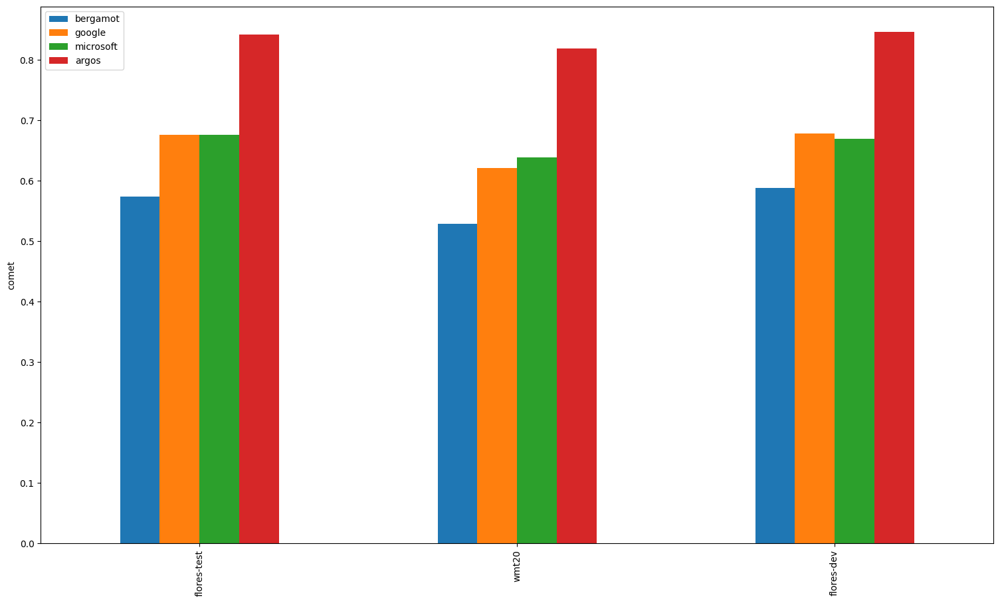
### Comparisons between systems
*If a comparison is omitted, the systems have equal averages (tie). Click on the dataset for a complete report*
#### [wmt20.pl-en](pl-en/wmt20.pl-en.cometcompare)
- wmt20.microsoft.en outperforms wmt20.bergamot.en.
- wmt20.google.en outperforms wmt20.bergamot.en.
- wmt20.microsoft.en outperforms wmt20.google.en.

#### [flores-test.pl-en](pl-en/flores-test.pl-en.cometcompare)
- flores-test.microsoft.en outperforms flores-test.bergamot.en.
- flores-test.google.en outperforms flores-test.bergamot.en.

#### [flores-dev.pl-en](pl-en/flores-dev.pl-en.cometcompare)
- flores-dev.microsoft.en outperforms flores-dev.bergamot.en.
- flores-dev.google.en outperforms flores-dev.bergamot.en.
- flores-dev.google.en outperforms flores-dev.microsoft.en.

---

## en-fr

| Translator/Dataset | wmt11 | wmt10 | wmt14 | flores-test | wmt09 | wmt08 | wmt15 | flores-dev | wmt12 | iwslt17 | wmt13 |
| --- | --- | --- | --- | --- | --- | --- | --- | --- | --- | --- | --- |
| bergamot | 0.81 | 0.81 | 0.84 | 0.85 | 0.81 | 0.79 | 0.80 | 0.86 | 0.81 | 0.83 | 0.82 |
| google | 0.83 (+0.02, +3.00%) | 0.85 (+0.03, +3.88%) | 0.87 (+0.03, +3.59%) | 0.88 (+0.03, +3.92%) | 0.83 (+0.03, +3.26%) | 0.82 (+0.03, +4.17%) | 0.84 (+0.04, +5.38%) | 0.88 (+0.03, +3.21%) | 0.83 (+0.02, +2.76%) | 0.85 (+0.02, +2.59%) | 0.85 (+0.02, +2.96%) |
| microsoft | 0.84 (+0.03, +3.81%) | 0.85 (+0.04, +4.48%) | 0.88 (+0.04, +4.58%) | 0.89 (+0.04, +4.23%) | 0.84 (+0.03, +4.07%) | 0.83 (+0.04, +4.52%) | 0.85 (+0.05, +5.76%) | 0.89 (+0.03, +3.66%) | 0.84 (+0.03, +3.76%) | 0.86 (+0.03, +3.22%) | 0.85 (+0.03, +3.66%) |
| argos | 0.80 (-0.01, -1.05%) | 0.80 (-0.01, -1.29%) | 0.82 (-0.02, -2.16%) | 0.84 (-0.02, -1.88%) | 0.80 (-0.01, -0.79%) | 0.78 (-0.01, -1.00%) | 0.79 (-0.01, -0.86%) | 0.84 (-0.02, -2.55%) | 0.80 (-0.01, -1.20%) | 0.81 (-0.02, -1.83%) | 0.81 (-0.01, -1.45%) |
| nllb | 0.83 (+0.02, +2.03%) | 0.83 (+0.02, +2.24%) | 0.85 (+0.02, +1.96%) | 0.87 (+0.01, +1.69%) | 0.82 (+0.01, +1.76%) | 0.81 (+0.02, +2.41%) | 0.82 (+0.02, +2.41%) | 0.87 (+0.01, +1.10%) | 0.82 (+0.01, +1.73%) | 0.84 (+0.01, +1.23%) | 0.83 (+0.01, +1.40%) |
| opusmt | 0.82 (+0.01, +1.51%) | 0.83 (+0.02, +1.90%) | 0.85 (+0.01, +1.41%) | 0.86 (+0.01, +1.21%) | 0.82 (+0.01, +1.84%) | 0.80 (+0.01, +1.65%) | 0.81 (+0.01, +1.86%) | 0.86 (+0.01, +0.73%) | 0.82 (+0.01, +1.64%) | 0.84 (+0.01, +0.74%) | 0.83 (+0.01, +1.34%) |

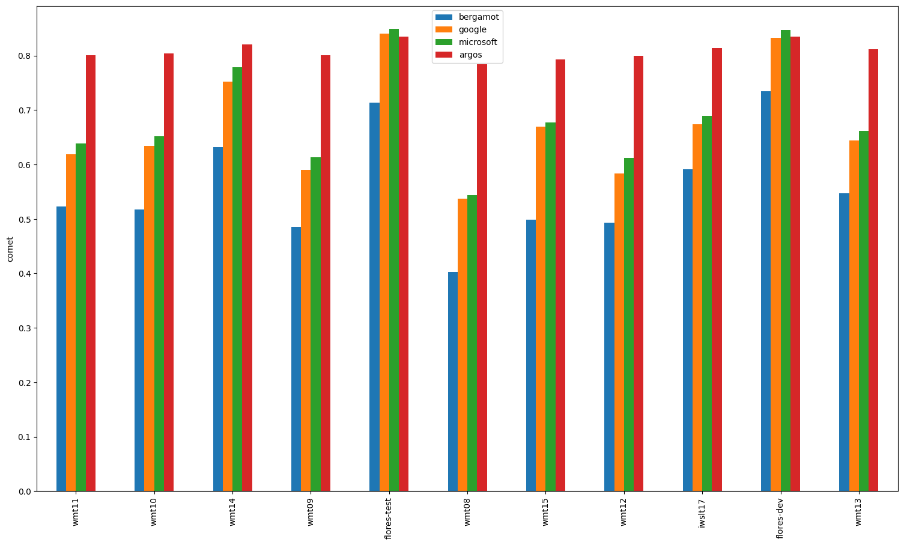
### Comparisons between systems
*If a comparison is omitted, the systems have equal averages (tie). Click on the dataset for a complete report*
#### [wmt11.en-fr](en-fr/wmt11.en-fr.cometcompare)
- wmt11.microsoft.fr outperforms wmt11.bergamot.fr.
- wmt11.google.fr outperforms wmt11.bergamot.fr.
- wmt11.microsoft.fr outperforms wmt11.google.fr.

#### [wmt10.en-fr](en-fr/wmt10.en-fr.cometcompare)
- wmt10.microsoft.fr outperforms wmt10.bergamot.fr.
- wmt10.google.fr outperforms wmt10.bergamot.fr.
- wmt10.microsoft.fr outperforms wmt10.google.fr.

#### [wmt14.en-fr](en-fr/wmt14.en-fr.cometcompare)
- wmt14.microsoft.fr outperforms wmt14.bergamot.fr.
- wmt14.google.fr outperforms wmt14.bergamot.fr.
- wmt14.microsoft.fr outperforms wmt14.google.fr.

#### [flores-test.en-fr](en-fr/flores-test.en-fr.cometcompare)
- flores-test.microsoft.fr outperforms flores-test.bergamot.fr.
- flores-test.google.fr outperforms flores-test.bergamot.fr.

#### [wmt09.en-fr](en-fr/wmt09.en-fr.cometcompare)
- wmt09.microsoft.fr outperforms wmt09.bergamot.fr.
- wmt09.google.fr outperforms wmt09.bergamot.fr.
- wmt09.microsoft.fr outperforms wmt09.google.fr.

#### [wmt08.en-fr](en-fr/wmt08.en-fr.cometcompare)
- wmt08.microsoft.fr outperforms wmt08.bergamot.fr.
- wmt08.google.fr outperforms wmt08.bergamot.fr.

#### [wmt15.en-fr](en-fr/wmt15.en-fr.cometcompare)
- wmt15.microsoft.fr outperforms wmt15.bergamot.fr.
- wmt15.google.fr outperforms wmt15.bergamot.fr.

#### [flores-dev.en-fr](en-fr/flores-dev.en-fr.cometcompare)
- flores-dev.microsoft.fr outperforms flores-dev.bergamot.fr.
- flores-dev.google.fr outperforms flores-dev.bergamot.fr.
- flores-dev.microsoft.fr outperforms flores-dev.google.fr.

#### [wmt12.en-fr](en-fr/wmt12.en-fr.cometcompare)
- wmt12.microsoft.fr outperforms wmt12.bergamot.fr.
- wmt12.google.fr outperforms wmt12.bergamot.fr.
- wmt12.microsoft.fr outperforms wmt12.google.fr.

#### [iwslt17.en-fr](en-fr/iwslt17.en-fr.cometcompare)
- iwslt17.microsoft.fr outperforms iwslt17.bergamot.fr.
- iwslt17.google.fr outperforms iwslt17.bergamot.fr.
- iwslt17.microsoft.fr outperforms iwslt17.google.fr.

#### [wmt13.en-fr](en-fr/wmt13.en-fr.cometcompare)
- wmt13.microsoft.fr outperforms wmt13.bergamot.fr.
- wmt13.google.fr outperforms wmt13.bergamot.fr.
- wmt13.microsoft.fr outperforms wmt13.google.fr.

---

## en-pl

| Translator/Dataset | flores-test | flores-dev | wmt20 |
| --- | --- | --- | --- |
| bergamot | 0.86 | 0.86 | 0.85 |
| google | 0.90 (+0.04, +4.86%) | 0.90 (+0.04, +4.81%) | 0.89 (+0.04, +4.97%) |
| microsoft | 0.89 (+0.04, +4.14%) | 0.89 (+0.03, +3.83%) | 0.89 (+0.04, +4.45%) |
| argos | 0.85 (-0.01, -1.14%) | 0.85 (-0.01, -1.49%) | 0.82 (-0.02, -2.91%) |
| nllb | 0.84 (-0.02, -1.76%) | 0.85 (-0.01, -1.50%) | 0.84 (-0.01, -1.24%) |
| opusmt | N/A | N/A | N/A |

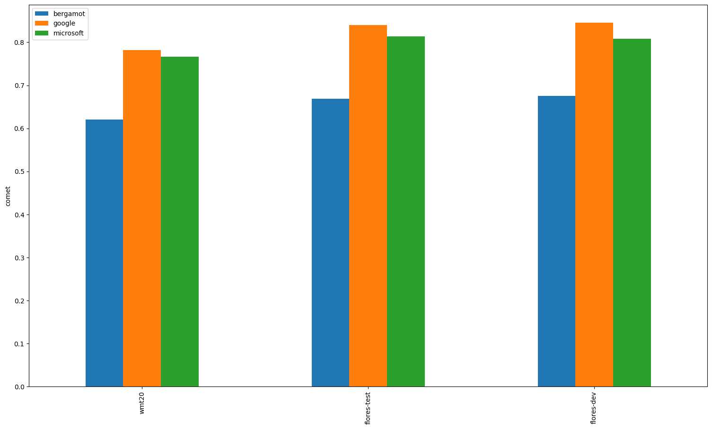
### Comparisons between systems
*If a comparison is omitted, the systems have equal averages (tie). Click on the dataset for a complete report*
#### [flores-test.en-pl](en-pl/flores-test.en-pl.cometcompare)
- flores-test.microsoft.pl outperforms flores-test.bergamot.pl.
- flores-test.google.pl outperforms flores-test.bergamot.pl.
- flores-test.google.pl outperforms flores-test.microsoft.pl.

#### [flores-dev.en-pl](en-pl/flores-dev.en-pl.cometcompare)
- flores-dev.microsoft.pl outperforms flores-dev.bergamot.pl.
- flores-dev.google.pl outperforms flores-dev.bergamot.pl.
- flores-dev.google.pl outperforms flores-dev.microsoft.pl.

#### [wmt20.en-pl](en-pl/wmt20.en-pl.cometcompare)
- wmt20.microsoft.pl outperforms wmt20.bergamot.pl.
- wmt20.google.pl outperforms wmt20.bergamot.pl.
- wmt20.google.pl outperforms wmt20.microsoft.pl.

---

## pt-en

| Translator/Dataset | flores-test | mtedx_test | flores-dev |
| --- | --- | --- | --- |
| bergamot | 0.88 | 0.85 | 0.89 |
| google | 0.90 (+0.01, +1.48%) | 0.87 (+0.02, +1.82%) | 0.90 (+0.01, +1.31%) |
| microsoft | 0.90 (+0.01, +1.46%) | 0.86 (+0.01, +1.55%) | 0.90 (+0.01, +1.30%) |
| argos | 0.88 (-0.01, -0.72%) | 0.84 (-0.01, -0.81%) | 0.88 (-0.01, -0.85%) |
| nllb | 0.85 (-0.03, -3.44%) | 0.80 (-0.05, -5.44%) | 0.85 (-0.03, -3.64%) |
| opusmt | N/A | N/A | N/A |

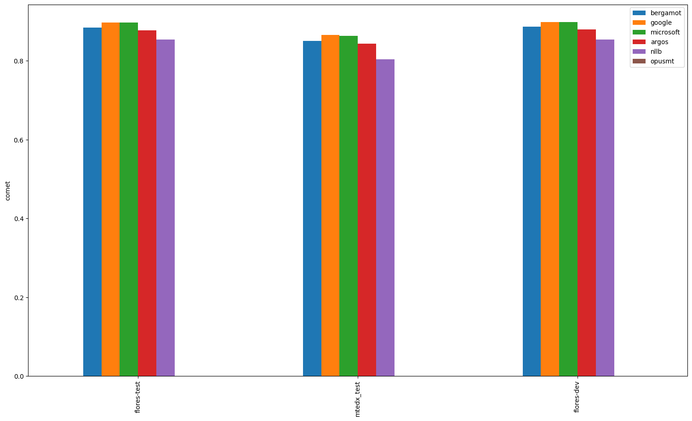
### Comparisons between systems
*If a comparison is omitted, the systems have equal averages (tie). Click on the dataset for a complete report*
#### [flores-test.pt-en](pt-en/flores-test.pt-en.cometcompare)
- flores-test.microsoft.en outperforms flores-test.bergamot.en.
- flores-test.google.en outperforms flores-test.bergamot.en.

#### [mtedx_test.pt-en](pt-en/mtedx_test.pt-en.cometcompare)
- mtedx_test.microsoft.en outperforms mtedx_test.bergamot.en.
- mtedx_test.google.en outperforms mtedx_test.bergamot.en.
- mtedx_test.google.en outperforms mtedx_test.microsoft.en.

#### [flores-dev.pt-en](pt-en/flores-dev.pt-en.cometcompare)
- flores-dev.microsoft.en outperforms flores-dev.bergamot.en.
- flores-dev.google.en outperforms flores-dev.bergamot.en.

---

## es-en

| Translator/Dataset | flores-test | wmt08 | wmt12 | mtedx_test | wmt11 | wmt09 | wmt10 | wmt13 | flores-dev |
| --- | --- | --- | --- | --- | --- | --- | --- | --- | --- |
| bergamot | 0.85 | 0.81 | 0.83 | 0.81 | 0.82 | 0.81 | 0.83 | 0.84 | 0.85 |
| google | 0.87 (+0.02, +2.49%) | 0.82 (+0.01, +1.75%) | 0.84 (+0.01, +0.93%) | 0.83 (+0.02, +2.17%) | 0.83 (+0.01, +0.84%) | 0.82 (+0.02, +2.07%) | 0.85 (+0.02, +1.90%) | 0.85 (+0.01, +1.01%) | 0.87 (+0.02, +2.60%) |
| microsoft | 0.87 (+0.02, +2.46%) | 0.82 (+0.02, +2.26%) | 0.85 (+0.02, +2.10%) | 0.83 (+0.02, +2.97%) | 0.84 (+0.02, +2.17%) | 0.83 (+0.02, +2.50%) | 0.85 (+0.02, +2.35%) | 0.86 (+0.02, +1.92%) | 0.87 (+0.02, +2.36%) |
| argos | 0.84 (-0.01, -0.66%) | 0.80 (-0.01, -1.07%) | 0.82 (-0.01, -1.25%) | 0.81 (-0.00, -0.46%) | 0.81 (-0.01, -1.13%) | 0.80 (-0.01, -0.90%) | 0.83 (-0.01, -0.96%) | 0.83 (-0.01, -1.00%) | 0.84 (-0.01, -0.96%) |
| nllb | 0.85 (+0.00, +0.56%) | 0.81 (+0.00, +0.35%) | 0.83 (-0.01, -0.66%) | 0.80 (-0.01, -1.63%) | 0.82 (-0.00, -0.43%) | 0.81 (+0.01, +0.78%) | 0.83 (-0.00, -0.01%) | 0.84 (-0.00, -0.53%) | 0.86 (+0.01, +0.67%) |
| opusmt | 0.86 (+0.01, +1.15%) | 0.81 (+0.01, +0.87%) | 0.84 (+0.00, +0.52%) | 0.83 (+0.01, +1.84%) | 0.83 (+0.01, +0.73%) | 0.82 (+0.01, +0.97%) | 0.84 (+0.01, +0.95%) | 0.85 (+0.01, +0.72%) | 0.86 (+0.01, +0.96%) |

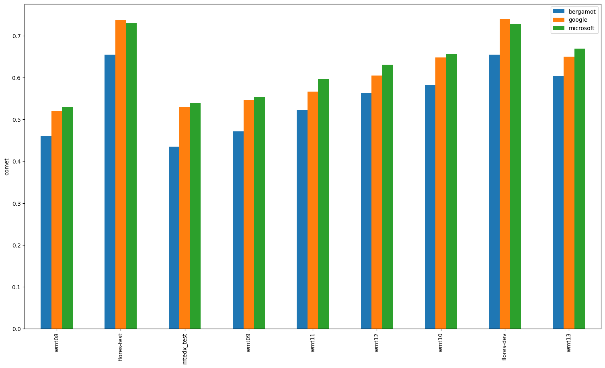
### Comparisons between systems
*If a comparison is omitted, the systems have equal averages (tie). Click on the dataset for a complete report*
#### [flores-test.es-en](es-en/flores-test.es-en.cometcompare)
- flores-test.microsoft.en outperforms flores-test.bergamot.en.
- flores-test.google.en outperforms flores-test.bergamot.en.
- flores-test.google.en outperforms flores-test.microsoft.en.

#### [wmt08.es-en](es-en/wmt08.es-en.cometcompare)
- wmt08.microsoft.en outperforms wmt08.bergamot.en.
- wmt08.google.en outperforms wmt08.bergamot.en.
- wmt08.microsoft.en outperforms wmt08.google.en.

#### [wmt12.es-en](es-en/wmt12.es-en.cometcompare)
- wmt12.microsoft.en outperforms wmt12.bergamot.en.
- wmt12.google.en outperforms wmt12.bergamot.en.
- wmt12.microsoft.en outperforms wmt12.google.en.

#### [mtedx_test.es-en](es-en/mtedx_test.es-en.cometcompare)
- mtedx_test.microsoft.en outperforms mtedx_test.bergamot.en.
- mtedx_test.google.en outperforms mtedx_test.bergamot.en.

#### [wmt11.es-en](es-en/wmt11.es-en.cometcompare)
- wmt11.microsoft.en outperforms wmt11.bergamot.en.
- wmt11.google.en outperforms wmt11.bergamot.en.
- wmt11.microsoft.en outperforms wmt11.google.en.

#### [wmt09.es-en](es-en/wmt09.es-en.cometcompare)
- wmt09.microsoft.en outperforms wmt09.bergamot.en.
- wmt09.google.en outperforms wmt09.bergamot.en.
- wmt09.microsoft.en outperforms wmt09.google.en.

#### [wmt10.es-en](es-en/wmt10.es-en.cometcompare)
- wmt10.microsoft.en outperforms wmt10.bergamot.en.
- wmt10.google.en outperforms wmt10.bergamot.en.
- wmt10.microsoft.en outperforms wmt10.google.en.

#### [wmt13.es-en](es-en/wmt13.es-en.cometcompare)
- wmt13.microsoft.en outperforms wmt13.bergamot.en.
- wmt13.google.en outperforms wmt13.bergamot.en.
- wmt13.microsoft.en outperforms wmt13.google.en.

#### [flores-dev.es-en](es-en/flores-dev.es-en.cometcompare)
- flores-dev.microsoft.en outperforms flores-dev.bergamot.en.
- flores-dev.google.en outperforms flores-dev.bergamot.en.
- flores-dev.google.en outperforms flores-dev.microsoft.en.

---

## en-de

| Translator/Dataset | wmt12 | wmt13 | wmt08 | wmt22 | wmt20 | flores-dev | wmt15 | wmt18 | wmt14 | wmt19 | wmt17 | wmt21 | wmt09 | wmt11 | iwslt17 | wmt16 | wmt10 | flores-test |
| --- | --- | --- | --- | --- | --- | --- | --- | --- | --- | --- | --- | --- | --- | --- | --- | --- | --- | --- |
| bergamot | 0.82 | 0.84 | 0.82 | 0.82 | 0.84 | 0.86 | 0.84 | 0.87 | 0.85 | 0.84 | 0.85 | 0.82 | 0.82 | 0.81 | 0.82 | 0.86 | 0.83 | 0.86 |
| google | 0.84 (+0.02, +3.01%) | 0.86 (+0.02, +2.90%) | 0.85 (+0.03, +3.62%) | 0.87 (+0.05, +5.66%) | 0.87 (+0.03, +3.77%) | 0.89 (+0.03, +4.06%) | 0.87 (+0.03, +3.39%) | 0.89 (+0.02, +2.82%) | 0.88 (+0.03, +3.68%) | 0.87 (+0.02, +2.75%) | 0.87 (+0.03, +3.32%) | 0.85 (+0.02, +2.98%) | 0.84 (+0.03, +3.44%) | 0.84 (+0.03, +3.55%) | 0.85 (+0.03, +3.16%) | 0.88 (+0.03, +2.99%) | 0.85 (+0.02, +2.88%) | 0.89 (+0.03, +3.63%) |
| microsoft | 0.85 (+0.03, +3.50%) | 0.87 (+0.03, +3.28%) | 0.85 (+0.03, +3.89%) | 0.87 (+0.05, +5.69%) | 0.87 (+0.03, +4.12%) | 0.89 (+0.03, +3.85%) | 0.87 (+0.03, +3.48%) | 0.90 (+0.03, +3.21%) | 0.88 (+0.03, +3.77%) | 0.87 (+0.03, +3.44%) | 0.88 (+0.03, +3.59%) | 0.85 (+0.03, +3.43%) | 0.85 (+0.03, +3.86%) | 0.84 (+0.03, +4.22%) | 0.85 (+0.03, +3.23%) | 0.89 (+0.03, +3.41%) | 0.86 (+0.03, +3.37%) | 0.89 (+0.03, +3.67%) |
| argos | 0.78 (-0.04, -5.28%) | 0.81 (-0.03, -3.91%) | 0.77 (-0.05, -5.57%) | 0.79 (-0.03, -3.97%) | 0.75 (-0.09, -10.40%) | 0.81 (-0.04, -5.15%) | 0.79 (-0.05, -6.11%) | 0.82 (-0.05, -5.82%) | 0.80 (-0.05, -6.12%) | 0.76 (-0.08, -9.63%) | 0.80 (-0.05, -6.01%) | 0.74 (-0.09, -10.36%) | 0.78 (-0.03, -3.92%) | 0.77 (-0.03, -4.27%) | 0.79 (-0.04, -4.28%) | 0.80 (-0.05, -6.15%) | 0.79 (-0.04, -5.21%) | 0.81 (-0.04, -5.22%) |
| nllb | 0.81 (-0.01, -0.90%) | 0.83 (-0.00, -0.58%) | 0.81 (-0.01, -0.76%) | 0.82 (-0.00, -0.27%) | 0.82 (-0.02, -1.90%) | 0.85 (-0.00, -0.55%) | 0.83 (-0.01, -1.14%) | 0.85 (-0.02, -1.98%) | 0.84 (-0.01, -1.37%) | 0.82 (-0.02, -2.32%) | 0.83 (-0.01, -1.56%) | 0.81 (-0.02, -1.90%) | 0.82 (-0.00, -0.17%) | 0.81 (+0.00, +0.04%) | 0.81 (-0.01, -1.07%) | 0.84 (-0.02, -1.79%) | 0.83 (-0.00, -0.53%) | 0.85 (-0.01, -0.82%) |
| opusmt | 0.81 (-0.01, -0.88%) | 0.84 (-0.00, -0.25%) | 0.81 (-0.01, -0.81%) | 0.82 (-0.00, -0.21%) | 0.80 (-0.03, -3.76%) | 0.84 (-0.01, -1.51%) | 0.83 (-0.01, -1.10%) | 0.86 (-0.01, -0.70%) | 0.84 (-0.01, -1.26%) | 0.81 (-0.03, -3.47%) | 0.84 (-0.01, -1.09%) | 0.79 (-0.03, -4.13%) | 0.82 (-0.00, -0.13%) | 0.80 (-0.00, -0.42%) | 0.82 (-0.00, -0.27%) | 0.84 (-0.02, -1.81%) | 0.83 (-0.00, -0.54%) | 0.85 (-0.01, -1.13%) |

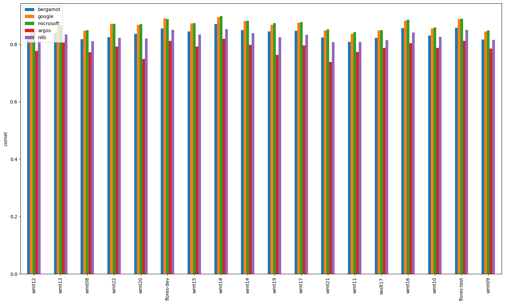
### Comparisons between systems
*If a comparison is omitted, the systems have equal averages (tie). Click on the dataset for a complete report*
#### [wmt12.en-de](en-de/wmt12.en-de.cometcompare)
- wmt12.microsoft.de outperforms wmt12.bergamot.de.
- wmt12.google.de outperforms wmt12.bergamot.de.
- wmt12.microsoft.de outperforms wmt12.google.de.

#### [wmt13.en-de](en-de/wmt13.en-de.cometcompare)
- wmt13.microsoft.de outperforms wmt13.bergamot.de.
- wmt13.google.de outperforms wmt13.bergamot.de.
- wmt13.microsoft.de outperforms wmt13.google.de.

#### [wmt08.en-de](en-de/wmt08.en-de.cometcompare)
- wmt08.microsoft.de outperforms wmt08.bergamot.de.
- wmt08.google.de outperforms wmt08.bergamot.de.
- wmt08.microsoft.de outperforms wmt08.google.de.

#### [wmt22.en-de](en-de/wmt22.en-de.cometcompare)
- wmt22.microsoft.de outperforms wmt22.bergamot.de.
- wmt22.google.de outperforms wmt22.bergamot.de.

#### [wmt20.en-de](en-de/wmt20.en-de.cometcompare)
- wmt20.microsoft.de outperforms wmt20.bergamot.de.
- wmt20.google.de outperforms wmt20.bergamot.de.
- wmt20.microsoft.de outperforms wmt20.google.de.

#### [flores-dev.en-de](en-de/flores-dev.en-de.cometcompare)
- flores-dev.microsoft.de outperforms flores-dev.bergamot.de.
- flores-dev.google.de outperforms flores-dev.bergamot.de.

#### [wmt15.en-de](en-de/wmt15.en-de.cometcompare)
- wmt15.microsoft.de outperforms wmt15.bergamot.de.
- wmt15.google.de outperforms wmt15.bergamot.de.

#### [wmt18.en-de](en-de/wmt18.en-de.cometcompare)
- wmt18.microsoft.de outperforms wmt18.bergamot.de.
- wmt18.google.de outperforms wmt18.bergamot.de.
- wmt18.microsoft.de outperforms wmt18.google.de.

#### [wmt14.en-de](en-de/wmt14.en-de.cometcompare)
- wmt14.microsoft.de outperforms wmt14.bergamot.de.
- wmt14.google.de outperforms wmt14.bergamot.de.
- wmt14.microsoft.de outperforms wmt14.google.de.

#### [wmt19.en-de](en-de/wmt19.en-de.cometcompare)
- wmt19.microsoft.de outperforms wmt19.bergamot.de.
- wmt19.google.de outperforms wmt19.bergamot.de.
- wmt19.microsoft.de outperforms wmt19.google.de.

#### [wmt17.en-de](en-de/wmt17.en-de.cometcompare)
- wmt17.microsoft.de outperforms wmt17.bergamot.de.
- wmt17.google.de outperforms wmt17.bergamot.de.
- wmt17.microsoft.de outperforms wmt17.google.de.

#### [wmt21.en-de](en-de/wmt21.en-de.cometcompare)
- wmt21.microsoft.de outperforms wmt21.bergamot.de.
- wmt21.google.de outperforms wmt21.bergamot.de.
- wmt21.microsoft.de outperforms wmt21.google.de.

#### [wmt09.en-de](en-de/wmt09.en-de.cometcompare)
- wmt09.microsoft.de outperforms wmt09.bergamot.de.
- wmt09.google.de outperforms wmt09.bergamot.de.
- wmt09.microsoft.de outperforms wmt09.google.de.

#### [wmt11.en-de](en-de/wmt11.en-de.cometcompare)
- wmt11.microsoft.de outperforms wmt11.bergamot.de.
- wmt11.google.de outperforms wmt11.bergamot.de.
- wmt11.microsoft.de outperforms wmt11.google.de.

#### [iwslt17.en-de](en-de/iwslt17.en-de.cometcompare)
- iwslt17.microsoft.de outperforms iwslt17.bergamot.de.
- iwslt17.google.de outperforms iwslt17.bergamot.de.

#### [wmt16.en-de](en-de/wmt16.en-de.cometcompare)
- wmt16.microsoft.de outperforms wmt16.bergamot.de.
- wmt16.google.de outperforms wmt16.bergamot.de.
- wmt16.microsoft.de outperforms wmt16.google.de.

#### [wmt10.en-de](en-de/wmt10.en-de.cometcompare)
- wmt10.microsoft.de outperforms wmt10.bergamot.de.
- wmt10.google.de outperforms wmt10.bergamot.de.
- wmt10.microsoft.de outperforms wmt10.google.de.

#### [flores-test.en-de](en-de/flores-test.en-de.cometcompare)
- flores-test.microsoft.de outperforms flores-test.bergamot.de.
- flores-test.google.de outperforms flores-test.bergamot.de.

---